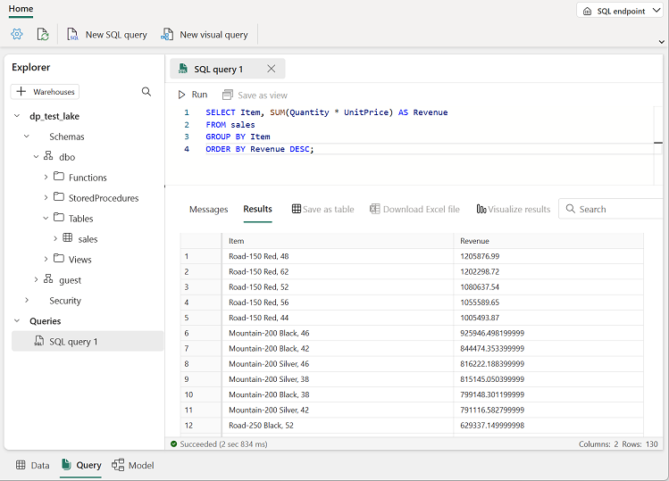

---
lab:
  title: "Créer un lakehouse Microsoft\_Fabric"
  module: Get started with lakehouses in Microsoft Fabric
---

# Créer un lakehouse Microsoft Fabric

Les solutions d’analytique des données à grande échelle sont généralement conçues autour d’un *entrepôt de données*, dans lequel les données sont stockées dans des tables relationnelles et interrogées à l’aide de SQL. La croissance du « Big Data » (caractérisé par des *volumes* élevés, la *variété* et la *rapidité* de nouvelles ressources de données), ainsi que la disponibilité d’un stockage à faible coût et de technologies de calcul distribué à l’échelle du cloud, a donné lieu à une autre approche du stockage des données analytiques : le *lac de données*. Dans un lac de données, les données sont stockées sous forme de fichiers sans imposer de schéma fixe pour le stockage. Les ingénieurs données et les analystes cherchent de plus en plus à tirer parti des meilleures fonctionnalités de ces deux approches en les combinant dans un *data lakehouse*. Ce dernier permet de stocker les données dans des fichiers dans un lac de données et un schéma relationnel leur est appliqué en tant que couche de métadonnées afin qu’elles puissent être interrogées à l’aide de la sémantique SQL traditionnelle.

Dans Microsoft Fabric, un lakehouse fournit un stockage de fichiers hautement évolutif dans un magasin *OneLake* (basé sur Azure Data Lake Store Gen2) avec un metastore pour des objets relationnels tels que des tables et des vues basées sur le format de table *Delta Lake* open source. Delta Lake vous permet de définir, dans votre lakehouse, un schéma de tables que vous pouvez interroger à l’aide de SQL.

Ce labo prend environ **30** minutes.

> **Remarque** : Vous devez disposer d’une [licence d’essai Microsoft Fabric](https://learn.microsoft.com/fabric/get-started/fabric-trial) pour effectuer cet exercice.

## Créer un espace de travail

Avant d’utiliser des données dans Fabric, créez un espace de travail avec l’essai gratuit de Fabric activé.

1. Accédez à la [page d’accueil de Microsoft Fabric](https://app.fabric.microsoft.com/home?experience=fabric) sur `https://app.fabric.microsoft.com/home?experience=fabric` dans un navigateur et connectez-vous avec vos informations d’identification Fabric.
1. Dans la barre de menus à gauche, sélectionnez **Espaces de travail** (l’icône ressemble à &#128455;).
1. Créez un nouvel espace de travail avec le nom de votre choix et sélectionnez un mode de licence dans la section **Avancé** qui comprend la capacité Fabric (*Essai*, *Premium* ou *Fabric*).
1. Lorsque votre nouvel espace de travail s’ouvre, il doit être vide.

    

## Créer un lakehouse

Maintenant que vous disposez d’un espace de travail, il est temps de créer un data lakehouse pour vos fichiers de données.

1. Sélectionnez **Créer** dans la barre de menus de gauche. Dans la page *Nouveau*, sous la section *Engineering données*, sélectionnez **Lakehouse**. Donnez-lui un nom unique de votre choix.

    >**Note** : si l’option **Créer** n’est pas épinglée à la barre latérale, vous devez d’abord sélectionner l’option avec des points de suspension (**...**).

    Au bout d’une minute environ, un nouveau lakehouse est créé :

    

1. Affichez le nouveau lakehouse et notez que le volet **Explorateur de lakehouse** à gauche vous permet de parcourir les tables et les fichiers présents dans le lakehouse :
    - Le dossier **Tables** contient des tables que vous pouvez interroger à l’aide de la sémantique SQL. Les tables d’un lakehouse Microsoft Fabric sont basées sur le format de fichier *Delta Lake* open source, qui est couramment utilisé dans Apache Spark.
    - Le dossier **Fichiers** contient des fichiers de données du stockage OneLake pour le lakehouse qui ne sont pas associés à des tables delta managées. Vous pouvez également créer des *raccourcis* dans ce dossier pour référencer des données qui sont stockées en externe.

    Actuellement, il n’y a pas de tables ou de fichiers dans le lakehouse.

## Charger un fichier

Fabric offre plusieurs façons de charger des données dans le lakehouse, notamment via la prise en charge intégrée des pipelines qui copient depuis des sources de données externes et des flux de données (Gen 2) que vous pouvez définir en utilisant des outils visuels basés sur Power Query. Toutefois, l’un des moyens les plus simples d’ingérer de petites quantités de données consiste à charger des fichiers ou des dossiers à partir de votre ordinateur local (ou d’une machine virtuelle de labo, le cas échéant).

1. Téléchargez le fichier [sales.csv](https://raw.githubusercontent.com/MicrosoftLearning/dp-data/main/sales.csv) à partir de `https://raw.githubusercontent.com/MicrosoftLearning/dp-data/main/sales.csv`, et enregistrez-le sous le nom **sales.csv** sur votre ordinateur local (ou machine virtuelle de labo, le cas échéant).

   > **Remarque** : Pour télécharger le fichier, ouvrez un nouvel onglet dans le navigateur, puis collez l’URL. Cliquez avec le bouton droit n’importe où dans la page contenant les données, puis sélectionnez **Enregistrer sous** pour enregistrer la page en tant que fichier CSV.

2. Retournez à l’onglet du navigateur web contenant votre lakehouse, puis dans le menu  **...** du dossier **Fichiers** dans le volet **Explorateur de lakehouse**, sélectionnez **Nouveau sous-dossier**, puis créez un sous-dossier nommé **Données**.
3. Dans le menu  **...** du nouveau dossier de **données**, sélectionnez **Charger** et **Charger les fichiers**, puis chargez le fichier **sales.csv** à partir de votre ordinateur local (ou machine virtuelle de labo, le cas échéant).
4. Une fois le fichier chargé, sélectionnez le dossier **Fichiers/Données** et vérifiez que le fichier **sales.csv** a été chargé, comme indiqué ici :

    

5. Sélectionnez le fichier **sales.csv** pour afficher un aperçu de son contenu.

## Explorer les raccourcis

Dans de nombreux scénarios, les données que vous devez utiliser dans votre lakehouse peuvent être stockées dans un autre emplacement. Même s’il existe de nombreuses façons d’ingérer des données dans le stockage OneLake pour votre lakehouse, une autre option consiste à créer un *raccourci*. Les raccourcis vous permettent d’inclure des données de source externe dans votre solution d’analytique sans la surcharge et le risque d’incohérence des données associée à leur copie.

1. Dans le menu  **...** du dossier **Fichiers**, sélectionnez **Nouveau raccourci**.
2. Affichez les types de sources de données disponibles pour les raccourcis. Fermez ensuite la boîte de dialogue **Nouveau raccourci** sans créer de raccourci.

## Charger des données de fichier dans une table

Les données de ventes que vous avez chargées se trouvent dans un fichier, que les ingénieurs et analystes de données peuvent utiliser directement à l’aide de code Apache Spark. Toutefois, dans de nombreux scénarios, vous souhaiterez peut-être charger les données du fichier dans une table afin de pouvoir les interroger à l’aide de SQL.

1. Dans la page **Accueil**, sélectionnez le dossier **Fichiers/Données** pour pouvoir voir le fichier **sales.csv** qu’il contient.
2. Dans le menu  **...** du fichier **sales.csv**, sélectionnez **Charger dans des tables** > **Nouvelle table**.
3. Dans la boîte de dialogue **Charger dans une table**, définissez le nom de la table sur **sales** (ventes), puis confirmez l’opération de chargement. Attendez ensuite que la table soit créée et chargée.

    > **Conseil** : Si la table **sales** ne s’affiche pas automatiquement, dans le menu  **...** du dossier **Tables**, sélectionnez **Actualiser**.

3. Dans le volet **Explorateur de lakehouse**, sélectionnez la table **sales** qui a été créée pour afficher les données.

    

4. Dans le menu  **...** de la table **sales**, sélectionnez **Afficher les fichiers** pour afficher les fichiers sous-jacents de cette table.

    

    Les fichiers d’une table delta sont stockés au format *Parquet* et incluent un sous-dossier nommé **_delta_log** dans lequel sont journalisés les détails des transactions appliquées à la table.

## Utiliser SQL pour interroger des tables

Lorsque vous créez un lakehouse et que vous y définissez des tables, un point de terminaison SQL par le biais duquel les tables peuvent être interrogées à l’aide d’instructions SQL `SELECT` est automatiquement créé.

1. En haut à droite de la page Lakehouse, passez de **Lakehouse** à **Point de terminaison d’analytique SQL**. Attendez ensuite que le point de terminaison d’analytique SQL de votre lakehouse s’ouvre dans une interface visuelle à partir de laquelle vous pouvez interroger ses tables.

2. Utilisez le bouton **Nouvelle requête SQL** pour ouvrir un nouvel éditeur de requête, puis entrez la requête SQL suivante :

    ```sql
   SELECT Item, SUM(Quantity * UnitPrice) AS Revenue
   FROM sales
   GROUP BY Item
   ORDER BY Revenue DESC;
    ```
> **Remarque** : Si vous êtes connecté à une machine virtuelle de labo et rencontrez des problèmes lors de l’entrée de la requête SQL, vous pouvez télécharger le fichier [01-Snippets.txt](https://github.com/MicrosoftLearning/mslearn-fabric/raw/main/Allfiles/Labs/01/Assets/01-Snippets.txt) à partir de `https://github.com/MicrosoftLearning/mslearn-fabric/raw/main/Allfiles/Labs/01/Assets/01-Snippets.txt` et l’enregistrer sur la machine virtuelle. Vous pouvez ensuite copier la requête à partir du fichier texte.

3. Utilisez le bouton **&#9655; Exécuter** pour exécuter la requête et afficher les résultats, qui doivent montrer les recettes totales de chaque produit.

    

## Créer une requête visuelle

Même si de nombreux professionnels des données connaissent bien SQL, les analystes de données ayant l’expérience de Power BI peuvent appliquer leurs compétences Power Query pour créer des requêtes visuelles.

1. Dans la barre d’outils, développez l’option **Nouvelle requête SQL** et sélectionnez **Nouvelle requête visuelle**.
2. Faites glisser la table **sales** vers le nouveau volet de l’éditeur de requête visuelle qui s’ouvre pour créer une requête Power Query, comme illustré ici : 

    

3. Dans le menu **Gérer les colonnes**, sélectionnez **Choisir les colonnes**. Sélectionnez ensuite uniquement les colonnes **SalesOrderNumber** et **SalesOrderLineNumber**.

    

4. Dans le menu **Transformer**, sélectionnez **Regrouper par**. Regroupez ensuite les données à l’aide des paramètres **De base** suivants :

    - **Regrouper par** : SalesOrderNumber
    - **Nouveau nom de colonne** : LineItems
    - **Opération** : Compter les valeurs distinctes
    - **Colonne** : SalesOrderLineNumber

    Lorsque vous avez terminé, le volet de résultats sous la requête visuelle affiche le nombre d’éléments de ligne pour chaque commande client.

    

## Nettoyer les ressources

Dans cet exercice, vous avez créé un lakehouse et importé des données dans celui-ci. Vous avez vu comment un lakehouse se compose de fichiers et de tables stockés dans un magasin de données OneLake. Les tables managées peuvent être interrogées à l’aide de SQL et sont incluses dans un modèle sémantique par défaut pour prendre en charge les visualisations de données.

Si vous avez terminé d’explorer votre lakehouse, vous pouvez supprimer l’espace de travail que vous avez créé pour cet exercice.

1. Dans la barre de gauche, sélectionnez l’icône de votre espace de travail pour afficher tous les éléments qu’il contient.
2. Dans la barre d’outils, sélectionnez **Paramètres de l’espaces de travail**.
3. Dans la section **Général**, sélectionnez **Supprimer cet espace de travail**.
