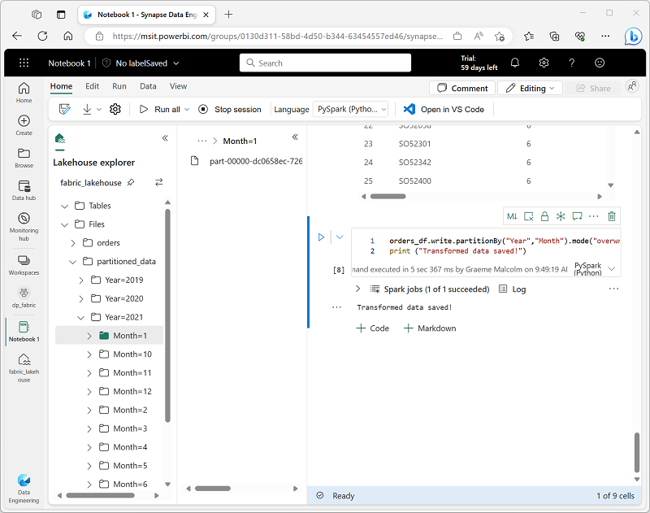

---
lab:
  title: Analyser des données avec Apache Spark
  module: Use Apache Spark to work with files in a lakehouse
---

# Analyser des données avec Apache Spark

Apache Spark est un moteur open source pour le traitement des données distribuées. Il est largement utilisé pour explorer, traiter et analyser d’énormes volumes de données dans Data Lake Storage. Spark est disponible en tant qu’option de traitement dans de nombreux produits de plateforme de données, notamment Azure HDInsight, Azure Databricks, Azure Synapse Analytics et Microsoft Fabric. L’un des avantages de Spark est la prise en charge d’un large éventail de langages de programmation, notamment Java, Scala, Python et SQL. Cela fait de Spark une solution très flexible pour les charges de travail de traitement des données, y compris le nettoyage et la manipulation des données, l’analyse statistique et le Machine Learning, ainsi que l’analytique données et la visualisation des données.

Ce labo prend environ **45** minutes.

> **Remarque** : Vous devez disposer d’une [licence d’essai Microsoft Fabric](https://learn.microsoft.com/fabric/get-started/fabric-trial) pour effectuer cet exercice.

## Créer un espace de travail

Avant d’utiliser des données dans Fabric, créez un espace de travail avec l’essai gratuit de Fabric activé.

1. Sur la [page d’accueil de Microsoft Fabric](https://app.fabric.microsoft.com) à l’adresse `https://app.fabric.microsoft.com`, sélectionnez **Synapse Engineering données**.
1. Dans la barre de menus à gauche, sélectionnez **Espaces de travail** (l’icône ressemble à &#128455;).
1. Créez un nouvel espace de travail avec le nom de votre choix et sélectionnez un mode de licence dans la section **Avancé** qui comprend la capacité Fabric (*Essai*, *Premium* ou *Fabric*).
1. Lorsque votre nouvel espace de travail s’ouvre, il doit être vide.

    

## Créer un lakehouse et charger des fichiers

Maintenant que vous disposez d’un espace de travail, il est temps de créer un data lakehouse pour les fichiers de données que vous analyserez.

1. Dans la page d’accueil d’**Engineering données Synapse**, créez un nouveau **Lakehouse** du nom de votre choix.

    Au bout d’une minute environ, un nouveau lakehouse vide est créé. Vous devez ingérer certaines données dans le data lakehouse à des fins d’analyse. Il existe plusieurs façons de procéder, mais dans cet exercice, vous allez simplement télécharger et extraire un dossier de fichiers texte de votre ordinateur local (ou machine virtuelle de laboratoire le cas échéant), puis les charger dans votre lakehouse.

1. Téléchargez et extrayez les [fichiers de données](https://github.com/MicrosoftLearning/dp-data/raw/main/orders.zip) pour cet exercice à partir de `https://github.com/MicrosoftLearning/dp-data/raw/main/orders.zip`.

1. Après avoir extrait l’archive compressée, vérifiez que vous disposez d’un dossier nommé **orders** qui contient des fichiers CSV nommés **2019.csv**, **2020.csv** et **2021.csv**.
1. Revenez à l’onglet du navigateur web contenant votre lakehouse, puis dans le menu **…** du dossier **Fichiers** dans le volet **Explorateur**, sélectionnez **Charger** et **Charger le dossier**, puis chargez le dossier **orders** à partir de votre ordinateur local (ou de la machine virtuelle de labo, le cas échéant) dans le lakehouse.
1. Une fois les fichiers chargés, développez **Fichiers** et sélectionnez le dossier **orders**, et vérifiez que les fichiers CSV ont été chargés, comme illustré ici :

    

## Créer un notebook

Pour utiliser des données dans Apache Spark, vous pouvez créer un *notebook*. Les notebooks fournissent un environnement interactif dans lequel vous pouvez écrire et exécuter du code (dans plusieurs langues), et ajouter des notes pour le documenter.

1. Dans la page **Accueil**, lors de l’affichage du contenu du dossier **orders** dans votre datalake, dans le menu **Ouvrir un notebook**, sélectionnez **Nouveau notebook**.

    Après quelques secondes, un nouveau notebook contenant une seule *cellule* s’ouvre. Les notebooks sont constitués d’une ou plusieurs cellules qui peuvent contenir du *code* ou du *Markdown* (texte mis en forme).

2. Sélectionnez la première cellule (qui est actuellement une cellule de *code*) puis, dans la barre d’outils dynamique en haut à droite, utilisez le bouton **M&#8595;** pour convertir la cellule en cellule *Markdown*.

    Lorsque la cellule devient une cellule Markdown, le texte qu’elle contient est affiché avec rendu.

3. Utilisez le bouton **&#128393;** (Modifier) pour placer la cellule en mode édition, puis modifiez le balisage Markdown comme suit :

    ```
   # Sales order data exploration

   Use the code in this notebook to explore sales order data.
    ```

4. Cliquez n’importe où dans le notebook en dehors de la cellule pour arrêter sa modification et voir le balisage Markdown rendu.

## Charger des données dans un dataframe

Vous êtes maintenant prêt à exécuter du code qui charge les données dans un *dataframe*. Les dataframes dans Spark sont similaires aux dataframes Pandas dans Python et fournissent une structure commune pour l’utilisation des données dans des lignes et des colonnes.

> **Remarque** : Spark prend en charge plusieurs langages de codage, y compris Scala et Java. Dans cet exercice, nous allons utiliser *PySpark*, qui est une variante optimisée pour Spark de Python. PySpark est l’un des langages les plus couramment utilisés sur Spark et représente le langage par défaut utilisé dans les notebooks Fabric.

1. Le notebook étant visible, dans le volet **Explorateur**, développez **Lakehouses**, puis développez la liste **Fichiers** de votre lakehouse et sélectionnez le dossier **orders** (commandes) afin que les fichiers CSV soient répertoriés en regard de l’éditeur de notebook, comme suit :

    

1. Dans le menu **…** pour **2019.csv**, sélectionnez **Charger des données** > **Spark**. Une nouvelle cellule de code contenant le code suivant doit être ajoutée au notebook :

    ```python
   df = spark.read.format("csv").option("header","true").load("Files/orders/2019.csv")
   # df now is a Spark DataFrame containing CSV data from "Files/orders/2019.csv".
   display(df)
    ```

    > **Conseil** : Vous pouvez masquer les volets de l’explorateur Lakehouse à gauche à l’aide de leurs icônes **<<** . Cela vous aidera à vous concentrer sur le notebook.

1. Utilisez le bouton **&#9655; Exécuter la cellule** à gauche de la cellule pour l’exécuter.

    > **Remarque** : Comme il s’agit de la première fois que vous exécutez du code Spark, une session Spark doit être démarrée. Cela signifie que la première exécution dans la session peut prendre environ une minute. Les exécutions suivantes seront plus rapides.

1. Une fois la commande de la cellule exécutée, examinez la sortie sous la cellule, qui doit être similaire à ceci :

    | Index | SO43701 | 11 | 2019-07-01 | Christy Zhu | christy12@adventure-works.com | Mountain-100 Silver, 44 | 16 | 3399.99 | 271,9992 |
    | -- | -- | -- | -- | -- | -- | -- | -- | -- | -- |
    | 1 | SO43704 | 1 | 2019-07-01 | Julio Ruiz | julio1@adventure-works.com | Mountain-100 Black, 48 | 1 | 3374.99 | 269,9992 |
    | 2 | SO43705 | 1 | 2019-07-01 | Curtis Lu | curtis9@adventure-works.com | Mountain-100 Silver, 38 | 1 | 3399.99 | 271,9992 |
    | ... | ... | ... | ... | ... | ... | ... | ... | ... | ... |

    La sortie affiche les lignes et les colonnes des données du fichier 2019.csv. Toutefois, notez que les en-têtes des colonnes ne sont pas corrects. Le code par défaut utilisé pour charger les données dans un dataframe suppose que le fichier CSV inclut les noms des colonnes dans la première ligne, mais dans ce cas, le fichier CSV inclut simplement les données sans informations d’en-tête.

1. Modifiez le code pour définir l’option **header** sur **false** comme suit :

    ```python
   df = spark.read.format("csv").option("header","false").load("Files/orders/2019.csv")
   # df now is a Spark DataFrame containing CSV data from "Files/orders/2019.csv".
   display(df)
    ```

1. Réexécutez la cellule et passez en revue la sortie, qui devrait être similaire à :

   | Index | _c0 | _c1 | _c2 | _c3 | _c4 | _c5 | _c6 | _c7 | _c8 |
    | -- | -- | -- | -- | -- | -- | -- | -- | -- | -- |
    | 1 | SO43701 | 11 | 2019-07-01 | Christy Zhu | christy12@adventure-works.com | Mountain-100 Silver, 44 | 16 | 3399.99 | 271,9992 |
    | 2 | SO43704 | 1 | 2019-07-01 | Julio Ruiz | julio1@adventure-works.com | Mountain-100 Black, 48 | 1 | 3374.99 | 269,9992 |
    | 3 | SO43705 | 1 | 2019-07-01 | Curtis Lu | curtis9@adventure-works.com | Mountain-100 Silver, 38 | 1 | 3399.99 | 271,9992 |
    | ... | ... | ... | ... | ... | ... | ... | ... | ... | ... |

    À présent, le dataframe inclut comme il se doit la première ligne en tant que valeurs de données, mais les noms des colonnes sont générés automatiquement et ne sont pas très utiles. Pour donner du sens aux données, vous devez définir explicitement le schéma et le type de données appropriés pour les valeurs de données dans le fichier.

1. Modifiez le code comme suit pour définir un schéma et l’appliquer lors du chargement des données :

    ```python
   from pyspark.sql.types import *

   orderSchema = StructType([
       StructField("SalesOrderNumber", StringType()),
       StructField("SalesOrderLineNumber", IntegerType()),
       StructField("OrderDate", DateType()),
       StructField("CustomerName", StringType()),
       StructField("Email", StringType()),
       StructField("Item", StringType()),
       StructField("Quantity", IntegerType()),
       StructField("UnitPrice", FloatType()),
       StructField("Tax", FloatType())
       ])

   df = spark.read.format("csv").schema(orderSchema).load("Files/orders/2019.csv")
   display(df)
    ```

1. Exécutez la cellule modifiée et passez en revue la sortie, qui devrait être similaire à :

   | Index | SalesOrderNumber | SalesOrderLineNumber | OrderDate | CustomerName | Courrier | Élément | Quantité | UnitPrice | Taxe |
    | -- | -- | -- | -- | -- | -- | -- | -- | -- | -- |
    | 1 | SO43701 | 11 | 2019-07-01 | Christy Zhu | christy12@adventure-works.com | Mountain-100 Silver, 44 | 16 | 3399.99 | 271,9992 |
    | 2 | SO43704 | 1 | 2019-07-01 | Julio Ruiz | julio1@adventure-works.com | Mountain-100 Black, 48 | 1 | 3374.99 | 269,9992 |
    | 3 | SO43705 | 1 | 2019-07-01 | Curtis Lu | curtis9@adventure-works.com | Mountain-100 Silver, 38 | 1 | 3399.99 | 271,9992 |
    | ... | ... | ... | ... | ... | ... | ... | ... | ... | ... |

    À présent, le dataframe inclut les noms de colonnes corrects (en plus de l’**index**, qui est une colonne intégrée dans tous les dataframes en fonction de la position ordinale de chaque ligne). Les types de données des colonnes sont spécifiés à l’aide d’un ensemble standard de types définis dans la bibliothèque Spark SQL, qui ont été importés au début de la cellule.

1. Le dataframe inclut uniquement les données du fichier **2019.csv**. Modifiez le code afin que le chemin de fichier utilise un caractère générique \* pour lire les données de commandes client à partir de tous les fichiers figurant dans le dossier **orders** :

    ```python
    from pyspark.sql.types import *

    orderSchema = StructType([
       StructField("SalesOrderNumber", StringType()),
       StructField("SalesOrderLineNumber", IntegerType()),
       StructField("OrderDate", DateType()),
       StructField("CustomerName", StringType()),
       StructField("Email", StringType()),
       StructField("Item", StringType()),
       StructField("Quantity", IntegerType()),
       StructField("UnitPrice", FloatType()),
       StructField("Tax", FloatType())
       ])

    df = spark.read.format("csv").schema(orderSchema).load("Files/orders/*.csv")
    display(df)
    ```

1. Exécutez la cellule de code modifiée et passez en revue la sortie, qui doit maintenant inclure les ventes de 2019, 2020 et 2021.

    **Remarque** : Seul un sous-ensemble des lignes s’affiche, de sorte que vous ne pourrez peut-être pas voir des exemples de toutes les années.

## Explorer les données dans un dataframe

L’objet dataframe inclut un large éventail de fonctions que vous pouvez utiliser pour filtrer, regrouper et manipuler les données qu’il contient.

### Filtrer un dataframe

1. Ajoutez une nouvelle cellule de code à l’aide du lien **+ Code** qui s’affiche lorsque vous déplacez la souris sous le côté gauche de la sortie de la cellule active (ou dans la barre de menus, sous l’onglet **Modifier**, sélectionnez **+ Ajouter une cellule de code**). Entrez ensuite le code suivant.

    ```Python
   customers = df['CustomerName', 'Email']
   print(customers.count())
   print(customers.distinct().count())
   display(customers.distinct())
    ```

2. Exécutez la nouvelle cellule de code et passez en revue les résultats. Observez les informations suivantes :
    - Lorsque vous effectuez une opération sur un dataframe, le résultat est un nouveau dataframe (dans ce cas, un nouveau dataframe **customers** est créé en sélectionnant un sous-ensemble spécifique de colonnes dans le dataframe **df**).
    - Les dataframes fournissent des fonctions telles que **count** et **distinct** qui peuvent être utilisées pour résumer et filtrer les données qu’ils contiennent.
    - La syntaxe `dataframe['Field1', 'Field2', ...]` est un moyen rapide de définir un sous-ensemble de colonnes. Vous pouvez également utiliser la méthode **select**, pour que la première ligne du code ci-dessus puisse être écrite sous la forme `customers = df.select("CustomerName", "Email")`

3. Modifiez le code comme suit :

    ```Python
   customers = df.select("CustomerName", "Email").where(df['Item']=='Road-250 Red, 52')
   print(customers.count())
   print(customers.distinct().count())
   display(customers.distinct())
    ```

4. Exécutez ce code modifié pour afficher les clients qui ont acheté le produit *Road-250 Red, 52*. Notez que vous pouvez « chaîner » plusieurs fonctions afin que la sortie d’une fonction devienne l’entrée de la suivante. Dans ce cas, le dataframe créé par la méthode **select** est le dataframe source de la méthode **where** utilisée pour appliquer des critères de filtrage.

### Agréger et regrouper des données dans un dataframe

1. Ajoutez une nouvelle cellule de code au notebook, puis entrez-y le code suivant :

    ```Python
   productSales = df.select("Item", "Quantity").groupBy("Item").sum()
   display(productSales)
    ```

2. Exécutez la cellule de code que vous avez ajoutée et remarquez que les résultats affichent la somme des quantités de commandes regroupées par produit. La méthode **groupBy** regroupe les lignes par *Item*, et la fonction d’agrégation **sum** suivante est appliquée à toutes les colonnes numériques restantes (dans ce cas, *Quantity*).

3. Ajoutez encore une nouvelle cellule de code au notebook, puis entrez-y le code suivant :

    ```Python
   from pyspark.sql.functions import *

   yearlySales = df.select(year(col("OrderDate")).alias("Year")).groupBy("Year").count().orderBy("Year")
   display(yearlySales)
    ```

4. Exécutez la cellule de code que vous avez ajoutée et notez que les résultats indiquent le nombre de commandes client par an. Notez que la méthode **select** inclut une fonction SQL **year** pour extraire le composant année du champ *OrderDate* (c’est pourquoi le code inclut une instruction **import** pour importer des fonctions de la bibliothèque Spark SQL). Il utilise ensuite une méthode **alias** pour affecter un nom de colonne à la valeur d’année extraite. Les données sont ensuite regroupées par la colonne *Year* dérivée et le nombre de lignes dans chaque groupe est calculé avant que la méthode **orderBy** soit finalement utilisée pour trier le dataframe résultant.

## Utiliser Spark pour transformer des fichiers de données

Une tâche courante des ingénieurs données consiste à ingérer des données dans un format ou une structure spécifique, et à les transformer pour poursuivre leur traitement ou analyse en aval.

### Utiliser des méthodes et des fonctions de dataframe pour transformer les données

1. Ajoutez encore une nouvelle cellule de code au notebook, puis entrez-y le code suivant :

    ```Python
   from pyspark.sql.functions import *

   ## Create Year and Month columns
   transformed_df = df.withColumn("Year", year(col("OrderDate"))).withColumn("Month", month(col("OrderDate")))

   # Create the new FirstName and LastName fields
   transformed_df = transformed_df.withColumn("FirstName", split(col("CustomerName"), " ").getItem(0)).withColumn("LastName", split(col("CustomerName"), " ").getItem(1))

   # Filter and reorder columns
   transformed_df = transformed_df["SalesOrderNumber", "SalesOrderLineNumber", "OrderDate", "Year", "Month", "FirstName", "LastName", "Email", "Item", "Quantity", "UnitPrice", "Tax"]

   # Display the first five orders
   display(transformed_df.limit(5))
    ```

2. Exécutez le code pour créer un nouveau dataframe à partir des données de commandes d’origine avec les transformations suivantes :
    - Ajoutez les colonnes **Year** et **Month** basées sur la colonne **OrderDate**.
    - Ajoutez les colonnes **FirstName** et **LastName** basées sur la colonne **CustomerName**.
    - Filtrez et réorganisez les colonnes, et supprimez la colonne **CustomerName**.

3. Passez en revue la sortie et vérifiez que les transformations ont été apportées aux données.

    Vous pouvez utiliser toute la puissance de la bibliothèque Spark SQL pour transformer les données en filtrant les lignes, en dérivant, en supprimant et en renommant des colonnes, et en appliquant d’autres modifications de données requises.

    > **Conseil** : Consultez la [documentation des dataframes Spark](https://spark.apache.org/docs/latest/api/python/reference/pyspark.sql/dataframe.html) pour en savoir plus sur les méthodes de l’objet Dataframe.

### Enregistrer les données transformées

1. Ajoutez une nouvelle cellule avec le code suivant pour enregistrer le dataframe transformé au format Parquet (en remplaçant les données si elles existent déjà) :

    ```Python
   transformed_df.write.mode("overwrite").parquet('Files/transformed_data/orders')
   print ("Transformed data saved!")
    ```

    > **Remarque** : Le format *Parquet* est généralement préféré pour les fichiers de données que vous allez utiliser pour une analyse ou une ingestion plus approfondie dans un magasin analytique. Parquet est un format très efficace qui est pris en charge par la plupart des systèmes d’analytique de données à grande échelle. Parfois, votre besoin de transformation de données peut en fait simplement consister à convertir des données d’un autre format (comme CSV) vers Parquet !

2. Exécutez la cellule et attendez le message indiquant que les données ont été enregistrées. Ensuite, dans le volet **Lakehouses** à gauche, dans le menu **…** du nœud **Fichiers**, sélectionnez **Actualiser**, puis sélectionnez le dossier **transformed_orders** pour vérifier qu’il contient un nouveau dossier nommé **orders**, qui contient à son tour un ou plusieurs fichiers Parquet.

    

3. Ajoutez une nouvelle cellule avec le code suivant pour charger un nouveau dataframe à partir des fichiers Parquet figurant dans le dossier **transformed_orders/orders** :

    ```Python
   orders_df = spark.read.format("parquet").load("Files/transformed_data/orders")
   display(orders_df)
    ```

4. Exécutez la cellule et vérifiez que les résultats affichent les données de commandes qui ont été chargées à partir des fichiers Parquet.

### Enregistrer des données dans des fichiers partitionnés

1. Ajoutez une nouvelle cellule avec le code suivant, qui enregistre le dataframe et partitionne les données par **Year** (année) et par **Month** (mois) :

    ```Python
   orders_df.write.partitionBy("Year","Month").mode("overwrite").parquet("Files/partitioned_data")
   print ("Transformed data saved!")
    ```

2. Exécutez la cellule et attendez le message indiquant que les données ont été enregistrées. Ensuite, dans le volet **Lakehouses** à gauche, dans le menu **...** du nœud **Fichiers**, sélectionnez **Actualiser**, puis développez le dossier **partitioned_orders** pour vérifier qu’il contient une hiérarchie de dossiers nommés **Year=* xxxx***, chacun contenant des dossiers nommés **Month=* xxxx***. Chaque dossier de mois contient un fichier Parquet avec les commandes de ce mois.

    

    Le partitionnement des fichiers de données est un moyen courant d’optimiser les performances lors du traitement de grands volumes de données. Cette technique peut améliorer considérablement les performances et faciliter le filtrage des données.

3. Ajoutez une nouvelle cellule avec le code suivant pour charger un nouveau dataframe à partir du fichier **orders.parquet** :

    ```Python
   orders_2021_df = spark.read.format("parquet").load("Files/partitioned_data/Year=2021/Month=*")
   display(orders_2021_df)
    ```

4. Exécutez cette cellule et vérifiez que les résultats affichent les données de commandes pour les ventes de 2021. Notez que les colonnes de partitionnement spécifiées dans le chemin (**Year** et **Month**) ne sont pas incluses dans le dataframe.

## Utiliser des tables et SQL

Comme vous l’avez vu, les méthodes natives de l’objet dataframe vous permettent d’interroger et d’analyser des données à partir d’un fichier de manière très efficace. Toutefois, de nombreux analystes de données sont plus à l’aise avec des tables qu’ils peuvent interroger à l’aide de la syntaxe SQL. Spark fournit un *metastore* dans lequel vous pouvez définir des tables relationnelles. La bibliothèque Spark SQL qui fournit l’objet dataframe prend également en charge l’utilisation d’instructions SQL pour interroger les tables figurant dans le metastore. En utilisant ces fonctionnalités Spark, vous pouvez combiner la flexibilité d’un lac de données avec le schéma de données structuré et les requêtes SQL d’un entrepôt de données relationnelles, d’où le terme de « data lakehouse ».

### Créer une table

Les tables d’un metastore Spark sont des abstractions relationnelles sur les fichiers figurant dans le lac de données. Les tables peuvent être *gérées* (auquel cas les fichiers sont gérés par le metastore) ou *externes* (auquel cas la table fait référence à un emplacement de fichier dans le lac de données que vous gérez indépendamment du metastore).

1. Ajoutez une nouvelle cellule de code au notebook, puis entrez le code suivant, qui enregistre le dataframe des données de commandes client sous la forme d’une table nommée **salesorders** :

    ```Python
   # Create a new table
   df.write.format("delta").saveAsTable("salesorders")

   # Get the table description
   spark.sql("DESCRIBE EXTENDED salesorders").show(truncate=False)
    ```

    > **Remarque** : Il est intéressant de relever quelques points au sujet de cet exemple. Tout d’abord, aucun chemin explicite n’est fourni, de sorte que les fichiers de la table sont gérés par le metastore. Deuxièmement, la table est enregistrée au format **delta**. Vous pouvez créer des tables basées sur plusieurs formats de fichiers (y compris CSV, Parquet et Avro), mais *delta lake* est une technologie Spark qui ajoute des fonctionnalités de base de données relationnelles aux tables, notamment la prise en charge des transactions, le contrôle de version de ligne et d’autres fonctionnalités utiles. La création de tables au format delta est recommandée pour les data lakehouses dans Fabric.

2. Exécutez la cellule de code et passez en revue la sortie, qui décrit la définition de la nouvelle table.

3. Dans le volet **Lakehouses**, dans le menu **…** du dossier **Tables**, sélectionnez **Actualiser**. Développez ensuite le nœud **Tables** et vérifiez que la table **salesorders** a été créée.

    

5. Dans le menu **…** de la table **salesorders**, sélectionnez **Charger des données** > **Spark**.

    Une nouvelle cellule de code contenant du code similaire à l’exemple suivant est ajoutée au notebook :

    ```Python
   df = spark.sql("SELECT * FROM [your_lakehouse].salesorders LIMIT 1000")
   display(df)
    ```

6. Exécutez ce nouveau code, qui utilise la bibliothèque Spark SQL pour incorporer une requête SQL sur la table **salesorder** dans le code PySpark et charger les résultats de la requête dans un dataframe.

### Exécuter du code SQL dans une cellule

Bien qu’il soit utile d’incorporer des instructions SQL dans une cellule contenant du code PySpark, les analystes de données veulent souvent simplement travailler directement dans SQL.

1. Ajoutez une nouvelle cellule de code au notebook, puis entrez-y le code suivant :

    ```sql
   %%sql
   SELECT YEAR(OrderDate) AS OrderYear,
          SUM((UnitPrice * Quantity) + Tax) AS GrossRevenue
   FROM salesorders
   GROUP BY YEAR(OrderDate)
   ORDER BY OrderYear;
    ```

2. Exécutez la cellule et passez en revue les résultats. Observez que :
    - La ligne `%%sql` au début de la cellule (appelée *commande magique*) indique que le runtime de langage Spark SQL doit être utilisé à la place de PySpark pour exécuter le code dans cette cellule.
    - Le code SQL fait référence à la table **salesorders** que vous avez créée précédemment.
    - La sortie de la requête SQL s’affiche automatiquement en tant que résultat sous la cellule.

> **Remarque** : Pour plus d’informations sur Spark SQL et les dataframes, consultez la [documentation Spark SQL](https://spark.apache.org/docs/2.2.0/sql-programming-guide.html).

## Visualiser les données avec Spark

Selon le proverbe, une image vaut mille mots, et un graphique exprime souvent plus qu’un millier de lignes de données. Les notebooks dans Fabric incluent une vue graphique intégrée pour les données affichées à partir d’un dataframe ou d’une requête Spark SQL, mais elle n’est pas conçue en tant que graphique complet. Toutefois, vous pouvez utiliser les bibliothèques graphiques Python telles que **matplotlib** et **seaborn** pour créer des graphiques à partir de données dans des dataframes.

### Afficher les résultats sous forme de graphique

1. Ajoutez une nouvelle cellule de code au notebook, puis entrez-y le code suivant :

    ```sql
   %%sql
   SELECT * FROM salesorders
    ```

2. Exécutez ce code et observez qu’il retourne les données de la vue **salesorders** que vous avez créée précédemment.
3. Dans la section des résultats sous la cellule, modifiez l’option **Affichage** de **Tableau** à **Graphique**.
4. Utilisez le bouton **Personnaliser le graphique** en haut à droite du graphique pour afficher le volet d’options du graphique. Définissez ensuite les options comme suit et sélectionnez **Appliquer** :
    - **Type de graphique** : Graphique à barres
    - **Clé** : Élément
    - **Valeurs** : Quantité
    - **Groupe de séries** : *laissez vide*
    - **Agrégation** : Somme
    - **Empilé** : *Non sélectionné*

5. Vérifiez que le graphique ressemble à ceci :

    

### Bien démarrer avec **matplotlib**

1. Ajoutez une nouvelle cellule de code au notebook, puis entrez-y le code suivant :

    ```Python
   sqlQuery = "SELECT CAST(YEAR(OrderDate) AS CHAR(4)) AS OrderYear, \
                   SUM((UnitPrice * Quantity) + Tax) AS GrossRevenue \
               FROM salesorders \
               GROUP BY CAST(YEAR(OrderDate) AS CHAR(4)) \
               ORDER BY OrderYear"
   df_spark = spark.sql(sqlQuery)
   df_spark.show()
    ```

2. Exécutez le code et observez qu’il retourne un dataframe Spark contenant le chiffre d’affaires annuel.

    Pour visualiser les données sous forme graphique, nous allons commencer en utilisant la bibliothèque Python **matplotlib**. Cette bibliothèque est la bibliothèque de traçage principale sur laquelle de nombreuses autres bibliothèques sont basées, et elle offre une grande flexibilité dans la création de graphiques.

3. Ajoutez une nouvelle cellule de code au notebook, puis ajoutez-y le code suivant :

    ```Python
   from matplotlib import pyplot as plt

   # matplotlib requires a Pandas dataframe, not a Spark one
   df_sales = df_spark.toPandas()

   # Create a bar plot of revenue by year
   plt.bar(x=df_sales['OrderYear'], height=df_sales['GrossRevenue'])

   # Display the plot
   plt.show()
    ```

4. Exécutez la cellule et passez en revue les résultats, qui se composent d’un histogramme indiquant le chiffre d’affaires brut total pour chaque année. Notez les fonctionnalités suivantes du code utilisé pour produire ce graphique :
    - La bibliothèque **matplotlib** nécessite un dataframe *Pandas*. Vous devez donc convertir le dataframe *Spark* retourné par la requête Spark SQL dans ce format.
    - Au cœur de la bibliothèque **matplotlib** figure l’objet **pyplot**. Il s’agit de la base de la plupart des fonctionnalités de traçage.
    - Les paramètres par défaut aboutissent à un graphique utilisable, mais il existe de nombreuses façons de le personnaliser.

5. Modifiez le code pour tracer le graphique comme suit :

    ```Python
   from matplotlib import pyplot as plt

   # Clear the plot area
   plt.clf()

   # Create a bar plot of revenue by year
   plt.bar(x=df_sales['OrderYear'], height=df_sales['GrossRevenue'], color='orange')

   # Customize the chart
   plt.title('Revenue by Year')
   plt.xlabel('Year')
   plt.ylabel('Revenue')
   plt.grid(color='#95a5a6', linestyle='--', linewidth=2, axis='y', alpha=0.7)
   plt.xticks(rotation=45)

   # Show the figure
   plt.show()
    ```

6. Réexécutez la cellule de code et examinez les résultats. Le graphique inclut désormais un peu plus d’informations.

    Un tracé est techniquement contenu dans une **figure**. Dans les exemples précédents, la figure a été créée implicitement pour vous, mais vous pouvez la créer explicitement.

7. Modifiez le code pour tracer le graphique comme suit :

    ```Python
   from matplotlib import pyplot as plt

   # Clear the plot area
   plt.clf()

   # Create a Figure
   fig = plt.figure(figsize=(8,3))

   # Create a bar plot of revenue by year
   plt.bar(x=df_sales['OrderYear'], height=df_sales['GrossRevenue'], color='orange')

   # Customize the chart
   plt.title('Revenue by Year')
   plt.xlabel('Year')
   plt.ylabel('Revenue')
   plt.grid(color='#95a5a6', linestyle='--', linewidth=2, axis='y', alpha=0.7)
   plt.xticks(rotation=45)

   # Show the figure
   plt.show()
    ```

8. Réexécutez la cellule de code et examinez les résultats. La figure détermine la forme et la taille du tracé.

    Une figure peut contenir plusieurs sous-tracés, chacun sur son propre *axe*.

9. Modifiez le code pour tracer le graphique comme suit :

    ```Python
   from matplotlib import pyplot as plt

   # Clear the plot area
   plt.clf()

   # Create a figure for 2 subplots (1 row, 2 columns)
   fig, ax = plt.subplots(1, 2, figsize = (10,4))

   # Create a bar plot of revenue by year on the first axis
   ax[0].bar(x=df_sales['OrderYear'], height=df_sales['GrossRevenue'], color='orange')
   ax[0].set_title('Revenue by Year')

   # Create a pie chart of yearly order counts on the second axis
   yearly_counts = df_sales['OrderYear'].value_counts()
   ax[1].pie(yearly_counts)
   ax[1].set_title('Orders per Year')
   ax[1].legend(yearly_counts.keys().tolist())

   # Add a title to the Figure
   fig.suptitle('Sales Data')

   # Show the figure
   plt.show()
    ```

10. Réexécutez la cellule de code et examinez les résultats. La figure contient les sous-tracés spécifiés dans le code.

> **Remarque** : Pour en savoir plus sur le traçage avec matplotlib, consultez la [documentation matplotlib](https://matplotlib.org/).

### Utiliser la bibliothèque **seaborn**

Bien que **matplotlib** vous permette de créer des graphiques complexes de plusieurs types, il peut nécessiter du code complexe pour obtenir les meilleurs résultats. Pour cette raison, au fil des ans, de nombreuses nouvelles bibliothèques ont été construites sur la base de matplotlib pour en extraire la complexité et améliorer ses capacités. L’une de ces bibliothèques est **seaborn**.

1. Ajoutez une nouvelle cellule de code au notebook, puis entrez-y le code suivant :

    ```Python
   import seaborn as sns

   # Clear the plot area
   plt.clf()

   # Create a bar chart
   ax = sns.barplot(x="OrderYear", y="GrossRevenue", data=df_sales)
   plt.show()
    ```

2. Exécutez le code et observez qu’il affiche un graphique à barres utilisant la bibliothèque seaborn.
3. Modifiez le code comme suit :

    ```Python
   import seaborn as sns

   # Clear the plot area
   plt.clf()

   # Set the visual theme for seaborn
   sns.set_theme(style="whitegrid")

   # Create a bar chart
   ax = sns.barplot(x="OrderYear", y="GrossRevenue", data=df_sales)
   plt.show()
    ```

4. Exécutez le code modifié et notez que seaborn vous permet de définir un thème de couleur cohérent pour vos tracés.

5. Modifiez à nouveau le code comme suit :

    ```Python
   import seaborn as sns

   # Clear the plot area
   plt.clf()

   # Create a line chart
   ax = sns.lineplot(x="OrderYear", y="GrossRevenue", data=df_sales)
   plt.show()
    ```

6. Exécutez le code modifié pour afficher le chiffre d’affaires annuel sous forme de graphique en courbes.

> **Remarque** : Pour en savoir plus sur le traçage avec seaborn, consultez la [documentation seaborn](https://seaborn.pydata.org/index.html).

## Enregistrer le notebook et mettre fin à la session Spark

Maintenant que vous avez terminé d’utiliser les données, vous pouvez enregistrer le notebook avec un nom explicite et mettre fin à la session Spark.

1. Dans la barre de menus du notebook, utilisez l’icône ⚙️ **Paramètres** pour afficher les paramètres du notebook.
2. Définissez le **nom** du notebook sur **Explorer les commandes client**, puis fermez le volet des paramètres.
3. Dans le menu du notebook, sélectionnez **Arrêter la session** pour mettre fin à la session Spark.

## Nettoyer les ressources

Dans cet exercice, vous avez appris à utiliser Spark pour travailler sur des données dans Microsoft Fabric.

Si vous avez terminé d’explorer votre lakehouse, vous pouvez supprimer l’espace de travail que vous avez créé pour cet exercice.

1. Dans la barre de gauche, sélectionnez l’icône de votre espace de travail pour afficher tous les éléments qu’il contient.
2. Dans la page de l’espace de travail, sélectionnez **Paramètres de l’espace de travail**.
3. En bas de la section **Général**, sélectionnez **Supprimer cet espace de travail**.
