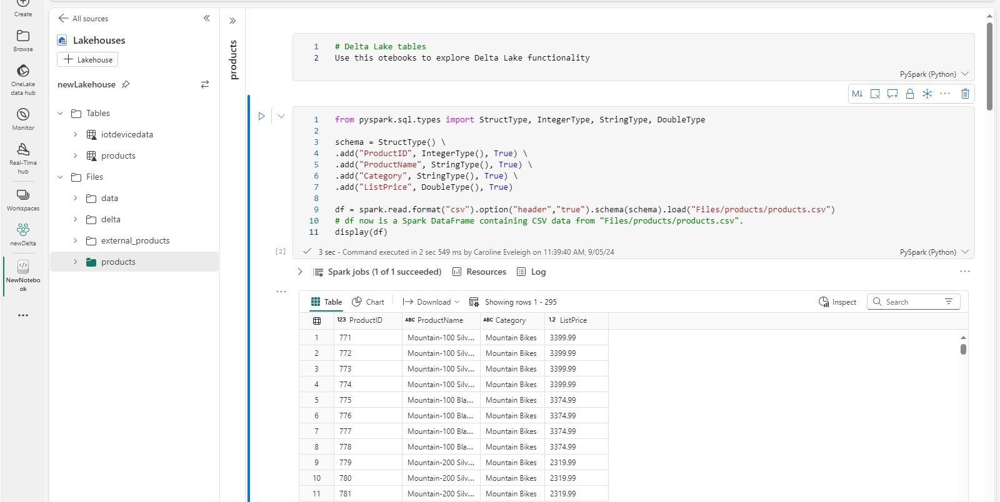
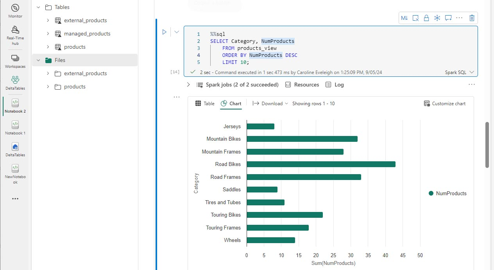

---
lab:
  title: Utiliser des tables delta dans Apache Spark
  module: Work with Delta Lake tables in Microsoft Fabric
---

# Utiliser des tables delta dans Apache Spark

Les tables d’un lakehouse Microsoft Fabric sont basées sur le format de fichier open source Delta Lake. Delta Lake ajoute la prise en charge de la sémantique relationnelle pour les données de diffusion et de lots. Dans cet exercice, vous allez créer des tables Delta et explorer les données à l’aide de requêtes SQL.

Cet exercice devrait prendre environ **45** minutes

> [!NOTE]
> Vous devez disposer d’une version d’évaluation [Microsoft Fabric](/fabric/get-started/fabric-trial) pour effectuer cet exercice.

## Créer un espace de travail

Tout d’abord, créez un espace de travail avec la *version d’évaluation de Fabric* activée.

1. Accédez à la [page d’accueil de Microsoft Fabric](https://app.fabric.microsoft.com/home?experience=fabric) sur `https://app.fabric.microsoft.com/home?experience=fabric` dans un navigateur et connectez-vous avec vos informations d’identification Fabric.
1. Dans la barre de menus à gauche, sélectionnez **Espaces de travail** (🗇).
1. Créez un **nouvel espace de travail** avec le nom de votre choix et sélectionnez un mode de licence qui inclut la capacité Fabric (Essai, Premium ou Fabric).
1. Lorsque votre nouvel espace de travail s’ouvre, il doit être vide.

    

## Créer un lakehouse et charger des données

Maintenant que vous disposez d’un espace de travail, il est temps de créer un lakehouse et de charger vos données.

1. Sélectionnez **Créer** dans la barre de menus de gauche. Dans la page *Nouveau*, sous la section *Engineering données*, sélectionnez **Lakehouse**. Donnez-lui un nom unique de votre choix.

    >**Note** : si l’option **Créer** n’est pas épinglée à la barre latérale, vous devez d’abord sélectionner l’option avec des points de suspension (**...**).

1. Il existe plusieurs façons d’ingérer les données, mais dans cet exercice, vous allez télécharger un fichier texte sur votre ordinateur local (ou sur votre machine virtuelle de labo le cas échéant), puis le charger dans votre lakehouse. Téléchargez le [fichier de données](https://github.com/MicrosoftLearning/dp-data/raw/main/products.csv) à partir de `https://github.com/MicrosoftLearning/dp-data/raw/main/products.csv`, en l’enregistrant en tant que *products.csv*.
1.  Revenez à l’onglet du navigateur web contenant votre lakehouse, puis, dans le volet Explorateur, en regard du dossier **Fichiers**, sélectionnez le menu … .  Créez un **sous-dossier** appelé *produits*.
1.  Dans le menu … du dossier produits, **chargez** le fichier *products.csv* à partir de votre ordinateur local (ou de votre machine virtuelle de labo le cas échéant).
1.  Une fois le fichier chargé, sélectionnez le dossier **products** et vérifiez que le fichier a été chargé, comme montré ici :

    
  
## Explorer les données dans un DataFrame

1.  Créez un **notebook**. Après quelques secondes, un nouveau notebook contenant une seule cellule s’ouvre. Les notebooks sont constitués d’une ou plusieurs cellules qui peuvent contenir du code ou du Markdown (texte mis en forme).
2.  Sélectionnez la première cellule (qui est actuellement une cellule de code) puis, dans la barre d’outils en haut à droite, utilisez le bouton **M↓** pour convertir la cellule en cellule Markdown. Le texte contenu dans la cellule s’affiche alors sous forme de texte mis en forme. Utilisez des cellules Markdown pour fournir des éléments d’explication sur votre code.
3.  Utilisez le bouton 🖉 (Modifier) pour placer la cellule en mode édition, puis modifiez le balisage Markdown comme suit :

    ```markdown
    # Delta Lake tables 
    Use this notebook to explore Delta Lake functionality 
    ```

4. Cliquez n’importe où dans le notebook en dehors de la cellule pour arrêter sa modification et voir le balisage Markdown rendu.
5. Ajoutez une nouvelle cellule de code et ajoutez le code suivant pour lire les données des produits dans un DataFrame à l’aide d’un schéma défini :

    ```python
    from pyspark.sql.types import StructType, IntegerType, StringType, DoubleType

    # define the schema
    schema = StructType() \
    .add("ProductID", IntegerType(), True) \
    .add("ProductName", StringType(), True) \
    .add("Category", StringType(), True) \
    .add("ListPrice", DoubleType(), True)

    df = spark.read.format("csv").option("header","true").schema(schema).load("Files/products/products.csv")
    # df now is a Spark DataFrame containing CSV data from "Files/products/products.csv".
    display(df)
    ```

> [!TIP]
> Masquez ou affichez les volets de l’Explorateur à l’aide de l’icône de chevron «. Cela vous permet de vous concentrer sur le notebook ou vos fichiers.

7. Utilisez le bouton **Exécuter la cellule** (▷) à gauche de la cellule pour l’exécuter.

> [!NOTE]
> Comme c’est la première fois que vous exécutez du code dans ce notebook, une session Spark doit être démarrée. Cela signifie que la première exécution peut prendre environ une minute. Les exécutions suivantes seront plus rapides.

8. Une fois le code de la cellule exécuté, examinez la sortie sous la cellule, qui doit être similaire à ceci :

    
 
## Créer des tables delta

Vous pouvez enregistrer le DataFrame en tant que table delta en utilisant la méthode *saveAsTable*. Delta Lake prend en charge la création de tables managées et externes.

   * Les tables delta **managées** bénéficient de performances plus élevées, car Fabric gère les métadonnées de schéma et les fichiers de données.
   * Les tables **externes** vous permettent de stocker des données en externe, avec les métadonnées gérées par Fabric.

### Créer une table managée

Les fichiers de données sont créés dans le dossier **Tables**.

1. Sous les résultats retournés par la première cellule de code, utilisez l’icône +Code pour ajouter une nouvelle cellule de code.

> [!TIP]
> Pour afficher l’icône +Code, déplacez la souris juste en dessous et à gauche de la sortie de la cellule active. Sinon, dans la barre de menus, dans l’onglet Modifier, sélectionnez **+Ajouter une cellule de code**.

2. Pour créer une table delta managée, ajoutez une nouvelle cellule, entrez le code suivant, puis exécutez la cellule :

    ```python
    df.write.format("delta").saveAsTable("managed_products")
    ```

3.  Dans le volet Explorateur Lakehouse, **actualisez** le dossier Tables et développez le nœud Tables pour vérifier que la table **managed_products** a été créée.

>[!NOTE]
> L’icône de triangle en regard du nom de fichier indique une table delta.

Les fichiers des tables managées sont stockés dans le dossier **Tables** dans le lakehouse. Un dossier nommé *managed_products* a été créé pour stocker les fichiers Parquet, et le dossier delta_log de la table.

### Créer une table externe

Vous pouvez également créer des tables externes, qui peuvent être stockées ailleurs que dans le lakehouse, avec les métadonnées de schéma stockées dans le lakehouse.

1.  Dans le volet Explorateur Lakehouse, dans le menu … du dossier **Fichiers**, sélectionnez **Copier le chemin ABFS**. Le chemin ABFS est le chemin d’accès complet du dossier Files du lakehouse.

2.  Dans une nouvelle cellule de code, collez le chemin ABFS. Ajoutez le code suivant, à l’aide de couper-coller pour insérer le abfs_path au bon endroit dans le code :

    ```python
    df.write.format("delta").saveAsTable("external_products", path="abfs_path/external_products")
    ```

3. Le chemin complet doit être similaire a ceci :

    ```python
    abfss://workspace@tenant-onelake.dfs.fabric.microsoft.com/lakehousename.Lakehouse/Files/external_products
    ```

4. **Exécutez** la cellule pour enregistrer le DataFrame en tant que table externe dans le dossier Files/external_products.

5.  Dans le volet Explorateur Lakehouse, **actualisez** le dossier Tables, développez le nœud Tables et vérifiez que la table external_products a été créée et qu’elle contient les métadonnées du schéma.

6.  Dans le volet Explorateur Lakehouse, dans le menu … du dossier Files, sélectionnez **Actualiser**. Développez ensuite le nœud Files et vérifiez que le dossier external_products a été créé pour les fichiers de données de la table.

### Comparer les tables managées et les tables externes

Explorons les différences entre les tables managées et les tables externes à l’aide de la commande magic %%sql.

1. Dans une nouvelle cellule de code, exécutez le code suivant :

    ```python
    %%sql
    DESCRIBE FORMATTED managed_products;
    ```

2. Dans les résultats, affichez la propriété Emplacement de la table. Cliquez sur la valeur Emplacement dans la colonne Type de données pour afficher le chemin d’accès complet. Notez que l’emplacement de stockage OneLake se termine par /Tables/managed_products.

3. Modifiez la commande DESCRIBE pour afficher les détails de la table external_products comme indiqué ici :

    ```python
    %%sql
    DESCRIBE FORMATTED external_products;
    ```

4. Exécutez la cellule et, dans les résultats, affichez la propriété Emplacement de la table. Étendez la colonne Type de données pour voir le chemin d’accès complet et notez que les emplacements de stockage OneLake se terminent par /Files/external_products.

5. Dans une nouvelle cellule de code, exécutez le code suivant :

    ```python
    %%sql
    DROP TABLE managed_products;
    DROP TABLE external_products;
    ```

6. Dans le volet Explorateur Lakehouse, **actualisez** le dossier Tables pour vérifier qu’aucune table n’est répertoriée dans le nœud Tables.
7.  Dans le volet Explorateur Lakehouse, **actualisez** le dossier Files et vérifiez que le fichier external_products n’a *pas* été supprimé. Sélectionnez ce dossier pour afficher les fichiers de données Parquet et le dossier _delta_log. 

Les métadonnées de table pour la table externe ont été supprimées, mais pas les fichiers de données.

## Utiliser SQL pour créer une table delta

Vous allez maintenant créer une table delta à l’aide de la commande magic %%sql. 

1. Ajoutez une autre cellule de code et exécutez le code suivant :

    ```python
    %%sql
    CREATE TABLE products
    USING DELTA
    LOCATION 'Files/external_products';
    ```

2. Dans le volet Explorateur Lakehouse, dans le menu … du dossier **Tables**, sélectionnez **Actualiser**. Développez ensuite le nœud Tables et vérifiez qu’une nouvelle table nommée *products* est listée. Développez ensuite la table pour afficher le schéma.

3. Ajoutez une autre cellule de code et exécutez le code suivant :

    ```python
    %%sql
    SELECT * FROM products;
    ```

## Explorer le versioning des tables

L’historique des transactions des tables delta est stocké dans des fichiers JSON, dans le dossier delta_log. Vous pouvez utiliser ce journal des transactions pour gérer le versioning des données.

1.  Ajoutez une nouvelle cellule de code au notebook et exécutez le code suivant qui implémente une réduction de 10 % du prix des VTT :

    ```python
    %%sql
    UPDATE products
    SET ListPrice = ListPrice * 0.9
    WHERE Category = 'Mountain Bikes';
    ```

2. Ajoutez une autre cellule de code et exécutez le code suivant :

    ```python
    %%sql
    DESCRIBE HISTORY products;
    ```

Les résultats montrent l’historique des transactions enregistrées pour la table.

3.  Ajoutez une autre cellule de code et exécutez le code suivant :

    ```python
    delta_table_path = 'Files/external_products'
    # Get the current data
    current_data = spark.read.format("delta").load(delta_table_path)
    display(current_data)

    # Get the version 0 data
    original_data = spark.read.format("delta").option("versionAsOf", 0).load(delta_table_path)
    display(original_data)
    ```

Deux jeux de résultats son renvoyés : un contenant les données après la réduction du prix et l’autre montrant la version d’origine des données.

## Analyser les données de table Delta avec des requêtes SQL

À l’aide de la commande magic SQL, vous pouvez utiliser la syntaxe SQL au lieu de Pyspark. Ici, vous allez créer une vue temporaire à partir de la table products à l’aide d’une instruction `SELECT`.

1. Ajoutez une nouvelle cellule de code, puis exécutez le code suivant pour créer et afficher l’affichage temporaire :

    ```python
    %%sql
    -- Create a temporary view
    CREATE OR REPLACE TEMPORARY VIEW products_view
    AS
        SELECT Category, COUNT(*) AS NumProducts, MIN(ListPrice) AS MinPrice, MAX(ListPrice) AS MaxPrice, AVG(ListPrice) AS AvgPrice
        FROM products
        GROUP BY Category;

    SELECT *
    FROM products_view
    ORDER BY Category;    
    ```

2. Ajoutez une nouvelle cellule de code et exécutez le code suivant pour retourner les 10 premières catégories par nombre de produits :

    ```python
    %%sql
    SELECT Category, NumProducts
    FROM products_view
    ORDER BY NumProducts DESC
    LIMIT 10;
    ```

3. Lorsque les données sont retournées, sélectionnez la vue **Graphique** pour afficher un graphique à barres.

    

Vous pouvez également exécuter une requête SQL à l’aide de PySpark.

4. Ajoutez une nouvelle cellule de code, puis exécutez le code suivant :

    ```python
    from pyspark.sql.functions import col, desc

    df_products = spark.sql("SELECT Category, MinPrice, MaxPrice, AvgPrice FROM products_view").orderBy(col("AvgPrice").desc())
    display(df_products.limit(6))
    ```

## Utiliser des tables delta pour les données de diffusion

Delta Lake prend en charge les données de diffusion. Les tables delta peuvent être un récepteur ou une source pour des flux de données créés en utilisant l’API Spark Structured Streaming. Dans cet exemple, vous allez utiliser une table delta comme récepteur pour des données de diffusion dans un scénario Internet des objets (IoT) simulé.

1.  Ajoutez une nouvelle cellule de code, ajoutez le code suivant et exécutez-le :

    ```python
    from notebookutils import mssparkutils
    from pyspark.sql.types import *
    from pyspark.sql.functions import *

    # Create a folder
    inputPath = 'Files/data/'
    mssparkutils.fs.mkdirs(inputPath)

    # Create a stream that reads data from the folder, using a JSON schema
    jsonSchema = StructType([
    StructField("device", StringType(), False),
    StructField("status", StringType(), False)
    ])
    iotstream = spark.readStream.schema(jsonSchema).option("maxFilesPerTrigger", 1).json(inputPath)

    # Write some event data to the folder
    device_data = '''{"device":"Dev1","status":"ok"}
    {"device":"Dev1","status":"ok"}
    {"device":"Dev1","status":"ok"}
    {"device":"Dev2","status":"error"}
    {"device":"Dev1","status":"ok"}
    {"device":"Dev1","status":"error"}
    {"device":"Dev2","status":"ok"}
    {"device":"Dev2","status":"error"}
    {"device":"Dev1","status":"ok"}'''

    mssparkutils.fs.put(inputPath + "data.txt", device_data, True)

    print("Source stream created...")
    ```

Vérifiez que le message *Flux source créé…* est affichée. Le code que vous venez d’exécuter a créé une source de données de streaming basée sur un dossier dans lequel des données ont été enregistrées, représentant les lectures d’appareils IoT hypothétiques.

2. Dans une nouvelle cellule de code, ajoutez et exécutez le code suivant :

    ```python
    # Write the stream to a delta table
    delta_stream_table_path = 'Tables/iotdevicedata'
    checkpointpath = 'Files/delta/checkpoint'
    deltastream = iotstream.writeStream.format("delta").option("checkpointLocation", checkpointpath).start(delta_stream_table_path)
    print("Streaming to delta sink...")
    ```

Ce code écrit les données des appareils de diffusion en continu au format delta dans un dossier nommé iotdevicedata. En raison du chemin de l’emplacement du dossier dans le dossier Tables, une table sera créée automatiquement pour celui-ci.

3. Dans une nouvelle cellule de code, ajoutez et exécutez le code suivant :

    ```python
    %%sql
    SELECT * FROM IotDeviceData;
    ```

Ce code interroge la table IotDeviceData, qui contient les données des appareils provenant de la source de streaming.

4. Dans une nouvelle cellule de code, ajoutez et exécutez le code suivant :

    ```python
    # Add more data to the source stream
    more_data = '''{"device":"Dev1","status":"ok"}
    {"device":"Dev1","status":"ok"}
    {"device":"Dev1","status":"ok"}
    {"device":"Dev1","status":"ok"}
    {"device":"Dev1","status":"error"}
    {"device":"Dev2","status":"error"}
    {"device":"Dev1","status":"ok"}'''

    mssparkutils.fs.put(inputPath + "more-data.txt", more_data, True)
    ```

Ce code écrit plus de données d’appareils hypothétiques dans la source de streaming.

5. Réexécutez la cellule contenant le code suivant :

    ```python
    %%sql
    SELECT * FROM IotDeviceData;
    ```

Ce code interroge à nouveau la table IotDeviceData, qui doit maintenant inclure les données supplémentaires qui ont été ajoutées à la source de streaming.

6. Dans une nouvelle cellule de code, ajoutez du code pour arrêter le flux et exécuter la cellule :

    ```python
    deltastream.stop()
    ```

## Nettoyer les ressources

Dans cet exercice, vous avez découvert comment travailler avec des tables delta dans Microsoft Fabric.

Si vous avez terminé d’explorer votre lakehouse, vous pouvez supprimer l’espace de travail que vous avez créé pour cet exercice.

1. Dans la barre de gauche, sélectionnez l’icône de votre espace de travail pour afficher tous les éléments qu’il contient.
2. Dans le menu … de la barre d’outils, sélectionnez **Paramètres des espaces de travail**.
3. Dans la section Général, sélectionnez **Supprimer cet espace de travail**.
