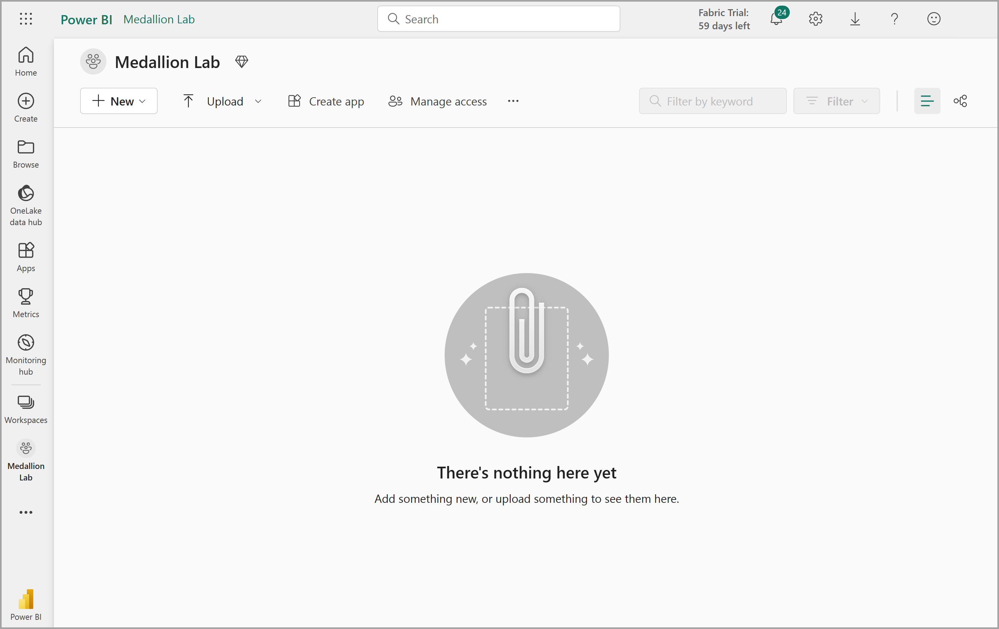
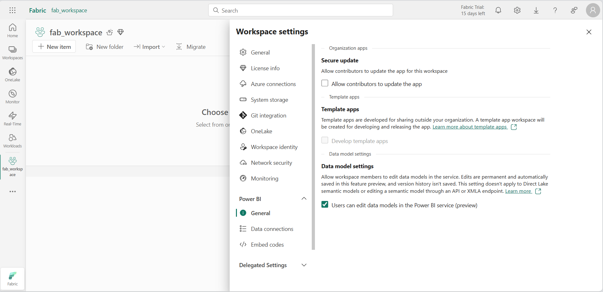
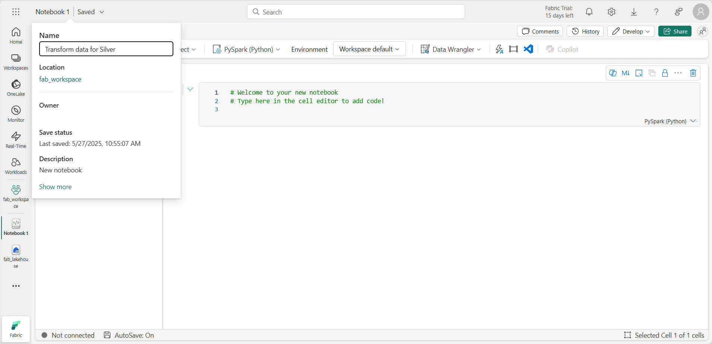
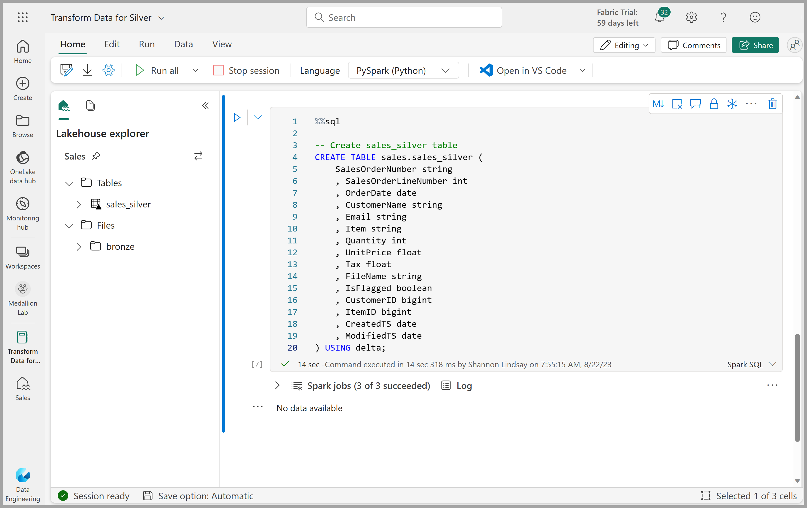

---
lab:
  title: Créer une architecture en médaillon dans un lakehouse Microsoft Fabric
  module: Organize a Fabric lakehouse using medallion architecture design
---

# Créer une architecture en médaillon dans un lakehouse Microsoft Fabric

Dans cet exercice, vous allez créer une architecture en médaillon dans un lakehouse Fabric à l’aide de notebooks. Vous allez créer un espace de travail, créer un lakehouse, charger les données dans la couche bronze, transformer les données et les charger dans la table Delta argent, transformer davantage les données et les charger dans les tables Delta or, puis explorer le modèle sémantique et créer des relations.

Cet exercice devrait prendre environ **45** minutes

> **Remarque** : Vous devez disposer d’une [licence d’essai Microsoft Fabric](https://learn.microsoft.com/fabric/get-started/fabric-trial) pour effectuer cet exercice.

## Créer un espace de travail

Avant d’utiliser des données dans Fabric, créez un espace de travail avec l’essai gratuit de Fabric activé.

1. Dans la [page d’accueil de Microsoft Fabric](https://app.fabric.microsoft.com/home?experience=fabric) sur `https://app.fabric.microsoft.com/home?experience=fabric`, sélectionnez **Power BI**.
2. Dans la barre de menus à gauche, sélectionnez **Espaces de travail** (l’icône ressemble à &#128455;).
3. Créez un espace de travail avec le nom de votre choix et sélectionnez un mode de licence qui inclut la capacité Fabric (*Essai*, *Premium* ou *Fabric*).
4. Lorsque votre nouvel espace de travail s’ouvre, il doit être vide.

   

5. Accédez aux paramètres de l’espace de travail et activez la fonctionnalité d’évaluation **Modification du modèle de données**. Cela vous permet de créer des relations entre des tables dans votre lakehouse à l’aide d’un modèle sémantique Power BI.

    

    > **Remarque** : vous devrez peut-être actualiser l’onglet du navigateur après avoir activé la fonctionnalité d’évaluation.

## Créer un lakehouse et charger les données dans la couche bronze

Maintenant que vous disposez d’un espace de travail, il est temps de créer un data lakehouse pour les données que vous analyserez.

1. Dans l’espace de travail que vous venez de créer, créez un **lakehouse** nommé **Sales** en cliquant sur le bouton **Nouvel élément**.

    Au bout d’une minute environ, un nouveau lakehouse vide est créé. Ingérez ensuite des données dans le data lakehouse à des fins d’analyse. Il existe plusieurs façons de faire cela mais dans cet exercice, vous allez simplement télécharger un fichier texte sur votre ordinateur local (ou sur votre machine virtuelle de labo le cas échéant), puis le charger dans votre lakehouse.

1. Téléchargez le fichier de données pour cet exercice à partir de `https://github.com/MicrosoftLearning/dp-data/blob/main/orders.zip`. Extrayez des fichiers et enregistrez-les avec leur nom d’origine sur votre ordinateur local (ou votre machine virtuelle de labo le cas échéant). Il doit y avoir 3 fichiers contenant des données de vente pour 3 ans : 2019.csv, 2020.csv et 2021.csv.

1. Retournez à l’onglet du navigateur web contenant votre lakehouse et, dans le menu  **...** du dossier **Fichiers** dans le volet **Explorateur**, sélectionnez **Nouveau sous-dossier**, puis créez un sous-dossier nommé **bronze**.

1. Dans le menu **...** du dossier **bronze**, sélectionnez **Charger** et **Charger des fichiers**, puis chargez les 3 fichiers (2019.csv, 2020.csv et 2021.csv) depuis votre ordinateur local (ou votre machine virtuelle de labo le cas échéant) dans le lakehouse. Utilisez la touche MAJ pour charger les 3 fichiers à la fois.

1. Une fois les fichiers chargés, sélectionnez le dossier **bronze**, et vérifiez que les fichiers ont été chargés, comme illustré ici :

    

## Transformer les données et les charger dans une table Delta argent

Maintenant que vous avez des données dans la couche bronze de votre lakehouse, vous pouvez utiliser un notebook pour les transformer et les charger dans une table Delta dans la couche argent.

1. Dans la page **Accueil**, lors de l’affichage du contenu du dossier **bronze** dans votre lac de données, dans le menu **Ouvrir un notebook**, sélectionnez **Nouveau notebook**.

    Après quelques secondes, un nouveau notebook contenant une seule *cellule* s’ouvre. Les notebooks sont constitués d’une ou plusieurs cellules qui peuvent contenir du *code* ou du *Markdown* (texte mis en forme).

2. Lorsque le notebook s’ouvre, nommez-le **Transformer les données pour la couche argent** en sélectionnant le texte **Notebook xxxx** en haut à gauche du notebook et en entrant le nouveau nom.

    

3. Sélectionnez la cellule existante dans le notebook, qui contient du code simple commenté. Mettez en surbrillance et supprimez ces deux lignes ; vous n’aurez pas besoin de ce code.

   > **Remarque** : les notebooks vous permettent d’exécuter du code dans divers langages, notamment Python, Scala et SQL. Dans cet exercice, vous allez utiliser PySpark et SQL. Vous pouvez également ajouter des cellules markdown pour fournir du texte et des images mis en forme pour documenter votre code.

4. **Collez** le code suivant dans la cellule :

    ```python
    from pyspark.sql.types import *
    
    # Create the schema for the table
    orderSchema = StructType([
        StructField("SalesOrderNumber", StringType()),
        StructField("SalesOrderLineNumber", IntegerType()),
        StructField("OrderDate", DateType()),
        StructField("CustomerName", StringType()),
        StructField("Email", StringType()),
        StructField("Item", StringType()),
        StructField("Quantity", IntegerType()),
        StructField("UnitPrice", FloatType()),
        StructField("Tax", FloatType())
        ])
    
    # Import all files from bronze folder of lakehouse
    df = spark.read.format("csv").option("header", "true").schema(orderSchema).load("Files/bronze/*.csv")
    
    # Display the first 10 rows of the dataframe to preview your data
    display(df.head(10))
    ```

5. Utilisez le bouton ****&#9655;** (*Exécuter la cellule*) à gauche de la cellule pour exécuter le code.

    > **Remarque** : Comme c’est la première fois que vous exécutez du code Spark dans ce notebook, une session Spark doit être démarrée. Cela signifie que la première exécution peut prendre environ une minute. Les exécutions suivantes seront plus rapides.

6. Une fois la commande de la cellule exécutée, **examinez la sortie** sous la cellule, qui doit être similaire à ceci :

    | Index | SalesOrderNumber | SalesOrderLineNumber | OrderDate | CustomerName | Courrier | Élément | Quantité | UnitPrice | Taxe |
    | -- | -- | -- | -- | -- | -- | -- | -- | -- | -- |
    | 1 | SO49172 | 1 | 2021-01-01 | Brian Howard | brian23@adventure-works.com | Road-250 Red, 52 | 1 | 2443,35 | 195,468 |
    | 2 |  SO49173 | 1 | 2021-01-01 | Linda Alvarez | linda19@adventure-works.com | Mountain-200 Silver, 38 | 1 | 2071.4197 | 165,7136 |
    | ... | ... | ... | ... | ... | ... | ... | ... | ... | ... |

    Le code que vous avez exécuté a chargé les données des fichiers CSV du dossier **bronze** dans un dataframe Spark, puis a affiché les premières lignes du dataframe.

    > **Remarque** : vous pouvez effacer, masquer et redimensionner automatiquement le contenu de la sortie de cellule en sélectionnant le menu **...** en haut à gauche du volet de sortie.

7. Vous allez maintenant **ajouter des colonnes pour la validation et le nettoyage des données**, à l’aide d’une trame de données PySpark pour ajouter des colonnes et mettre à jour les valeurs de certaines des colonnes existantes. Utilisez le bouton + pour **ajouter un nouveau bloc de code** et ajoutez le code suivant à la cellule :

    ```python
    from pyspark.sql.functions import when, lit, col, current_timestamp, input_file_name
    
    # Add columns IsFlagged, CreatedTS and ModifiedTS
    df = df.withColumn("FileName", input_file_name()) \
        .withColumn("IsFlagged", when(col("OrderDate") < '2019-08-01',True).otherwise(False)) \
        .withColumn("CreatedTS", current_timestamp()).withColumn("ModifiedTS", current_timestamp())
    
    # Update CustomerName to "Unknown" if CustomerName null or empty
    df = df.withColumn("CustomerName", when((col("CustomerName").isNull() | (col("CustomerName")=="")),lit("Unknown")).otherwise(col("CustomerName")))
    ```

    La première ligne du code importe les fonctions nécessaires à partir de PySpark. Vous ajoutez ensuite de nouvelles colonnes à la trame de données afin de pouvoir suivre le nom du fichier source (si l’ordre a été marqué comme étant avant l’exercice concerné) et quand la ligne a été créée et modifiée.

    Enfin, vous mettez à jour la colonne CustomerName pour « Inconnu » si elle a une valeur nulle ou est vide.

8. Exécutez la cellule pour exécuter le code à l’aide du bouton ****&#9655;** (*Exécuter la cellule*)**.

9. Ensuite, vous allez définir le schéma de la table **sales_silver** dans la base de données des ventes au format Delta Lake. Créez un bloc de code et ajoutez le code suivant à la cellule :

    ```python
    # Define the schema for the sales_silver table
    
    from pyspark.sql.types import *
    from delta.tables import *
    
    DeltaTable.createIfNotExists(spark) \
        .tableName("sales.sales_silver") \
        .addColumn("SalesOrderNumber", StringType()) \
        .addColumn("SalesOrderLineNumber", IntegerType()) \
        .addColumn("OrderDate", DateType()) \
        .addColumn("CustomerName", StringType()) \
        .addColumn("Email", StringType()) \
        .addColumn("Item", StringType()) \
        .addColumn("Quantity", IntegerType()) \
        .addColumn("UnitPrice", FloatType()) \
        .addColumn("Tax", FloatType()) \
        .addColumn("FileName", StringType()) \
        .addColumn("IsFlagged", BooleanType()) \
        .addColumn("CreatedTS", DateType()) \
        .addColumn("ModifiedTS", DateType()) \
        .execute()
    ```

10. Exécutez la cellule pour exécuter le code à l’aide du bouton ****&#9655;** (*Exécuter la cellule*)**.

11. Sélectionnez le bouton **...** dans la section Tables du volet Explorateur lakehouse, puis sélectionnez **Actualiser**. Vous devrez maintenant voir la nouvelle table **sales_silver** répertoriée. Le symbole **&#9650;** (icône de triangle) indique qu’il s’agit d’une table Delta.

    

    > **Note** : si vous ne voyez pas la nouvelle table, attendez quelques secondes, puis sélectionnez **Actualiser** à nouveau ou actualisez l’onglet du navigateur.

12. Vous allez maintenant effectuer une **opération upsert** sur une table Delta. Cela met à jour les enregistrements existants en fonction de conditions spécifiques et insère de nouveaux enregistrements lorsqu’aucune correspondance n’est trouvée. Ajoutez un nouveau bloc de code et collez le code suivant :

    ```python
    # Update existing records and insert new ones based on a condition defined by the columns SalesOrderNumber, OrderDate, CustomerName, and Item.

    from delta.tables import *
    
    deltaTable = DeltaTable.forPath(spark, 'Tables/sales_silver')
    
    dfUpdates = df
    
    deltaTable.alias('silver') \
      .merge(
        dfUpdates.alias('updates'),
        'silver.SalesOrderNumber = updates.SalesOrderNumber and silver.OrderDate = updates.OrderDate and silver.CustomerName = updates.CustomerName and silver.Item = updates.Item'
      ) \
       .whenMatchedUpdate(set =
        {
          
        }
      ) \
     .whenNotMatchedInsert(values =
        {
          "SalesOrderNumber": "updates.SalesOrderNumber",
          "SalesOrderLineNumber": "updates.SalesOrderLineNumber",
          "OrderDate": "updates.OrderDate",
          "CustomerName": "updates.CustomerName",
          "Email": "updates.Email",
          "Item": "updates.Item",
          "Quantity": "updates.Quantity",
          "UnitPrice": "updates.UnitPrice",
          "Tax": "updates.Tax",
          "FileName": "updates.FileName",
          "IsFlagged": "updates.IsFlagged",
          "CreatedTS": "updates.CreatedTS",
          "ModifiedTS": "updates.ModifiedTS"
        }
      ) \
      .execute()
    ```
13. Exécutez la cellule pour exécuter le code à l’aide du bouton ****&#9655;** (*Exécuter la cellule*)**.

    Cette opération est importante, car elle vous permet de mettre à jour les enregistrements existants dans la table en fonction des valeurs de colonnes spécifiques et d’insérer de nouveaux enregistrements lorsqu’aucune correspondance n’est trouvée. Il s’agit d’une exigence courante lorsque vous chargez des données à partir d’un système source qui peut contenir des mises à jour des enregistrements existants et nouveaux.

Vous disposez maintenant dans votre table Delta argent de données qui sont prêtes pour une transformation et une modélisation ultérieures.

## Explorer les données de la couche argent à l’aide du point de terminaison SQL

Maintenant que vous avez des données dans votre couche argent, vous pouvez utiliser le point de terminaison d’analytique SQL pour explorer les données et effectuer une analyse de base. Il s’agit d’une bonne option pour vous si vous êtes familiarisé avec SQL et que vous souhaitez effectuer une exploration de base de vos données. Dans cet exercice, nous utilisons la vue Point de terminaison SQL dans Fabric, mais vous pouvez également utiliser d’autres outils tels que SQL Server Management Studio (SSMS) et Azure Data Explorer.

1. Revenez à votre espace de travail et notez que vous avez maintenant plusieurs éléments répertoriés. Sélectionnez **Point de terminaison d’analytique SQL Sales** pour ouvrir votre lakehouse dans la vue Point de terminaison d’analytique SQL.

    

2. Sélectionnez **Nouvelle requête SQL** dans le ruban, ce qui ouvre un éditeur de requête SQL. Notez que vous pouvez renommer votre requête à l’aide de l’élément de menu  **...** en regard du nom de requête existant dans le volet de l’explorateur de lakehouse.

   Ensuite, vous allez exécuter deux requêtes SQL pour explorer les données.

3. Collez la requête suivante dans l’éditeur de requête, puis cliquez sur **Exécuter** :

    ```sql
    SELECT YEAR(OrderDate) AS Year
        , CAST (SUM(Quantity * (UnitPrice + Tax)) AS DECIMAL(12, 2)) AS TotalSales
    FROM sales_silver
    GROUP BY YEAR(OrderDate) 
    ORDER BY YEAR(OrderDate)
    ```

    Cette requête calcule les ventes totales pour chaque année dans la table sales_silver. Vos résultats devraient ressembler à ceci :

    

4. Ensuite, vous allez voir quels clients achètent le plus (en termes de quantité). Collez la requête suivante dans l’éditeur de requête, puis cliquez sur **Exécuter** :

    ```sql
    SELECT TOP 10 CustomerName, SUM(Quantity) AS TotalQuantity
    FROM sales_silver
    GROUP BY CustomerName
    ORDER BY TotalQuantity DESC
    ```

      Cette requête calcule la quantité totale d’articles achetés par chaque client dans la table sales_silver, puis retourne les 10 premiers clients en termes de quantité.

L’exploration des données au niveau de la couche argent est utile pour l’analyse de base, mais vous devez transformer davantage les données et les modéliser en schéma en étoile pour permettre une analyse et des rapports plus avancés. Vous le ferez dans la section suivante.

## Transformer les données pour la couche or

Vous avez réussi à extraire des données de votre couche bronze, à les transformer et à les charger dans une table Delta argent. Vous allez maintenant utiliser un nouveau notebook pour transformer davantage les données, les modéliser en schéma en étoile et les charger dans des tables Delta or.

Vous auriez pu effectuer toutes ces opérations dans un seul notebook, mais pour cet exercice, vous utilisez des notebooks distincts pour illustrer le processus de transformation des données de la couche bronze vers la couche argent, puis de la couche argent vers la couche or. Cela peut faciliter le débogage, la résolution des problèmes et la réutilisation.

1. Revenez à la page d’accueil de l’espace de travail et créez un notebook appelé **Transformer les données pour la couche or**.

2. Dans le volet Explorateur lakehouse, ajoutez votre lakehouse **Sales** en sélectionnant **Ajouter**, puis en sélectionnant le lakehouse **Sales** que vous avez créé précédemment. Dans la fenêtre **Ajouter un lakehouse**, sélectionnez **Lakehouse existant sans schéma**. Vous devrez voir la table **sales_silver** répertoriée dans la section **Tables** du volet Explorateur.

3. Dans le bloc de code existant, supprimez le texte commenté et **ajoutez le code suivant** pour charger des données dans votre dataframe et commencer à créer votre schéma en étoile, puis exécutez-le :

   ```python
    # Load data to the dataframe as a starting point to create the gold layer
    df = spark.read.table("Sales.sales_silver")
    ```

4. **Ajoutez un nouveau bloc de code** et collez le code suivant pour créer votre table de dimension de date, puis exécutez-le :

    ```python
    from pyspark.sql.types import *
    from delta.tables import*
    
    # Define the schema for the dimdate_gold table
    DeltaTable.createIfNotExists(spark) \
        .tableName("sales.dimdate_gold") \
        .addColumn("OrderDate", DateType()) \
        .addColumn("Day", IntegerType()) \
        .addColumn("Month", IntegerType()) \
        .addColumn("Year", IntegerType()) \
        .addColumn("mmmyyyy", StringType()) \
        .addColumn("yyyymm", StringType()) \
        .execute()
    ```

    > **Remarque** : vous pouvez exécuter la commande `display(df)` à tout moment pour vérifier la progression de votre travail. Dans ce cas, vous exécutez « display(dfdimDate_gold) » pour afficher le contenu de la trame de données dimDate_gold.

5. Dans un nouveau bloc de code, **ajoutez et exécutez le code suivant** pour créer un dataframe pour votre dimension de date, **dimdate_gold** :

    ```python
    from pyspark.sql.functions import col, dayofmonth, month, year, date_format
    
    # Create dataframe for dimDate_gold
    
    dfdimDate_gold = df.dropDuplicates(["OrderDate"]).select(col("OrderDate"), \
            dayofmonth("OrderDate").alias("Day"), \
            month("OrderDate").alias("Month"), \
            year("OrderDate").alias("Year"), \
            date_format(col("OrderDate"), "MMM-yyyy").alias("mmmyyyy"), \
            date_format(col("OrderDate"), "yyyyMM").alias("yyyymm"), \
        ).orderBy("OrderDate")

    # Display the first 10 rows of the dataframe to preview your data

    display(dfdimDate_gold.head(10))
    ```

6. Vous séparez le code en nouveaux blocs de code afin de pouvoir comprendre et observer ce qui se passe dans le notebook à mesure que vous transformez les données. Dans un nouveau bloc de code, **ajoutez et exécutez le code suivant** pour mettre à jour la dimension de date à mesure que de nouvelles données arrivent :

    ```python
    from delta.tables import *
    
    deltaTable = DeltaTable.forPath(spark, 'Tables/dimdate_gold')
    
    dfUpdates = dfdimDate_gold
    
    deltaTable.alias('gold') \
      .merge(
        dfUpdates.alias('updates'),
        'gold.OrderDate = updates.OrderDate'
      ) \
       .whenMatchedUpdate(set =
        {
          
        }
      ) \
     .whenNotMatchedInsert(values =
        {
          "OrderDate": "updates.OrderDate",
          "Day": "updates.Day",
          "Month": "updates.Month",
          "Year": "updates.Year",
          "mmmyyyy": "updates.mmmyyyy",
          "yyyymm": "updates.yyyymm"
        }
      ) \
      .execute()
    ```

    La dimension de date est maintenant configurée. Vous allez maintenant créer votre dimension client.
7. Pour générer la table de dimension client, **ajoutez un nouveau bloc de code**, puis collez et exécutez le code suivant :

    ```python
    from pyspark.sql.types import *
    from delta.tables import *
    
    # Create customer_gold dimension delta table
    DeltaTable.createIfNotExists(spark) \
        .tableName("sales.dimcustomer_gold") \
        .addColumn("CustomerName", StringType()) \
        .addColumn("Email",  StringType()) \
        .addColumn("First", StringType()) \
        .addColumn("Last", StringType()) \
        .addColumn("CustomerID", LongType()) \
        .execute()
    ```

8. Dans un nouveau bloc de code, **ajoutez et exécutez le code suivant** pour supprimer les clients en double, sélectionnez des colonnes spécifiques et fractionnez la colonne « CustomerName » pour créer les colonnes « Prénom » et « Nom » :

    ```python
    from pyspark.sql.functions import col, split
    
    # Create customer_silver dataframe
    
    dfdimCustomer_silver = df.dropDuplicates(["CustomerName","Email"]).select(col("CustomerName"),col("Email")) \
        .withColumn("First",split(col("CustomerName"), " ").getItem(0)) \
        .withColumn("Last",split(col("CustomerName"), " ").getItem(1)) 
    
    # Display the first 10 rows of the dataframe to preview your data

    display(dfdimCustomer_silver.head(10))
    ```

     Ici, vous avez créé une nouvelle trame de données dfdimCustomer_silver en effectuant diverses transformations telles que la suppression des doublons, la sélection de colonnes spécifiques et le fractionnement de la colonne « CustomerName » pour créer des colonnes de nom « First » et « Last ». Le résultat est une trame de données avec des données client nettoyées et structurées, y compris des colonnes de nom « First » et « Last » distinctes extraites de la colonne « CustomerName ».

9. Ensuite, nous allons **créer la colonne ID pour nos clients**. Dans un nouveau bloc de code, collez et exécutez les éléments suivants :

    ```python
    from pyspark.sql.functions import monotonically_increasing_id, col, when, coalesce, max, lit
    
    dfdimCustomer_temp = spark.read.table("Sales.dimCustomer_gold")
    
    MAXCustomerID = dfdimCustomer_temp.select(coalesce(max(col("CustomerID")),lit(0)).alias("MAXCustomerID")).first()[0]
    
    dfdimCustomer_gold = dfdimCustomer_silver.join(dfdimCustomer_temp,(dfdimCustomer_silver.CustomerName == dfdimCustomer_temp.CustomerName) & (dfdimCustomer_silver.Email == dfdimCustomer_temp.Email), "left_anti")
    
    dfdimCustomer_gold = dfdimCustomer_gold.withColumn("CustomerID",monotonically_increasing_id() + MAXCustomerID + 1)

    # Display the first 10 rows of the dataframe to preview your data

    display(dfdimCustomer_gold.head(10))
    ```

    Ici, vous nettoyez et transformez les données client (dfdimCustomer_silver) en effectuant une jointure anti gauche pour exclure les doublons qui existent déjà dans la table dimCustomer_gold, puis en générant des valeurs CustomerID uniques à l’aide de la fonction monotonically_increasing_id().

10. Vous allez maintenant vous assurer que votre table client reste à jour à mesure de l’intégration de nouvelles données. **Dans un nouveau bloc de code**, collez et exécutez les éléments suivants :

    ```python
    from delta.tables import *

    deltaTable = DeltaTable.forPath(spark, 'Tables/dimcustomer_gold')
    
    dfUpdates = dfdimCustomer_gold
    
    deltaTable.alias('gold') \
      .merge(
        dfUpdates.alias('updates'),
        'gold.CustomerName = updates.CustomerName AND gold.Email = updates.Email'
      ) \
       .whenMatchedUpdate(set =
        {
          
        }
      ) \
     .whenNotMatchedInsert(values =
        {
          "CustomerName": "updates.CustomerName",
          "Email": "updates.Email",
          "First": "updates.First",
          "Last": "updates.Last",
          "CustomerID": "updates.CustomerID"
        }
      ) \
      .execute()
    ```

11. Vous allez maintenant **répéter ces étapes pour créer votre dimension produit**. Dans un nouveau bloc de code, collez et exécutez les éléments suivants :

    ```python
    from pyspark.sql.types import *
    from delta.tables import *
    
    DeltaTable.createIfNotExists(spark) \
        .tableName("sales.dimproduct_gold") \
        .addColumn("ItemName", StringType()) \
        .addColumn("ItemID", LongType()) \
        .addColumn("ItemInfo", StringType()) \
        .execute()
    ```

12. **Ajoutez un autre bloc de code** pour créer la trame de données **product_silver**.
  
    ```python
    from pyspark.sql.functions import col, split, lit, when
    
    # Create product_silver dataframe
    
    dfdimProduct_silver = df.dropDuplicates(["Item"]).select(col("Item")) \
        .withColumn("ItemName",split(col("Item"), ", ").getItem(0)) \
        .withColumn("ItemInfo",when((split(col("Item"), ", ").getItem(1).isNull() | (split(col("Item"), ", ").getItem(1)=="")),lit("")).otherwise(split(col("Item"), ", ").getItem(1))) 
    
    # Display the first 10 rows of the dataframe to preview your data

    display(dfdimProduct_silver.head(10))
       ```

13. Vous allez maintenant créer des ID pour votre **table dimProduct_gold**. Ajoutez la syntaxe suivante à un nouveau bloc de code, puis exécutez-le :

    ```python
    from pyspark.sql.functions import monotonically_increasing_id, col, lit, max, coalesce
    
    #dfdimProduct_temp = dfdimProduct_silver
    dfdimProduct_temp = spark.read.table("Sales.dimProduct_gold")
    
    MAXProductID = dfdimProduct_temp.select(coalesce(max(col("ItemID")),lit(0)).alias("MAXItemID")).first()[0]
    
    dfdimProduct_gold = dfdimProduct_silver.join(dfdimProduct_temp,(dfdimProduct_silver.ItemName == dfdimProduct_temp.ItemName) & (dfdimProduct_silver.ItemInfo == dfdimProduct_temp.ItemInfo), "left_anti")
    
    dfdimProduct_gold = dfdimProduct_gold.withColumn("ItemID",monotonically_increasing_id() + MAXProductID + 1)
    
    # Display the first 10 rows of the dataframe to preview your data

    display(dfdimProduct_gold.head(10))
    ```

      Cela calcule l’ID de produit disponible suivant en fonction des données actuelles dans la table, affecte ces nouveaux ID aux produits, puis affiche les informations de produit mises à jour.

14. À l’instar de ce que vous avez fait avec vos autres dimensions, vous devez vous assurer que votre table de produits reste à jour à mesure que de nouvelles données arrivent. **Dans un nouveau bloc de code**, collez et exécutez les éléments suivants :

    ```python
    from delta.tables import *
    
    deltaTable = DeltaTable.forPath(spark, 'Tables/dimproduct_gold')
            
    dfUpdates = dfdimProduct_gold
            
    deltaTable.alias('gold') \
      .merge(
            dfUpdates.alias('updates'),
            'gold.ItemName = updates.ItemName AND gold.ItemInfo = updates.ItemInfo'
            ) \
            .whenMatchedUpdate(set =
            {
               
            }
            ) \
            .whenNotMatchedInsert(values =
             {
              "ItemName": "updates.ItemName",
              "ItemInfo": "updates.ItemInfo",
              "ItemID": "updates.ItemID"
              }
              ) \
              .execute()
      ```

      **Maintenant que vos dimensions ont été générées, la dernière étape consiste à créer la table de faits.**

15. **Dans un nouveau bloc de code**, collez et exécutez le code suivant pour créer la **table de faits** :

    ```python
    from pyspark.sql.types import *
    from delta.tables import *
    
    DeltaTable.createIfNotExists(spark) \
        .tableName("sales.factsales_gold") \
        .addColumn("CustomerID", LongType()) \
        .addColumn("ItemID", LongType()) \
        .addColumn("OrderDate", DateType()) \
        .addColumn("Quantity", IntegerType()) \
        .addColumn("UnitPrice", FloatType()) \
        .addColumn("Tax", FloatType()) \
        .execute()
    ```

16. **Dans un nouveau bloc de code**, collez et exécutez le code suivant pour créer un **nouveau dataframe** afin de combiner les données de vente avec les informations client et produit, notamment l’ID client, l’ID d’article, la date de commande, la quantité, le prix unitaire et les taxes :

    ```python
    from pyspark.sql.functions import col
    
    dfdimCustomer_temp = spark.read.table("Sales.dimCustomer_gold")
    dfdimProduct_temp = spark.read.table("Sales.dimProduct_gold")
    
    df = df.withColumn("ItemName",split(col("Item"), ", ").getItem(0)) \
        .withColumn("ItemInfo",when((split(col("Item"), ", ").getItem(1).isNull() | (split(col("Item"), ", ").getItem(1)=="")),lit("")).otherwise(split(col("Item"), ", ").getItem(1))) \
    
    
    # Create Sales_gold dataframe
    
    dffactSales_gold = df.alias("df1").join(dfdimCustomer_temp.alias("df2"),(df.CustomerName == dfdimCustomer_temp.CustomerName) & (df.Email == dfdimCustomer_temp.Email), "left") \
            .join(dfdimProduct_temp.alias("df3"),(df.ItemName == dfdimProduct_temp.ItemName) & (df.ItemInfo == dfdimProduct_temp.ItemInfo), "left") \
        .select(col("df2.CustomerID") \
            , col("df3.ItemID") \
            , col("df1.OrderDate") \
            , col("df1.Quantity") \
            , col("df1.UnitPrice") \
            , col("df1.Tax") \
        ).orderBy(col("df1.OrderDate"), col("df2.CustomerID"), col("df3.ItemID"))
    
    # Display the first 10 rows of the dataframe to preview your data
    
    display(dffactSales_gold.head(10))
    ```

17. Vous allez maintenant vous assurer que les données de vente restent à jour en exécutant le code suivant dans un **nouveau bloc de code** :

    ```python
    from delta.tables import *
    
    deltaTable = DeltaTable.forPath(spark, 'Tables/factsales_gold')
    
    dfUpdates = dffactSales_gold
    
    deltaTable.alias('gold') \
      .merge(
        dfUpdates.alias('updates'),
        'gold.OrderDate = updates.OrderDate AND gold.CustomerID = updates.CustomerID AND gold.ItemID = updates.ItemID'
      ) \
       .whenMatchedUpdate(set =
        {
          
        }
      ) \
     .whenNotMatchedInsert(values =
        {
          "CustomerID": "updates.CustomerID",
          "ItemID": "updates.ItemID",
          "OrderDate": "updates.OrderDate",
          "Quantity": "updates.Quantity",
          "UnitPrice": "updates.UnitPrice",
          "Tax": "updates.Tax"
        }
      ) \
      .execute()
    ```

     Ici, vous utilisez l’opération de fusion de Delta Lake pour synchroniser et mettre à jour la table factsales_gold avec les nouvelles données de vente (dffactSales_gold). L’opération compare la date de commande, l’ID client et l’ID d’articles entre les données existantes (table argent) et les nouvelles données (met à jour la trame de données), mettant à jour les lignes correspondantes et insérant de nouvelles lignes si nécessaire.

Vous disposez maintenant d’une couche **or** organisée et modélisée qui peut être utilisée pour la création de rapports et l’analyse.

## Créer un modèle sémantique

Dans votre espace de travail, vous pouvez désormais utiliser la couche or pour créer un rapport et analyser les données. Vous pouvez accéder au modèle sémantique directement dans votre espace de travail afin de créer des relations et des mesures pour la génération de rapports.

Notez que vous ne pouvez pas utiliser le **modèle sémantique par défaut** créé automatiquement lorsque vous créez un lakehouse. Vous devez créer un modèle sémantique qui inclut les tables or que vous avez créées dans cet exercice, à partir de l’Explorateur lakehouse.

1. Dans votre espace de travail, accédez à votre lakehouse **Sales**.
2. Sélectionnez **Nouveau modèle sémantique** dans le ruban de la vue Explorateur lakehouse.
3. Attribuez le nom **Sales_Gold** à votre nouveau modèle sémantique.
4. Sélectionnez vos tables or transformées à inclure dans votre modèle sémantique, puis **Confirmer**.
   - dimdate_gold
   - dimcustomer_gold
   - dimproduct_gold
   - factsales_gold

    Cela ouvre le modèle sémantique dans Fabric, où vous pouvez créer des relations et des mesures.

    

À partir de là, vous ou d’autres membres de votre équipe de données pouvez créer des rapports et des tableaux de bord en fonction des données de votre lakehouse. Ces rapports seront directement connectés à la couche or de votre lakehouse, de sorte à refléter en permanence les données les plus récentes.

## Nettoyer les ressources

Dans cet exercice, vous avez appris à créer une architecture en médaillon dans un lakehouse Microsoft Fabric.

Si vous avez terminé d’explorer votre lakehouse, vous pouvez supprimer l’espace de travail que vous avez créé pour cet exercice.

1. Dans la barre de gauche, sélectionnez l’icône de votre espace de travail pour afficher tous les éléments qu’il contient.
2. Dans le menu  **...** de la barre d’outils, sélectionnez **Paramètres de l’espace de travail**.
3. Dans la section **Général**, sélectionnez **Supprimer cet espace de travail**.
