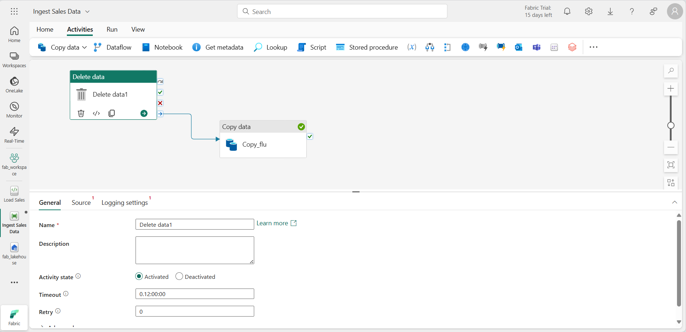

---
lab:
  title: Ingérer des données avec un pipeline dans Microsoft Fabric
  module: Use Data Factory pipelines in Microsoft Fabric
---

# Ingérer des données avec un pipeline dans Microsoft Fabric

Un data lakehouse est un magasin de données analytiques courant pour les solutions d’analytique à l’échelle du cloud. L’une des principales tâches d’un ingénieur Données consiste à implémenter et à gérer l’ingestion des données à partir de plusieurs sources de données opérationnelles dans le lakehouse. Dans Microsoft Fabric, vous pouvez implémenter des solutions *d’extraction, de transformation et de chargement* (ETL) ou *d’extraction, de chargement et de transformation* (ELT) pour l’ingestion des données par le biais de la création de *pipelines*.

Fabric prend également en charge Apache Spark, ce qui vous permet d’écrire et d’exécuter du code pour traiter des données à grande échelle. En combinant les fonctionnalités Spark et de pipeline dans Fabric, vous pouvez implémenter une logique d’ingestion des données complexe qui copie les données provenant de sources externes dans le stockage OneLake sur lequel le lakehouse est basé, puis qui utilise du code Spark pour effectuer des transformations de données personnalisées avant de les charger dans des tables à des fins d’analyse.

Ce labo prend environ **60** minutes.

> **Remarque** : Vous devez disposer d’un [essai gratuit Microsoft Fabric](https://learn.microsoft.com/fabric/get-started/fabric-trial) pour effectuer cet exercice.

## Créer un espace de travail

Avant d’utiliser des données dans Fabric, créez un espace de travail avec l’essai gratuit de Fabric activé.

1. Sur la [page d’accueil de Microsoft Fabric](https://app.fabric.microsoft.com), sélectionnez **Synapse Engineering données**.
1. Dans la barre de menus à gauche, sélectionnez **Espaces de travail** (l’icône ressemble à &#128455;).
1. Créez un espace de travail avec le nom de votre choix et sélectionnez un mode de licence qui inclut la capacité Fabric (*Essai*, *Premium* ou *Fabric*).
1. Lorsque votre nouvel espace de travail s’ouvre, il doit être vide.

    

## Créer un lakehouse

Maintenant que vous disposez d’un espace de travail, il est temps de créer un data lakehouse dans lequel vous ingérerez les données.

1. Dans la page d’accueil d’**Engineering données Synapse**, créez un nouveau **Lakehouse** du nom de votre choix.

    Au bout d’une minute environ, un nouveau lakehouse sans **tables** ou **fichiers** sera créé.

1. Sous l’onglet **Vue du lac** dans le volet de gauche, dans le menu **...** du nœud **Fichiers**, sélectionnez **Nouveau sous-dossier** et créez un sous-dossier nommé **new_data**.

## Créer un pipeline

Un moyen simple d’ingérer des données consiste à utiliser une activité **Copier des données** dans un pipeline afin d’extraire les données d’une source et de les copier dans un fichier dans le lakehouse.

1. Dans la page **Accueil** de votre lakehouse, sélectionnez **Obtenir des données**, puis sélectionnez **Nouveau pipeline de données** et créez un pipeline de données nommé **Ingérer des données de ventes**.
2. Si l’assistant **Copier des données** ne s’ouvre pas automatiquement, sélectionnez **Copier des données > Utiliser l’assistant de copie** dans la page de l’éditeur de pipeline.
3. Dans l’assistant **Copier des données**, dans la page **Choisir une source de données**, saisissez HTTP dans la barre de recherche, puis sélectionnez **HTTP** dans la section **Nouvelles sources**.


    

4. Dans le volet **Se connecter à la source de données**, saisissez les paramètres suivants pour la connexion à votre source de données :
    - **URL** : `https://raw.githubusercontent.com/MicrosoftLearning/dp-data/main/sales.csv`
    - **Connexion** : créez une connexion
    - **Nom de connexion** : *spécifiez un nom unique*
    - **Passerelle de données** : (aucune)
    - **Type d’authentification** : Anonyme
5. Cliquez sur **Suivant**. Vérifiez ensuite que les paramètres suivants sont sélectionnés :
    - **URL relative** : *Laissez vide*
    - **Méthode de demande** : GET
    - **En-têtes supplémentaires** : *Laissez vide*
    - **Copie binaire** : <u>Non</u> sélectionné
    - **Expiration du délai de la demande** : *Laissez vide*
    - **Nombre maximal de connexions simultanées** : *Laisser vide*
6. Sélectionnez **Suivant**, attendez que les données soient échantillonnées, puis vérifiez que les paramètres suivants sont sélectionnés :
    - **Format de fichier** : DelimitedText
    - **Séparateur de colonne** : virgule (,)
    - **Délimiteur de lignes** : Saut de ligne (\n)
    - **Première ligne comme en-tête** : Sélectionné
    - **Type de compression** : Aucune
7. Sélectionnez **Aperçu des données** pour afficher un échantillon des données qui seront ingérées. Fermez ensuite l’aperçu des données, puis sélectionnez **Suivant**.
8. Dans la page **Choisir la destination des données**, sélectionnez **Hub de données OneLake**, puis votre lakehouse existant.
9. Définissez les options de destination des données suivantes, puis sélectionnez **Suivant** :
    - **Dossier racine** : Fichiers
    - **Nom du chemin d’accès au dossier** : new_data
    - **Nom du fichier** : sales.csv
    - **Comportement de copie** : Aucun
10. Définissez les options de format de fichier suivantes, puis sélectionnez **Suivant** :
    - **Format de fichier** : DelimitedText
    - **Séparateur de colonne** : virgule (,)
    - **Délimiteur de lignes** : Saut de ligne (\n)
    - **Ajouter un en-tête au fichier** : Sélectionné
    - **Type de compression** : Aucune
11. Dans la page **Récapitulatif de la copie**, passez en revue les détails de votre opération de copie, puis sélectionnez **Enregistrer + Exécuter**.

    Un nouveau pipeline contenant une activité **Copier des données** est créé, comme illustré ici :

    

12. Lorsque le pipeline commence à s’exécuter, vous pouvez superviser son statut dans le volet **Sortie** sous le concepteur de pipeline. Utilisez l’icône **&#8635;** (*Actualiser*) pour actualiser le statut et attendez qu’il indique une réussite.

13. Dans la barre de menus à gauche, sélectionnez votre lakehouse.
14. Dans la page **Accueil**, dans le volet **Explorateur de lakehouse**, développez **Fichiers** et sélectionnez le dossier **new_data** pour vérifier que le fichier **sales.csv** a été copié.

## Créer un notebook

1. Dans la page **Accueil** de votre lakehouse, dans le menu **Ouvrir un notebook**, sélectionnez **Nouveau notebook**.

    Après quelques secondes, un nouveau notebook contenant une seule *cellule* s’ouvre. Les notebooks sont constitués d’une ou plusieurs cellules qui peuvent contenir du *code* ou du *markdown* (texte mis en forme).

2. Sélectionnez la cellule existante dans le notebook, qui contient du code simple, puis remplacez le code par défaut par la déclaration de variable suivante.

    ```python
   table_name = "sales"
    ```

3. Dans le menu **...** de la cellule (en haut à droite), sélectionnez **Activer/désactiver la cellule de paramètre**. Cela configure la cellule afin que les variables déclarées dedans soient traitées comme des paramètres lors de l’exécution du notebook à partir d’un pipeline.

4. Sous la cellule de paramètres, utilisez le bouton **+ Code** pour ajouter une nouvelle cellule de code. Ajoutez-y ensuite le code suivant :

    ```python
   from pyspark.sql.functions import *

   # Read the new sales data
   df = spark.read.format("csv").option("header","true").load("Files/new_data/*.csv")

   ## Add month and year columns
   df = df.withColumn("Year", year(col("OrderDate"))).withColumn("Month", month(col("OrderDate")))

   # Derive FirstName and LastName columns
   df = df.withColumn("FirstName", split(col("CustomerName"), " ").getItem(0)).withColumn("LastName", split(col("CustomerName"), " ").getItem(1))

   # Filter and reorder columns
   df = df["SalesOrderNumber", "SalesOrderLineNumber", "OrderDate", "Year", "Month", "FirstName", "LastName", "EmailAddress", "Item", "Quantity", "UnitPrice", "TaxAmount"]

   # Load the data into a table
   df.write.format("delta").mode("append").saveAsTable(table_name)
    ```

    Ce code charge les données à partir du fichier sales.csv qui a été ingéré par l’activité **Copier des données**, applique une logique de transformation, et enregistre les données transformées sous forme de table, en ajoutant les données si la table existe déjà.

5. Vérifiez que votre notebook ressemble à ceci, puis utilisez le bouton **&#9655; Tout exécuter** dans la barre d’outils pour exécuter toutes les cellules qu’il contient.

    

    > **Remarque** : Comme c’est la première fois que vous exécutez du code Spark dans cette session, le pool Spark doit être démarré. Cela signifie que l’exécution de la première cellule peut prendre environ une minute.

6. Une fois l’exécution du notebook terminée, dans le volet **Explorateur de lakehouse** à gauche, dans le menu **...** pour **Tables**, sélectionnez **Actualiser** et vérifiez qu’une table **sales** a été créée.
7. Dans la barre de menus du notebook, utilisez l’icône ⚙️ **Paramètres** pour afficher les paramètres du notebook. Ensuite, définissez le **nom** du notebook sur **Charger les ventes** et fermez le volet de paramètres.
8. Dans la barre de menus du hub à gauche, sélectionnez votre lakehouse.
9. Dans le volet **Explorateur**, actualisez la vue. Développez ensuite **Tables**, puis sélectionnez la table **sales** pour afficher un aperçu des données qu’elle contient.

## Modifier le pipeline

Maintenant que vous avez implémenté un notebook pour transformer des données et les charger dans une table, vous pouvez incorporer le notebook dans un pipeline pour créer un processus ETL réutilisable.

1. Dans la barre de menus du hub à gauche, sélectionnez le pipeline **Ingérer des données de ventes** que vous avez créé.
2. Sous l’onglet **Activités**, dans la liste **Autres activités**, sélectionnez **Supprimer des données**. Positionnez ensuite la nouvelle activité **Supprimer des données** à gauche de l’activité **Copier des données**, et connectez sa sortie **À l’achèvement** à l’activité **Copier des données**, comme illustré ici :

    

3. Sélectionnez l’activité **Supprimer des données** et, dans le volet situé sous le canevas de conception, définissez les propriétés suivantes :
    - **Général** :
        - **Nom** : Supprimer les anciens fichiers
    - **Source**
        - **Connexion** : *Votre lakehouse*
        - **Type de chemin de fichier** : Chemin de fichier générique
        - **Chemin du dossier** : Files / **new_data**
        - **Nom du fichier générique** : *.csv        
        - **Récursivement** : *Sélectionné*
    - **Paramètres de journalisation** :
        - **Activer la journalisation** : *<u>Non </u>sélectionné*

    Ces paramètres garantissent que tous les fichiers .csv existants sont supprimés avant la copie du fichier **sales.csv**.

4. Dans le concepteur de pipeline, sous l’onglet **Activités**, sélectionnez **Notebook** pour ajouter une activité **Notebook** au pipeline.
5. Sélectionnez l’activité **Copier des données**, puis connectez sa sortie **À l’achèvement** à l’activité **Notebook**, comme illustré ici :

    

6. Sélectionnez l’activité **Notebook** puis, dans le volet sous le canevas de conception, définissez les propriétés suivantes :
    - **Général** :
        - **Nom** : Notebook Charger les ventes
    - **Paramètres**:
        - **Notebook** : Charger les ventes
        - **Paramètres de base** : *Ajoutez un nouveau paramètre avec les propriétés suivantes :*
            
            | Nom | Type | Valeur |
            | -- | -- | -- |
            | table_name | Chaîne | new_sales |

    Le paramètre **table_name** sera passé au notebook et remplacera la valeur par défaut affectée à la variable **table_name** dans la cellule de paramètres.

7. Sous l’onglet **Accueil**, utilisez l’icône **&#128427;** (*Enregistrer*) pour enregistrer le pipeline. Utilisez ensuite le bouton **&#9655; Exécuter** pour exécuter le pipeline, et attendez que toutes les activités se terminent.

    

> Remarque : Si vous recevez le message d’erreur * Les requêtes Spark SQL sont uniquement possibles dans le contexte d’un lakehouse. Attachez un lakehouse pour poursuivre* : Ouvrez votre bloc-notes, sélectionnez dans le volet gauche le lakehouse que vous avez créé, sélectionnez **Supprimer tous les lakehouses**, puis ajoutez-le à nouveau. Revenez au concepteur de pipeline et sélectionnez **&#9655 ; Exécuter**.

8. Dans la barre de menus du hub sur le bord gauche du portail, sélectionnez votre lakehouse.
9. Dans le volet **Explorateur**, développez **Tables** et sélectionnez la table **new_sales** pour afficher un aperçu des données qu’elle contient. Cette table a été créée par le notebook lors de son exécution par le pipeline.

Dans cet exercice, vous avez implémenté une solution d’ingestion des données qui utilise un pipeline pour copier des données dans votre lakehouse à partir d’une source externe, puis un notebook Spark pour transformer les données et les charger dans une table.

## Nettoyer les ressources

Dans cet exercice, vous avez appris à implémenter un pipeline dans Microsoft Fabric.

Si vous avez terminé d’explorer votre lakehouse, vous pouvez supprimer l’espace de travail que vous avez créé pour cet exercice.

1. Dans la barre de gauche, sélectionnez l’icône de votre espace de travail pour afficher tous les éléments qu’il contient.
2. Dans le menu  **...** de la barre d’outils, sélectionnez **Paramètres de l’espace de travail**.
3. Dans la section **Général**, sélectionnez **Supprimer cet espace de travail**.
