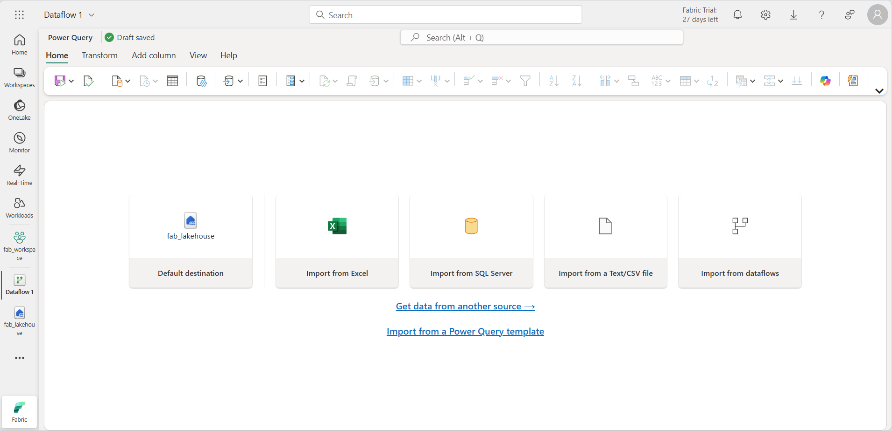
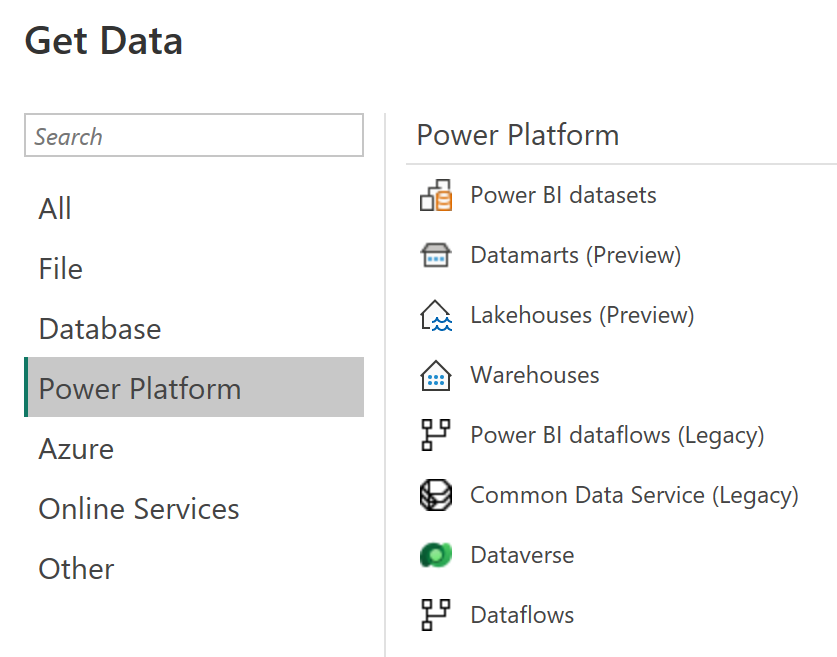

---
lab:
  title: Créer et utiliser des flux de données (Gen2) dans Microsoft Fabric
  module: Ingest Data with Dataflows Gen2 in Microsoft Fabric
---

# Créer et utiliser des flux de données (Gen2) dans Microsoft Fabric

Dans Microsoft Fabric, les flux de données (Gen2) se connectent à différentes sources de données et effectuent des transformations dans Power Query Online. Ils peuvent ensuite être utilisés dans des pipelines de données pour ingérer des données dans un lakehouse ou un autre magasin analytique, ou pour définir un jeu de données pour un rapport Power BI.

Ce labo est conçu pour présenter les différents éléments des flux de données (Gen2) et non pour créer une solution complexe qui peut exister dans une entreprise. Ce labo prend **environ 30 minutes**.

> **Remarque** : Vous devez disposer d’une [licence d’essai Microsoft Fabric](https://learn.microsoft.com/fabric/get-started/fabric-trial) pour effectuer cet exercice.

## Créer un espace de travail

Avant d’utiliser des données dans Fabric, créez un espace de travail avec l’essai gratuit de Fabric activé.

1. Accédez à la [page d’accueil de Microsoft Fabric](https://app.fabric.microsoft.com/home?experience=fabric) sur `https://app.fabric.microsoft.com/home?experience=fabric` dans un navigateur et connectez-vous avec vos informations d’identification Fabric.
1. Dans la barre de menus à gauche, sélectionnez **Espaces de travail** (l’icône ressemble à &#128455;).
1. Créez un espace de travail avec le nom de votre choix et sélectionnez un mode de licence qui inclut la capacité Fabric (*Essai*, *Premium* ou *Fabric*).
1. Lorsque votre nouvel espace de travail s’ouvre, il doit être vide.

    

## Créer un lakehouse

Maintenant que vous disposez d’un espace de travail, il est temps de créer un data lakehouse dans lequel vous ingérerez les données.

1. Sélectionnez **Créer** dans la barre de menus de gauche. Dans la page *Nouveau*, sous la section *Engineering données*, sélectionnez **Lakehouse**. Donnez-lui un nom unique de votre choix.

    >**Note** : si l’option **Créer** n’est pas épinglée à la barre latérale, vous devez d’abord sélectionner l’option avec des points de suspension (**...**).

    Au bout d’une minute environ, un nouveau lakehouse vide est créé.

 

## Créer un flux de données (Gen2) pour ingérer des données

Maintenant que vous disposez d’un lakehouse, vous devez y ingérer des données. Pour ce faire, vous pouvez définir un flux de données qui encapsule un processus d’*extraction, transformation et chargement* (ETL).

1. Dans la page d’accueil de votre espace de travail, sélectionnez **Obtenir des données** > **Nouveau flux de données Gen2**. Après quelques secondes, l’éditeur Power Query de votre nouveau flux de données s’ouvre comme illustré ici.

 

2. Sélectionnez **Importer à partir d’un fichier texte/CSV** et créez une nouvelle source de données avec les paramètres suivants :
 - **Lien vers le fichier** : *Sélectionné*
 - **Chemin ou URL du fichier** : `https://raw.githubusercontent.com/MicrosoftLearning/dp-data/main/orders.csv`
 - **Connexion** : Créez une nouvelle connexion
 - **Passerelle de données** : (aucune)
 - **Type d’authentification** : Anonyme

3. Sélectionnez **Suivant** pour afficher un aperçu des données du fichier, puis **Créer** pour créer la source de données. L’éditeur Power Query affiche la source de données et un ensemble initial d’étapes de requête pour mettre en forme les données, comme illustré ici :

 

4. Dans le ruban de la barre d’outils, sélectionnez l’onglet **Ajouter une colonne**. Sélectionnez ensuite **Colonne personnalisée** et créez une nouvelle colonne.

5. Définissez le *nouveau nom de colonne* sur `MonthNo`, définissez le *type de données* sur **Nombre entier**, puis ajoutez la formule suivante `Date.Month([OrderDate])` – tel qu’illustré ici :

 

6. Sélectionnez **OK** pour créer la colonne et remarquez que l’étape de l’ajout de la colonne personnalisée est ajoutée à la requête. La colonne résultante s’affiche dans le volet Données :

 

> **Conseil :** Dans le volet Paramètres de la requête sur le côté droit, notez que les **étapes appliquées** incluent chaque étape de transformation. En bas, vous pouvez également activer le bouton **Flux de diagramme** pour activer le diagramme visuel des étapes.
>
> Les étapes peuvent être déplacées vers le haut ou vers le bas, modifiées en sélectionnant l’icône d’engrenage, et vous pouvez sélectionner chaque étape pour voir les transformations s’appliquer dans le volet d’aperçu.

7. Vérifiez et confirmez que le type de données de la colonne **OrderDate** est défini sur **Date** et celui la colonne nouvellement créée **MonthNo** sur **Nombre entier**.

## Ajouter une destination de données pour le flux de données

1. Dans le ruban de la barre d’outils, sélectionnez l’onglet **Accueil**. Ensuite, dans le menu déroulant **Ajouter une destination de données**, sélectionnez **Lakehouse**.

   > **Remarque :** Si cette option est grisée, vous disposez peut-être déjà d’un jeu de destination de données. Vérifiez la destination des données en bas du volet Paramètres de la requête à droite de l’éditeur Power Query. Si une destination est déjà définie, vous pouvez la modifier à l’aide de l’engrenage.

2. Dans la boîte de dialogue **Se connecter à la destination des données**, modifiez la connexion et connectez-vous à l’aide de votre compte d’organisation Power BI pour définir l’identité que le flux de données utilise pour accéder au lakehouse.

 

3. Sélectionnez **Suivant** et, dans la liste des espaces de travail disponibles, recherchez votre espace de travail et sélectionnez le lakehouse que vous avez créé au début de cet exercice. Spécifiez ensuite une nouvelle table nommée **orders** :

   

4. Sélectionnez **Suivant** et, dans la page **Choisir les paramètres de destination**, désactivez l’option **Utiliser les paramètres automatiques**, sélectionnez **Ajouter**, puis **Enregistrer les paramètres**.
    > **Remarque :** Nous recommandons l’utilisation de l’éditeur *Power Query* pour mettre à jour les types de données, mais vous pouvez également le faire à partir de cette page.

    

5. Dans la barre de menus, ouvrez **Affichage** et sélectionnez **Vue en diagramme**. Vous remarquez la destination **Lakehouse** indiquée sous forme d’icône dans la requête de l’éditeur Power Query.

   

6. Sélectionnez **Publier** pour publier le flux de données. Attendez ensuite que le flux de données **Dataflow 1** soit créé dans votre espace de travail.

## Ajouter un flux de données à un pipeline

Vous pouvez inclure un flux de données en tant qu’activité dans un pipeline. Les pipelines sont utilisés pour orchestrer les activités d’ingestion et de traitement des données, ce qui vous permet de combiner des flux de données avec d’autres types d’opérations dans un processus unique, planifié. Les pipelines peuvent être créés dans plusieurs expériences différentes, notamment l’expérience Data Factory.

1. À partir de votre espace de travail Fabric, vérifiez que vous figurez toujours dans l’expérience **Engineering données**. Sélectionnez **+ Nouvel élément** > **Pipeline de données**, puis, lorsque vous y êtes invité, créez un pipeline nommé **Charger des données**.

   L’éditeur de pipeline s’ouvre.

   

   > **Conseil** : Si l’Assistant Copier des données s’ouvre automatiquement, fermez-le.

2. Sélectionnez **Ajouter une activité de pipeline** et ajoutez une activité **Flux de données** au pipeline.

3. La nouvelle activité **Dataflow1** étant sélectionnée, sous l’onglet **Paramètres**, dans la liste déroulante **Flux de données**, sélectionnez **Dataflow 1** (le flux de données que vous avez créé précédemment).

   

4. Sous l’onglet **Accueil**, enregistrez le pipeline à l’aide de l’icône **&#128427;** (*Enregistrer*).
5. Utilisez le bouton **&#9655; Exécuter** pour exécuter le pipeline et attendez la fin de l’opération. Cette opération peut prendre quelques minutes.

   

6. Dans la barre de menus sur le bord gauche, sélectionnez votre lakehouse.
7. Dans le menu **…** pour **Tables**, sélectionnez **Actualiser**. Ensuite, développez **Tables** et sélectionnez la table **orders**, qui a été créée par votre flux de données.

   

> **Conseil** : dans Power BI Desktop, vous pouvez vous connecter directement aux transformations de données effectuées avec votre flux de données à l’aide du connecteur hérité du *flux de données Power BI*.
>
> Vous pouvez également effectuer des transformations supplémentaires, publier en tant que nouveau jeu de données et distribuer auprès d’un public visé pour les jeux de données spécialisés.
>
>

## Nettoyer les ressources

Si vous avez terminé d’explorer les flux de données dans Microsoft Fabric, vous pouvez supprimer l’espace de travail que vous avez créé pour cet exercice.

1. Accédez à Microsoft Fabric dans votre navigateur.
1. Dans la barre de gauche, sélectionnez l’icône de votre espace de travail pour afficher tous les éléments qu’il contient.
1. Sélectionnez **Paramètres de l’espace de travail** et, dans la section**Général**, faites défiler vers le bas et sélectionnez **Supprimer cet espace de travail**.
1. Sélectionnez **Supprimer** pour supprimer l’espace de travail.
