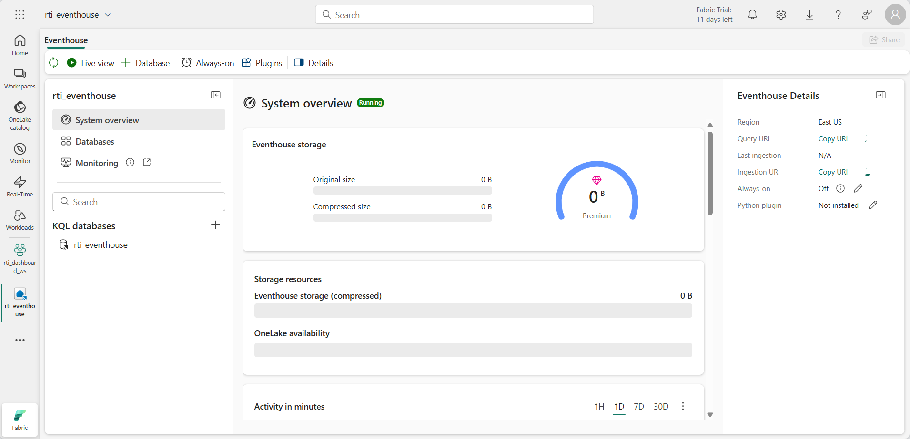
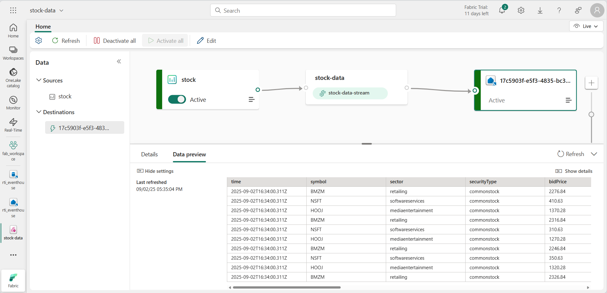
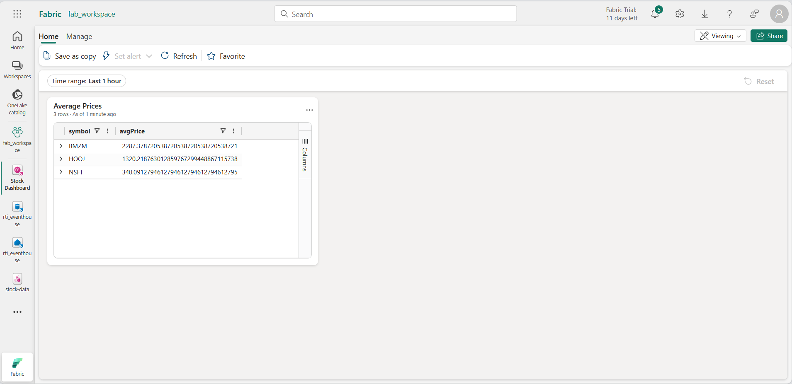

---
lab:
  title: "Bien démarrer avec Real-Time Intelligence dans Microsoft\_Fabric"
  module: Get started with Real-Time Intelligence in Microsoft Fabric
---

# Bien démarrer avec Real-Time Intelligence dans Microsoft Fabric

Microsoft Fabric fournit Real-Time Intelligence, qui vous permet créer des solutions analytiques pour les flux de données en temps réel. Dans cet exercice, vous allez utiliser les fonctionnalités de Real-Time Intelligence dans Microsoft Fabric pour ingérer, analyser et visualiser un flux en temps réel de données boursières.

Ce labo prend environ **30** minutes.

> **Remarque** : pour effectuer cet exercice, vous avez besoin d’un [locataire Microsoft Fabric](https://learn.microsoft.com/fabric/get-started/fabric-trial).

## Créer un espace de travail

Avant d’utiliser des données dans Fabric, vous devez créer un espace de travail dans un locataire avec la fonctionnalité Fabric activée.

1. Dans la [page d’accueil de Microsoft Fabric](https://app.fabric.microsoft.com/home?experience=fabric) sur `https://app.fabric.microsoft.com/home?experience=fabric`, sélectionnez **Real-Time Intelligence**.
1. Dans la barre de menus à gauche, sélectionnez **Espaces de travail** (l’icône ressemble à &#128455;).
1. Créez un espace de travail avec le nom de votre choix et sélectionnez un mode de licence qui inclut la capacité Fabric (*Essai*, *Premium* ou *Fabric*).
1. Lorsque votre nouvel espace de travail s’ouvre, il doit être vide.

    

## Créer un Eventstream

Vous êtes maintenant prêt à rechercher et à ingérer des données en temps réel à partir d’une source de diffusion en continu. Pour ce faire, vous allez commencer dans le hub en temps réel Fabric.

> **Conseil** : la première fois que vous utilisez le hub en temps réel, certains conseils de *prise en main* peuvent s’afficher. Vous pouvez les fermer.

1. Dans la barre de menus de gauche, sélectionnez le **hub en temps réel**.

    Le hub en temps réel offre un moyen simple de rechercher et de gérer des sources de données de streaming.

    

1. Dans le hub en temps réel, dans la section **Se connecter à**, sélectionnez **Sources de données**.
1. Recherchez l’exemple de source de données **Stock market** et sélectionnez **Se connecter**. Ensuite, dans l’assistant de **connexion**, nommez la source `stock` et modifiez le nom d’eventstream par défaut pour le remplacer par `stock-data`. Le flux par défaut associé à ces données sera automatiquement nommé *stock-data-stream* :

    

1. Sélectionnez **Suivant** et attendez que la source et l’eventstream soient créés, puis sélectionnez **Ouvrir l’eventstream**. L’eventstream affiche la source **stock** et **stock-data-stream** sur le canevas de conception :

   

## Créer un eventhouse

L’eventstream ingère les données boursières en temps réel, mais n’en fait rien actuellement. Nous allons créer un eventhouse dans lequel nous pouvons stocker les données capturées dans une table.

1. Dans la barre de menus de gauche, sélectionnez **Accueil**, puis, dans la page d’accueil de Real-Time Intelligence, créez un **Eventhouse**, en lui donnant un nom unique de votre choix.

    Fermez toutes les invites ou conseils affichés jusqu’à ce que le nouvel eventhouse vide soit visible :

    

1. Dans le volet de gauche, notez que votre eventhouse contient une base de données KQL portant le même nom que l’eventhouse. Vous pouvez créer des tables pour vos données en temps réel dans cette base de données ou créer des bases de données supplémentaires si nécessaire.
1. Sélectionnez la base de données et notez qu’il existe un *ensemble de requêtes* associé. Ce fichier contient des exemples de requêtes KQL que vous pouvez utiliser pour commencer à interroger les tables de votre base de données.

    Toutefois, il n’existe actuellement aucune table à interroger. Nous allons résoudre ce problème en obtenant des données de l’eventstream dans une nouvelle table.

1. Dans la page principale de votre base de données KQL, sélectionnez **Obtenir des données**.
1. Pour la source de données, sélectionnez **Eventstream** > **Evenstream existant**.
1. Dans le volet **Sélectionner ou créer une table de destination**, créez une table nommée `stock`. Ensuite, dans le volet **Configurer la source de données**, sélectionnez votre espace de travail et l’eventstream **stock-data**, puis nommez la connexion `stock-data`.

   

1. Utilisez le bouton **Suivant** pour effectuer les étapes d’inspection des données, puis terminez la configuration. Fermez ensuite la fenêtre de configuration pour afficher votre eventhouse avec la table stock.

   

    La connexion entre le flux et la table a été créée. Vérifions cela dans l’eventstream.

1. Dans la barre de menus de gauche, sélectionnez le hub **en temps réel**, puis affichez la page **Mes flux de données**. La table **stock** et le flux **stock-data-stream** doivent être répertoriés.

   

1. Dans le menu **...** du flux **stock-data-stream**, sélectionnez **Ouvrir l’eventstream**.

    L’eventstream affiche désormais une destination pour le flux :

   

    > **Conseil** : sélectionnez la destination sur le canevas de conception et, si aucun aperçu des données n’est affiché sous celui-ci, sélectionnez **Actualiser**.

    Dans cet exercice, vous avez créé un eventstream très simple qui capture des données en temps réel et les charge dans une table. Dans une solution réelle, vous ajouteriez généralement des transformations pour agréger les données sur des fenêtres temporelles (par exemple, pour capturer le prix moyen de chaque action sur des périodes de cinq minutes).

    Examinons maintenant comment interroger et analyser les données capturées.

## Interroger les données capturées

L’eventstream capture les données boursières en temps réel et les charge dans une table de votre base de données KQL. Vous pouvez interroger cette table pour afficher les données capturées.

1. Dans la barre de menus de gauche, sélectionnez la base de données de votre eventhouse.
1. Sélectionnez l’*ensemble de requêtes* de votre base de données.
1. Dans le volet de requête, modifiez le premier exemple de requête, comme illustré ici :

    ```kql
    stock
    | take 100
    ```

1. Sélectionnez le code de requête et exécutez-le pour afficher 100 lignes de données depuis la table.

    

1. Passez en revue les résultats, puis modifiez la requête pour récupérer le prix moyen de chaque symbole boursier au cours des 5 dernières minutes :

    ```kql
    stock
    | where ["time"] > ago(5m)
    | summarize avgPrice = avg(todecimal(bidPrice)) by symbol
    | project symbol, avgPrice
    ```

1. Sélectionnez la requête modifiée et exécutez-la pour afficher les résultats.
1. Attendez quelques secondes et réexécutez-la, en notant que les prix moyens changent à mesure que de nouvelles données sont ajoutées à la table à partir du flux en temps réel.

## Créer des tableaux de bord en temps réel

Maintenant que vous disposez d’une table remplie par le flux de données, vous pouvez utiliser un tableau de bord en temps réel pour visualiser les données.

1. Dans l’éditeur de requête, sélectionnez la requête KQL que vous avez utilisée pour récupérer les prix moyens des actions pendant les cinq dernières minutes.
1. Sélectionnez **Épingler au tableau de bord** dans la barre d’outils. Épinglez ensuite la requête **dans un nouveau tableau de bord** avec les paramètres suivants :
    - **Nom du tableau de bord** : `Stock Dashboard`
    - **Nom de la vignette** : `Average Prices`
1. Créez le tableau de bord et ouvrez-le. Il doit se présenter comme suit :

    

1. En haut du tableau de bord, passez du mode **Affichage** au mode **Édition**.
1. Sélectionnez l’icône **Modifier** (*crayon*) pour la vignette **Prix moyens**.
1. Dans le volet **Mise en forme visuelle**, remplacez le **visuel** *Table* par *Histogramme* :

    

1. En haut du tableau de bord, sélectionnez **Appliquer les modifications** et affichez votre tableau de bord modifié :

    

    Vous disposez maintenant d’une visualisation dynamique de vos données boursières en temps réel.

## Créer une alerte

L’intelligence en temps réel dans Microsoft Fabric inclut une technologie nommée *Activator*, qui peut déclencher des actions basées sur des événements en temps réel. Nous allons l’utiliser pour vous avertir lorsque le prix moyen des actions augmente d’un montant spécifique.

1. Dans la fenêtre du tableau de bord contenant votre visualisation du prix des actions, dans la barre d’outils, sélectionnez **Définir une alerte**.
1. Dans le volet **Définir une alerte**, créez une alerte avec les paramètres suivants :
    - **Exécuter la requête toutes les** : 5 minutes
    - **Vérifier** : sur chaque événement Regroupé par
    - **Champ de regroupement** : symbole
    - **Quand** : avgPrice
    - **Condition** : Augmente de
    - **Valeur** : 100
    - **Action** : Envoyer un e-mail
    - **Emplacement d’enregistrement** :
        - **Espace de travail** : *votre espace de travail*
        - **Élément** : Créer un élément
        - **Nouveau nom d’élément** : *un nom unique de votre choix*

    

1. Créez l’alerte et attendez qu’elle soit enregistrée. Fermez ensuite le volet confirmant qu’elle a été créée.
1. Dans la barre de menus de gauche, sélectionnez la page de votre espace de travail (enregistrez les modifications non enregistrées dans votre tableau de bord si vous y êtes invité).
1. Dans la page de l’espace de travail, affichez les éléments que vous avez créés dans cet exercice, y compris l’activateur de votre alerte.
1. Ouvrez l’activateur et, dans sa page, sous le nœud **avgPrice**, sélectionnez l’identificateur unique de votre alerte. Affichez ensuite son onglet **Historique**.

    Votre alerte n’a peut-être pas été déclenchée, auquel cas l’historique ne contiendra aucune donnée. Si le prix moyen des actions change de plus de 100, l’activateur vous envoie un e-mail et l’alerte est enregistrée dans l’historique.

## Nettoyer les ressources

Dans cet exercice, vous avez créé un eventhouse, ingéré des données en temps réel à l’aide d’un eventstream, interrogé les données ingérées dans une table de base de données KQL, créé un tableau de bord en temps réel pour visualiser les données en temps réel et configuré une alerte à l’aide de l’activateur.

Si vous avez fini d’explorer l’intelligence en temps réel dans Fabric, vous pouvez supprimer l’espace de travail que vous avez créé pour cet exercice.

1. Dans la barre de gauche, sélectionnez l’icône de votre espace de travail.
2. Dans la barre d’outils, sélectionnez **Paramètres de l’espace de travail**.
3. Dans la section **Général**, sélectionnez **Supprimer cet espace de travail**.
