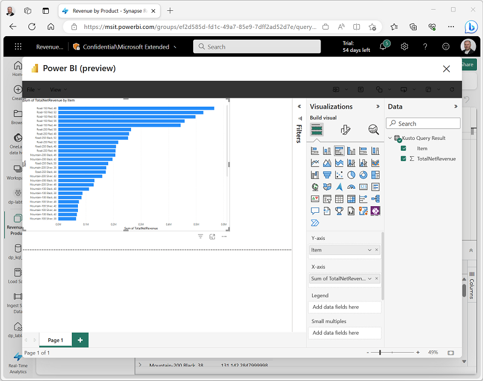

---
lab:
  title: Bien démarrer avec Real-Time Analytics dans Microsoft Fabric
  module: Get started with real-time analytics in Microsoft Fabric
---

# Bien démarrer avec Real-Time Analytics dans Microsoft Fabric

Microsoft Fabric fournit un runtime que vous pouvez utiliser pour stocker et interroger des données à l’aide du langage de requête Kusto (KQL). Kusto est optimisé pour les données qui incluent un composant de série chronologique, comme les données en temps réel de fichiers journaux ou d’appareils IoT.

Ce labo prend environ **30** minutes.

> **Remarque** : Vous devez disposer d’une [licence d’essai Microsoft Fabric](https://learn.microsoft.com/fabric/get-started/fabric-trial) pour effectuer cet exercice.

## Créer un espace de travail

Avant d’utiliser des données dans Fabric, créez un espace de travail avec l’essai gratuit de Fabric activé.

1. Sur la [page d’accueil de Microsoft Fabric](https://app.fabric.microsoft.com), sélectionnez **Synapse Analyse en temps réel**.
1. Dans la barre de menus à gauche, sélectionnez **Espaces de travail** (l’icône ressemble à &#128455;).
1. Créez un espace de travail avec le nom de votre choix et sélectionnez un mode de licence qui inclut la capacité Fabric (*Essai*, *Premium* ou *Fabric*).
1. Lorsque votre nouvel espace de travail s’ouvre, il doit être vide.

    

## Télécharger le fichier pour la base de données KQL

Maintenant que vous disposez d’un espace de travail, il est temps de télécharger le fichier de données que vous analyserez.

1. Téléchargez le fichier de données pour cet exercice à partir de [https://raw.githubusercontent.com/MicrosoftLearning/dp-data/main/sales.csv](https://raw.githubusercontent.com/MicrosoftLearning/dp-data/main/sales.csv), et enregistrez-le en tant que **sales.csv** sur votre ordinateur local (ou machine virtuelle de labo le cas échéant).
1. Revenez à la fenêtre du navigateur avec l’expérience **Microsoft Fabric**.

## Créer une base de données KQL

Le langage de requête Kusto (KQL) est utilisé pour interroger des données statiques ou de streaming dans une table définie dans une base de données KQL. Pour analyser les données de ventes, vous devez créer une table dans une base de données KQL et ingérer les données à partir du fichier.

1. Dans le portail d’expérience **Microsoft Fabric**, sélectionnez l’image d’expérience **Analyse en temps réel Synapse**, comme illustré ici :

    

2. Dans la page d’**accueil** de l’expérience **Analyse en temps réel**, sélectionnez **Base de données KQL** et créez une base de données avec le nom de votre choix.
3. Une fois la nouvelle base de données créée, sélectionnez l’option permettant d’obtenir des données à partir d’un **fichier local**. Ensuite, utilisez l’Assistant pour importer les données dans une nouvelle table en sélectionnant les options suivantes :
    - **Destination** :
        - **Base de données** : *La base de données que vous avez créée est déjà sélectionnée*
        - **Table** : *Créez une table nommée* **sales** en cliquant sur le signe + à gauche de ***Nouvelle table***

        

        - Vous verrez maintenant que le lien hypertexte **Faites glisser des fichiers ici ou sélectionnez des fichiers** apparaît dans la même fenêtre.

        

        - Sélectionnez ou faites glisser votre fichier **sales.csv** sur l’écran, et attendez que la zone État affiche une coche verte, puis sélectionnez **Suivant**.

        

        - Dans cet écran, vous verrez que vos en-têtes de colonne se trouvent dans la première ligne ; même si le système les a détectés, nous devons néanmoins déplacer le curseur au-dessus de ces lignes et sélectionner **La première ligne est l’en-tête de colonne** pour éviter d’obtenir des erreurs.
        
        

        - Une fois que vous avez sélectionné ce curseur, vous verrez que tout est maintenant correct : sélectionnez le bouton **Terminer** en bas à droite du panneau.

        

        - Attendez que les étapes suivantes de l’écran récapitulatif se terminent :
            - Créer une table (sales)
            - Créer un mappage (sales_mapping)
            - Mise en file d’attente des données
            - Ingestion
        - Sélectionnez le bouton **Fermer**.

        

> **Remarque** : Dans cet exemple, vous avez importé une très petite quantité de données statiques à partir d’un fichier, ce qui est parfait dans le cadre de cet exercice. En réalité, vous pouvez utiliser Kusto pour analyser des volumes de données beaucoup plus importants, notamment des données en temps réel à partir d’une source de streaming telle qu’Azure Event Hubs.

## Utiliser KQL pour interroger la table sales

Maintenant que vous disposez d’une table de données dans votre base de données, vous pouvez utiliser du code KQL pour l’interroger.

1. Vérifiez que la table **sales** est mise en évidence. Dans la barre de menus, sélectionnez la liste déroulante **Interroger la table** et sélectionnez **Afficher 100 enregistrements**.

2. Un nouveau volet s’ouvre avec la requête et son résultat. 

3. Modifiez la requête de la manière suivante :

    ```kusto
   sales
   | where Item == 'Road-250 Black, 48'
    ```

4. Exécute la requête. Passez en revue les résultats, qui ne doivent contenir que les lignes des commandes client pour le produit *Road-250 Black, 48*.

5. Modifiez la requête de la manière suivante :

    ```kusto
   sales
   | where Item == 'Road-250 Black, 48'
   | where datetime_part('year', OrderDate) > 2020
    ```

6. Exécutez la requête et passez en revue les résultats, qui doivent contenir uniquement les commandes client pour *Road-250 Black, 48* passées après 2020.

7. Modifiez la requête de la manière suivante :

    ```kusto
   sales
   | where OrderDate between (datetime(2020-01-01 00:00:00) .. datetime(2020-12-31 23:59:59))
   | summarize TotalNetRevenue = sum(UnitPrice) by Item
   | sort by Item asc
    ```

8. Exécutez la requête et passez en revue les résultats, qui doivent contenir le chiffre d’affaires net total de chaque produit entre le 1er janvier et le 31 décembre 2020 par ordre croissant du nom de produit.
9. Sélectionnez **Enregistrer en tant que jeu de requêtes KQL** et enregistrez la requête sous le nom **Revenue by Product**.

## Créer un rapport Power BI à partir d’un jeu de requêtes KQL

Vous pouvez utiliser votre jeu de requêtes KQL comme base d’un rapport Power BI.

1. Dans l’éditeur de requête Workbench pour votre jeu de requêtes, exécutez la requête et attendez les résultats.
2. Sélectionnez **Générer un rapport Power BI** et attendez que l’éditeur de rapport s’ouvre.
3. Dans l’éditeur de rapport, dans le volet **Données**, développez **Résultat de la requête Kusto** et sélectionnez les champs **Item** et **TotalRevenue**.
4. Dans le canevas de conception du rapport, sélectionnez la visualisation de table qui a été ajoutée puis, dans le volet **Visualisations**, sélectionnez **Graphique à barres groupées**.

    

5. Dans la fenêtre **Power BI**, dans le menu **Fichier**, sélectionnez **Enregistrer**. Enregistrez ensuite le rapport sous le nom **Revenue by Item.pbix** dans l’espace de travail où votre base de données KQL et votre lakehouse sont définis à l’aide d’une étiquette de confidentialité **Non professionnelle**.
6. Fermez la fenêtre **Power BI** et, dans la barre de gauche, sélectionnez l’icône de votre espace de travail.

    Actualisez la page Espace de travail si nécessaire pour afficher tous les éléments qu’elle contient.

7. Dans la liste des éléments de votre espace de travail, notez que le rapport **Revenue by Item** est listé.

## Nettoyer les ressources

Dans cet exercice, vous avez créé un lakehouse et une base de données KQL pour analyser les données chargées dans le lakehouse. Vous avez utilisé KQL pour interroger les données et créer un jeu de requêtes, qui a ensuite été utilisé pour créer un rapport Power BI.

Si vous avez terminé d’explorer votre base de données KQL, vous pouvez supprimer l’espace de travail que vous avez créé pour cet exercice.

1. Dans la barre de gauche, sélectionnez l’icône de votre espace de travail.
2. Dans le menu **...** de la barre d’outils, sélectionnez **Paramètres de l’espace de travail**.
3. Dans la section **Général**, sélectionnez **Supprimer cet espace de travail**.
