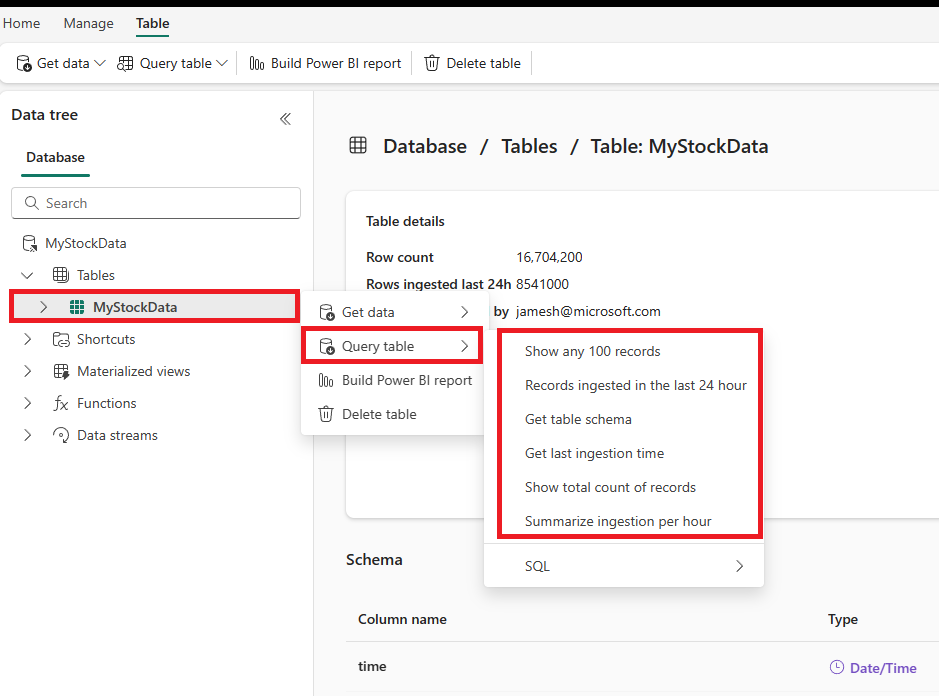
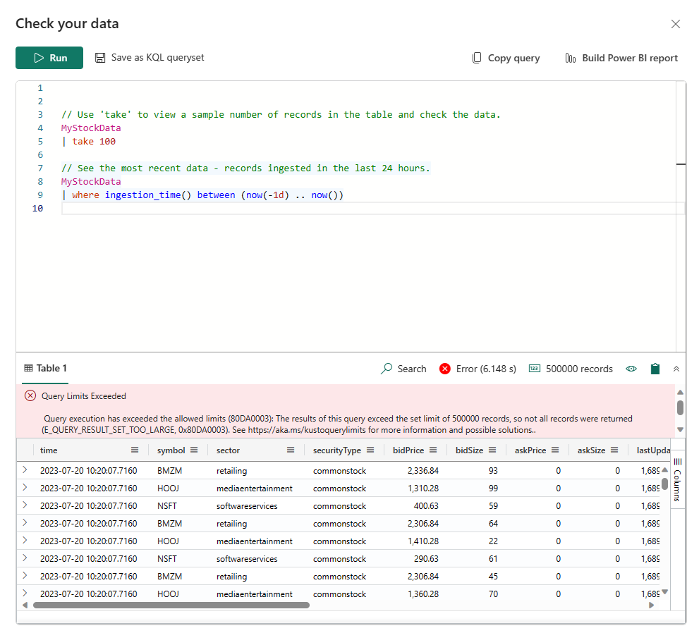

---
lab:
  title: Bien démarrer avec Eventstream dans Microsoft Fabric
  module: Get started with Eventstream in Microsoft Fabric
---
# Bien démarrer avec Eventstream dans Real-Time Analytics (RTA)

Eventstream est une fonctionnalité de Microsoft Fabric qui capture, transforme et route les événements en temps réel vers différentes destinations avec une expérience sans code. Vous pouvez ajouter des sources de données d’événement, des destinations de routage, ainsi que le processeur d’événements lorsque la transformation est nécessaire, au flux d’événements. EventStore de Microsoft Fabric est une option de supervision qui tient à jour les événements du cluster et fournit un moyen de comprendre l’état de votre cluster ou de votre charge de travail à un moment donné. Vous pouvez interroger le service EventStore à propos des événements qui sont disponibles pour chaque entité et type d’entité du cluster. Cela signifie que vous pouvez rechercher des événements à différents niveaux, tels que les clusters, les nœuds, les applications, les services, les partitions et les réplicas de partition. Le service EventStore a également la possibilité de mettre en corrélation les événements du cluster. En examinant les événements écrits en même temps à partir de différentes entités dont les conséquences peuvent être mutuelles, le service EventStore peut lier ces événements pour aider à identifier les causes des activités du cluster. L’agrégation et la collecte d’événements avec EventFlow constituent une autre option pour superviser et diagnostiquer des clusters Microsoft Fabric.

Ce labo prend environ **30** minutes.

> **Remarque** : Vous devez disposer d’une [licence d’essai Microsoft Fabric](https://learn.microsoft.com/fabric/get-started/fabric-trial) pour effectuer cet exercice.

## Créer un espace de travail

Avant d’utiliser des données dans Fabric, créez un espace de travail avec l’essai gratuit de Fabric activé.

1. Connectez-vous à [Microsoft Fabric](https://app.fabric.microsoft.com) à l’adresse `https://app.fabric.microsoft.com` et sélectionnez **Power BI**.
2. Dans la barre de menus à gauche, sélectionnez **Espaces de travail** (l’icône ressemble à &#128455;).
3. Créez un nouvel espace de travail avec le nom de votre choix et sélectionnez un mode de licence qui inclut la capacité Fabric (*Essai*, *Premium* ou *Fabric*).
4. Lorsque votre nouvel espace de travail s’ouvre, il doit être vide, comme illustré ici :

   
5. En bas à gauche du portail Power BI, sélectionnez l’icône **Power BI**, puis passez à l’expérience **Real-Time Analytics**.

## Scénario

Avec les flux d’événements Fabric, vous pouvez gérer facilement vos données d’événement dans un même endroit. Vous pouvez collecter, transformer et envoyer des données d’événement en temps réel dans différentes destinations au format souhaité. Vous pouvez également connecter vos flux d’événements à Azure Event Hubs, à la base de données KQL et à Lakehouse sans aucune difficulté.

Ce labo est basé sur des exemples de données de streaming appelées « Stock Market Data » (Données boursières). L’exemple de données Stock Market est un jeu de données d’une bourse avec une colonne de schéma prédéfini telle que l’heure, le symbole, le prix, le volume, et plus encore. Vous allez utiliser cet exemple de données pour simuler des événements en temps réel des cours des actions et les analyser avec différentes destinations, telles que la base de données KQL.

Utilisez les fonctionnalités de streaming et de requête Real-Time Analytics pour répondre aux questions clés sur les statistiques boursières. Dans ce scénario, nous allons tirer pleinement parti de l’Assistant au lieu de créer manuellement certains composants sans aide extérieure, comme la base de données KQL.

Ce didacticiel vous montre comment effectuer les opérations suivantes :

- Créer une base de données KQL
- Activer la copie de données vers OneLake
- Créer un flux d’événements
- Streamer des données d’un flux d’événements vers votre base de données KQL
- Explorer des données avec KQL et SQL

## Créer une base de données KQL

1. Dans **Real-Time Analytics**, cochez la case **Base de données KQL**.

   

2. Vous êtes invité à donner un **Nom** à la base de données KQL

   

3. Donnez à la base de données KQL un nom dont vous vous souviendrez, par exemple **MyStockData**, puis appuyez sur **Créer**.

1. Dans le panneau **Détails de la base de données**, sélectionnez l’icône de crayon pour activer la disponibilité dans OneLake.

   

2. Veillez à basculer le bouton sur **Actif**, puis sélectionnez **Terminé**.

 > **Remarque :** Vous n’avez pas besoin de sélectionner un dossier, Fabric le crée pour vous.

   

## Créer un flux d’événements

1. Dans la barre de menus, sélectionnez **Real-Time Analytics** (l’icône ressemble au ).
2. Sous **Nouveau**, sélectionnez **Flux d’événements (préversion)**

   

3. Vous êtes invité à **nommer** votre flux d’événements. Donnez à l’EventStream un nom dont vous vous souviendrez, par exemple ***MyStockES**, puis cliquez sur le bouton **Créer**.

   

## Établir une source et une destination de flux d’événements

1. Dans le canevas du flux d’événements, sélectionnez **Nouvelle source** dans la liste déroulante, puis sélectionnez **Exemples de données**.

   

2. Saisissez les valeurs de vos données d’échantillonnage comme indiqué dans le tableau suivant, puis sélectionnez **Ajouter et configurer**.

   | Champ       | Valeur recommandée |
   | ----------- | ----------------- |
   | Nom de la source | StockData         |
   | Exemple de données | Marché boursier      |

3. Maintenant, ajoutez une destination en sélectionnant **Nouvelle destination**, puis **Base de données KQL**

   

4. Dans la configuration de la base de données KQL, utilisez le tableau suivant pour effectuer la configuration.

   | Champ            | Valeur recommandée                              |
   | ---------------- | ---------------------------------------------- |
   | Nom de la destination | MyStockData                                    |
   | Espace de travail        | Espace de travail dans lequel vous avez créé une base de données KQL |
   | Base de données KQL     | MyStockData                                    |
   | Table de destination| MyStockData                                    |
   | Format des données d’entrée| Json                                           |

3. Sélectionnez **Ajouter**.

> **Remarque** : L’ingestion de vos données commence immédiatement.

Attendez que toutes les étapes soient marquées par des coches vertes. Vous devez voir le titre de la page **Ingestion continue à partir d’un flux d’événements établie**. Après cela, sélectionnez **Fermer** pour revenir à votre page de flux d’événements.

> **Remarque** : Il peut être nécessaire d’actualiser la page pour afficher votre table une fois que la connexion Eventstream a été créée et établie.

## Requêtes KQL

Une requête KQL (Kusto Query Language, langage de requête Kusto) est une requête en lecture seule de traitement de données et de retour de résultats. La demande est formulée en texte brut en utilisant un modèle de flux de données facile à lire, à créer et à automatiser. Les requêtes s’exécutent toujours dans le contexte d’une table ou d’une base de données particulière. Une requête se compose au minimum d’une référence de données source et d’un ou de plusieurs opérateurs de requête appliqués de manière séquentielle, indiqués visuellement par l’utilisation d’une barre verticale (|) pour délimiter les opérateurs. Pour plus d’informations sur le langage de requête, consultez la [vue d’ensemble du langage de requête Kusto (KQL)](https://learn.microsoft.com/en-us/azure/data-explorer/kusto/query/?context=%2Ffabric%2Fcontext%2Fcontext).

> **Remarque** : L’éditeur KQL est fourni avec la mise en évidence de la syntaxe et d’Intellisense, ce qui vous permet d’acquérir rapidement des connaissances sur le langage de requête Kusto (KQL).

1. Accédez à la base de données KQL que vous venez de créer et d’activer, nommée **MyStockData**.
2. Dans l’arborescence Données, sélectionnez le menu Plus [...] dans la table MyStockData. Sélectionnez ensuite Interroger la table > Afficher 100 enregistrements.

   

3. L’exemple de requête s’ouvre dans le volet **Explorer vos données** avec le contexte de table déjà renseigné. Cette première requête utilise l’opérateur take pour retourner un nombre restreint d’enregistrements, et est utile pour obtenir un premier aperçu de la structure des données et des valeurs possibles. Les exemples de requêtes renseignées automatiquement sont exécutés automatiquement. Les résultats de la requête s’affichent dans le volet des résultats.

   

4. Retournez dans l’arborescence de données pour sélectionner la requête suivante, qui utilise l’opérateur where et l’opérateur between pour retourner les enregistrements ingérés au cours des dernières 24 heures.

   

> **Remarque** : Vous pouvez voir un avertissement indiquant que vous avez dépassé les limites de requête. Ce comportement varie en fonction de la quantité de données diffusées en streaming dans votre base de données.

Vous pouvez continuer à naviguer à l’aide des fonctions de requête intégrées pour vous familiariser avec vos données.

## Exemples de requêtes SQL

L’éditeur de requête prend en charge l’utilisation de T-SQL en plus de son langage KQL (Kusto Query Language) de requête principale. T-SQL peut être utile pour les outils qui ne peuvent pas utiliser KQL. Pour plus d’informations, consultez [Interroger des données à l’aide de T-SQL](https://learn.microsoft.com/en-us/azure/data-explorer/t-sql).

1. De retour dans l’arborescence Données, sélectionnez le **menu Plus** [...] dans la table MyStockData. Sélectionnez **Interroger la table > SQL > Afficher 100 enregistrements**.

   

2. Placez votre curseur n’importe où dans la requête, puis sélectionnez **Exécuter** ou appuyez sur **Maj + Entrée**.

   

Vous pouvez continuer à naviguer à l’aide des fonctions intégrées et à vous familiariser avec les données à l’aide de SQL ou de KQL. Cela met fin à la leçon.

## Nettoyer les ressources

Dans cet exercice, vous avez créé une base de données KQL et configuré un streaming continu avec un flux d’événements. Après cela, vous avez interrogé les données à l’aide de KQL et de SQL. Lorsque vous avez terminé d’explorer votre base de données KQL, vous pouvez supprimer l’espace de travail que vous avez créé pour cet exercice.
1. Dans la barre de gauche, sélectionnez l’icône de votre espace de travail.
2. Dans le menu ... de la barre d’outils, sélectionnez Paramètres des espaces de travail.
3. Dans la section Autre, sélectionnez Supprimer cet espace de travail.
