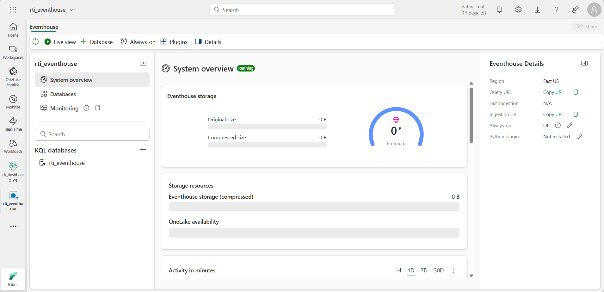
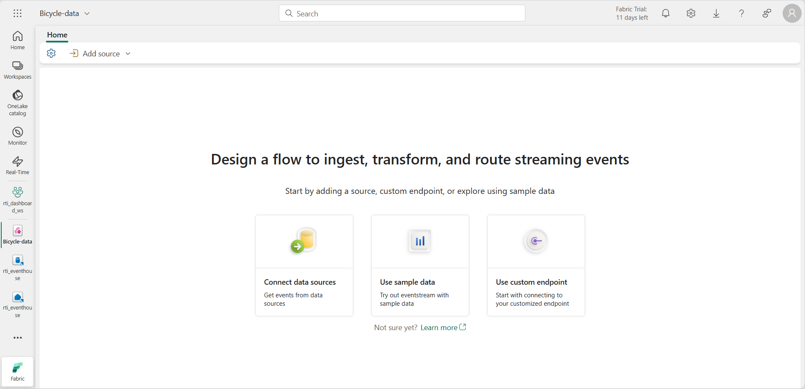
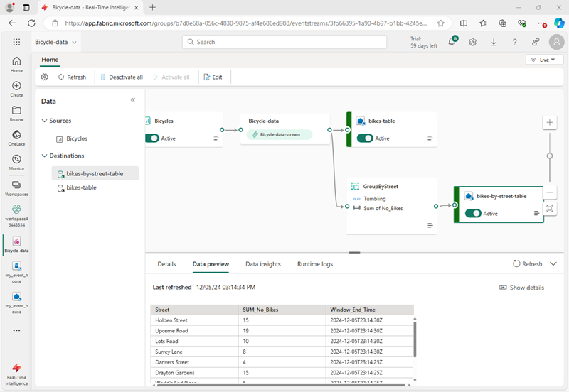
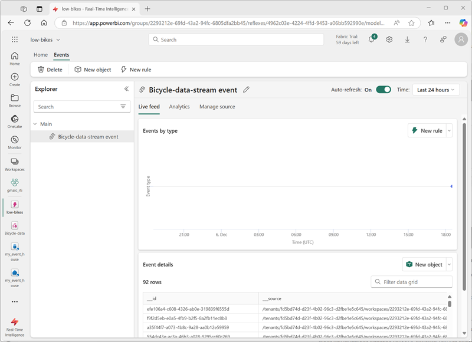

---
lab:
  title: "Ingérer des données en temps réel avec Eventstream dans Microsoft\_Fabric"
  module: Ingest real-time data with Eventstream in Microsoft Fabric
---
# Ingérer des données en temps réel avec Eventstream dans Microsoft Fabric

Eventstream est une fonctionnalité de Microsoft Fabric qui capture, transforme et route les événements en temps réel vers différentes destinations. Vous pouvez ajouter des sources de données d’événement, des destinations et des transformations à l’eventstream.

Dans cet exercice, vous allez ingérer des données à partir d’un exemple de source de données qui émet un flux d’événements liés aux observations des points de regroupement de vélos dans un système de partage de vélos permettant aux gens de louer des vélos dans une ville.

Ce labo prend environ **30** minutes.

> **Remarque** : pour effectuer cet exercice, vous avez besoin d’un [locataire Microsoft Fabric](https://learn.microsoft.com/fabric/get-started/fabric-trial).

## Créer un espace de travail

Avant d’utiliser des données dans Fabric, vous devez créer un espace de travail dans un locataire avec la fonctionnalité Fabric activée.

1. Accédez à la [page d’accueil de Microsoft Fabric](https://app.fabric.microsoft.com/home?experience=fabric) sur `https://app.fabric.microsoft.com/home?experience=fabric` dans un navigateur et connectez-vous avec vos informations d’identification Fabric.
1. Dans la barre de menus à gauche, sélectionnez **Espaces de travail** (l’icône ressemble à &#128455;).
1. Créez un espace de travail avec le nom de votre choix et sélectionnez un mode de licence qui inclut la capacité Fabric (*Essai*, *Premium* ou *Fabric*).
1. Lorsque votre nouvel espace de travail s’ouvre, il doit être vide.

    

## Créer un eventhouse

Maintenant que vous disposez d’un espace de travail, vous pouvez commencer à créer les éléments Fabric dont vous aurez besoin pour votre solution d’intelligence en temps réel. Nous allons commencer par créer un eventhouse.

1. Dans l’espace de travail que vous venez de créer, sélectionnez **+ Nouvel élément**. Dans le volet *Nouvel élément*, sélectionnez **Eventhouse**, en lui donnant un nom unique de votre choix.
1. Fermez toutes les invites ou conseils affichés jusqu’à ce que le nouvel eventhouse vide soit visible :

    

1. Dans le volet de gauche, notez que votre eventhouse contient une base de données KQL portant le même nom que l’eventhouse.
1. Sélectionnez la base de données KQL pour l’afficher.

    Actuellement, il n’existe aucune table dans la base de données. Dans la partie restante de cet exercice, vous allez utiliser un eventstream pour charger des données d’une source en temps réel dans une table.

## Créer un flux d’événements

1. Dans la page principale de votre base de données KQL, sélectionnez **Obtenir des données**.
2. Pour la source de données, sélectionnez **Eventstream** > **Nouvel evenstream**. Nommez l’eventstream `Bicycle-data`.

    La création de votre flux d’événements dans l’espace de travail ne prend que quelques instants. Une fois l’opération effectuée, vous êtes automatiquement redirigé vers l’éditeur principal, prêt à commencer à intégrer des sources dans votre flux d’événements.

    

## Ajouter une source

1. Dans le canevas d’eventstream, sélectionnez **Utiliser des exemples de données**.
2. Nommez la source `Bicycles` et sélectionnez **Vélos** comme exemple de données.

    Votre flux sera mappé et sera automatiquement affiché sur le **canevas d’eventstream**.

   

## Ajouter une destination

1. Sélectionnez la vignette **Transformer des événements ou ajouter une destination** et recherchez **Eventhouse**.
1. Dans le volet **Eventhouse**, configurez les options suivantes.
   - **Mode d’ingestion des données :** traitement des événements avant l’ingestion
   - **Nom de la destination :**`bikes-table`
   - **Espace de travail :***sélectionnez l’espace de travail que vous avez créé au début de cet exercice.*
   - **Eventhouse** : *sélectionnez votre eventhouse*
   - **Base de données KQL :***sélectionnez votre base de données KQL*
   - **Table de destination :** créez une table nommée `bikes`
   - **Format de données d’entrée :** JSON

   

1. Dans le volet **Eventhouse**, sélectionnez **Enregistrer**. 
1. Dans la barre d’outils, sélectionnez **Publier**.
1. Attendez environ une minute que la destination des données devienne active. Sélectionnez ensuite le nœud **bike-table** dans le canevas de conception et affichez le volet **Aperçu des données** en dessous pour afficher les données les plus récentes qui ont été ingérées :

   

1. Patientez quelques minutes, puis utilisez le bouton **Actualiser** pour actualiser le volet **Aperçu des données**. Le flux s’exécutant en continu, de nouvelles données ont peut-être été ajoutées à la table.
1. Sous le canevas de conception de l’eventstream, affichez l’onglet **Informations sur les données** pour afficher les détails des événements de données capturés.

## Interroger les données capturées

L’eventstream que vous avez créé prend les données de l’exemple de source de données de vélos et les charge dans la base de données dans votre eventhouse. Vous pouvez analyser les données capturées en interrogeant la table dans la base de données.

1. Dans la barre de menus de gauche, sélectionnez votre base de données KQL.
1. Sous l’onglet **base de données**, dans la barre d’outils de votre base de données KQL, utilisez le bouton **Actualiser** pour actualiser la vue jusqu’à ce que vous voyiez la table **vélos** sous la base de données. Sélectionnez ensuite la table **vélos**.

   

1. Dans le menu **...** de la table **vélos**, sélectionnez **Interroger la table** > **Enregistrements ingérés au cours des dernières 24 heures**.
1. Dans le volet de requête, notez que la requête suivante a été générée et exécutée, et les résultats se sont affichés en dessous :

    ```kql
    // See the most recent data - records ingested in the last 24 hours.
    bikes
    | where ingestion_time() between (now(-1d) .. now())
    ```

1. Sélectionnez le code de requête et exécutez-le pour afficher 100 lignes de données depuis la table.

    

## Transformer des données d’événements

Les données que vous avez capturées ne sont pas modifiées à partir de la source. Dans de nombreux scénarios, vous pouvez transformer les données dans l’eventstream avant de les charger dans une destination.

1. Dans la barre de menus de gauche, sélectionnez l’eventstream **Bike-data**.
1. Dans la barre d’outils, sélectionnez **Modifier** pour modifier l’eventstream.
1. Dans le menu **Transformer des événements**, sélectionnez **Regrouper par** pour ajouter un nouveau nœud **Regrouper par** à l’eventstream.
1. Faites glisser une connexion de la sortie du nœud **Bicycle-data** vers l’entrée du nouveau nœud **Regrouper par**, puis utilisez l’icône *crayon* dans le nœud **Regrouper par** pour la modifier.

   

1. Configurez les propriétés de la section de paramètres **Regrouper par** :
    - **Nom de l’opération :** GroupByStreet
    - **Type d’agrégat :***sélectionnez* Sum
    - **Champ :***sélectionnez* No_Bikes *Sélectionnez ensuite **Ajouter** pour créer la fonction* SUM de No_Bikes
    - **Regrouper les agrégations par (facultatif) :** Street
    - **Fenêtre temporelle** : bascule
    - **Durée** : 5 secondes
    - **Décalage** : 0 seconde

    > **Remarque** : cette configuration entraîne le calcul par l’eventstream du nombre total de vélos dans chaque rue toutes les 5 secondes.
      
1. Enregistrez la configuration et revenez au canevas d’Eventstream, où une erreur est indiquée (car vous devez stocker la sortie de la transformation quelque part !).

1. Utilisez l’icône **+** à droite du nœud **GroupByStreet** pour ajouter un nouveau nœud **Eventhouse**.
1. Configurez le nouveau nœud d’eventhouse avec les options suivantes :
   - **Mode d’ingestion des données :** traitement des événements avant l’ingestion
   - **Nom de la destination :**`bikes-by-street-table`
   - **Espace de travail :***sélectionnez l’espace de travail que vous avez créé au début de cet exercice.*
   - **Eventhouse** : *sélectionnez votre eventhouse*
   - **Base de données KQL :***sélectionnez votre base de données KQL*
   - **Table de destination :** créez une table nommée `bikes-by-street`
   - **Format de données d’entrée :** JSON

    

1. Dans le volet **Eventhouse**, sélectionnez **Enregistrer**. 
1. Dans la barre d’outils, sélectionnez **Publier**.
1. Attendez environ une minute que les modifications deviennent actives.
1. Dans le canevas de conception, sélectionnez le nœud **bike-by-street-table** et affichez le volet **Aperçu des données** sous le canevas.

    

    Notez que les données transformées incluent le champ de regroupement que vous avez spécifié (**Rue**), l’agrégation que vous avez spécifiée (**SUM_no_Bikes**) et un champ d’horodatage indiquant la fin de la fenêtre bascule de 5 secondes dans laquelle l’événement s’est produit (**Window_End_Time**).

## Interroger les données transformées

Vous pouvez maintenant interroger les données de vélos qui ont été transformées et chargées dans une table par votre eventstream.

1. Dans la barre de menus de gauche, sélectionnez votre base de données KQL.
1. 1. Sous l’onglet **base de données**, dans la barre d’outils de votre base de données KQL, utilisez le bouton **Actualiser** pour actualiser la vue jusqu’à ce que vous voyiez la table **bikes-by-street** sous la base de données.
1. Dans le menu **...** de la table **bikes-by-street**, sélectionnez **Interroger les données** > **Afficher 100 enregistrements**.
1. Dans le volet de requête, notez que la requête suivante est générée et exécutée :

    ```kql
    ['bikes-by-street']
    | take 100
    ```

1. Modifiez la requête KQL pour récupérer le nombre total de vélos par rue au cours de chaque fenêtre de 5 secondes :

    ```kql
    ['bikes-by-street']
    | summarize TotalBikes = sum(tolong(SUM_No_Bikes)) by Window_End_Time, Street
    | sort by Window_End_Time desc , Street asc
    ```

1. Sélectionnez la requête modifiée et exécutez-la.

    Les résultats affichent le nombre de vélos observés dans chaque rue au cours de chaque période de 5 secondes.

    

<!--
## Add an Activator destination

So far, you've used an eventstream to load data into tables in an eventhouse. You can also direct streams to an activator and automate actions based on values in the event data.

1. In the menu bar on the left, return to the **Bicycle-data** eventstream. Then in the eventstream page, on the toolbar, select **Edit**.
1. In the **Add destination** menu, select **Activator**. Then drag a connection from the output of the **Bicycle-data** stream to the input of the new Activator destination.
1. Configure the new Activator destination with the following settings:
    - **Destination name**: `low-bikes-activator`
    - **Workspace**: *Select your workspace*
    - **Activator**: *Create a **new** activator named `low-bikes`*
    - **Input data format**: Json

    

1. Save the new destination.
1. In the menu bar on the left, select your workspace to see all of the items you have created so far in this exercise - including the new **low-bikes** activator.
1. Select the **low-bikes** activator to view its page, and then on the activator page select **Get data**.
1. On the **select a data source** dialog box, scroll down until you see **Data streams** and then select the **Bicycle-data-stream**.

    

1. Use the **Next**,  **Connect**, and **Finish** buttons to connect the stream to the activator.

    > **Tip**: If the data preview obscures the **Next** button, close the dialog box, select the stream again, and click **Next** before the preview is rendered.

1. When the stream has been connected, the activator page displays the **Events** tab:

    

1. Add a new rule, and configure its definition with the following settings:
    - **Monitor**:
        - **Event**: Bicycle-data-stream-event
    - **Condition**
        - **Condition 1**:
            - **Operation**: Numeric state: Is less than or equal to
            - **Column**: No_Bikes
            - **Value**: 3
            - **Default type**: Same as window size
    - **Action**:
        - **Type**: Email
        - **To**: *The email address for the account you are using in this exercise*
        - **Subject**: `Low bikes`
        - **Headline**: `The number of bikes is low`
        - **Message**: `More bikes are needed.`
        - **Context**: *Select the **Neighborhood**, **Street**, and **No-Bikes** columns.

    

1. Save and start the rule.
1. View the **Analytics** tab for the rule, which should show each instance if the condition being met as the stream of events is ingested by your eventstream.

    Each instance will result in an email being sent notifying you of low bikes, which will result in a large numbers of emails, so...

1. On the toolbar, select **Stop** to stop the rule from being processed.

-->

## Nettoyer les ressources

Dans cet exercice, vous avez créé un eventhouse et rempli des tables dans sa base de données à l’aide d’un eventstream.

Lorsque vous avez terminé d’explorer votre base de données KQL, vous pouvez supprimer l’espace de travail que vous avez créé pour cet exercice.

1. Dans la barre de gauche, sélectionnez l’icône de votre espace de travail.
2. Dans la barre d’outils, sélectionnez **Paramètres de l’espace de travail**.
3. Dans la section **Général**, sélectionnez **Supprimer cet espace de travail**.
.
