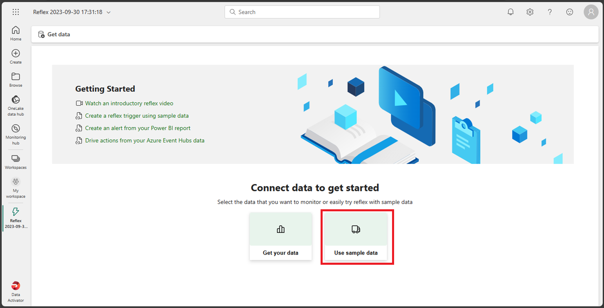

---
lab:
  title: Utiliser Data Activator dans Fabric
  module: Get started with Data Activator in Microsoft Fabric
---

# Utiliser Data Activator dans Fabric

Data Activator dans Microsoft Fabric prend des mesures en fonction de ce qui se passe dans vos données. Data Activator vous permet de surveiller vos données et de créer des déclencheurs pour réagir aux changements de vos données.

Ce labo prend environ **30** minutes.

> **Remarque** : Vous devez disposer d’une [licence d’essai Microsoft Fabric](https://learn.microsoft.com/fabric/get-started/fabric-trial) pour effectuer cet exercice.

## Créer un espace de travail

Avant d’utiliser des données dans Fabric, créez un espace de travail avec l’essai gratuit de Fabric activé.

1. Dans la [page d’accueil de Microsoft Fabric](https://app.fabric.microsoft.com), sélectionnez **Data Activator**.
1. Dans la barre de menus à gauche, sélectionnez **Espaces de travail** (l’icône ressemble à &#128455;).
1. Créez un espace de travail avec le nom de votre choix et sélectionnez un mode de licence qui inclut la capacité Fabric (*Essai*, *Premium* ou *Fabric*).
1. Lorsque votre nouvel espace de travail s’ouvre, il doit être vide.

    

Dans ce labo, vous allez utiliser Data Activator dans Fabric pour créer un élément *reflex*. Data Activator fournit de façon pratique un exemple de jeu de données que vous pouvez utiliser pour explorer les fonctionnalités de Data Activator. Vous utilisez cet exemple de données pour créer un *reflex* qui analyse certaines données en temps réel et crée un déclencheur pour envoyer un e-mail lorsqu’une condition est remplie.

> **Remarque** : l’exemple de processus de Data Activator génère des données aléatoires en arrière-plan. Plus vos conditions et filtres seront complexes, plus il faudra de temps pour les déclencher. Si vous ne voyez pas de données dans le graphique, attendez quelques minutes et actualisez la page. Cela dit, vous n’avez pas besoin d’attendre que les données soient affichées dans les graphiques pour continuer avec le labo.

## Scénario

Dans ce scénario, vous êtes analyste de données pour une entreprise qui vend et expédie une gamme de produits.  Vous êtes responsable des données de toutes les ventes et expéditions vers la ville de Redmond. Vous souhaitez créer un reflex qui analyse les colis en cours de livraison. Parmi les produits que vous expédiez, il y a des médicaments prescrits qui doivent être réfrigérés à une température particulière pendant le transport. Vous souhaitez créer un reflex qui envoie un e-mail au service d’expédition si la température d’un colis contenant un médicament prescrit est supérieure ou inférieure à un certain seuil. La température idéale doit être comprise entre 0,5 degré et 5 degrés. Étant donné que les événements reflex contiennent déjà un déclencheur similaire, vous en créez un spécifiquement pour les colis expédiés vers la ville de Redmond. C’est parti !

## Créer un reflex

1. Vérifiez que vous êtes sur l’écran d’accueil de Data Activator en vérifiant que l’icône en bas à droite reflète Data Activator. Nous allons créer un reflex en sélectionnant le bouton **reflex (préversion)**.

    

1. Dans un environnement de production réel, vous utiliseriez vos propres données. Toutefois, pour ce labo, vous allez utiliser les exemples de données fournis par Data Activator. Sélectionnez le bouton **Utiliser des exemples de données** pour terminer la création de votre reflex.

    

1. Par défaut, Data Activator crée votre Reflex avec le nom *Reflex AAAA-MM-JJ hh :mm :ss*. Étant donné qu’il peut exister plusieurs reflex dans votre espace de travail, vous devez remplacer le nom du reflex par défaut par un autre plus descriptif. Sélectionnez le menu déroulant situé à côté du nom du Reflex actuel dans le coin supérieur gauche et modifiez le nom en ***Reflex Expédition Contoso*** pour notre exemple.

    

Notre reflex maintenant créé, nous pouvons commencer à lui ajouter des déclencheurs et des actions.

## Familiarisez-vous avec l’écran d’accueil de reflex

L’écran d’accueil de reflex est divisé en deux sections, le mode *Conception* et le mode *Données*. Vous pouvez sélectionner le mode en sélectionnant l’onglet correspondant en bas à gauche de l’écran.  L’onglet du mode *Conception* vous permet de définir vos objets avec vos déclencheurs, propriétés et événements. L’onglet du mode *Données* vous permet d’ajouter vos sources de données et d’afficher les données traitées par votre reflex. Examinons l’onglet du mode *Conception* qui doit être ouvert par défaut lorsque vous créez votre reflex.

### Mode Conception

Si vous n’êtes pas en mode *Conception*, sélectionnez l’onglet **Conception** en bas à gauche de l’écran.

Pour vous familiariser avec le mode *Conception*, sélectionnez les différentes sections de l’écran, les déclencheurs, les propriétés et les événements. Nous abordons chaque section plus en détail dans les sections suivantes.

### Mode Données

Si vous n’êtes pas actuellement en mode *Données*, sélectionnez l’onglet **Données** en bas à gauche de l’écran. Dans un exemple réel, vous ajouteriez ici vos propres sources de données à partir de vos visuels EventStreams et Power BI. Pour ce lab, vous utilisez les exemples de données fournis par Data Activator. Cet exemple est déjà configuré avec trois EventStreams qui surveillent l’état de livraison du colis.

Sélectionnez chacun des différents événements et observez les données utilisées dans le flux.

Il est temps d’ajouter un déclencheur à notre reflex, mais commençons par créer un objet.

## Créer un objet 

Dans un scénario réel, il n’est peut-être pas nécessaire de créer un objet pour ce reflex, car l’exemple Data Activator inclut déjà un objet appelé *Colis*. Mais pour ce labo, nous allons créer un objet pour illustrer comment en créer un. Nous allons créer un objet appelé *Colis Redmond*.

1. Si vous n’êtes pas actuellement en mode *Données*, sélectionnez l’onglet **Données** en bas à gauche de l’écran.

1. Sélectionnez l’événement ***Colis en transit***. Prêtez une attention particulière aux valeurs des colonnes *IdColis*, *Température*, *TypeChaîneFroid*, *Ville* et *SoinsParticuliers*. Vous utiliserez ces colonnes pour créer votre déclencheur.

1. Si la boîte de dialogue *Attribuer vos données* n’est pas déjà ouverte sur le côté droit, sélectionnez le bouton **Attribuer vos données** sur la droite de l’écran.

    

1. Dans la boîte de dialogue *Attribuer vos données*, sélectionnez l’onglet ***Attribuer à un nouvel objet*** et entrez les valeurs suivantes :

    - **Nom de l’objet** : *Colis Redmond*
    - **Attribuer une colonne clé** : *IdColis*
    - **Attribuer les propriétés** : *Ville, TypeChaîneFroid, SoinsParticuliers, Température*

    

1. Sélectionnez **Enregistrer**, puis **Enregistrer et passer en mode Conception**.

1. Vous devriez maintenant être de retour dans le mode *Conception*. Un nouvel objet appelé ***Colis Redmond*** a été ajouté. Sélectionnez ce nouvel objet, développez ses *Événements*, puis sélectionnez l’événement **Colis en transit**.

    

Il est temps de créer votre déclencheur.

## Créer une gâchette

Examinons ce que doit faire votre déclencheur : *Vous voulez créer un Reflex qui envoie un e-mail au service d’expédition si la température d’un colis contenant un médicament prescrit est supérieure ou inférieure à un certain seuil. La température idéale doit être comprise entre 33 et 41 degrés. Comme les événements du Reflex contiennent déjà un déclencheur similaire, vous en créez un spécifiquement pour les colis expédiés vers la ville de Redmond*.

1. Dans l’événement *Colis en transit* de l’objet **Colis Redmond**, sélectionnez le bouton **Nouveau déclencheur** dans le menu supérieur. Un nouveau déclencheur est créé avec le nom par défaut *Sans titre*. Remplacez le nom par ***Température du médicament hors plage*** pour mieux définir votre déclencheur.

    

1. Il est temps de sélectionner la colonne propriété ou événement qui déclenche votre reflex. Étant donné que vous avez créé plusieurs propriétés lors de la création de votre objet, sélectionnez le bouton **Propriété existante**, puis sélectionnez la propriété ***Température***. 

    

    La sélection de cette propriété doit renvoyer un graphique avec un échantillon de valeurs historiques de température.

    

1. Vous devez maintenant décider du type de condition que vous souhaitez déclencher à partir de cette propriété. Dans ce cas, vous souhaitez déclencher votre reflex lorsque la température est supérieure à 41 degrés ou inférieure à 33 degrés. Étant donné que nous recherchons une plage numérique, sélectionnez le bouton **Numérique**, puis sélectionnez la condition **Sort de la plage**.

    

1. Vous devez maintenant entrer les valeurs pour votre condition. Saisissez ***33*** et ***41*** comme valeurs de plage. Étant donné que vous choisissez la condition *Sort de la plage numérique*, le déclencheur doit s’activer lorsque la température est inférieure à *33* degrés ou supérieure à *41* degrés.

    

1. Jusqu’à présent, vous avez défini la propriété et la condition sur lesquelles vous souhaitez que le déclencheur soit activé, mais cela n’inclut pas encore tous les paramètres dont vous avez besoin. Vous devez toujours vous assurer que le déclencheur ne s’active que pour la *Ville* de **Redmond** et pour le type de *Soins particuliers* de **Médicament**. Nous allons maintenant ajouter quelques filtres pour ces conditions.  Sélectionnez le bouton **Ajouter un filtre**, définissez la propriété sur ***Ville***, définissez la relation sur ***Égal***, puis entrez ***Redmond*** comme valeur. Ensuite, ajoutez un nouveau filtre avec la propriété ***SpecialCare***, définissez-la sur ***Égal***, puis entrez ***Médicament*** comme valeur.

    

1. Ajoutons un filtre supplémentaire pour nous assurer que le médicament est réfrigéré. Sélectionnez le bouton **Ajouter un filtre**, définissez la propriété ***ColdChainType***, définissez-la sur ***Égal***, puis entrez ***Réfrigéré*** comme valeur.

    

1. Vous avez presque terminé. Il vous suffit de définir l’action que vous souhaitez effectuer lorsque le déclencheur s’active. Dans ce cas, vous souhaitez envoyer un e-mail au service d’expédition. Sélectionnez le bouton **E-mail**.

    

1. Entrez les valeurs suivantes pour votre action d’e-mail :

    - **Envoyer à** : votre compte d’utilisateur actuel devrait être sélectionné par défaut, ce qui devrait convenir pour ce labo.
    - **Objet** : *Colis médical Redmond en dehors de la plage de température acceptable*
    - **Titre** : *Température trop élevée ou trop basse*
    - **Informations supplémentaires** : sélectionnez la propriété *Température* dans la liste de cases à cocher.

    

1. Sélectionnez **Enregistrer**, puis **Démarrer** dans le menu du haut.

Vous avez maintenant créé et démarré un déclencheur dans Data Activator.

## Mettre à jour et arrêter un déclencheur

Le seul problème avec ce déclencheur est que tandis que le déclencheur a envoyé un e-mail avec la température, il n’a pas envoyé l’*IdColis* du colis. Nous allons maintenant mettre à jour le déclencheur pour inclure l’*IdColis*.

1. Sélectionnez l’événement **Colis en transit** à partir de l’objet **Colis Redmond**, puis sélectionnez **Nouvelle propriété** dans le menu du haut.

    

1. Ajoutons la propriété **IdColis** en sélectionnant la colonne de l’événement *Colis en transit*. N’oubliez pas de changer le nom de la propriété de *Sans titre* en *IdColis*.

    

1. Nous allons mettre à jour notre action de déclencheur. Sélectionnez le déclencheur **Température du médicament hors plage**, faites défiler jusqu’à la section **Acte** en bas, sélectionnez **Informations supplémentaires** et ajoutez la propriété **IdColis**. Ne sélectionnez PAS le bouton **Enregistrer** pour le moment.

    

1. Étant donné que vous avez mis à jour le déclencheur, l’action appropriée devrait être de mettre à jour et non d’enregistrer le déclencheur, mais pour ce labo, nous allons faire le contraire et sélectionner le bouton **Enregistrer** au lieu du bouton **Mettre à jour** pour voir également ce qu’il se passe. La raison pour laquelle vous devriez avoir sélectionné le bouton *Mettre à jour* est que le fait de*mettre à jour* le déclencheur l’enregistre et met à jour celui en cours d’exécution avec les nouvelles conditions. Si vous sélectionnez simplement le bouton *Enregistrer*, le déclencheur en cours d’exécution n’appliquera les nouvelles conditions que lorsque vous choisirez de le mettre à jour. Nous allons maintenant sélectionner le bouton **Enregistrer**.

1. Étant donné que vous avez sélectionné *Enregistrer* au lieu de *Mettre à jour*, vous avez remarqué que le message *Il existe une mise à jour de propriété disponible. Mettez à jour maintenant pour vous assurer que le déclencheur a les modifications les plus récentes* s’affiche en haut de l’écran. Le message comporte également un bouton *Mettre à jour*. Nous allons maintenant sélectionner le bouton **Mettre à jour**.

    

1. Arrêtez le déclencheur en sélectionnant le bouton **Arrêter** dans le menu du haut de l’écran.

## Nettoyer les ressources

Dans cet exercice, vous avez créé un reflex avec un déclencheur dans Data Activator. Vous devriez désormais être familiarisé avec l’interface de Data Activator et savoir comment créer un reflex, ainsi que ses objets, déclencheurs et propriétés.

Si vous avez terminé d’explorer votre reflex de Data Activator, vous pouvez supprimer l’espace de travail que vous avez créé pour cet exercice.

1. Dans la barre de gauche, sélectionnez l’icône de votre espace de travail pour afficher tous les éléments qu’il contient.
2. Dans le menu  **...** de la barre d’outils, sélectionnez **Paramètres de l’espace de travail**.
3. Dans la section **Général**, sélectionnez **Supprimer cet espace de travail**.
