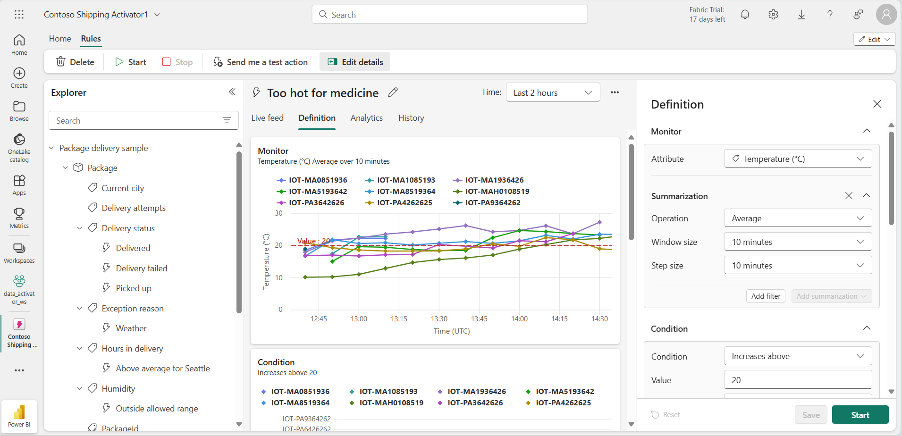

---
lab:
  title: Utilisez Activator dans Microsoft Fabric
  module: Use Activator in Microsoft Fabric
---
# Utiliser Activator dans Fabric

Activator dans Microsoft Fabric prend des mesures en fonction de ce qui se passe dans vos données. Un Activator vous permet de surveiller vos données et de créer des déclencheurs pour réagir aux changements de vos données.

Ce labo prend environ **30** minutes.

> **Remarque** : Vous devez disposer d’une [licence d’essai Microsoft Fabric](https://learn.microsoft.com/fabric/get-started/fabric-trial) pour effectuer cet exercice.

## Scénario

Dans ce scénario, vous êtes analyste de données pour une entreprise qui vend et expédie une gamme de produits.  Vous êtes responsable des données de toutes les ventes et expéditions vers la ville de Redmond. Vous souhaitez créer une règle d'alerte qui analyse les colis en cours de livraison. Parmi les produits que vous expédiez, il y a des médicaments prescrits qui doivent être réfrigérés à une température particulière pendant le transport. Vous voulez créer une règle d’alerte qui envoie un e-mail au service d’expédition si la température d’un colis contenant un médicament prescrit est supérieure ou inférieure à un certain seuil. La température idéale doit être comprise entre 0,5 degré et 5 degrés. Étant donné que les événements Activator contiennent déjà un déclencheur similaire, vous en créez un spécifiquement pour les colis expédiés vers la ville de Redmond. C’est parti !

## Créer un espace de travail

Avant d’utiliser des données dans Fabric, créez un espace de travail avec l’essai gratuit de Fabric activé.

1. Accédez à la [page d’accueil de Microsoft Fabric](https://app.fabric.microsoft.com/home?experience=fabric-developer) sur `https://app.fabric.microsoft.com/home?experience=fabric-developer` dans un navigateur et connectez-vous avec vos informations d’identification Fabric.
1. Dans la barre de menus à gauche, sélectionnez **Espaces de travail** (l’icône ressemble à &#128455;).
1. Créez un espace de travail avec le nom de votre choix et sélectionnez un mode de licence qui inclut la capacité Fabric (*Essai*, *Premium* ou *Fabric*).
1. Lorsque votre nouvel espace de travail s’ouvre, il doit être vide.

    

Dans ce laboratoire, vous allez utiliser l’Activator dans Fabric pour créer des déclencheurs en fonction des modifications de données. Activator de Fabric fournit de façon pratique un exemple de jeu de données que vous pouvez utiliser pour explorer les fonctionnalités d’Activator. Vous allez utiliser cet exemple de données pour analyser une diffusion en continu de données en temps réel et créer un déclencheur pour envoyer un e-mail lorsqu’une condition est remplie.

> **Remarque** : L’exemple de processus d'Activator génère des données aléatoires en arrière-plan. Plus vos conditions et filtres seront complexes, plus il faudra de temps pour les déclencher. Si vous ne voyez pas de données dans le graphique, attendez quelques minutes et actualisez la page. Cela dit, vous n’avez pas besoin d’attendre que les données soient affichées dans les graphiques pour continuer avec le labo.

## Créer un Activator

Ensuite, créez un Activator dans l’espace de travail que vous avez créé :

1. Sélectionnez **Créer** dans la barre de menus de gauche. Dans la page *Nouveau*, sous la section *Intelligence en temps réel*, sélectionnez **Activator**.

    >**Note** : si l’option **Créer** n’est pas épinglée à la barre latérale, vous devez d’abord sélectionner l’option avec des points de suspension (**...**).

    Après une minute, un nouvel Activator est créé :

    

    Dans un environnement de production réel, vous utiliseriez vos propres données. Toutefois, pour ce laboratoire, vous allez utiliser les exemples de données fournis par Activator. 

1. Sélectionnez la vignette **Essayer l’exemple** pour remplir votre Activator avec des exemples de données.

    Par défaut, l’Activator est créé avec le nom *Activator YYYY-MM-DD hh:mm:ss*. Étant donné qu’il peut exister plusieurs Activators dans votre espace de travail, vous devez remplacer le nom de l’Activator par défaut par un autre plus descriptif.

1. Sélectionnez le menu déroulant situé à côté du nom de l’Activator actuel dans le coin supérieur gauche et modifiez le nom en ***Contoso Shipping Activator*** pour notre exemple.

    

Notre projet Activator est désormais créé et nous pouvons commencer à parcourir ses objets, ses propriétés et ses règles.

## Familiarisez-vous avec l’écran d’accueil d’Activator

Explorons les données du flux d’événements sur lesquelles cet exemple est basé.

1. Dans le volet **Explorateur**, faites défiler vers le bas et sélectionnez le flux d’**événements de livraison de colis**.

    Ces évènements montrent l’état en temps réel des packages qui sont en cours de livraison.

    

1. Passez en revue les données de la table dynamique **Détails de l’événement**. Chaque point de données contient des informations sur les événements entrants. Vous devrez peut-être faire défiler pour tout voir.

    Le volet **Explorateur** affiche des objets qui utilisent des données provenant des flux d’événements. Ces objets ont des propriétés à partir desquelles les règles peuvent être créées. Dans cet exemple, **Colis** est l’objet créé à partir du flux d’événements **Événements de livraison de colis**.

1. Dans le volet **Explorateur**, sous la propriété **Température**, sélectionnez la règle **Trop chaude pour le médicament**.
1. Dans le volet **Définition**, passez en revue le fonctionnement de la règle. Dans la section **Moniteur**, la propriété **Température** est sélectionnée en tant qu’attribut surveillé. Les valeurs de température proviennent de la colonne Température de la table **Détails de l’événement** que nous avons vue précédemment dans le flux d’événements. 

     

1. Dans la section **Condition**, vous voyez la condition de règle pour surveiller les températures supérieures à 20 degrés Celsius.
1. Dans la section **Filtre des propriétés**, vous voyez un filtre personnalisé qui garantit que notre règle s’applique uniquement aux colis contenant des médicaments. Dans la table du flux d’événements, la règle examine la colonne nommée **SpecialCare**, représentée ici en tant que propriété *Contenus des soins spéciaux*. Dans la propriété *Contenus des soins spéciaux*, certains des colis ont une valeur Médicament.
1. Enfin, nous avons la section **Action**. Notre règle est définie pour envoyer un message Teams si la condition est remplie. Vous pouvez également la définir pour envoyer plutôt un e-mail.
1. Sélectionnez le type d’action que vous préférez, vérifiez que vous êtes le destinataire, puis sélectionnez **Envoies-moi une action test**. Vous devez recevoir le message défini dans le champ **Message** avec des détails sur le déclencheur, tels que l’heure d’activation et l’ID du colis.

## Créer un objet 

Dans un scénario réel, il n’est peut-être pas nécessaire de créer un objet pour ce flux d’événements, car l’exemple Activator inclut déjà un objet appelé *Colis*. Mais pour ce labo, nous allons créer un objet pour illustrer comment en créer un. Nous allons créer un objet appelé *Colis Redmond*.

1. Sélectionnez le flux d’événements **Événements de livraison de colis**, puis sélectionnez **Nouvel objet** dans le ruban.

1. Dans le volet **Générer un objet** à droite, saisissez les valeurs suivantes :
    - **Nom de l’objet** : `Redmond Packages`
    - **Identificateur unique** : **PackageId**
    - **Propriétés** : **Ville**, **ColdChainType**, **SpecialCare**, **Température**

1. Sélectionnez **Créer**.

    

Dans le volet **Explorateur**, un nouvel objet appelé **Colis Redmond** a été ajouté. Temps de création de votre règle.

## Créer une règle

Examinons ce que vous souhaitez que votre règle fasse : *Vous voulez créer une règle d’alerte qui envoie un e-mail au service d’expédition si la température d’un colis contenant un médicament prescrit est supérieure ou inférieure à un certain seuil. La température idéale doit être inférieure à 20 degrés. Étant donné que l’objet Colis contient déjà une règle similaire, vous en créerez une spécifiquement pour les colis expédiés à la ville de Redmond*.

1. Sélectionnez la propriété **Température** dans l’objet *Colis Redmond*, puis sélectionnez le bouton **Nouvelle règle** dans le ruban, s’il n’est pas déjà sélectionné.
1. Dans le volet **Créer une règle**, saisissez les valeurs suivantes :
    - **Condition** : Augmentations supérieures
    - **Valeur** : `20`
    - **Occurrence** : Chaque fois que la condition est remplie
    - **Action** : Envoyer un e-mail

1. Sélectionnez **Créer**.
1. Une nouvelle règle est créée avec le nom par défaut de l’*alerte température*. Remplacez le nom par ***Température du médicament en dehors de la plage*** en sélectionnant l’icône de crayon en regard du nom de la règle dans le volet central.

    

    Jusqu’à présent, vous avez défini la propriété et la condition sur lesquelles vous souhaitez que la règle soit activée, mais cette définition n’inclut pas encore tous les paramètres dont vous avez besoin. Vous devez toujours vous assurer que le déclencheur ne s’active que pour la *Ville* de **Redmond** et pour le type de *Soins particuliers* de **Médicament**. Nous allons maintenant ajouter quelques filtres pour ces conditions.  

1. Dans le volet **Définition**, développez la section **Filtre des propriétés**.
1. Dans la zone **Filtre 1**, définissez l’attribut sur **Ville**, définissez l’opération sur **Est égale à**, puis sélectionnez **Redmond** comme valeur.
1. Sélectionnez **Ajouter un filtre**, puis ajoutez un nouveau filtre avec l’attribut **SpecialCare**, définissez-le sur **Est égal à** et saisissez **Médicament** comme valeur.
1. Ajoutons un filtre supplémentaire pour nous assurer que le médicament est réfrigéré. Sélectionnez le bouton **Ajouter un filtre**, définissez l’attribut ***ColdChainType***, définissez-la sur **Est égal à**, puis saisissez **Réfrigéré** comme valeur.

    

    Vous avez presque terminé. Il vous suffit de définir l’action que vous souhaitez effectuer lorsque le déclencheur s’active. Dans ce cas, vous souhaitez envoyer un e-mail au service d’expédition.

1. Dans la section**Action**, saisissez les valeurs suivantes :
    - **Type** : E-mail
    - **À** : votre compte d’utilisateur actuel devrait être sélectionné par défaut, ce qui devrait convenir pour cette activité.
    - **Objet** : *Colis médical Redmond en dehors de la plage de température acceptable*
    - **Titre** : *Température trop élevée*
    - **Contexte** : Sélectionnez la propriété *Temperature* dans la liste des cases à cocher.

    

1. Sélectionnez **Enregistrer et démarrer**.

    Vous avez maintenant créé et démarré une règle dans votre Activator. La règle doit se déclencher plusieurs fois toutes les heures.

1. Une fois que vous avez vérifié que la règle fonctionne, vous pouvez la désactiver à l’aide du bouton **Arrêter** sur le ruban.

## Nettoyer les ressources

Dans cet exercice, vous avez créé un Activator avec une règle d’alerte. Vous devez maintenant vous être familiarisé avec l’interface Activator et savoir comment créer des objets, des propriétés et des règles.

Si vous avez terminé d’explorer votre Activator, vous pouvez supprimer l’espace de travail que vous avez créé pour cet exercice.

1. Dans la barre de navigation de gauche, sélectionnez l’icône de votre espace de travail pour voir tous les éléments qu’il contient.
2. Dans le menu de la barre d’outils du haut, sélectionnez **Paramètres de l’espace de travail**.
3. Dans la section **Général**, sélectionnez **Supprimer cet espace de travail**.
