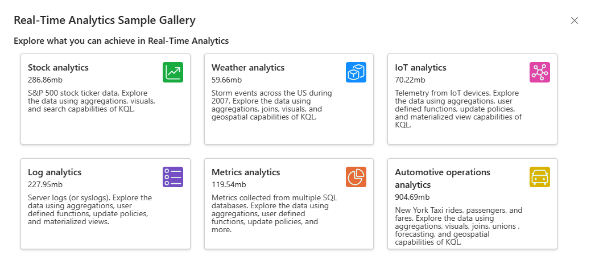
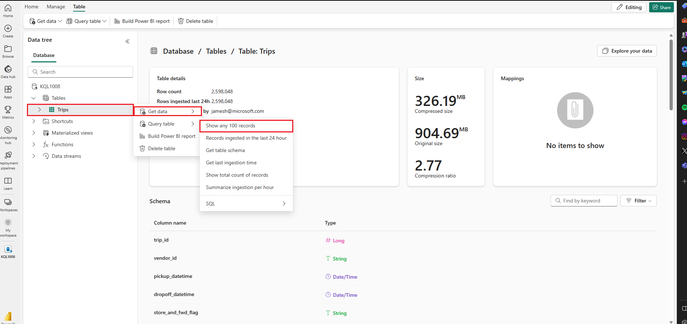
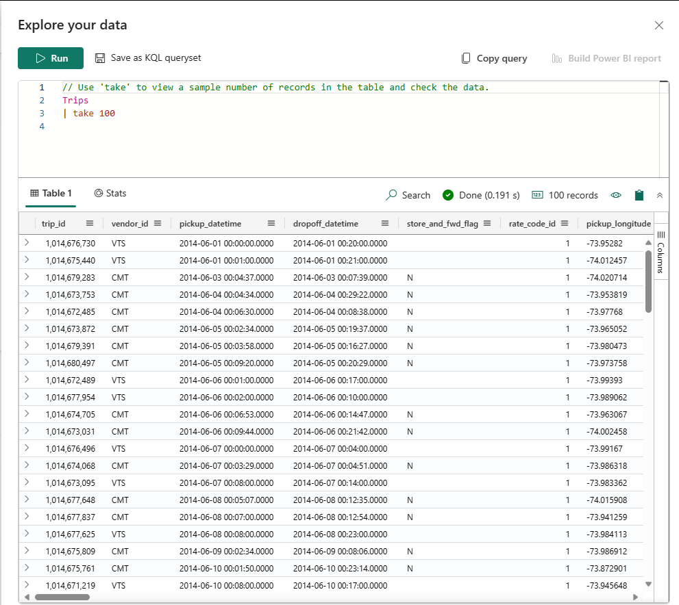

---
lab:
  title: Interroger des données dans une base de données KQL
  module: Query data from a Kusto Query database in Microsoft Fabric
---

# Bien démarrer avec l’interrogation d’une base de données Kusto dans Microsoft Fabric

KQL Queryset est un outil qui vous permet d’exécuter des requêtes, mais également de modifier et d’afficher les résultats des requêtes à partir d’une base de données KQL. Vous pouvez lier chaque onglet dans KQL Queryset à une base de données KQL différente et enregistrer vos requêtes pour une utilisation ultérieure ou les partager avec d’autres personnes pour l’analyse des données. Vous pouvez également basculer la base de données KQL pour n’importe quel onglet, ce qui vous permet de comparer les résultats de la requête à partir de diverses sources de données.

Dans ce scénario, vous jouez le rôle d’un analyste chargé d’interroger un exemple de jeu de données de métriques brutes sur des courses de taxi à NYC pour extraire des statistiques récapitulatives (profilage) des données dans l’environnement Fabric. Vous utilisez KQL pour interroger ces données et collecter des informations afin d’obtenir des insights informatifs sur les données.

Pour créer des requêtes, KQL Queryset utilise le langage Kusto Query qui est compatible avec de nombreuses fonctions SQL. Pour en savoir plus sur le [langage kusto query (KQL)](https://learn.microsoft.com/en-us/azure/data-explorer/kusto/query/?context=%2Ffabric%2Fcontext%2Fcontext).

Ce labo est d’une durée de **25** minutes environ.

> **Remarque** : Vous devez disposer d’une [licence d’essai Microsoft Fabric](https://learn.microsoft.com/fabric/get-started/fabric-trial) pour effectuer cet exercice.

## Créer un espace de travail

Avant d’utiliser des données dans Fabric, créez un espace de travail avec l’essai gratuit de Fabric activé.

1. Dans la [page d’accueil de Microsoft Fabric](https://app.fabric.microsoft.com), sélectionnez **Real-Time Intelligence**.
1. Dans la barre de menus à gauche, sélectionnez **Espaces de travail** (l’icône ressemble à &#128455;).
1. Créez un espace de travail avec le nom de votre choix et sélectionnez un mode de licence qui inclut la capacité Fabric (*Essai*, *Premium* ou *Fabric*).
1. Lorsque votre nouvel espace de travail s’ouvre, il doit être vide.

    

Dans ce labo, vous allez utiliser Real-Time Intelligence dans Fabric pour créer une base de données KQL à partir d’un exemple d’Eventstream. Real-Time Intelligence fournit à des fins pratiques un exemple de jeu de données que vous pouvez utiliser pour explorer les fonctionnalités de Real-Time Intelligence. Vous utilisez cet échantillon de données pour créer des requêtes KQL/SQL et des ensembles de requêtes qui analysent les données en temps réel et permettent d’autres utilisations dans les processus descendants.

## Créer une base de données KQL

1. Dans **Real-Time Analytics**, cochez la case **Base de données KQL**.

   

1. Vous êtes invité à donner un **Nom** à la base de données KQL

   

1. Donnez à la base de données KQL un nom dont vous vous souviendrez, comme **TaxiData**, puis cliquez sur **Créer**.

1. Dans le panneau **Détails de la base de données**, sélectionnez l’icône de crayon pour activer la disponibilité dans OneLake.

   

   Utilisez ensuite le curseur pour activer la disponibilité.

   
   
1. Sélectionnez la zone **exemple de données** dans les options ***Commencer par obtenir des données***.

   

   Finalement, dans les options d’échantillons de données, choisissez la zone **Analytique des opérations automobiles**.

   

1. Une fois le chargement des données terminé, nous pouvons vérifier le remplissage de la base de données KQL.

   

1. Une fois les données chargées, vérifiez qu’elles sont chargées dans la base de données KQL. Pour effectuer cette opération, sélectionnez les points de suspension à droite de la table, accédez à **Interroger la table** et sélectionnez **Afficher 100 enregistrements**.

    

   > **REMARQUE** : La première fois que vous effectuez cette opération, l’allocation des ressources de calcul peut prendre plusieurs secondes.


    

## Présentation du langage de requête Kusto (KQL) et de sa syntaxe

Le langage de requête Kusto (KQL) est un langage de requête utilisé pour analyser des données dans Microsoft Azure Data Explorer, qui fait partie d’Azure Fabric. KQL est conçu pour être simple et intuitif, ce qui facilite l’apprentissage et l’utilisation pour des débutants. Parallèlement, il est également hautement flexible et personnalisable, ce qui permet aux utilisateurs avancés d’effectuer des requêtes et des analyses complexes.

KQL est basé sur une syntaxe semblable à SQL, mais avec quelques différences clés. Par exemple, KQL utilise un opérateur pipe (|) au lieu d’un point-virgule (;) pour séparer les commandes, ainsi qu’un ensemble différent de fonctions et d’opérateurs pour filtrer et manipuler les données.

L’une des principales caractéristiques de KQL est sa capacité à gérer de grands volumes de données rapidement et efficacement. Cette fonctionnalité est idéale pour analyser des journaux, des données de télémétrie et d’autres types de Big Data. KQL prend également en charge un large éventail de sources de données, dont des données structurées et non structurées, ce qui en fait un outil polyvalent pour l’analyse des données.

Dans le contexte de Microsoft Fabric, KQL peut servir à interroger et à analyser des données provenant de différentes sources, telles que les journaux d’application, les métriques de performances et les événements système. Cela peut vous aider à obtenir des insights sur l’intégrité et les performances de vos applications et de votre infrastructure, mais également à identifier les problèmes et les opportunités d’optimisation.

Dans l’ensemble, KQL est un puissant et flexible langage de requête qui peut vous aider à obtenir des insights sur vos données rapidement et facilement, que vous travailliez avec Microsoft Fabric ou d’autres sources de données. Avec sa syntaxe intuitive et ses puissantes fonctionnalités, KQL vaut la peine d’être davantage exploré.

Dans ce module, nous nous concentrons sur les principes de base des requêtes sur une base de données KQL en utilisant d’abord KQL, puis T-SQL. Nous allons nous concentrer sur les éléments de base de la syntaxe T-SQL utilisés pour les requêtes incluant les éléments suivants :

Requêtes **SELECT** qui sont utilisées pour récupérer des données à partir d’une ou plusieurs tables. Vous pouvez par exemple utiliser une requête SELECT pour obtenir les noms et les salaires de tous les employés d’une entreprise.

Requêtes **WHERE** qui sont utilisées pour filtrer les données en fonction de certaines conditions. Vous pouvez par exemple utiliser une requête WHERE pour obtenir les noms des employés qui travaillent dans un service spécifique ou qui ont un salaire supérieur à un certain montant.

Requêtes **GROUP BY** qui sont utilisées pour regrouper les données par une ou plusieurs colonnes et effectuer des fonctions d’agrégation sur celles-ci. Vous pouvez par exemple utiliser une requête GROUP BY pour obtenir le salaire moyen des employés par service ou par pays.

Requêtes **ORDER BY** qui sont utilisées pour trier les données d’une ou de plusieurs colonnes dans l’ordre croissant ou décroissant. Vous pouvez par exemple utiliser une requête ORDER BY pour obtenir les noms des employés triés par salaire ou par nom de famille.

   > **AVERTISSEMENT :** Vous ne pouvez pas créer de rapports Power BI à partir des ensembles de requêtes avec **T-SQL**, car Power BI ne prend pas en charge T-SQL en tant que source de données. **Power BI ne prend en charge KQL qu’en tant que langage de requête natif pour les ensembles de requêtes**. Pour utiliser T-SQL pour interroger vos données dans Microsoft Fabric, vous devez utiliser le point de terminaison T-SQL qui émule Microsoft SQL Server et vous permet d’exécuter des requêtes T-SQL sur vos données. Le point de terminaison T-SQL présente toutefois certaines limitations et différences par rapport au SQL Server natif et ne prend pas en charge la création ou la publication de rapports dans Power BI.

> **REMARQUE** : En plus de l’approche consistant à extraire une fenêtre de requête, indiquée plus haut, vous pouvez toujours appuyer sur le bouton **Explorer vos données** dans le principal panneau de la base de données KQL...

   

## Données `SELECT` de notre exemple de jeu de données à l’aide de KQL

1. Dans cette requête, nous extrayons 100 enregistrements de la table Trajets. Nous utilisons le mot clé `take` pour demander au moteur de retourner 100 enregistrements.

    ```kusto
    
    Trips
    | take 100
    ```

    > **REMARQUE :** Le caractère trait vertical `|` est utilisé à deux fins dans KQL, notamment pour séparer des opérateurs de requête dans une instruction d’expression tabulaire. Il est également utilisé comme opérateur OR logique entre parenthèses carrées ou rondes pour indiquer que vous pouvez spécifier l’un des éléments séparés par le caractère du canal.

1. Nous pouvons être plus précis en ajoutant des attributs spécifiques que nous aimerions interroger à l’aide du mot clé `project`, puis en utilisant le mot clé `take` pour indiquer au moteur le nombre d’enregistrements à renvoyer.

    > **REMARQUE :** l’utilisation de `//` désigne les commentaires utilisés dans l’outil de requête ***Exploration de vos données*** de Microsoft Fabric.

    ```kusto
    
    // Use 'project' and 'take' to view a sample number of records in the table and check the data.
    Trips 
    | project vendor_id, trip_distance
    | take 10
    ```

1. Une autre pratique courante dans l’analyse consiste à renommer des colonnes dans notre ensemble de requêtes pour les rendre plus conviviales. Pour ce faire, utilisez le nouveau nom de colonne, suivi du signe égal et de la colonne à renommer.

    ```kusto
    
    Trips 
    | project vendor_id, ["Trip Distance"] = trip_distance
    | take 10
    ```

1. Nous pouvons également résumer les trajets pour voir le nombre de kilomètres parcourus :

    ```kusto
    
    Trips
    | summarize ["Total Trip Distance"] = sum(trip_distance)
    ```

## Données `GROUP BY` de notre exemple de jeu de données à l’aide de KQL

1. Nous pouvons ensuite `group by` l’emplacement de prise en charge que nous effectuons avec l’opérateur `summarize`. Nous pouvons également utiliser l’opérateur `project` qui nous permet de sélectionner et de renommer les colonnes que vous souhaitez inclure dans votre sortie. Dans ce cas, nous regroupons par quartier, au sein du système Taxi de NY, pour fournir à nos utilisateurs la distance totale parcourue à partir de chaque quartier.

```kusto

Trips
| summarize ["Total Trip Distance"] = sum(trip_distance) by pickup_boroname
| project Borough = pickup_boroname, ["Total Trip Distance"]
```

1. Dans ce cas, nous avons une valeur vide, ce qui n’est jamais bon pour les analyses, et nous pouvons utiliser la fonction `case`, ainsi que les fonctions `isempty` et `isnull`, pour les classer dans une catégorie ***Non identifié*** pour le suivi.

```kusto

Trips
| summarize ["Total Trip Distance"] = sum(trip_distance) by pickup_boroname
| project Borough = case(isempty(pickup_boroname) or isnull(pickup_boroname), "Unidentified", pickup_boroname), ["Total Trip Distance"]
```

## Données `ORDER BY` de notre exemple de jeu de données à l’aide de KQL

Pour donner plus de sens à nos données, nous les trions généralement par colonne, et ce processus est effectué dans KQL avec un opérateur `sort by` ou `order by` qui se comporte de la même façon.
 
```kusto

// using the sort by operators
Trips
| summarize ["Total Trip Distance"] = sum(trip_distance) by pickup_boroname
| project Borough = case(isempty(pickup_boroname) or isnull(pickup_boroname), "Unidentified", pickup_boroname), ["Total Trip Distance"]
| sort by Borough asc 

// order by operator has the same result as sort by
Trips
| summarize ["Total Trip Distance"] = sum(trip_distance) by pickup_boroname
| project Borough = case(isempty(pickup_boroname) or isnull(pickup_boroname), "Unidentified", pickup_boroname), ["Total Trip Distance"]
| sort by Borough asc 
```

## Clause `WHERE` pour filtrer les données dans notre exemple de requête KQL

Contrairement à SQL, notre clause `WHERE` est immédiatement appelée dans notre requête KQL. Nous pouvons toujours utiliser les opérateurs logiques `and` et `or` au sein de la clause « where » qui prennent la valeur « true » ou « false » par rapport à la table et peuvent être une expression simple ou complexe pouvant impliquer plusieurs colonnes, opérateurs et fonctions.

```kusto

// let's filter our dataset immediately from the source by applying a filter directly after the table.
Trips
| where pickup_boroname == "Manhattan"
| summarize ["Total Trip Distance"] = sum(trip_distance) by pickup_boroname
| project Borough = case(isempty(pickup_boroname) or isnull(pickup_boroname), "Unidentified", pickup_boroname), ["Total Trip Distance"]
| sort by Borough asc

```

## Utiliser T-SQL pour interroger des informations sur le résumé

La base de données KQL ne prend pas en charge T-SQL de manière native, mais elle fournit un point de terminaison T-SQL qui émule Microsoft SQL Server et vous permet d’exécuter des requêtes T-SQL sur vos données. Le point de terminaison T-SQL présente toutefois certaines limitations et différences par rapport au SQL Server natif. Il ne prend par exemple pas en charge la création, la modification ou la suppression de tables, ni l’insertion, la mise à jour ou la suppression de données. Il ne prend pas non plus en charge certaines fonctions et syntaxe T-SQL non compatibles avec KQL. Il a été créé pour permettre aux systèmes (ne prenant pas en charge KQL) d’utiliser T-SQL pour interroger les données au sein d’une base de données KQL. Il est donc recommandé d’utiliser KQL comme langage de requête principal pour une base de données KQL, car il offre davantage de fonctionnalités et de performances que T-SQL. Vous pouvez également utiliser certaines fonctions SQL prises en charge par KQL, telles que count, sum, avg, min, max, etc. 

## Données `SELECT` de notre exemple de jeu de données à l’aide de T-SQL

1. Dans cette requête, nous extrayons les 100 premiers enregistrements de la table `Trips` en utilisant la clause `TOP`. 

    ```sql
    // We can use the TOP clause to limit the number of records returned
    
    SELECT TOP 100 * from Trips
    ```

1. Si vous utilisez le `//`, qui est un commentaire dans l’outil ***Explorer vos données*** de la base de données KQL, vous ne pouvez pas le mettre en surbrillance lors de l’exécution de requêtes T-SQL. Vous devez plutôt utiliser la notation de commentaires SQL standard `--`. ce trait d’union double indique également au moteur KQL d’attendre T-SQL dans Azure Data Explorer.

    ```sql
    -- instead of using the 'project' and 'take' keywords we simply use a standard SQL Query
    SELECT TOP 10 vendor_id, trip_distance
    FROM Trips
    ```

1. Une fois de plus, vous pouvez voir que les fonctionnalités T-SQL standard fonctionnent parfaitement avec la requête dans laquelle nous renommons trip_distance en un nom plus convivial.

    ```sql
    
    -- No need to use the 'project' or 'take' operators as standard T-SQL Works
    SELECT TOP 10 vendor_id, trip_distance as [Trip Distance]
    from Trips
    ```

1. Nous pouvons également résumer les trajets pour voir le nombre de kilomètres parcourus :

    ```sql
    Select sum(trip_distance) as [Total Trip Distance]
    from Trips
    ```
     >**REMARQUE :** l’utilisation des guillemets n’est pas nécessaire dans T-SQL par rapport à la requête KQL. Notez également que les commandes `summarize` et `sort by` ne sont pas disponibles dans T-SQL.

## Données `GROUP BY` de notre exemple de jeu de données à l’aide de T-SQL

1. Nous pouvons ensuite `group by` l’emplacement de prise en charge que nous effectuons avec l’opérateur `GROUP BY`. Nous pouvons également utiliser l’opérateur `AS` qui nous permet de sélectionner et de renommer les colonnes que vous souhaitez inclure dans votre sortie. Dans ce cas, nous regroupons par quartier, au sein du système Taxi de NY, pour fournir à nos utilisateurs la distance totale parcourue à partir de chaque quartier.

    ```sql
    SELECT pickup_boroname AS Borough, Sum(trip_distance) AS [Total Trip Distance]
    FROM Trips
    GROUP BY pickup_boroname
    ```

1. Dans ce cas, nous avons une valeur vide, ce qui n’est jamais bon pour les analyses, et nous pouvons utiliser la fonction `CASE`, ainsi que la fonction `IS NULL` et la valeur vide `''` pour les classer dans une catégorie ***Non identifié*** pour le suivi. 

    ```sql
    
    SELECT CASE
             WHEN pickup_boroname IS NULL OR pickup_boroname = '' THEN 'Unidentified'
             ELSE pickup_boroname
           END AS Borough,
           SUM(trip_distance) AS [Total Trip Distance]
    FROM Trips
    GROUP BY CASE
               WHEN pickup_boroname IS NULL OR pickup_boroname = '' THEN 'Unidentified'
               ELSE pickup_boroname
             END;
    ```

## Données `ORDER BY` de notre exemple de jeu de données à l’aide de T-SQL

1. Pour mieux comprendre nos données, nous les trions généralement par colonne, et ce processus est effectué dans T-SQL avec un opérateur `ORDER BY`. Il n’existe aucun opérateur ***TRIER PAR*** dans T-SQL
 
    ```sql
    -- Group by pickup_boroname and calculate the summary statistics of trip_distance
    SELECT CASE
             WHEN pickup_boroname IS NULL OR pickup_boroname = '' THEN 'unidentified'
             ELSE pickup_boroname
           END AS Borough,
           SUM(trip_distance) AS [Total Trip Distance]
    FROM Trips
    GROUP BY CASE
               WHEN pickup_boroname IS NULL OR pickup_boroname = '' THEN 'unidentified'
               ELSE pickup_boroname
             END
    -- Add an ORDER BY clause to sort by Borough in ascending order
    ORDER BY Borough ASC;
    ```
    ## Clause `WHERE` pour filtrer les données dans notre exemple de requête T-KQL
    
1. Contrairement à KQL, notre clause `WHERE` ira à la fin de l’instruction T-SQL. Toutefois, dans ce cas, nous avons une clause `GROUP BY`, qui nous oblige à utiliser l’instruction `HAVING` et nous utilisons le nouveau nom de la colonne, dans ce cas **Borough** (Quartier) comme nom de colonne à partir de laquelle filtrer.

    ```sql
    -- Group by pickup_boroname and calculate the summary statistics of trip_distance
    SELECT CASE
             WHEN pickup_boroname IS NULL OR pickup_boroname = '' THEN 'unidentified'
             ELSE pickup_boroname
           END AS Borough,
           SUM(trip_distance) AS [Total Trip Distance]
    FROM Trips
    GROUP BY CASE
               WHEN pickup_boroname IS NULL OR pickup_boroname = '' THEN 'unidentified'
               ELSE pickup_boroname
             END
    -- Add a having clause due to the GROUP BY statement
    HAVING Borough = 'Manhattan'
    -- Add an ORDER BY clause to sort by Borough in ascending order
    ORDER BY Borough ASC;
    
    ```

## Nettoyer les ressources

Dans cet exercice, vous avez créé une base de données KQL et configuré un exemple de jeu de données pour un interrogation. Après cela, vous avez interrogé les données à l’aide de KQL et de SQL. Lorsque vous avez terminé d’explorer votre base de données KQL, vous pouvez supprimer l’espace de travail que vous avez créé pour cet exercice.
1. Dans la barre de gauche, sélectionnez l’**icône** de votre espace de travail.
2. Dans le menu ... de la barre d’outils, sélectionnez **Paramètres des espaces de travail**.
3. Dans la section **Général**, sélectionnez **Supprimer cet espace de travail**.
