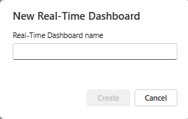
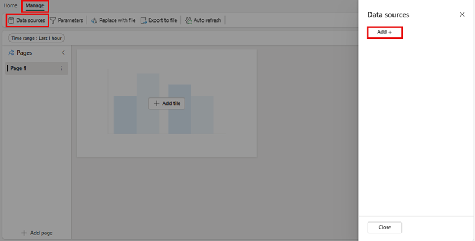
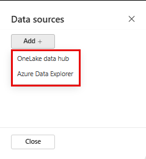
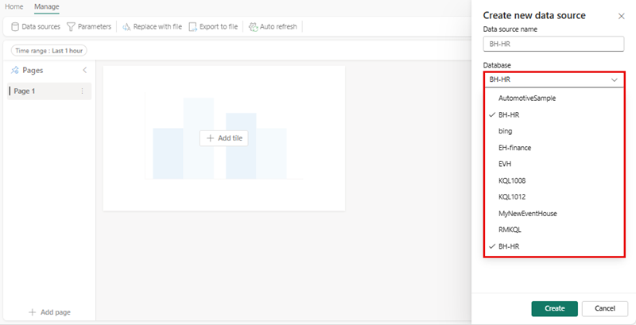
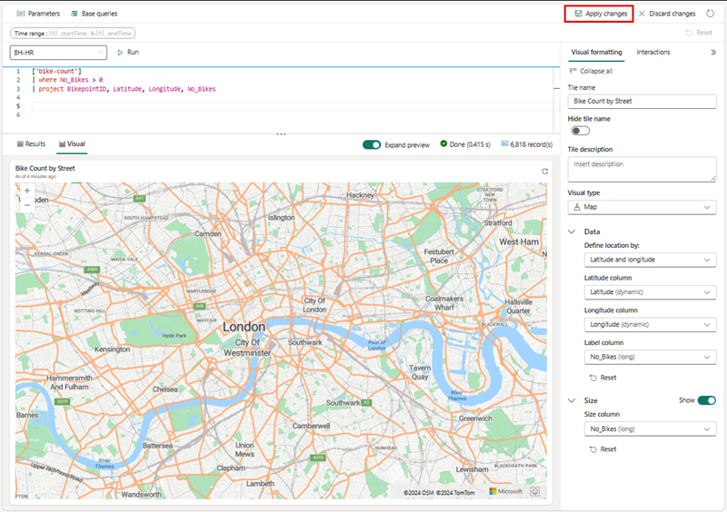

---
lab:
  title: Tableaux de bord en temps réel dans Microsoft Fabric
  module: Get Started with Real-Time Dashboards in Microsoft Fabric
---

# Bien démarrer avec les tableaux de bord en temps réel dans Microsoft Fabric

Les tableaux de bord en temps réel vous permettent de glaner des insights à partir de Microsoft Fabric en utilisant Langage de requête Kusto (KQL) pour récupérer des données structurées et non structurées et les restituer dans des graphiques, des nuages de points, des tables, etc. dans des panneaux qui permettent de lier des segments similaires à ceux de Power BI. 

Ce labo est d’une durée de **25** minutes environ.

> **Remarque** : vous devez disposer d’un [essai de Microsoft Fabric](https://learn.microsoft.com/fabric/get-started/fabric-trial) pour effectuer cet exercice.

## Créer un espace de travail

Avant d’utiliser des données dans Fabric, créez un espace de travail avec l’essai gratuit de Fabric activé.

1. Dans la [page d’accueil de Microsoft Fabric](https://app.fabric.microsoft.com), sélectionnez **Real-Time Intelligence**.
1. Dans la barre de menus à gauche, sélectionnez **Espaces de travail** (l’icône ressemble à &#128455;).
1. Créez un nouvel espace de travail avec le nom de votre choix et sélectionnez un mode de licence qui inclut la capacité Fabric (*Essai*, *Premium* ou *Fabric*). Vous pouvez également utiliser un espace de travail existant pour créer un tableau de bord en temps réel.
1. Lorsque votre nouvel espace de travail s’ouvre, il doit être vide.

    

Dans ce labo, vous utilisez Real-Time Intelligence dans Fabric pour créer un tableau de bord en temps réel. Real-Time Intelligence fournit à des fins pratiques un exemple de jeu de données que vous pouvez utiliser pour explorer les fonctionnalités de Real-Time Intelligence. Vous utilisez cet exemple de données pour créer des requêtes et des ensembles de requêtes KQL | SQL qui analysent des données en temps réel et permettent d’autres utilisations dans des processus en aval.

## Créer un tableau de bord en temps réel

1. Dans **Real-Time Intelligence**, cochez la case **Tableau de bord en temps réel**.

   

2. Vous êtes invité à attribuer un **Nom** au tableau de bord en temps réel.

   

3. Donnez au tableau de bord en temps réel un nom facile à retenir, par exemple un nom basé sur votre source principale, puis appuyez sur **Créer**.

4. Dans le panneau **Détails de la base de données**, sélectionnez l’icône de crayon pour activer la disponibilité dans OneLake.

   [ ](./Images/real-time-dashboard-details-large.png#lightbox)

## Ajouter une source de données

Les sources de données servent de références réutilisables à des bases de données ou à des requêtes spécifiques dans le même espace de travail que le tableau de bord en temps réel, ce qui permet à différentes vignettes d’utiliser des sources de données distinctes pour leurs besoins en données.

1. Sélectionnez l’onglet **Gérer**, puis **Nouvelle source de données** dans la ***barre de menus***.
1. Sélectionnez le bouton **+ Ajouter** dans le volet **Sources de données**.

    [  ](./Images/add-data-source-to-real-time-dashboard-large.png#lightbox)

1. Choisissez l’une des deux options principales : **Hub de données OneLake** ou **Azure Data Explorer**.

    

1. Choisissez la **source de données** qui répond aux besoins de votre entreprise, puis sélectionnez le bouton **Connecter**.

    [  ](./Images/select-onelake-data-hub-large.png#lightbox)

    > **Remarque** Une fois que vous êtes connecté à une source de données, vous pouvez confirmer et créer des sources de données supplémentaires à l’emplacement sélectionné.

1. Confirmez votre connexion à la **source de données** dans le volet **Créer une source de données**, puis sélectionnez **Créer**.

    [  ](./Images/conected-now-create-datasource-large.png#lightbox)

1. À ce stade, sélectionnez les points de suspension (**...**) à droite de **Page n**, puis sélectionnez **Renommer la page** pour choisir un nom reflétant l’utilisation de la vignette.
1. Sélectionnez **+ Ajouter une vignette**.

    [  ](./Images/rename-page-add-tile-large.png#lightbox)

1. Vous êtes redirigé vers le **volet de requête de vignette** où vous pouvez ajouter des paramètres et extraire des requêtes de base pour prendre en charge votre vignette. 

    [  ](./Images/write-query-for-tile-large.png#lightbox)

    > **Remarque** Vous pouvez ajouter une nouvelle source de données dans la fenêtre déroulante de la même fenêtre. Cette source peut se trouver dans votre espace de travail personnel ou dans tout espace de travail dans lequel vous pouvez disposer d’une autre base de données KQL stockée dans un Eventhouse auquel vous avez accès.

## Écrire des requêtes

Les vignettes de tableau de bord en temps réel utilisent des extraits de code en KQL (langage de requête Kusto) pour récupérer les données et afficher des visuels. Chaque vignette/requête peut prendre en charge un seul visuel.

1. Dans chaque vignette, vous pouvez écrire une requête. Vous pouvez également coller des requêtes à partir de **Copilot** pour les épingler à une vignette, nouvelle ou existante, puis les modifier pour répondre à vos besoins. À partir d’une simple requête, nous pouvons créer une visualisation de carte qui utilise les tailles sur la carte en fonction du nombre de vélos.

```kusto

['Bike-count']
BikepointID, Latitude, Longitude, No_Bikes

```

## Créer des visualisations

Quand vous êtes satisfait de la visualisation, sélectionnez simplement **Appliquer les modifications**, puis ajoutez d’autres visualisations pour prendre en charge votre tableau de bord en temps réel ou effectuez des étapes supplémentaires pour, par exemple, définir des **Paramètres** ou des **Planifications**.

   [  ](./Images/create-visual-in-tiles-large.png#lightbox)

Une fois les modifications appliquées, les données apparaissent. Vous pouvez alors effectuer des ajustements pour que vos utilisateurs puissent plus facilement lire et comprendre les données.

   [  ](./Images/first-published-visual-large.png#lightbox)

Vous pouvez continuer à créer des **vignettes** comprenant des informations sur les tables et les visualisations pour rendre les données plus accessibles à votre communauté d’utilisateurs. Vous pouvez également, comme indiqué précédemment, ajouter une ou plusieurs **pages** ainsi qu’une ou plusieurs **nouvelles sources de données**. Nous allons à présent nous pencher sur l’ajout d’un paramètre pour faciliter la navigation et réduire la quantité d’informations présentées à un utilisateur.

## Ajouter des paramètres
Les paramètres améliorent l’efficacité du rendu d’un tableau de bord et permettent l’utilisation de valeurs de filtre dès la première phase du processus de requête. L’inclusion de paramètres dans la requête liée à vos vignettes active des fonctionnalités de filtrage. Vous pouvez utiliser un paramètre à l’échelle d’un tableau de bord et plusieurs paramètres pour filtrer les données représentées dans les visualisations sous-jacentes, y compris des tables.

La création d’un paramètre est un processus simple : 

1. Sélectionnez le bouton Nouveaux paramètres dans le menu supérieur. Le volet Paramètres s’ouvre.
1. Sélectionnez le bouton + Ajouter en haut du panneau droit.

    [  ](./Images/add-new-parameter-large.png#lightbox)

1. Renseignez les propriétés pertinentes pour votre paramètre.

    [  ](./Images/configure-parameter-large.png#lightbox)

1. L’une des fonctionnalités les plus importantes d’un paramètre est la possibilité d’**ajouter une requête** pour proposer uniquement à l’utilisateur des options adaptées aux informations sous-jacentes.

    

1. Sélectionnez Terminé pour créer le paramètre.

    [  ](./Images/complete-parameter-settings-large.png#lightbox)

### Propriétés de paramètre

| Champ            | Description |
|------------------|-------------|
| **Étiquette**        | Nom du paramètre affiché sur le tableau de bord ou la carte de modification. |
| **Type de paramètre** | Un des types suivants : <ul><li>Sélection unique : une seule valeur peut être sélectionnée dans le filtre comme entrée du paramètre.</li><li>Sélection multiple : une ou plusieurs valeurs peuvent être sélectionnées dans le filtre comme entrées du paramètre.</li><li>Intervalle de temps : permet de créer des paramètres supplémentaires pour filtrer des requêtes et des tableaux de bord en fonction du temps. Chaque tableau de bord a un sélecteur d’intervalle de temps par défaut.</li><li>Texte libre : permet aux utilisateurs de taper ou de coller une valeur dans le champ de filtre sans valeurs préremplies, en conservant les valeurs récentes utilisées.</li></ul> |
| **Description**  | Description optionnelle du paramètre. |
| **Nom de la variable** | Nom utilisé pour le paramètre dans la requête. |
| **Type de données**    | Type de données que représentent les valeurs de paramètre. |
| **Afficher sur les lignes** | Pages dans lesquelles le paramètre est affiché, avec une option permettant de sélectionner toutes les pages. |
| **Source**       | Origine des valeurs de paramètre, avec au choix : <ul><li>Valeurs fixes : valeurs de filtre statiques entrées manuellement.</li><li>Requête : valeurs dynamiques introduites à l’aide d’une requête KQL.</li></ul> |
| **Ajouter une valeur « Tout sélectionner »** | Applicable aux types de paramètres à sélection unique et multiple, cette option récupère les données pour toutes les valeurs de paramètre et doit être intégrée à la requête pour des raisons fonctionnelles. |
| **Valeur par défaut** | Valeur par défaut du filtre, qui est définie lors du rendu initial du tableau de bord. |

6. Veillez à ajouter le paramètre à chacune des requêtes dans les vignettes, puis sélectionnez **Appliquer les modifications**.

**Avant la requête KQL**
```kusto
//Add the street parameter to each tile's query
['bike-count']
| where No_Bikes > 0
| project BikepointID, Latitude, Longitude, No_Bikes

```

**Après la requête KQL**
```kusto
//Add the street parameter to each tile's query
['bike-count']
| where No_Bikes > 0 and Street == street
| project BikepointID, Latitude, Longitude, No_Bikes

```
   [  ](./Images/update-each-query-large.png#lightbox)

## Activer l’actualisation automatique

L’actualisation automatique est une fonctionnalité qui permet de mettre à jour automatiquement les données du tableau de bord sans avoir besoin de recharger manuellement les pages ou d’appuyer sur un bouton d’actualisation. La fréquence d’actualisation automatique initiale est configurable par un éditeur de base de données. Les éditeurs et les viewers peuvent modifier le taux d’actualisation automatique réel lors de l’affichage du tableau de bord. Les éditeurs de base de données peuvent établir un taux d’actualisation minimal pour atténuer toute charge excessive sur le cluster. Une fois ce taux minimum défini, les utilisateurs de la base de données ne peuvent pas sélectionner un taux d’actualisation inférieur au minimum spécifié. De cette façon, les performances du système sont conservées sans surcharger les ressources.

1. Sélectionnez l’onglet Gérer > Actualisation automatique.

    [  ](./Images/enable-auto-refresh-large.png#lightbox)

1. Activez ou désactivez l’option pour activer l’actualisation automatique.
1. Sélectionnez des valeurs pour Intervalle de temps minimal et Fréquence d’actualisation par défaut.
1. Sélectionnez Appliquer et enregistrez le tableau de bord.

    [  ](./Images/enable-and-configure-refresh-rate-large.png#lightbox)

## Nettoyer les ressources

Dans cet exercice, vous avez créé une base de données KQL et configuré un exemple de jeu de données pour un interrogation. Après cela, vous avez interrogé les données à l’aide de KQL et de SQL. Lorsque vous avez terminé d’explorer votre base de données KQL, vous pouvez supprimer l’espace de travail que vous avez créé pour cet exercice.
1. Dans la barre de gauche, sélectionnez l’**icône** de votre espace de travail.
2. Dans le menu ... de la barre d’outils, sélectionnez **Paramètres des espaces de travail**.
3. Dans la section **Général**, sélectionnez **Supprimer cet espace de travail**.

