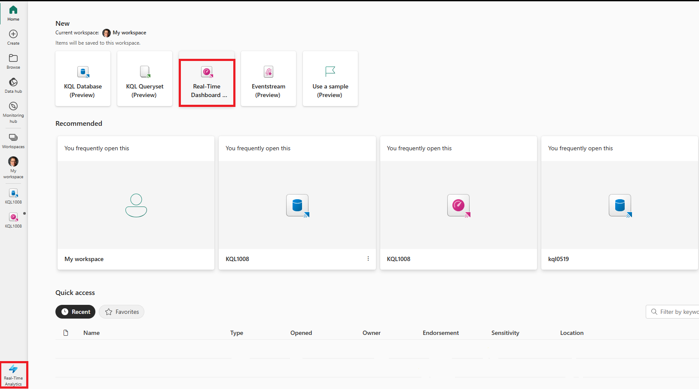

## ***BROUILLON DE TRAVAIL**
---
lab:
  title: Tableaux de bord en temps réel
  module: Query data from a Kusto Query database in Microsoft Fabric
---
# Bien démarrer avec l’interrogation d’une base de données Kusto dans Microsoft Fabric
Les tableaux de bord en temps réel vous permettent de glaner des insights à partir de Microsoft Fabric en utilisant Langage de requête Kusto (KQL) pour récupérer des données structurées et non structurées et les restituer dans des graphiques, des nuages de points, des tables, etc. dans des panneaux qui permettent de lier des segments similaires à ceux de Power BI. 

Ce labo est d’une durée de **25** minutes environ.

## Créer un espace de travail

Avant d’utiliser des données dans Fabric, créez un espace de travail avec l’essai gratuit de Fabric activé.

1. Connectez-vous à [Microsoft Fabric](https://app.fabric.microsoft.com) à l’adresse `https://app.fabric.microsoft.com` et sélectionnez **Power BI**.
2. Dans la barre de menus à gauche, sélectionnez **Espaces de travail** (l’icône ressemble à &#128455;).
3. Créez un espace de travail avec le nom de votre choix et sélectionnez un mode de licence qui inclut la capacité Fabric (*Essai*, *Premium* ou *Fabric*).
4. Lorsque votre nouvel espace de travail s’ouvre, il doit être vide, comme illustré ici :

    

Dans ce labo, vous utilisez l’Analyse en temps réel (RTA) dans Fabric pour créer une base de données KQL à partir d’un exemple d’eventstream. L’Analyse en temps réel fournit facilement un exemple de jeu de données à utiliser pour explorer les fonctionnalités de l’analyse en temps réel (RTA). Vous utilisez cet exemple de données pour créer des requêtes et des ensembles de requêtes KQL | SQL qui analysent des données en temps réel et permettent d’autres utilisations dans des processus en aval.

## Créer une base de données KQL

1. Dans **Real-Time Analytics**, cochez la case **Base de données KQL**.

   

2. Vous êtes invité à donner un **Nom** à la base de données KQL

   

3. Donnez à la base de données KQL un nom dont vous vous souviendrez, par exemple **MyStockData**, puis appuyez sur **Créer**.

4. Dans le panneau **Détails de la base de données**, sélectionnez l’icône de crayon pour activer la disponibilité dans OneLake.

   

5. Sélectionnez la zone **exemple de données** dans les options ***Commencer par obtenir des données***.
 
   

6. Choisissez la zone **Analytique des métriques automobile** dans les options des exemples de données.

   

7. Une fois le chargement des données terminé, nous pouvons vérifier le remplissage de la base de données KQL.

   

7. Une fois les données chargées, vérifiez qu’elles sont chargées dans la base de données KQL. Pour effectuer cette opération, sélectionnez les points de suspension à droite de la table, accédez à **Interroger la table** et sélectionnez **Afficher 100 enregistrements**.

    

   > **REMARQUE** : La première fois que vous effectuez cette opération, l’allocation des ressources de calcul peut prendre plusieurs secondes.

    


## Scénario
Dans ce scénario, vous allez créer un tableau de bord en temps réel, basé sur des exemples de données fournis par Microsoft Fabric, qui vous permettra d’afficher des données dans diverses méthodes, de créer une variable et de l’utiliser pour lier les panneaux du tableau de bord ensemble afin d’obtenir des informations plus approfondies sur ce qui se passe dans le ou les systèmes sources. Dans ce module, nous utilisons le jeu de données NY Taxi pour examiner les détails actuels des voyages par arrondissement et autres.

1. Accédez à **Analyse en temps réel**, puis sélectionnez **Tableau de bord en temps réel** dans la page Fabric principale.

    

1. Appuyez sur le bouton **Ajouter une nouvelle vignette**.

```kusto

Trips
| summarize ["Total Trip Distance"] = sum(trip_distance) by pickup_boroname
| project Borough = case(isempty(pickup_boroname) or isnull(pickup_boroname), "Unidentified", pickup_boroname), ["Total Trip Distance"]
| sort by Borough asc 

```
3. Appuyez sur le bouton Exécuter et vérifiez que votre requête ne contient aucune erreur.
4. Sur le côté droit du panneau, sélectionnez l’onglet **Mise en forme visuelle** et renseignez le ***Nom de la vignette*** et le ***Type de visuel***.

   

