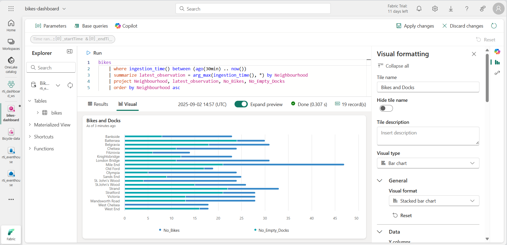
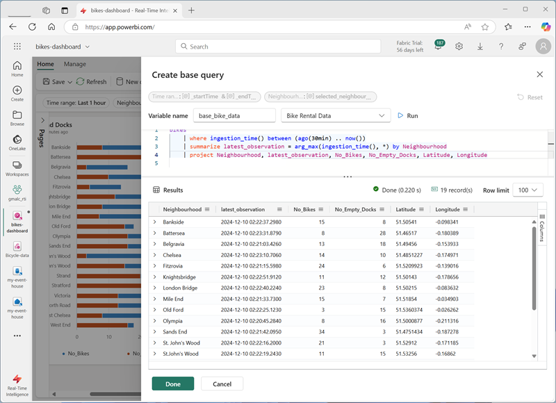

---
lab:
  title: "Bien démarrer avec les tableaux de bord en temps réel dans Microsoft\_Fabric"
  module: Get started with Real-Time Dashboards in Microsoft Fabric
---

# Bien démarrer avec les tableaux de bord en temps réel dans Microsoft Fabric

Les tableaux de bord en temps réel dans Microsoft Fabric vous permettent de visualiser et d’explorer les données de streaming à l’aide du Langage de requête Kusto (KQL).  Dans cet exercice, vous allez découvrir comment créer et utiliser un tableau de bord en temps réel basé sur une source de données en temps réel.

Ce labo est d’une durée de **25** minutes environ.

> **Remarque** : pour effectuer cet exercice, vous avez besoin d’un [locataire Microsoft Fabric](https://learn.microsoft.com/fabric/get-started/fabric-trial).

## Créer un espace de travail

Avant d’utiliser des données dans Fabric, vous devez créer un espace de travail dans un locataire avec la fonctionnalité Fabric activée.

1. Accédez à la [page d’accueil de Microsoft Fabric](https://app.fabric.microsoft.com/home?experience=fabric) sur `https://app.fabric.microsoft.com/home?experience=fabric` dans un navigateur et connectez-vous avec vos informations d’identification Fabric.
1. Dans la barre de menus à gauche, sélectionnez **Espaces de travail** (l’icône ressemble à &#128455;).
1. Créez un espace de travail avec le nom de votre choix et sélectionnez un mode de licence qui inclut la capacité Fabric (*Essai*, *Premium* ou *Fabric*).
1. Lorsque votre nouvel espace de travail s’ouvre, il doit être vide.

    

## Créer un eventhouse

Maintenant que vous disposez d’un espace de travail, vous pouvez commencer à créer les éléments Fabric dont vous aurez besoin pour votre solution d’intelligence en temps réel. Nous allons commencer par créer un eventhouse.

1. Sélectionnez **Créer** dans la barre de menus de gauche. Dans la page *Nouveau*, sous la section *Real-Time Intelligence*, sélectionnez **Eventhouse**. Donnez-lui un nom unique de votre choix.

    >**Note** : si l’option **Créer** n’est pas épinglée à la barre latérale, vous devez d’abord sélectionner l’option avec des points de suspension (**...**).

1. Fermez toutes les invites ou conseils affichés jusqu’à ce que le nouvel eventhouse vide soit visible :

    

1. Dans le volet de gauche, notez que votre eventhouse contient une base de données KQL portant le même nom que l’eventhouse.
1. Sélectionnez la base de données KQL pour l’afficher.

## Créer un flux d’événements

Actuellement, il n’existe aucune table dans la base de données. Nous allons utiliser un eventstream pour charger des données d’une source en temps réel dans une table.

1. Dans la page principale de votre base de données KQL, sélectionnez **Obtenir des données**.
2. Pour la source de données, sélectionnez **Eventstream** > **Nouvel evenstream**. Nommez l’eventstream `Bicycle-data`.

    

    La création de votre flux d’événements dans l’espace de travail ne prend que quelques instants. Une fois l’opération effectuée, vous êtes automatiquement redirigé afin de sélectionner une source de données pour votre eventstream.

1. Sélectionnez **Utiliser un exemple de données**.
1. Nommez la source `Bicycles` et sélectionnez **Vélos** comme exemple de données.

    Votre flux sera mappé et sera automatiquement affiché sur le **canevas d’eventstream**.

   

1. Dans la liste déroulante **Ajouter une destination**, sélectionnez **Eventhouse**.
1. Dans le volet **Eventhouse**, configurez les options suivantes.
   - **Mode d’ingestion des données :** traitement des événements avant l’ingestion
   - **Nom de la destination :**`bikes-table`
   - **Espace de travail :***sélectionnez l’espace de travail que vous avez créé au début de cet exercice.*
   - **Eventhouse** : *sélectionnez votre eventhouse*
   - **Base de données KQL :***sélectionnez votre base de données KQL*
   - **Table de destination :** créez une table nommée `bikes`
   - **Format de données d’entrée :** JSON

   

1. Dans le volet **Eventhouse**, sélectionnez **Enregistrer**. 
1. Connectez la sortie du nœud **Bicycles-data** au nœud **bikes-table**, puis sélectionnez **Publier**.
1. Attendez environ une minute que la destination des données devienne active. Sélectionnez ensuite le nœud **bike-table** dans le canevas de conception et affichez le volet **Aperçu des données** en dessous pour afficher les données les plus récentes qui ont été ingérées :

   

1. Patientez quelques minutes, puis utilisez le bouton **Actualiser** pour actualiser le volet **Aperçu des données**. Le flux s’exécutant en continu, de nouvelles données ont peut-être été ajoutées à la table.

## Créer des tableaux de bord en temps réel

Maintenant que vous disposez d’un flux de données en temps réel chargé dans une table dans l’eventhouse, vous pouvez le visualiser avec un tableau de bord en temps réel.

1. Sélectionnez **Créer** dans la barre de menus de gauche. Dans la page *Nouveau*, sous la section *Inteligence en temps réel*, sélectionnez **Tableau de bord en temps réel** et nommez-le `bikes-dashboard`.

    >**Note** : si l’option **Créer** n’est pas épinglée à la barre latérale, vous devez d’abord sélectionner l’option avec des points de suspension (**...**). 

    Un nouveau tableau de bord vide est créé.


    

1. Dans la barre d’outils, sélectionnez **Nouvelle source de données**, puis sélectionnez **Eventhouse/Base de données KQL**. Sélectionnez ensuite votre eventhouse et créez une source de données avec les paramètres suivants :
    - **Nom d’affichage** : `Bike Rental Data`
    - **Base de données** : *base de données par défaut dans votre eventhouse.*
    - **Passthrough d’identité** : *sélectionné*

1. Sélectionnez **Ajouter**.
1. Dans le canevas de conception du tableau de bord, sélectionnez **Ajouter une vignette**.
1. Dans l’éditeur de requête, vérifiez que la source **Données de location de vélos** est sélectionnée et entrez le code KQL suivant :

    ```kql
    bikes
        | where ingestion_time() between (ago(30min) .. now())
        | summarize latest_observation = arg_max(ingestion_time(), *) by Neighbourhood
        | project Neighbourhood, latest_observation, No_Bikes, No_Empty_Docks
        | order by Neighbourhood asc
    ```

1. Exécutez la requête, qui indique le nombre de vélos et de stations de vélos vides observés dans chaque quartier au cours des 30 dernières minutes.
1. Appliquez les modifications pour afficher les données affichées dans une table de la vignette sur le tableau de bord.

   

1. Dans la vignette, sélectionnez l’icône **Modifier** (qui ressemble à un crayon). Ensuite, dans le volet **Mise en forme des visuels**, définissez les propriétés suivantes :
    - **Nom de la vignette** : Vélos et stations
    - **Type de visuel** : graphique à barres
    - **Format visuel** : graphique à barres empilées
    - **Colonnes Y** : No_Bikes, No-Empty_Docks
    - **Colonne X** : Quartier
    - **Colonnes de série** : infer
    - **Emplacement de la légende** : bas

    Le temps modifié doit ressembler à ceci :

   

1. Appliquez les modifications, puis redimensionnez la vignette pour qu’elle occupe toute la hauteur à gauche du tableau de bord.

1. Dans la barre d’outils, sélectionnez **Nouvelle vignette**.
1. Dans l’éditeur de requête, vérifiez que la source **Données de location de vélos** est sélectionnée et entrez le code KQL suivant :

    ```kql
    bikes
        | where ingestion_time() between (ago(30min) .. now())
        | summarize latest_observation = arg_max(ingestion_time(), *) by Neighbourhood
        | project Neighbourhood, latest_observation, Latitude, Longitude, No_Bikes
        | order by Neighbourhood asc
    ```

1. Exécutez la requête, qui indique l’emplacement et le nombre de vélos observés dans chaque quartier au cours des 30 dernières minutes.
1. Appliquez les modifications pour afficher les données affichées dans une table de la vignette sur le tableau de bord.
1. Dans la vignette, sélectionnez l’icône **Modifier** (qui ressemble à un crayon). Ensuite, dans le volet **Mise en forme des visuels**, définissez les propriétés suivantes :
    - **Nom de la vignette** : Emplacements de vélos
    - **Type de visuel** : carte
    - **Définir l’emplacement par** : latitude et longitude
    - **Colonne de latitude** : latitude
    - **Colonne de longitude** : longitude
    - **Colonne d’étiquette** : Quartier
    - **Taille** : Afficher
    - **Colonne de taille** : No_Bikes

1. Appliquez les modifications, puis redimensionnez la vignette de carte pour remplir le côté droit de l’espace disponible sur le tableau de bord :

   

## Créer une requête de base

Votre tableau de bord contient deux visuels basés sur des requêtes similaires. Pour éviter une duplication et rendre votre tableau de bord plus gérable, vous pouvez consolider les données communes dans une *requête de base* unique.

1. Dans la barre d’outils du tableau de bord, sélectionnez **Requêtes de base**. Sélectionnez ensuite **+Add** (+Ajouter).
1. Dans l’éditeur de requête de base, définissez le **Nom de la variable** sur `base_bike_data` et vérifiez que la source **Données de location de vélos** est sélectionnée. Entrez ensuite la requête suivante :

    ```kql
    bikes
        | where ingestion_time() between (ago(30min) .. now())
        | summarize latest_observation = arg_max(ingestion_time(), *) by Neighbourhood
    ```
1. Exécutez la requête et vérifiez qu’elle retourne toutes les colonnes nécessaires pour les deux visuels du tableau de bord (et autres).

   

1. Sélectionnez **Terminé**, puis fermez le volet **Requêtes de base**.
1. Modifiez l’apparence du graphique à barres **Bikes and Docks** et remplacez la requête par le code suivant :

    ```kql
    base_bike_data
    | project Neighbourhood, latest_observation, No_Bikes, No_Empty_Docks
    | order by Neighbourhood asc
    ```

1. Appliquez les modifications et vérifiez que le graphique à barres affiche toujours les données de tous les quartiers.

1. Modifiez le visuel de carte **Emplacements de vélos** et remplacez la requête par le code suivant :

    ```kql
    base_bike_data
    | project Neighbourhood, latest_observation, No_Bikes, Latitude, Longitude
    | order by Neighbourhood asc
    ```

1. Appliquez les modifications et vérifiez que la carte affiche toujours les données de tous les quartiers.

## Ajouter un paramètre

Votre tableau de bord affiche actuellement les dernières données de vélo, de station et d’emplacement pour tous les quartiers. Ajoutons maintenant un paramètre afin de pouvoir sélectionner un quartier spécifique.

1. Dans la barre d’outils du tableau de bord, sous l’onglet **Gérer**, sélectionnez **Paramètres**.
1. Notez les paramètres existants qui ont été créés automatiquement (un paramètre *Intervalle de temps* par exemple). **Supprimez-les** ensuite.
1. Sélectionnez **Ajouter**.
1. Ajoutez un paramètre avec les paramètres suivants :
    - **Étiquette :** `Neighbourhood`
    - **Type de paramètre** : sélection multiple
    - **Description** : `Choose neighbourhoods`
    - **Nom de la variable** : `selected_neighbourhoods`
    - **Type de données** : chaîne
    - **Afficher sur les pages** : Sélectionner tout
    - **Source** : requête
    - **Source de données** : Données de location de vélos
    - **Modifier la requête** :

        ```kql
        bikes
        | distinct Neighbourhood
        | order by Neighbourhood asc
        ```

    - **Colonne de valeur** : Quartier
    - **Colonne d’étiquette** : sélection de la valeur de correspondance
    - **Ajouter une valeur « Tout sélectionner »**  : *sélectionné*
    - **« Tout sélectionner » envoie une chaîne vide** : *sélectionné*
    - **Réinitialisation automatique de la valeur par défaut** : sélectionné
    - **Valeur par défaut** : Tout sélectionner

1. Sélectionnez **Terminé** pour créer le paramètre.

    Maintenant que vous avez ajouté un paramètre, vous devez modifier la requête de base pour filtrer les données en fonction des quartiers choisis.

1. Dans la barre d’outils, sélectionnez **Requêtes de base**. Sélectionnez ensuite la requête **base_bike_data** et modifiez-la pour ajouter une condition **and** à la condition **where** afin de filtrer en fonction des valeurs de paramètre sélectionnées, comme indiqué dans le code suivant :

    ```kql
    bikes
        | where ingestion_time() between (ago(30min) .. now())
          and (isempty(['selected_neighbourhoods']) or Neighbourhood  in (['selected_neighbourhoods']))
        | summarize latest_observation = arg_max(ingestion_time(), *) by Neighbourhood
    ```

1. Sélectionnez **Terminé** pour enregistrer la requête de base.

1. Dans le tableau de bord, utilisez le paramètre **Quartier** pour filtrer les données en fonction des quartiers que vous sélectionnez.

   

1. Sélectionnez **Réinitialiser** pour supprimer les filtres de paramètres sélectionnés.

## Ajouter une page

Votre tableau de bord se compose actuellement d’une seule page. Vous pouvez ajouter d’autres pages pour fournir plus de données.

1. À gauche du tableau de bord, développez le volet **Pages**, puis sélectionnez **+ Ajouter une page**.
1. Nommez la nouvelle page **Page 2**. Puis sélectionnez-la.
1. Dans la nouvelle page, sélectionnez **+ Ajouter une vignette**.
1. Dans l’éditeur de requête de la nouvelle vignette, entrez la requête suivante :

    ```kql
    base_bike_data
    | project Neighbourhood, latest_observation
    | order by latest_observation desc
    ```

1. Appliquez les modifications. Redimensionnez ensuite la vignette pour qu’elle occupe toute la hauteur du tableau de bord.

   

## Configurer l’actualisation automatique

Les utilisateurs peuvent actualiser manuellement le tableau de bord, mais il peut être utile d’actualiser automatiquement les données à un intervalle défini.

1. Dans la barre d’outils du tableau de bord, sous l’onglet **Gérer**, sélectionnez **Actualisation automatique**.
1. Dans le volet **Actualisation automatique**, configurez les paramètres suivants :
    - **Activé** : *sélectionné*
    - **Intervalle de temps minimal** : autoriser tous les intervalles d’actualisation
    - **Fréquence de rafraîchissement par défaut** : 30 minutes
1. Appliquez les paramètres d’actualisation automatique.

## Enregistrer et partager le tableau de bord

Maintenant que vous disposez d’un tableau de bord utile, vous pouvez l’enregistrer et le partager avec d’autres utilisateurs.

1. Dans la barre d’outils du tableau de bord, sélectionnez **Enregistrer**.
1. Lorsque le tableau de bord est enregistré, sélectionnez **Partager**.
1. Dans la boîte de dialogue **Partager**, sélectionnez **Copier le lien** et copiez le lien vers le tableau de bord dans le Presse-papiers.
1. Ouvrez un nouvel onglet de navigateur et collez le lien copié pour accéder au tableau de bord partagé. Si vous y êtes invité, connectez-vous à nouveau avec vos informations d’identification Fabric.
1. Explorez le tableau de bord, en l’utilisant pour voir les dernières informations sur les vélos et les stations de vélos vides dans toute la ville.

## Nettoyer les ressources

Lorsque vous avez terminé d’explorer votre tableau de bord, vous pouvez supprimer l’espace de travail que vous avez créé pour cet exercice.

1. Dans la barre de gauche, sélectionnez l’**icône** de votre espace de travail.
2. Dans la barre d’outils, sélectionnez **Paramètres de l’espace de travail**.
3. Dans la section **Général**, sélectionnez **Supprimer cet espace de travail**.
