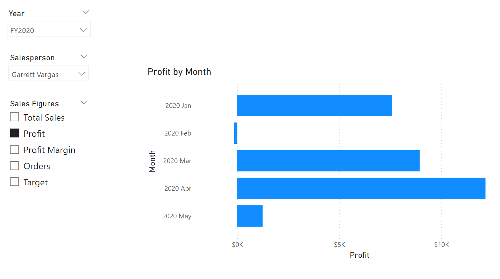

---
lab:
  title: Concevoir des modèles sémantiques évolutifs
  module: Design scalable semantic models
---

# Concevoir des modèles sémantiques évolutifs

Dans cet exercice, vous allez travailler avec les fonctions DAX pour améliorer la flexibilité et l’efficacité des modèles de données, en particulier grâce à des fonctionnalités telles que des groupes de calcul et des paramètres de champ. En utilisant ces fonctionnalités ensemble, vous pouvez créer des rapports interactifs sans avoir besoin de plusieurs visuels ou d’expressions DAX complexes, créant ainsi des modèles sémantiques hautement flexibles et évolutifs.

Dans cet exercice, vous apprenez à effectuer les opérations suivantes :

- Utiliser des fonctions DAX pour modifier le comportement des relations.
- Créer des groupes de calcul et les appliquer dans des calculs dynamiques Time intelligence.
- Créer des paramètres de champ pour sélectionner et afficher dynamiquement différents champs et mesures.

Ce labo prend environ **30** minutes.

## Avant de commencer

1. Téléchargez le [fichier de démarrage Sales Analysis](https://github.com/MicrosoftLearning/mslearn-fabric/raw/main/Allfiles/Labs/15/15-scalable-semantic-models.zip) de `https://github.com/MicrosoftLearning/mslearn-fabric/raw/main/Allfiles/Labs/15/15-scalable-semantic-models.zip` et enregistrez-le localement.

2. Extrayez le dossier dans le dossier **C:\Users\Student\Downloads\15-scalable-semantic-models**.

3. Ouvrez le fichier **15-Starter-Sales Analysis.pbix**.

    > Ignorez et fermez les avertissements demandant d’appliquer des modifications. Ne sélectionnez pas *Ignorer les modifications*.

## Utiliser les relations

Dans cette tâche, vous allez ouvrir une solution Power BI Desktop prédéveloppée pour en savoir plus sur le modèle de données. Vous allez ensuite explorer le comportement des relations de modèle actives.

1. Dans Power BI Desktop, à gauche, passez à la vue **Modèle**.

    

2. Utilisez le diagramme de modèle pour passer en revue la conception du modèle.

    

3. Notez qu’il existe trois relations entre les tables **Date** et **Sales**.

    

    > La colonne **Date** de la table **Date** est une colonne unique représentant le côté « unique » des relations. Les filtres appliqués à n’importe quelle colonne de la table **Date** se propagent à la table **Sales** à l’aide de l’une des relations.*

4. Placez le curseur sur chacune des trois relations pour mettre en évidence la colonne qui représente le côté « plusieurs » dans la table **Sales**.

5. Notez que la relation entre **Date** et **OrderDate** est active. La conception actuelle du modèle indique que la table **Date** est une dimension de rôle actif. Cette dimension peut jouer le rôle de date de commande, de date d’échéance ou de date d’expédition. Le choix du rôle dépend des exigences analytiques du rapport.

> Nous allons utiliser DAX ultérieurement pour utiliser ces relations inactives sans créer une autre table simplement pour obtenir deux relations actives pour différentes colonnes de date.

### Visualiser les données de ventes par date

Dans cette tâche, vous allez visualiser le total des ventes par année et utiliser des relations inactives.

1. Passez à l’affichage **Report**.

    

2. Pour ajouter un visuel de table, dans le volet **Visualisations**, sélectionnez l’icône de visuel **Table**.

    

3. Pour ajouter des colonnes au visuel de table, dans le volet **Données** (à droite), développez d’abord la table **Date**.

4. Faites glisser la colonne **Year** et déposez-la dans le visuel de table.

5. Développez la table **Sales**, puis faites glisser et déposez la colonne **Total Sales** dans le visuel de table.

6. Passez en revue le visuel de table.


> Le visuel de table affiche la somme de la colonne **Total Sales** groupée par année. Mais que signifie **Year** ? Étant donné qu’il existe une relation active entre les tables **Date** et **Sales** de la colonne **OrderDate**, **Year** correspond à l’exercice comptable au cours duquel les commandes ont été effectuées.

### Utiliser des relations inactives

Dans cette tâche, vous allez utiliser la fonction `USERELATIONSHIP` pour activer une relation inactive.

1. Dans le volet **Données**, cliquez avec le bouton droit sur la table **Sales**, puis sélectionnez **Nouvelle mesure**.

    

2. Dans la barre de formule (située sous le ruban), remplacez le texte par la définition de mesure suivante, puis sélectionnez **Entrée**.

    ```DAX
    Sales Shipped =
    CALCULATE (
    SUM ('Sales'[Sales]),
    USERELATIONSHIP('Date'[Date], 'Sales'[ShipDate])
    )
    ```

    > Cette formule utilise la fonction CALCULATE pour modifier le contexte de filtre. Il s’agit de la fonction USERELATIONSHIP qui active la relation **ShipDate**, uniquement pour cette mesure.

3. Ajoutez la mesure **Sales Shipped** au visuel de table.

4. Redimensionnez le visuel de table afin que toutes les colonnes soient visibles. Notez que la ligne **Total** est la même, mais que le montant des ventes pour chaque année dans **Total Sales** et **Sales Shipped** est différent. Cette différence est due à la réception de commandes au cours d’une année donnée et à leur expédition seulement au cours de l’année suivante ou qui n’a même pas encore eu lieu.


> La création de mesures qui définissent temporairement les relations comme actives est un moyen d’utiliser des dimensions de rôle actif. Toutefois, celq peut devenir fastidieux lorsqu’il est nécessaire de créer des versions de rôle actif pour de nombreuses mesures. Par exemple, s’il y a 10 mesures liées aux ventes et trois dates de rôle actif, cela pourrait signifier la création de 30 mesures. Leur création avec des groupes de calcul facilite le processus.

## Créer des groupes de calcul

Dans cette tâche, vous allez créer un groupe de calcul pour l’analyse de Time Intelligence.

1. Basculez vers la vue **Modèle**.

2. Dans Vue du modèle, sélectionnez **Groupe de calcul** pour créer une table de groupe de calcul, une colonne de groupe et un élément. Si une fenêtre d’avertissement s’affiche, sélectionnez **Oui** pour confirmer la création du groupe de calcul.

   

    > Remarque : une mesure implicite se produit lorsque, dans Affichage du rapport, vous utilisez une colonne de données du volet Données directement dans un visuel. Le visuel vous permet de l’agréger sous la forme d’une agrégation SUM, AVERAGE, MIN, MAX ou d’une autre agrégation de base, qui devient une mesure implicite. Une fois que vous avez créé un groupe de calcul, Power BI Desktop ne crée plus de mesures implicites, ce qui signifie que vous devez créer des mesures explicitement pour agréger des colonnes de données.

3. Renommez le groupe de calcul en *Calculs temporels* et la colonne de calcul en *Calculs annuels*.

4. Dans l’onglet **Modèle** du volet **Données**, sélectionnez l’élément de calcul créé automatiquement avec votre groupe de calcul.

5. Remplacez la formule de l’élément par ce qui suit et validez-la :

    ```DAX
   Year-to-Date (YTD) = CALCULATE(SELECTEDMEASURE(), DATESYTD('Date'[Date]))
    ```

6. Cliquez avec le bouton droit sur le champ **Éléments de calcul**, puis sélectionnez **Nouvel élément de calcul**.

7. Utilisez la formule DAX suivante pour le nouvel élément :

    ```DAX
   Previous Year (PY) = CALCULATE(SELECTEDMEASURE(), PREVIOUSYEAR('Date'[Date]))
    ```

8. Créez un troisième élément avec la formule DAX suivante :

    ```DAX
   Year-over-Year (YoY) Growth = 
   VAR MeasurePriorYear =
   CALCULATE(
       SELECTEDMEASURE(),
       SAMEPERIODLASTYEAR('Date'[Date])
   )
   RETURN
   DIVIDE(
       (SELECTEDMEASURE() - MeasurePriorYear),
       MeasurePriorYear
   )
    ```

Le dernier élément de calcul doit retourner des valeurs en pourcentage uniquement. Il a donc besoin d’une chaîne de format dynamique pour modifier le format des mesures qu’il affecte.

9. Dans le volet **Propriétés** de l’élément Année après année, activez la fonctionnalité de **chaîne de format dynamique**.

10. Dans la barre de formule DAX, vérifiez que le champ à gauche est défini comme **Format** et écrivez la chaîne de format suivante : `"0.##%"`

11. Vérifiez que votre groupe de calcul se présente comme suit :

    

### Appliquer un groupe de calcul aux mesures

Dans cette tâche, vous allez visualiser comment les éléments de calcul affectent les mesures dans un visuel.

1. Passez à l’affichage **Report**.

2. En bas du canevas, sélectionnez l’onglet **Vue d’ensemble**.

3. Sélectionnez le visuel de matrice déjà créé dans le canevas et faites glisser la colonne de calcul **Calculs annuels** du volet **Données** vers le champ **Colonnes** dans le volet **Visualisations**.

    

4. Notez que maintenant la matrice a un ensemble de chiffres de vente pour chaque élément de calcul. 

   

> La lisibilité de toutes ces informations figurant dans un seul visuel peut être altérée. Par conséquent, il serait pratique de limiter le visuel à un seul chiffre de vente à la fois. Pour ce faire, nous pouvons utiliser un paramètre de champ.

## Créer des paramètres de champs

Dans cette tâche, vous allez créer des paramètres de champ pour modifier les visuels.

1. Sélectionnez l’onglet **Modélisation** dans le ruban supérieur, puis développez le bouton **Nouveau paramètre**, puis sélectionnez **Champs**.

    

2. Dans la fenêtre Paramètres, renommez le paramètre **Sales Figures**, vérifiez que l’option **Ajouter un segment à cette page** est cochée et ajoutez les champs suivants à partir de la table **Sales** :

   - Total Sales
   - Bénéfices
   - Marge de bénéfice
   - Ordres

    

3. Sélectionnez **Créer**.

4. Une fois le segment créé, vous pouvez sélectionner la matrice et supprimer tous les champs du volet **Visualisations** et ajouter à la place le paramètre de champ Sales Figures.

    

5. Vérifiez les différents chiffres de vente dans le segment et comment la matrice change lorsque chacun d’eux est sélectionné.

6. Découvrez comment le champ Profit est sélectionné à l’aide du segment pour le paramètre de champ Sales Figures. Il s’agit de la même matrice que celle ci-dessus. Vous pouvez donc voir les trois éléments de calcul (année précédente, année après année, année en cours), mais uniquement appliqués au profit en raison du segment.

    

### Modifier des paramètres de champ

Dans cette tâche, vous allez modifier le paramètre de champ **Sales Figures** en modifiant directement son expression DAX.

1. Sélectionnez l’onglet **Performances de vendeur** en bas du canevas. Observez le graphique à barres groupées pour basculer entre les ventes par mois et l’objectif par mois.

    > La création des boutons de signet vous permet de modifier le type visuel avec chaque option, mais si vous devez basculer entre de nombreuses mesures, vous devrez créer un bouton de signet pour chacune d’elles et cela peut prendre beaucoup de temps. Au lieu de cela, nous pouvons utiliser un paramètre de champ avec toutes les mesures que nous voulons analyser et basculer rapidement de l’une à l’autre.

    

2. Sélectionnez le visuel de graphique à barres et remplacez le champ **Total Sales** dans l’**axe X** par le paramètre de champ **Sales Figures**.

3. Créez un visuel **Segment** et faites glisser le paramètre **Sales Figures** vers la zone **Champ**.

Pour ce visuel, vous devez toujours évaluer l’objectif par mois, qui n’est pas dans le paramètre de champ.

4. Sélectionnez le paramètre **Sales Figures** dans le volet Données et ajoutez le champ d’objectif dans l’expression DAX du paramètre comme indiqué ci-dessous :

    ```DAX
   Sales Figures = {
    ("Total Sales", NAMEOF('Sales'[Total Sales]), 0),
    ("Profit", NAMEOF('Sales'[Profit]), 1),
    ("Profit Margin", NAMEOF('Sales'[Profit Margin]), 2),
    ("Orders", NAMEOF('Sales'[Orders]), 3),
    ("Target", NAMEOF('Targets'[Target]), 4)
   }
    ```

5. Validez les modifications et vérifiez que le visuel change à mesure que vous sélectionnez les différents chiffres de vente.

6. Supprimez les boutons de signet et observez l’état final de la page du rapport.

    

## Labo terminé

Pour terminer cet exercice, fermez Power BI Desktop. Il est inutile d’enregistrer le fichier.
