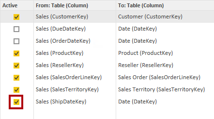
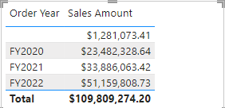
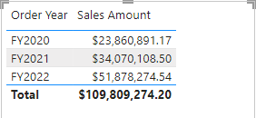
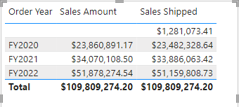
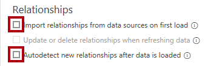
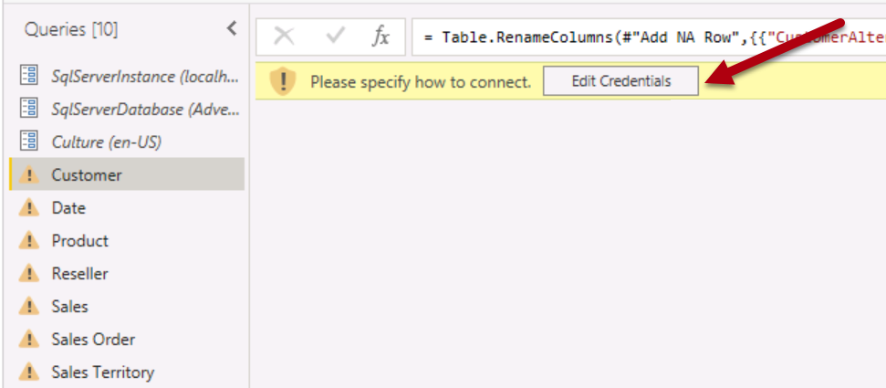
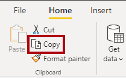
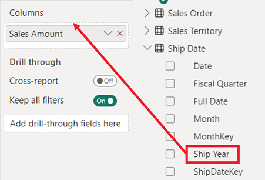
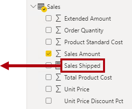

---
lab:
  title: Utiliser des relations de modèle
  module: Design and build tabular models
---

# Utiliser des relations de modèle

## Vue d’ensemble

**La durée estimée pour effectuer ce tutoriel est de 45 minutes.**

Dans ce labo, vous allez travailler avec des relations de modèle pour répondre aux besoins de dimensions spécifiques de rôles actifs. Cela implique d’utiliser des relations actives et inactives, ainsi que des fonctions DAX (Data Analysis Expressions) qui modifient le comportement des relations.

Dans ce labo, vous découvrez comment :

- Interpréter les propriétés des relations dans le diagramme du modèle

- Définir les propriétés des relations.

- Utiliser des fonctions DAX qui modifient le comportement des relations

## Explorer les relations de modèle

Dans cet exercice, vous allez ouvrir une solution Power BI Desktop prédéveloppée pour en savoir plus sur le modèle de données. Vous allez ensuite explorer le comportement des relations de modèle actives.

### Télécharger un ficher de démarrage

1. Téléchargez le [fichier de démarrage Analyse des ventes](https://aka.ms/fabric-relationships-starter) à partir de `https://aka.ms/fabric-relationships-starter` et enregistrez-le sur votre ordinateur local (dans n’importe quel dossier).

1. Accédez au fichier téléchargé et ouvrez-le dans Power BI Desktop.
    >Remarque : Ignorez et fermez l’avertissement demandant d’appliquer des modifications.

### Examiner le modèle de données

1. Dans Power BI Desktop, à gauche, passez à la vue **Modèle**.

    
2. Utilisez le diagramme de modèle pour passer en revue la conception du modèle.

    

    *Le modèle comprend six tables de dimension et une table de faits. La table de faits **Sales** stocke les détails des commandes client. Il s’agit d’une conception classique de schéma en étoile.*

3. Notez qu’il existe trois relations entre les tables **Date** et **Sales**.

    

    *La colonne **DateKey** de la table **Date** est une colonne unique qui représente le côté « unique » des relations. Les filtres appliqués à n’importe quelle colonne de la table **Date** se propagent à la table **Sales** à l’aide de l’une des relations.*

4. Placez le curseur sur chacune des trois relations pour mettre en évidence la colonne qui représente le côté « plusieurs » dans la table **Sales**.

5. Notez que la relation avec la colonne **OrderDateKey** est une ligne solide, tandis que les autres relations sont représentées par une ligne pointillée.

    *Une ligne solide représente une relation active. Il ne peut y avoir qu’un seul chemin de relation actif entre deux tables de modèle, et le chemin est utilisé par défaut pour propager les filtres entre les tables. À l’inverse, une ligne pointillée représente une relation inactive. Les relations inactives sont utilisées uniquement lorsqu’elles sont appelées explicitement par des formules DAX.*

    *La conception actuelle du modèle indique que la table **Date** est une dimension de rôle actif. Cette dimension peut jouer le rôle de date de commande, de date d’échéance ou de date d’expédition. Le rôle dépend des exigences d’analyse du rapport.*

    *Dans ce labo, vous allez apprendre à concevoir un modèle pour prendre en charge les dimensions de rôle.*

### Visualiser les données de date

Dans cette tâche, vous allez visualiser les données de ventes par date et changer l’état actif des relations.

1. Passez à l’affichage **Report**.

    

2. Pour ajouter un visuel de table, dans le volet **Visualisations**, sélectionnez l’icône de visuel **Table**.

    

3. Pour ajouter des colonnes au visuel de table, dans le volet **Données** (à droite), développez d’abord la table **Date**.

    

4. Faites glisser la colonne **Fiscal Year** et déposez-la dans le visuel de table.

    

5. Développez la table **Sales**, puis faites glisser et déposez la colonne **Sales Amount** dans le visuel de table.

    

6. Passez en revue le visuel de table.

    

    *Le visuel de table affiche la somme de la colonne **Sales Amount** regroupée par année. Mais que signifie **Fiscal Year** ? Étant donné qu’il existe une relation active entre les tables **Date** et **Sales** avec la colonne **OrderDateKey**, **Fiscal year** correspond à l’année fiscale pendant laquelle les commandes ont été effectuées.*

    *Pour préciser de quelle année fiscale il s’agit, il est conseillé de renommer le champ du visuel (ou d’ajouter un titre au visuel).*

7. Dans le volet **Visualisations** du visuel de table, dans la zone **Valeurs**, sélectionnez la flèche vers le bas, puis **Renommer pour ce visuel**.

    

8. Remplacez le texte par **Order Year**, puis appuyez sur **Entrée**.

    

    *Remarque : Il est plus rapide de renommer un champ visuel en cliquant deux fois sur son nom.*

9. Notez que l’en-tête de colonne du visuel de table est mis à jour avec le nouveau nom.

    

### Modifier l’état actif des relations

Dans cette tâche, vous allez modifier l’état actif de deux relations.

1. Sous le ruban **Modélisation**, sélectionnez **Gérer les relations**.

    

2. Dans la fenêtre **Gérer les relations**, pour la relation entre les tables **Sales** et **Date** de la colonne **OrderDateKey** (troisième de la liste), décochez la case **Active**.

    

3. Cochez la case **Active** pour la relation entre les tables **Sales** et **Date** pour la colonne **ShipDateKey** (dernière dans la liste).

    

4. Sélectionnez **Fermer**.

    

    *Ces configurations ont basculé la relation active entre les tables **Date** et **Sales** vers la colonne **ShipDateKey**.*

5. Examinez le visuel de table qui affiche désormais les montants des ventes regroupés par années d’expédition.

    

6. Renommez la première colonne en **Ship Year**.

    

    *La première ligne représente un groupe vide, car certaines commandes n’ont pas encore été livrées. En d’autres termes, la colonne **ShipDateKey** de la table **Sales** contient des espaces vides (BLANK).*

7. Dans la fenêtre **Gérer les relations**, rétablissez la relation **OrderDateKey** comme active en procédant comme suit :

    - Ouvrez la fenêtre **Gérer les relations**

    - Décochez la case **Active** pour la relation **ShipDateKey** (dernière dans la liste).

    - Cochez la case **Active** pour la relation **OrderDateKey** (troisième dans la liste).

    - Fermez la fenêtre **Gérer les relations**.

    - Renommez le premier champ visuel dans le visuel de table en **Order Year**.

    

    *Dans l’exercice suivant, vous allez apprendre à activer une relation dans une formule DAX.*

## Utiliser des relations inactives

Dans cet exercice, vous allez apprendre à activer une relation dans une formule DAX.

### Utiliser des relations inactives

Dans cette tâche, vous allez utiliser la fonction USERELATIONSHIP pour activer une relation inactive.

1. Dans le volet **Données**, cliquez avec le bouton droit sur la table **Sales**, puis sélectionnez **Nouvelle mesure**.

    

2. Dans la barre de formule (située sous le ruban), remplacez le texte par la définition de mesure suivante, puis sélectionnez **Entrée**.

    ```DAX
    Sales Shipped =
    CALCULATE (
    SUM ( 'Sales'[Sales Amount] ),
    USERELATIONSHIP ( 'Date'[DateKey], 'Sales'[ShipDateKey] )
    )
    ```

    *Cette formule utilise la fonction CALCULATE pour modifier le contexte de filtre. C’est la fonction USERELATIONSHIP qui, dans le cadre de ce calcul, active la relation **ShipDateKey**.*

3. Dans le ruban contextuel **Outils de mesure**, à l’intérieur du groupe **Mise en forme**, définissez les décimales sur **2**.

    

4. Ajoutez la mesure **Sales Shipped** au visuel de table.

    

5. Redimensionnez le visuel de table afin que toutes les colonnes soient visibles.

    

    *La création de mesures qui définissent temporairement les relations comme actives constitue un moyen d’utiliser des dimensions de rôle actif. Toutefois, cela peut devenir fastidieux lorsqu’il est nécessaire de créer des versions de rôle actif pour de nombreuses mesures. Par exemple, s’il y a 10 mesures liées aux ventes et trois dates de rôle actif, cela signifie qu’il faut créer 30 mesures. La création de ces dernières avec des groupes de calcul peut faciliter le processus.*

    *Une autre approche consiste à créer une table de modèle différente pour chaque dimension de rôle actif. C’est ce que vous allez faire dans l’exercice suivant.*

6. Pour supprimer la mesure du visuel de table, dans le volet **Visualisations**, à partir du champ **Valeurs**, pour le champ **Sales Shipped**, cliquez sur **X**.

    

## Ajouter une table Date

Dans cet exercice, vous allez ajouter une table Date pour l’analyse des dates d’expédition.

### Supprimer des relations inactives

Dans cette tâche, vous allez supprimer la relation existante avec la **colonne ShipDateKey**.

1. Basculez vers la vue **Modèle**.

    

2. Dans le diagramme de modèle, cliquez avec le bouton droit sur la relation **ShipDateKey**, puis sélectionnez **Supprimer**.

    

3. Lorsque vous êtes invité à confirmer la suppression, sélectionnez **Oui**.

    *La suppression de la relation entraîne une erreur avec la mesure **Sales Shipped**. Vous réécrirez la formule de mesure plus loin dans ce labo.*

### Désactiver les options de relation

Dans cette tâche, vous allez désactiver deux options de relation.

1. Sous l’onglet de ruban **Fichier**, sélectionnez **Options et paramètres**, puis **Options**.

    

2. Dans la fenêtre **Options**, à gauche, à partir du groupe **FICHIER ACTIF**, sélectionnez **Chargement des données**.

    

3. Dans la section **Relations**, décochez les deux options activées.

    

    *En règle générale, dans votre travail quotidien, vous pouvez laisser ces options activées. Toutefois, dans le cadre de ce labo, vous allez créer des relations explicitement.*

4. Cliquez sur **OK**.

    

### Ajouter une autre table de dates

Dans cette tâche, vous allez créer une requête pour ajouter une autre table de dates au modèle.

1. Sous l’onglet de ruban **Accueil**, dans le groupe **Requêtes**, sélectionnez l’icône **Transformer les données** qui ouvre l’**éditeur Power Query**.

    

    *Si vous êtes invité à spécifier comment vous connecter, **modifiez les informations d’identification**.*

    

    *Conservez les paramètres de connexion par défaut pour Windows avec l’option « Utiliser mes informations d’identification actuelles », puis **Se connecter**.*

      *Sélectionnez **Oui** dans le message d’avertissement.*

2. Dans la fenêtre **Éditeur Power Query**, dans le volet **Requêtes** (à gauche), cliquez avec le bouton droit sur la requête **Date**, puis sélectionnez **Référence**.

    

    *Une requête de référencement est une requête qui utilise une autre requête comme source. Par conséquent, cette nouvelle requête obtient sa date de la requête **Date**.*

3. Dans le volet **Paramètres de requête** (à droite), dans la zone **Nom**, remplacez le texte par **Ship Date**.

    

4. Pour renommer la colonne **DateKey**, double-cliquez sur l’en-tête de colonne **DateKey**.

5. Remplacez le texte par **ShipDateKey**, puis appuyez sur **Entrée**.

    

6. Renommez également la colonne **Fiscal Year** en **Ship Year**.

    *Dans la mesure du possible, il est conseillé de renommer toutes les colonnes afin qu’elles décrivent le rôle qu’elles jouent. Dans ce labo, vous allez renommer deux colonnes uniquement pour simplifier les choses.*

7. Pour charger la table dans le modèle, sous l’onglet de ruban **Accueil**, sélectionnez l’icône **Fermer &amp; appliquer**.

    

8. Lorsque la table a été ajoutée au modèle, pour créer une relation, à partir de la table **Ship Date**, faites glisser la colonne **ShipDateKey** vers la colonne **ShipDateKey** de la table **Sales**.

    

9. Notez qu’une relation active existe maintenant entre la table **Ship Date** et la table **Sales**.

### Visualiser les données de date d’expédition

Dans cette tâche, vous allez visualiser les données de date d’expédition dans un nouveau visuel de table.

1. Passez à l’affichage **Report**.

    

2. Pour cloner le visuel de table, commencez par sélectionner le visuel.

3. Sous l’onglet de ruban **Accueil**, dans le groupe **Presse-papiers**, sélectionnez **Copier**.

    

4. Pour coller le visuel copié, sous l’onglet de ruban **Accueil**, à partir du groupe **Presse-papiers**, sélectionnez **Coller**.

    *Conseil : vous pouvez également utiliser les raccourcis **Ctrl+C** et **Ctrl+V**.*

    

5. Déplacez le nouveau visuel de table à droite du visuel de table existant.

6. Sélectionnez le nouveau visuel de table, puis, dans le volet **Visualisations**, à l’intérieur de la zone **Valeurs**, supprimez le champ **Order Year**.

    

7. Dans le volet **Données**, développez la table **Ship Date**.

8. Pour ajouter un nouveau champ au nouveau visuel de table, à partir de la table **Ship Date**, faites glisser le champ **Ship Year** vers la zone **Valeurs**, au-dessus du champ **Sales Amount**.

    

9. Vérifiez que le nouveau visuel de table affiche le montant des ventes par année d’expédition.

    

    *Le modèle possède désormais deux tables de dates, chacune avec une relation active avec la table **Sales**. L’avantage de cette approche de conception est qu’elle est flexible. Il est désormais possible d’utiliser toutes les mesures et champs récapitulants avec l’une ou l’autre table de dates.*

    *Il existe cependant des inconvénients. Chaque table de rôle actif contribue à agrandir la taille du modèle, bien que la table de dimension ne soit généralement pas importante en termes de lignes. Chaque table de rôle actif nécessite également de dupliquer les configurations du modèle, telles que le marquage de la table de dates, la création de hiérarchies et d’autres paramètres. En outre, l’ajout de tables supplémentaires peut entraîner un nombre excessif de champs. Les utilisateurs peuvent avoir plus de difficultés à trouver les ressources du modèle dont ils ont besoin.*

    *Enfin, il n’est pas possible d’obtenir une combinaison de filtres dans un visuel. Par exemple, il n’est pas possible de combiner les ventes commandées et les ventes livrées dans le même visuel sans créer de mesure. Vous allez créer cette mesure dans l’exercice suivant.*

## Explorer d’autres fonctions de relation

Dans cet exercice, vous allez utiliser d’autres fonctions de relation DAX.

### Explorer d’autres fonctions de relation

Dans cette tâche, vous allez utiliser les fonctions CROSSFILTER et TREATAS pour modifier le comportement des relations pendant les calculs.

1. Dans le volet **Données**, dans la table **Sales**, sélectionnez la mesure **Sales Shipped**.

    

2. Dans la base de formule, remplacez le texte par la définition suivante :

    ```dax
    Sales Shipped =
    CALCULATE (
    SUM ( 'Sales'[Sales Amount] ),
    CROSSFILTER ( 'Date'[DateKey], 'Sales'[OrderDateKey], NONE ),
    TREATAS (
    VALUES ( 'Date'[DateKey] ),
    'Ship Date'[ShipDateKey]
        )
    )
    ```

    *Cette formule utilise la fonction CALCULATE pour additionner la colonne **Sales Amount** à l’aide de comportements de relation modifiés. La fonction CROSSFILTER désactive la relation active avec la colonne **OrderDateKey** (cette fonction peut également modifier le sens du filtre). La fonction TREATAS crée une relation virtuelle en appliquant les valeurs **DateKey** dans le contexte à la colonne **ShipDateKey**.*

3. Ajoutez la mesure **Sales Shipped** révisée au premier visuel de table.

    

4. Examinez le premier visuel de table.

    

5. Notez qu’il n’existe aucun groupe « BLANK ».

    *Étant donné qu’il n’y a pas de mention BLANK dans la colonne **OrderDateKey**, aucun groupe BLANK n’a été généré. L’affichage des ventes non expédiées nécessite une approche différente.*

### Afficher les ventes non expédiées

Dans cette tâche, vous allez créer une mesure pour afficher le montant des ventes non expédiées.

1. Créez une mesure nommée **Sales Unshipped** dans la table **Sales** en utilisant la définition suivante :

    ```DAX
    Sales Unshipped =
    CALCULATE (
    SUM ( 'Sales'[Sales Amount] ),
    ISBLANK ( 'Sales'[ShipDateKey] )
    )
    ```

    *Cette formule additionne la colonne **Sales Amount** lorsque la colonne **ShipDateKey** affiche BLANK.*

2. Formatez la mesure pour qu’elle comporte deux décimales.

3. Pour ajouter un nouveau visuel à la page, sélectionnez d’abord une zone vide de la page de rapport.

4. Dans le volet **Visualisations**, sélectionnez l’icône de visuel **Carte**.

    

5. Faites glisser la mesure **Sales Unshipped** dans le visuel de carte.

    

6. Vérifiez que la mise en page du rapport final ressemble à ce qui suit :

    

### Terminer

Pour terminer cet exercice, fermez Power BI Desktop. Il est inutile d’enregistrer le fichier.
