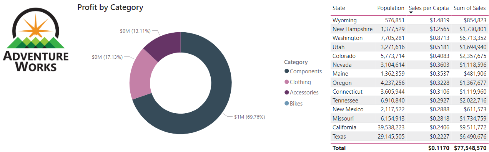

---
lab:
  title: "Créer des ressources Power\_BI réutilisables"
  module: Create reusable Power BI assets
---

# Créer des ressources Power BI réutilisables

Dans cet exercice, vous allez créer des ressources réutilisables pour prendre en charge le développement de modèles sémantiques et de rapports. Ces ressources incluent les fichiers de projets et de modèles Power BI et les modèles sémantiques partagés. À la fin, la vue de traçabilité affiche la façon dont ces éléments se rapportent les uns aux autres dans le service Power BI.

   > Note : cet exercice ne nécessite pas de licence Fabric et peut être effectué dans un environnement Power BI ou Microsoft Fabric.

Cet exercice devrait prendre environ **30** minutes.

## Avant de commencer

Afin de commencer cet exercice, vous devez d’abord ouvrir un navigateur web et entrer l’URL suivante pour télécharger le dossier zip :

`https://github.com/MicrosoftLearning/mslearn-fabric/raw/refs/heads/main/Allfiles/Labs/16b/16-reusable-assets.zip`

Extrayez le dossier dans le dossier **C:\Users\Student\Downloads\16-reusable-assets**.

## Créer un projet Power BI

Dans cette tâche, vous allez créer un rapport en vous connectant au modèle sémantique publié et l’enregistrer en tant que fichier de projet Power BI (*.pbip*). Les fichiers de projet Power BI stockent les détails du rapport et du modèle sémantique dans des fichiers plats qui utilisent un contrôle de source. Vous pouvez utiliser Visual Studio Code pour modifier ces fichiers ou Git pour suivre les modifications.

1. À partir du bureau, ouvrez l’application Power BI Desktop et créez un rapport vide.

    > Lorsque vous y êtes invité, connectez-vous avec le même compte que celui utilisé dans le service Fabric.

1. Sélectionnez **Fichier** > **Options et paramètres** > **Options** > **Fonctionnalités en version préliminaire**, puis sélectionnez **Stocker le modèle sémantique via l’option de format TMDL** et cliquez sur **OK**.

    > Cela active l’option permettant d’enregistrer le modèle sémantique en utilisant TMDL (Tabular Model Definition Language), qui est actuellement une fonctionnalité en version préliminaire.

1. Si vous êtes invité à redémarrer Power BI Desktop, faites-le avant de poursuivre l’exercice.

    

1. Sélectionnez **Enregistrer sous**, puis choisissez le type de fichier en sélectionnant la flèche dans le menu déroulant lorsque vous nommez le fichier.
1. Sélectionnez l’extension de fichier **.pbip**, choisissez un nom pour votre rapport, puis enregistrez-le dans un dossier dont vous vous rappellerez.

    

1. Notez que le nom de votre rapport situé en haut de la fenêtre Power BI Desktop est juxtaposé à **(Projet Power BI)**.
1. Dans le ruban Accueil, accédez à **Obtenir des données > modèles sémantiques Power BI** pour vous connecter au modèle sémantique publié.

    

1. Une fois connecté, vous devez voir 9 tables dans le volet Données.
1. **Enregistrez** à nouveau votre fichier.

### Consulter les détails du fichier de projet Power BI

Examinons comment les modifications apportées dans Power BI Desktop sont reflétées dans les fichiers .tmdl.

1. À partir du bureau, utilisez l’Explorateur de fichiers pour accéder au dossier dans lequel vous avez enregistré le fichier **.pbip**.
1. Vous devriez voir les éléments suivants :

    - Fichier YourReport.pbip
    - Dossier YourReport.Report
    - Dossier YourReport.SemanticModel
    - Fichier source Git Ignore .gitignore

## Ajouter une nouvelle table à votre rapport

Dans cette tâche, vous allez ajouter une nouvelle table, car le modèle sémantique ne dispose pas de toutes les données dont vous avez besoin.

1. Dans Power BI Desktop, accédez à **Obtenir des données > Web** pour ajouter les nouvelles données.
1. Notez le message indiquant qu’une connexion DirectQuery est requise. Choisissez **Ajouter un modèle local** pour continuer.
1. Une nouvelle boîte de dialogue apparaît et affiche une base de données, ainsi que des tables parmi lesquelles vous pouvez choisir. Sélectionnez tout et cliquez sur **Envoyer**.

    > Le modèle sémantique est traité comme une base de données SQL Server Analysis Server.

1. La boîte de dialogue À partir du web s’affiche une fois connecté. Laissez la case d’option De base sélectionnée. Saisissez le chemin d’accès du fichier suivant en tant que chemin de l’URL.

    `C:\Users\Student\Downloads\16-reusable-assets\us-resident-population-estimates-2020.html`

1. Sélectionnez la zone **Tables HTML > Table 2**, puis sélectionnez **Transformer les données** pour continuer.

    

1. Une nouvelle fenêtre de l’éditeur Power Query s’ouvre avec la prévisualisation des données de la table 2.
1. Renommez **Table 2** en *US Population*.
1. Renommez STATE en **State** et NUMBER en **Population**.
1. Supprimez la colonne RANK.
1. Sélectionnez **Fermer & Appliquer** pour charger les données transformées dans votre modèle sémantique.
1. Sélectionnez **OK** si une boîte de dialogue s’affiche concernant un *risque de sécurité potentiel*.
1. **Enregistrez** votre fichier.
1. Si vous y êtes invité, **n’effectuez pas la mise à niveau** vers le format de rapport Power BI amélioré.

### Consulter les détails du fichier de projet Power BI

Dans cette tâche, nous allons apporter des modifications au rapport dans Power BI Desktop et observer les modifications apportées dans les fichiers plats .tmdl.

1. Dans l’Explorateur de fichiers, recherchez le dossier ***YourReport*.SemanticModel**.
1. Ouvrez le dossier de définition et observez les différents fichiers.
1. Ouvrez le fichier **relationships.tmdl** dans le Bloc-notes : vous pouvez ainsi noter qu’il existe 9 relations répertoriées. Fermez le fichier .
1. Revenez à Power BI Desktop, puis accédez à l’onglet **Modélisation** sur le ruban.
1. Sélectionnez **Gérer les relations** et notez qu’il existe 9 relations.
1. Créez une nouvelle relation comme suit :
    - **De** : Reseller avec State-Province comme colonne clé
    - **À** : US Population avec State comme colonne clé
    - **Cardinalité** : plusieurs-pour-un (*:1)
    - **Direction du filtrage croisé** : les deux

    

1. **Enregistrez** votre fichier.
1. Revenez dans le fichier **relationships.tmdl** et notez qu’une nouvelle relation a été ajoutée.

> Les modifications dans les fichiers plats peuvent être suivies dans les systèmes de contrôle de source, contrairement à celles des fichiers *.pbix*, ceux-ci étant binaires.

## Ajouter une mesure et un visuel à votre rapport

Dans cette tâche, vous allez ajouter une mesure et un visuel pour étendre le modèle sémantique et utiliser la mesure dans un visuel.

1. Dans Power BI Desktop, accédez au volet Données et sélectionnez la table Sales.
1. Sélectionnez **Nouvelle mesure** dans le ruban d’outils contextuel de la table.
1. Dans la barre de formule, saisissez et validez le code suivant :

    ```DAX
    Sales per Capita =
    DIVIDE(
        SUM(Sales[Sales]),
        SUM('US Population'[Population])
    )
    ```

1. Recherchez la nouvelle mesure **Sales per Capita** et faites-la glisser sur le canevas.
1. Faites glisser les champs **Sales \| Sales**, **US Population \| State** et **US Population \| Population** dans le même visuel.

   > *Les labos utilisent une notation abrégée pour référencer un champ. Voici le résultat : **Sales \| Unit Price**. Dans cet exemple, **Sales** est le nom de la table et **Unit Price** correspond au nom du champ.*

1. Sélectionnez le visuel et modifiez-le en **Tableau**.
1. Notez la mise en forme incohérente des données Sales per Capita et Population.
1. Sélectionnez chaque champ dans le volet Données et modifiez le format et les décimales.
    - Sales per Capita : Devise \| 4 décimales
    - Population : Nombre entier \| Séparé par une virgule \| 0 décimale

    

    > Conseil : si vous créez accidentellement une mesure dans la mauvaise table, vous pouvez facilement modifier la table Accueil, comme le montre l’image précédente.

1. Enregistrez votre fichier.

> Votre tableau doit ressembler à l’image suivante, avec quatre colonnes et des nombres correctement mis en forme.


## Configurer un fichier de modèle Power BI (.pbit)

Dans cette tâche, vous allez créer un fichier de modèle afin de pouvoir partager un fichier léger avec d’autres personnes pour une meilleure collaboration.

1. Accédez à l’onglet Insérer du ruban dans Power BI Desktop et sélectionnez **Images**. Accédez à votre dossier de téléchargements et sélectionnez le fichier `AdventureWorksLogo.jpg`.
1. Positionnez cette image dans le coin supérieur gauche.
1. Sélectionnez un nouveau visuel et ajoutez **Ventes \| Profit** et **Produit \| Catégorie** à celui-ci.

    > Nous avons utilisé un graphique en anneau pour notre capture d’écran suivante.

    

1. Notez qu’il existe 4 couleurs différentes dans la légende.
1. Accédez à l’onglet **Affichage** dans le ruban.
1. Sélectionnez la flèche à côté des **thèmes** pour développer et afficher tous les choix.
1. Sélectionnez l’un des **thèmes accessibles** à appliquer à ce rapport.

    > Ces thèmes sont spécifiquement créés pour offrir une meilleure accessibilité pour les personnes qui consultent les rapports.

1. Développez à nouveau les thèmes, puis sélectionnez **Personnaliser le thème actuel**.

    

1. Dans la fenêtre Personnaliser le thème, accédez à l’onglet **Texte**. Remplacez la famille de polices par une police Segoe UI pour chacune des sections.

    

1. Une fois que vous avez terminé, **appliquez** les modifications.
1. Notez les différentes couleurs dans les visuels avec le nouveau thème appliqué.

    

1. Sélectionnez **Fichier > Enregistrer sous** pour créer le fichier *.pbit*.
1. Remplacez le type de fichier par *.pbit* et enregistrez-le dans le même emplacement que le fichier *.pbip*.
1. Entrez une description de ce que les utilisateurs doivent attendre de ce modèle quand ils l’utilisent, puis sélectionnez OK.
1. Revenez à l’Explorateur de fichiers, ouvrez le fichier *.pbit* et vérifiez qu’il ressemble exactement au fichier *.pbip*.

    > Dans cet exercice, nous voulons uniquement un modèle de thème de rapport standard sans modèle sémantique.

1. Dans ce même nouveau fichier, supprimez les deux visuels du canevas.
1. Dans le ruban Accueil, sélectionnez **Transformer les données**.
1. Dans l’Éditeur Power Query, sélectionnez la requête **US population** et cliquez avec le bouton droit pour la supprimer.
1. Sélectionnez Paramètres de la source de données dans le ruban et supprimez la source de données **DirectQuery vers AS - modèle sémantique Power BI**, puis sélectionnez **Fermer**.
1. **Fermer et appliquer**
1. Revenez aux thèmes et regardez que votre thème accessible modifié est toujours appliqué au rapport.
1. Notez également le message *Vous n’avez pas encore chargé de données* présent dans le volet Données.
1. **Enregistrez sous** un fichier *.pbit* avec le même nom que celui que vous avez utilisé précédemment pour remplacer le fichier.
1. Fermez le fichier sans titre sans enregistrer. Votre autre fichier *.pbip* doit encore être ouvert.

> Vous disposez maintenant d’un modèle avec un thème cohérent sans aucune donnée préchargée.

### Passer en revue l’état final

Dans la capture d’écran suivante, vous avez créé votre fichier Projet Power BI et l’avez publié dans un espace de travail. Vous avez ensuite accédé à l’espace de travail dans le service Power BI et basculé vers la **vue de traçabilité** pour voir comment votre nouveau rapport dépend d’autres sources de données.

De gauche à droite, les éléments suivants sont visibles :

- Sources de données : 2 fichiers texte/CSV et une connexion SQL Server.
- Modèle sémantique 16-Starter-Sales Analysis, qui est connecté aux sources de données.
- Rapport 16-Starter-Sales Analysis, qui est connecté au modèle sémantique 16-Starter-Sales Analysis.
- Mon nouveau modèle sémantique de rapport, qui est connecté au modèle sémantique 16-Starter-Sales Analysis.
- Mon nouveau rapport, qui est connecté à mon nouveau modèle sémantique de rapport.

> Lorsque des modèles sémantiques sont liés à d’autres modèles sémantiques, cela s’appelle un **chaînage**. Dans ce labo, le modèle sémantique de démarrage est chaîné au modèle sémantique nouvellement créé, ce qui permet sa réutilisation dans un but spécifique.


## Nettoyage

Vous avez terminé cet exercice. Vous avez créé des fichiers de projet et de modèle Power BI, ainsi que des modèles sémantiques spécialisés et des rapports. Vous pouvez supprimer en toute sécurité l’espace de travail et toutes les ressources locales.
