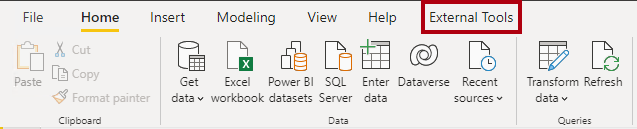
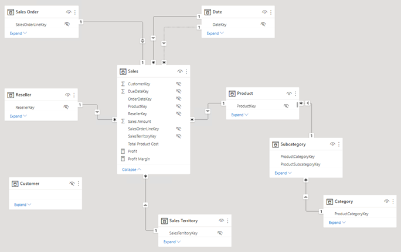
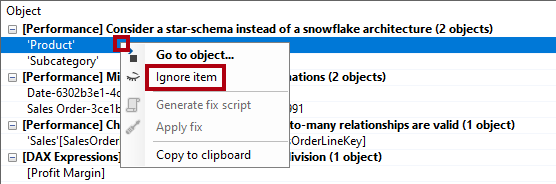
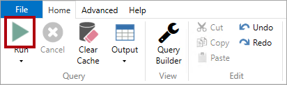

---
lab:
  title: Utiliser des outils pour optimiser le niveau de performance de Power BI
  module: Optimize enterprise-scale tabular models
---

# Utiliser des outils pour optimiser le niveau de performance de Power BI

## Vue d’ensemble

**La durée estimée pour effectuer ce labo est de 30 minutes.**

Dans ce labo, vous allez apprendre à utiliser deux outils externes pour développer, gérer et optimiser des modèles de données et des requêtes DAX.

Dans ce labo, vous découvrez comment :

- Utiliser Best Practice Analyzer (BPA)

- Utiliser DAX Studio

## Bien démarrer

Pour ce labo, vous allons utiliser Power BI Desktop, Tabular Editor et DAX Studio pour optimiser un modèle sémantique.

### Télécharger le fichier de démarrage Power BI

1. Naviguez vers [GitHub](https://github.com/MicrosoftLearning/mslearn-fabric/blob/main/Allfiles/Labs/16/Starter%20File%20-%20Use%20tools%20to%20optimize%20Power%20BI%20performance.pbix) et téléchargez le **Fichier de démarrage**. Il s’agit d’un fichier .pbix que vous ouvrez dans Power BI Desktop. Utilisez le menu des points de suspension ... pour obtenir l’option de téléchargement du fichier .pbix brut.

## Utiliser Best Practice Analyzer

Dans cet exercice, vous allez installer Tabular Editor 2 et charger les règles BPA (Best Practice Analyzer). Vous allez passer en revue les règles BPA, puis résoudre des problèmes spécifiques qui sont apparus dans le modèle de données.

*BPA est un outil tiers gratuit qui vous avertit des erreurs de modélisation potentielles ou des modifications qui vous permettraient d’améliorer la conception et les performances de votre modèle. Il inclut des recommandations pour l’attribution de noms, l’expérience utilisateur et les optimisations courantes que vous pouvez appliquer pour améliorer les performances. Pour plus d’informations, consultez [Best practice rules to improve your model's performance](https://powerbi.microsoft.com/blog/best-practice-rules-to-improve-your-models-performance/) (version française non disponible).*


### Télécharger et installer Tabular Editor 2

Téléchargez et installez Tabular Editor 2 pour activer la création de groupes de calcul.

**Important :** *si vous avez déjà installé Tabular Editor 2 dans votre environnement de machine virtuelle, passez à la tâche suivante.*

*Tabular Editor est un autre outil permettant de créer des modèles tabulaires pour Analysis Services et Power BI. Tabular Editor 2 est un projet open source capable de modifier un fichier BIM sans accéder aux données du modèle.*

1.  Vérifiez que Power BI Desktop est fermé.

1.  Dans Microsoft Edge, accédez à la page Tabular Editor Release.

    ```https://github.com/TabularEditor/TabularEditor/releases```
    
1. Faites défiler la page jusqu’à la section **Assets** et sélectionnez le fichier **TabularEditor.Installer.msi**. L’installation du fichier est lancée.

1. Une fois l’opération terminée, sélectionnez **Ouvrir le fichier** pour exécuter le programme d’installation.

1.  Dans la fenêtre du programme d’installation de Tabular Editor, sélectionnez **Suivant**.

1.  À l’étape **Contrat de licence**, si vous acceptez, sélectionnez **J’accepte**, puis sélectionnez **Suivant**.

1.  À l’étape **Sélectionner le dossier d’installation**, sélectionnez **Suivant**.

1.  À l’étape **Raccourcis de l’application**, sélectionnez **Suivant**.

1.  À l’étape **Confirmer l’installation**, sélectionnez **Suivant**. 

    *Si vous y êtes invité, sélectionnez **Oui** pour autoriser l’application à apporter des modifications.*

1. Une fois l’installation terminée, sélectionnez **Fermer**.

    *Tabular Editor est désormais installé et inscrit en tant qu’outil externe Power BI Desktop.*

### Configurer Power BI Desktop

Dans cette tâche, vous ouvrez la solution Power BI Desktop pré-développée téléchargée plus tôt (**Utiliser des outils pour optimiser le fichier performance.pbix Power BI**).

1. Ouvrez le fichier et, dans la fenêtre **Enregistrer sous**, enregistrez le fichier dans un emplacement dont vous vous souviendrez.

1. Sélectionnez l’onglet de ruban **Outils externes**.

    

1. Notez que vous pouvez lancer Tabular Editor à partir de cet onglet de ruban.

    

    *Plus loin dans cet exercice, vous allez utiliser Tabular Editor pour travailler avec BPA.*

### Examiner le modèle de données

Dans cette tâche, vous allez passer en revue le modèle de données.

1. Dans Power BI Desktop, à gauche, passez à la vue **Modèle**.

    

2. Utilisez le diagramme de modèle pour passer en revue la conception du modèle.

    

    *Le modèle comprend huit tables de dimension et une table de faits. La table de faits **Sales** stocke les détails de la commande client. Il s’agit d’une conception classique de schéma en étoile qui inclut des tables de dimension en flocon (**Catégorie** > **Sous-catégorie** > **Product**) pour la dimension de produit.*

    *Dans cet exercice, vous allez utiliser BPA pour détecter les problèmes de modèle et les résoudre.*

### Charger des règles BPA

Dans cette tâche, vous allez charger des règles BPA.

*Les règles BPA ne sont pas ajoutées pendant l’installation de Tabular Editor. Vous devez les télécharger et les installer.*

1. Dans le ruban **Outils externes** , sélectionnez **Tabular Editor**.

    

    *Tabular Editor s’ouvre dans une nouvelle fenêtre et se connecte en direct au modèle de données hébergé dans Power BI Desktop. Les modifications apportées au modèle dans Tabular Editor ne sont pas propagées à Power BI Desktop tant que vous ne les enregistrez pas.*

2. Pour charger les règles BPA, sélectionnez l’onglet **Script C#**.

    *Remarque : il peut s’agir de l’onglet Script avancé dans les versions antérieures de Tabular Editor.*

    

3. Collez le script suivant.

    *Conseil : le script peut être copié et collé à partir du fichier **D:\DP500\Allfiles\13\Assets\Snippets.txt**.*

    ```
    System.Net.WebClient w = new System.Net.WebClient(); 

    string path = System.Environment.GetFolderPath(System.Environment.SpecialFolder.LocalApplicationData);
    string url = "https://raw.githubusercontent.com/microsoft/Analysis-Services/master/BestPracticeRules/BPARules.json";
    string downloadLoc = path+@"\TabularEditor\BPARules.json";
    w.DownloadFile(url, downloadLoc);
    ```

4. Pour exécuter le script, dans la barre d’outils, sélectionnez la commande **Exécuter le script**.

    

    *Pour utiliser les règles BPA, vous devez fermer, puis rouvrir Tabular Editor.*

5. Fermez Tabular Editor.

6. Dans Power BI Desktop, sur le ruban **Outils externes**, sélectionnez **Tabular Editor** pour rouvrir Tabular Editor.

    

### Passer en revue les règles BPA

Dans cette tâche, vous allez passer en revue les règles BPA que vous avez chargées dans la tâche précédente.

1. Dans Tabular Editor, dans le menu, sélectionnez **Outils** > **Gérer les règles BPA**.

    

2. Dans la fenêtre **Gérer les règles de bonnes pratiques**, dans la liste **Collections de règles**, sélectionnez **Règles pour l’utilisateur local**.

    

3. Dans la liste **Règles dans la collection**, faites défiler la liste des règles vers le bas.

    *Conseil : vous pouvez faire glisser le coin inférieur droit pour agrandir la fenêtre.*

    *En quelques secondes, Tabular Editor peut analyser votre modèle entier par rapport à chacune des règles et fournir un rapport de tous les objets de modèle qui répondent à la condition dans chaque règle.*

4. Notez que BPA regroupe les règles en catégories.

    *Certaines règles, comme les expressions DAX, se concentrent sur l’optimisation des performances tandis que d’autres, comme les règles de mise en forme, sont orientées sur l’esthétique.*

5. Examinez la colonne **Gravité**.

    *Plus ce nombre est élevé, plus la règle est importante.*

6. Faites défiler vers le bas de la liste, puis décochez la règle **Définir IsAvailableInMdx sur false sur la règle des colonnes non-attributs**.

    

    *Vous pouvez désactiver des règles une par une ou des catégories de règles entières. BPA ne vérifie pas les règles désactivées selon votre modèle. La suppression de cette règle sert à vous montrer comment désactiver une règle.*

7. Cliquez sur **OK**.

    

### Résoudre les problèmes BPA

Dans cette tâche, vous allez ouvrir BPA et passer en revue les résultats des vérifications.

1. Dans le menu, sélectionnez **Outils** > **Best Practice Analyzer** (ou appuyez sur **F10**).

    

2. Dans la fenêtre **Best Practice Analyzer**, si nécessaire, agrandissez la fenêtre.

3. Examinez la liste des problèmes (possibles), regroupés par catégorie.

4. Dans la première catégorie, cliquez avec le bouton droit sur la table **Product**, puis sélectionnez **Ignorer l’élément**.

    

    *Quand un problème n’en est pas vraiment un, vous pouvez ignorer cet élément. Vous pouvez toujours afficher les éléments ignorés à l’aide de la commande **Afficher ignorés** dans la barre d’outils.*

5. Plus loin dans la liste, dans la catégorie **Utiliser la fonction DIVIDE pour la division**, cliquez avec le bouton droit sur **[Profit Margin]**, puis sélectionnez **Atteindre l’objet**.

    

    *Cette commande bascule vers Tabular Editor et se concentre sur l’objet. Cela facilite l’application d’un correctif au problème.*

6. Dans l’éditeur d’expressions, modifiez la formule DAX pour utiliser la fonction [DIVIDE](https://docs.microsoft.com/dax/divide-function-dax) plus efficace (et sécurisée), comme suit.

    *Conseil : toutes les formules peuvent être copiées et collées à partir du fichier **D:\DP500\Allfiles\13\Assets\Snippets.txt**.*

    ```
    DIVIDE ( [Profit], SUM ( 'Sales'[Sales Amount] ) )C#
    ```

7. Pour enregistrer les modifications du modèle, dans la barre d’outils, sélectionnez la commande **Enregistrer les modifications apportées à la base de données connectée** (ou appuyez sur **Ctrl+S**).

    

    *L’enregistrement des modifications envoie (push) les modifications au modèle de données Power BI Desktop.*

8. Revenez à la fenêtre **Best Practice Analyzer** (hors champ).

9. Notez que le problème n’apparaît plus dans BPA.

10. Faites défiler la liste des problèmes pour rechercher la catégorie **Fournir la chaîne de format pour les colonnes « Date »**.

    

11. Cliquez avec le bouton droit sur le problème **'Date'[Date]**, puis sélectionnez **Générer un script de correction**.

    

    *Cette commande génère un script C# et le copie dans le presse-papiers. Vous pouvez également utiliser la commande **Appliquer le correctif** pour générer et exécuter le script, mais il plus sûr de passer en revue (et de modifier) le script avant de l’exécuter.*

12. Lorsque vous êtes averti que BPA a copié le script de correctif dans le presse-papiers, sélectionnez **OK**.

13. Basculez vers Tabular Editor, puis sélectionnez l’onglet **Script C#**.

    *Remarque : cet onglet peut apparaître comme « Script avancé » dans les versions antérieures de Tabular Editor.*
    
    

14. Pour coller le script de correction, cliquez avec le bouton droit dans le volet, puis appuyez sur **Ctrl+V**.

    

    *Vous pouvez choisir d’apporter une modification à la chaîne de format.*

15. Pour exécuter le script, dans la barre d’outils, sélectionnez la commande **Exécuter le script**.

    

16. Enregistrez les changements apportés au modèle.

17. Pour fermer Tabular Editor, dans le menu, sélectionnez **Fichier** > **Quitter**.

18. Enregistrez le fichier Power BI Desktop.

    

    *Vous devez également enregistrer le fichier Power BI Desktop pour vous assurer que les modifications apportées à Tabular Editor sont enregistrées.*

## Utiliser DAX Studio

Téléchargez et installez DAX Studio.

*Selon son site web, DAX Studio est « l’outil ultime pour l’exécution et l’analyse des requêtes DAX sur des modèles tabulaires Microsoft ». Cet outil riche en fonctionnalités est utilisé pour la création, le diagnostic, le réglage des performances et l’analyse DAX. Les fonctionnalités incluent la navigation d’objet, le suivi intégré, les répartitions d’exécution des requêtes avec des statistiques détaillées, la mise en évidence de la syntaxe DAX et la mise en forme.*

### Télécharger DAX Studio

Dans cette tâche, vous allez télécharger DAX Studio.

Téléchargez et installez DAX Studio pour optimiser les requêtes DAX.

1.  Dans Microsoft Edge, accédez à la page de téléchargement de DAX Studio.

    ```https://daxstudio.org/downloads/```
    
1. Sélectionnez **DAX Studio v.2.x.x (programme d’installation)**. Cette opération lance l’installation du fichier.
    *Remarque : la version de DAX Studio change légèrement au fil du temps. Téléchargez la dernière version.*

1. Une fois l’opération terminée, sélectionnez **Ouvrir le fichier** pour exécuter le programme d’installation.

    

1.  Dans la fenêtre du programme d’installation de DAX Studio, sélectionnez **Installer pour tous les utilisateurs (recommandé)**.

1. Dans la fenêtre Contrôle de compte d’utilisateur, sélectionnez Oui pour autoriser l’application à apporter des modifications à votre appareil.

    

1.  Sur la page **Contrat de Licence**, sélectionnez l’option **J’accepte les termes du contrat de licence** si vous les acceptez, puis cliquez sur **Suivant**.

    

1. Sélectionnez **Suivant** pour utiliser l’emplacement de destination par défaut.
1. Sélectionnez **Suivant** pour sélectionner les composants par défaut à installer.
1. Sélectionnez **Suivant** pour placer le raccourci dans le dossier de menu de démarrage par défaut.
1. Sélectionnez **Créer un raccourci Bureau**, puis Suivant.

    
1. Sélectionnez **Installer**.

1. Une fois l’opération terminée, avec l’option **Lancer DAX Studio** cochée, sélectionnez **Terminer**. DAX Studio s’ouvre.
    

1. Dans la fenêtre **Connecter**, sélectionnez l’option **PBI/SSDT Model**.

1. Dans la liste déroulante correspondante, vérifiez que le modèle **Sales Analysis - Use tools to optimize Power BI performance** est sélectionné.

    

    *Si le fichier de démarrage **Sales Analysis - Use tools to optimize Power BI performance** n’est pas ouvert, vous ne pourrez pas vous connecter. Vérifiez que le fichier est ouvert.*

1. Sélectionnez **Se connecter**.

    

1. Si nécessaire, agrandissez la fenêtre DAX Studio.

### Utiliser DAX Studio pour optimiser une requête

Dans cette tâche, vous allez optimiser une requête à l’aide d’une formule de mesure améliorée.

*Notez qu’il est difficile d’optimiser une requête lorsque les volumes du modèle de données sont petits. Cet exercice se concentre sur l’utilisation de DAX Studio plutôt que sur l’optimisation des requêtes DAX.*

1. Dans le menu **Fichier**, sélectionnez **Parcourir**.

2. Dans la fenêtre **Ouvrir**, accédez au dossier **D:\DP500\Allfiles\13\Assets**.

3. Sélectionnez **Monthly Profit Growth.dax**.

4. Cliquez sur **Ouvrir**.

    

5. Lisez les commentaires en haut du fichier, puis passez en revue la requête qui suit.

    *Il n’est pas important de comprendre la requête dans son intégralité.*

    *La requête définit deux mesures qui déterminent la croissance mensuelle des bénéfices. Actuellement, la requête utilise uniquement la première mesure (à la ligne 72). Lorsqu’une mesure n’est pas utilisée, elle n’a pas d’impact sur l’exécution de la requête.*

6. Pour exécuter une trace de serveur pour enregistrer des informations de minutage détaillées pour le profilage des performances, sous l’onglet de ruban **Accueil**, à partir du groupe **Traces**, sélectionnez **Minutages du serveur**.

    

7. Pour exécuter le script, sous l’onglet de ruban **Accueil**, dans le groupe **Requête**, sélectionnez l’icône **Exécuter**.

    

8. Dans le volet inférieur, passez en revue les résultats de la requête.

    *La dernière colonne affiche les résultats de la mesure.*

9. Dans le volet inférieur, sélectionnez l’onglet **Minutages du serveur**.

    

10. Passez en revue les statistiques disponibles sur le côté gauche.

    

    *Du haut à gauche vers le bas à droite, les statistiques indiquent le nombre de millisecondes nécessaires à l’exécution de la requête et la durée du processeur du moteur de stockage (SE). Dans ce cas (vos résultats sont différents), le moteur de formule (FE) a pris 73,5 % du temps, tandis que le SE a pris les 26,5 % restants. Il y avait 34 requêtes SE individuelles et 21 accès au cache.*

11. Réexécutez la requête et notez que toutes les requêtes SE proviennent du cache SE.

    *C’est parce que les résultats ont été mis en cache pour pouvoir être réutilisés. Parfois, lors de vos tests, vous voudrez peut-être vider le cache. Dans ce cas, sous l’onglet de ruban **Accueil**, sélectionnez la flèche vers le bas de la commande **Exécuter**.*

    

    *La deuxième définition de mesure fournit un résultat plus efficace. Vous allez maintenant mettre à jour la requête pour utiliser la deuxième mesure.*

12. À la ligne 72, remplacez le mot **Bad** par **Better**.

    

13. Exécutez la requête, puis passez en revue les statistiques de minutage du serveur.

    

14. Exécutez-la une deuxième fois pour assurer l’accès à l’intégralité du cache.

    

    *Dans ce cas, vous pouvez déterminer que la requête « better », qui utilise des variables et une fonction Time Intelligence, est plus performante et permet de réduire de près de 50 % le temps d’exécution de la requête.*

### Terminer

Dans cette tâche, vous allez terminer.

1. Pour fermer DAX Studio, sous l’onglet de ruban **Fichier**, sélectionnez **Quitter**.

2. Fermez Power BI Desktop.
