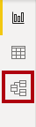
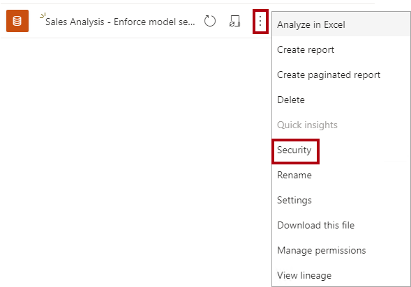
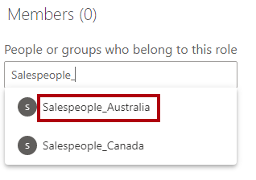
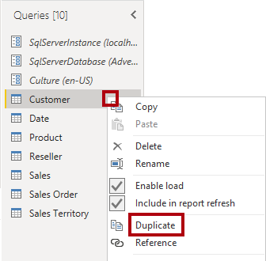
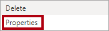

---
lab:
  title: Appliquer la sécurité du modèle sémantique
  module: Design and build tabular models
---

# Appliquer la sécurité du modèle sémantique

Dans cet exercice, vous allez mettre à jour un modèle de données prédéfini pour appliquer la sécurité. Plus précisément, les vendeurs de l’entreprise Adventure Works ne doivent être en mesure de voir que les données de vente liées à la région qui leur est affectée.

Dans cet exercice, vous apprenez à effectuer les opérations suivantes :

- Créer des rôles statiques.
- Créer des rôles dynamiques.
- Valider les rôles
- Mapper des principaux de sécurité à des rôles de modèle sémantique.

Ce labo est d’une durée de **45** minutes environ.

> **Remarque** : Vous devez disposer d’une [licence d’essai Microsoft Fabric](https://learn.microsoft.com/fabric/get-started/fabric-trial) pour effectuer cet exercice.

## Bien démarrer

Dans cet exercice, vous allez préparer votre environnement.

### Télécharger le fichier de démarrage Power BI

1. Téléchargez le [fichier Sales Analysis starter](https://aka.ms/fabric-security-starter) à partir de `https://aka.ms/fabric-security-starter` et enregistrez-le sur votre ordinateur local (dans n’importe quel dossier).

1. Accédez au fichier téléchargé et ouvrez-le dans Power BI Desktop.

1. Lorsque vous y êtes invité, connectez-vous avec un compte professionnel ou scolaire.

### Se connecter au service Power BI

Dans cette tâche, vous allez vous connecter au service Power BI, démarrer une licence d’évaluation et créer un espace de travail.

1. Dans un navigateur Web, accédez à `https://app.powerbi.com/`.

2. Terminez le processus de connexion avec le même compte utilisé dans Power BI Desktop.

    *Important : vous devez utiliser les mêmes informations d’identification que celles utilisées pour vous connecter à partir de Power BI Desktop.*

    *Conseil : l’expérience du navigateur web de Power BI est appelée **service Power BI**.*

### Créer un espace de travail

Dans cette tâche, vous allez créer un espace de travail.

1. Dans le service Power BI, pour créer un espace de travail, dans le volet **Navigation** (situé à gauche), sélectionnez **Espaces de travail**, puis **+ Nouvel espace de travail**.

2. Dans le volet **Créer un espace de travail** (situé à droite), dans la zone **Nom**, entrez un nom pour l’espace de travail.

    *Ce nom doit être unique au sein du locataire.*

3. Sélectionnez **Appliquer**.

    *Une fois créé, l’espace de travail est ouvert. Dans un exercice ultérieur, vous allez publier un modèle sémantique dans cet espace de travail.*

### Examiner le modèle de données

Dans cette tâche, vous allez passer en revue le modèle de données.

1. Dans Power BI Desktop, à gauche, passez à la vue **Modèle**.

    

2. Utilisez le diagramme de modèle pour passer en revue la conception du modèle.

    

    *Le modèle comprend six tables de dimension et une table de faits. La table de faits **Sales** stocke les détails de la commande client. Il s’agit d’une conception classique de schéma en étoile.*

3. Développez la table **Sales Territory**.

    

4. Notez que la table inclut une colonne **Region**.

    *La colonne **Region** stocke les régions de ventes d’Adventure Works. Au sein de cette organisation, les commerciaux sont autorisés à voir uniquement les données relatives à leur région de vente. Dans ce labo, vous allez implémenter deux techniques de sécurité au niveau des lignes différentes pour appliquer des autorisations de données.*

## Créer des rôles statiques

Dans cet exercice, vous allez créer et valider des rôles statiques, puis voir comment mapper des principaux de sécurité aux rôles de modèle sémantique.

### Créer des rôles statiques

Dans cette tâche, vous allez créer deux rôles statiques.

1. Passez à l’affichage **Report**.

    

2. Dans le visuel de graphique à barres empilées, dans la légende, notez qu’il est possible (pour l’instant) de voir un grand nombre de régions.

    

    *Pour l’instant, le graphique semble trop chargé. C’est parce que toutes les régions sont visibles. Lorsque la solution applique la sécurité au niveau des lignes, le consommateur de rapports ne voit qu’une seule région.*

3. Sous l’onglet de ruban **Modélisation**, dans le groupe **Sécurité**, sélectionnez **Gérer les rôles** pour ajouter un rôle de sécurité.

    

4. Dans la fenêtre **Gérer les rôles**, sélectionnez **+ Nouveau**.

5. Pour nommer le rôle, remplacez le texte *Sans titre* sélectionné par **Australia**, puis appuyez sur **Entrée**.

6. Dans la liste **Sélectionner des tables**, sélectionnez **Sales Territory**, puis, dans la section **Filtrer les données**, sélectionnez **+ Nouveau**.
  
7. Dans la nouvelle ligne de règle, définissez les paramètres suivants :
    * **Colonne** : Region
    * **Condition** : Equals
    * **Valeur** : Australia

    

    *Cette règle filtre la colonne **Region** en fonction de la valeur **Australia**.*

10. Pour créer un autre rôle, appuyez sur **+ Nouveau** dans la **section Rôles**.

11. Répétez les étapes de cette tâche pour créer un rôle nommé **Canada** qui filtre la colonne **Region** par **Canada**.

    

    *Dans ce labo, vous allez créer uniquement deux rôles. Toutefois, n’oubliez pas que dans une solution réelle, un rôle doit être créé pour chacune des onze régions d’Adventure Works.*

12. Sélectionnez **Enregistrer**.

### Valider les rôles statiques

Dans cette tâche, vous allez valider l’un des rôles statiques.

1. Sous l’onglet de ruban **Modélisation**, dans le groupe **Sécurité**, sélectionnez **Afficher comme**.

    

2. Dans la fenêtre **Afficher comme rôles**, sélectionnez le rôle **Australia**.

    

3. Cliquez sur **OK**.

    

4. Sur la page du rapport, notez que le visuel de graphique à barres empilées affiche uniquement les données pour l’Australie.

    

5. En haut du rapport, la bannière jaune qui confirme le rôle appliqué apparaît.

    

6. Pour arrêter l’affichage à partir du rôle, à droite de la bannière jaune, sélectionnez **Arrêter l’affichage**.

    

### Publier l’état

Dans cette tâche, vous allez publier le rapport.

1. Enregistrez le fichier Power BI Desktop. Quand il vous est demandé d’appliquer les modifications en attente, sélectionnez **Appliquer plus tard**.

    

2. Pour publier le rapport, sous l’onglet de ruban **Accueil**, sélectionnez le bouton **Publier**.

    

3. Dans la fenêtre **Publier sur Power BI**, sélectionnez votre espace de travail, puis **Sélectionner**.

    

4. Une fois la publication réussie, sélectionnez **OK**.

    

### Configurer la sécurité au niveau des lignes (*facultatif*)

Dans cette tâche, vous allez voir comment configurer la sécurité au niveau des lignes dans le service Power BI.

Cette tâche s’appuie sur l’existence d’un groupe de sécurité **Salespeople_Australia** dans le locataire dans lequel vous travaillez. Ce groupe de sécurité N’existe PAS automatiquement dans le locataire. Si vous disposez d’autorisations sur votre locataire, vous pouvez suivre les étapes ci-dessous. Si vous utilisez un locataire fourni pour la formation, vous n’avez pas les autorisations appropriées pour créer des groupes de sécurité. Lisez les tâches, mais notez que vous ne pourrez pas les terminer en l’absence du groupe de sécurité. **Après la lecture, passez à la tâche de nettoyage.**

1. Basculez vers le service Power BI (navigateur web).

2. Dans la page d’arrivée de l’espace de travail, notez le modèle sémantique **Analyse des ventes – Appliquer le modèle de sécurité**.

    

3. Placez le curseur sur le modèle sémantique et, quand les points de suspension apparaissent, sélectionnez-les, puis sélectionnez **Sécurité**.

    

    *L’option **Sécurité** prend en charge le mappage des principaux de sécurité Microsoft Entra, qui incluent des groupes de sécurité et des utilisateurs.*

4. À gauche, examinez la liste des rôles ; vous verrez qu’**Australia** est sélectionné.

    

5. Dans la zone **Membres**, commencez à entrer **Salespeople_Australia**.

    *Les étapes 5 à 8 sont uniquement destinées à des fins de démonstration, car elles s’appuient sur la création ou l’existence d’un groupe de sécurité Salespeople_Australia. Si vous disposez des autorisations et des connaissances nécessaires pour créer des groupes de sécurité, n’hésitez pas à continuer. Sinon, passez à la tâche de nettoyage.*

    

6. Sélectionnez **Ajouter**.

    

7. Pour terminer le mappage de rôle, sélectionnez **Enregistrer**.

    

    *À présent, tous les membres du groupe de sécurité **Salespeople_Australia** sont mappés au rôle **Australia**, ce qui limite l’accès aux données pour afficher uniquement les ventes australiennes.*

    *Dans une solution réelle, chaque rôle doit être mappé à un groupe de sécurité.*

    *Cette approche de conception est simple et efficace quand des groupes de sécurité existent pour chaque région. Il existe cependant des inconvénients : créer et configurer demande plus de travail. Elle nécessite également de mettre à jour et de republier le modèle sémantique quand de nouvelles régions sont intégrées.*

    *Dans l’exercice suivant, vous allez créer un rôle dynamique piloté par les données. Cette approche de conception peut aider à résoudre ces inconvénients.*

8. Pour revenir à la page d’accueil de l’espace de travail, dans le volet **Navigation**, sélectionnez l’espace de travail.

### Nettoyer la solution

Dans cette tâche, vous allez nettoyer la solution en supprimant le modèle sémantique et les rôles de modèle.

1. Pour supprimer le modèle sémantique, placez le curseur sur le modèle sémantique et, quand les points de suspension apparaissent, sélectionnez-les, puis sélectionnez **Supprimer**.

    

    *Vous allez republier un modèle sémantique révisé dans l’exercice suivant.*

2. Lorsque vous êtes invité à confirmer la suppression, sélectionnez **Supprimer**.

    

3. Revenez à Power BI Desktop.

4. Pour supprimer les rôles de sécurité, sous l’onglet de ruban **Modélisation**, dans le groupe **Sécurité**, sélectionnez **Gérer les rôles**.

    

5. Dans la fenêtre **Gérer les rôles**, pour supprimer le premier rôle, sélectionnez les points de suspension à côté de ce rôle, puis sélectionnez **Supprimer**.

    

6. Supprimez également le deuxième rôle.

7. Sélectionnez **Enregistrer**.

## Créer un rôle dynamique

Dans cet exercice, vous allez ajouter une table au modèle, créer et valider un rôle dynamique, puis mapper un principal de sécurité au rôle de modèle sémantique.

### Créer la table Salesperson

Dans cette tâche, vous allez ajouter la table **Salesperson** au modèle.

1. Basculez vers la vue **Modèle**.

    

2. Sous l’onglet de ruban **Accueil**, dans le groupe **Requêtes**, sélectionnez l’icône **Transformer les données**.

    

    *Si vous êtes invité à spécifier le mode de connexion, sélectionnez **Modifier les informations d’identification** et spécifiez le mode de connexion.*

    

    *Sélectionnez **Se connecter***

     

    *Dans la page **Prise en charge du chiffrement**, sélectionnez **OK**.*

3. Dans la fenêtre **Éditeur Power Query**, dans le volet **Requêtes** (situé à gauche), cliquez avec le bouton droit sur la requête **Customer**, puis sélectionnez **Dupliquer**.

    

    *Étant donné que la requête **Customer** inclut déjà des étapes pour connecter l’entrepôt de données, la duplication est un moyen efficace de commencer le développement d’une nouvelle requête.*

4. Dans le volet **Paramètres de la requête** (situé à droite), dans la zone **Nom**, remplacez le texte par **Salesperson**.

    

5. Dans la liste **Étapes appliquées**, cliquez avec le bouton droit sur l’étape **Supprimer d’autres colonnes** (troisième étape), puis sélectionnez **Supprimer jusqu’à la fin**.

    

6. Lorsque vous êtes invité à confirmer la suppression, sélectionnez **Supprimer**.

    

7. Pour sourcer des données à partir d’une autre table d’entrepôt de données, dans la liste **Étapes appliquées**, dans l’étape **Navigation** (deuxième étape), sélectionnez l’icône d’engrenage (située à droite).

    

8. Dans la fenêtre **Navigation**, sélectionnez la table **DimEmployee**.

    

9. Cliquez sur **OK**.

    

10. Pour supprimer des colonnes inutiles, sous l’onglet de ruban **Accueil**, dans le groupe **Gérer les colonnes**, sélectionnez l’icône **Choisir les colonnes**.

    

11. Dans la fenêtre **Choisir des colonnes**, décochez l’élément **(Sélectionner toutes les colonnes)**.

    

12. Cochez les trois colonnes suivantes :

    - EmployeeKey

    - SalesTerritoryKey

    - EmailAddress

13. Cliquez sur **OK**.

    

14. Pour renommer la colonne **EmailAddress**, double-cliquez sur l’en-tête de colonne **EmailAddress**.

15. Remplacez le texte par **UPN**, puis appuyez sur **Entrée**.

    *UPN est l’acronyme de User Principal Name (nom d’utilisateur principal). Les valeurs de cette colonne correspondent aux noms de compte Azure AD.*

    

16. Pour charger la table dans le modèle, sous l’onglet de ruban **Accueil**, sélectionnez l’icône **Fermer &amp; appliquer**.

    

17. Lorsque la table a été ajoutée au modèle, notez qu’une relation avec la table **Sales Territory** a été créée automatiquement.

### Configurer la relation

Dans cette tâche, vous allez configurer les propriétés de la nouvelle relation.

1. Cliquez avec le bouton droit sur la relation entre les tables **Salesperson** et **Sales Territory**, puis sélectionnez **Propriétés**.

    

2. Dans la liste déroulante **Direction du filtre croisé** de la fenêtre **Modifier la relation**, sélectionnez **Les deux**.

3. Cochez la case **Appliquer le filtre de sécurité dans les deux directions**.

    

    *Étant donné qu’il existe une relation un-à-plusieurs entre la table **Sales Territory** et la table **Salesperson**, les filtres se propagent uniquement de la table **Sales Territory** à la table **Salesperson**. Pour forcer la propagation dans l’autre sens, la direction du filtrage croisé doit être définie sur les deux.*

4. Cliquez sur **OK**.

    

5. Pour masquer la table, en haut à droite de la table **Salesperson**, sélectionnez l’icône d’œil.

    

    *L’objectif de la table **Salesperson** est d’appliquer des autorisations de données. Lorsqu’ils sont masqués, les créateurs de rapports et l’expérience Q&A ne voient pas la table ou ses champs.*

### Créer un rôle dynamique

Dans cette tâche, vous allez créer un rôle dynamique, qui applique des autorisations basées sur des données dans le modèle.

1. Passez à l’affichage **Report**.

    

2. Sous l’onglet de ruban **Modélisation**, dans le groupe **Sécurité**, sélectionnez **Gérer les rôles** pour ajouter un rôle de sécurité.

    

3. Dans la fenêtre **Gérer les rôles**, sélectionnez **Créer**.

    

4. Pour nommer le rôle, remplacez le texte sélectionné par **Salespeople**.

    

    *Cette fois, un seul rôle doit être créé.*

5. Ajoutez un filtre à la colonne **UPN** de la table **Salesperson**.

    

6. Dans la zone **Expression DAX de filtre de table**, remplacez **"Value"** par `USERPRINCIPALNAME()`.

    

    *Cette expression filtre la colonne **UPN** par la fonction USERPRINCIPALNAME, qui retourne le nom d’utilisateur principal (UPN) de l’utilisateur authentifié.*

    *Lorsque l’UPN filtre la table **Salesperson**, elle filtre la table **Sales Territory**, qui filtre à son tour la table **Sales**. De cette manière, l’utilisateur authentifié voit uniquement les données de vente de sa région.*

7. Sélectionnez **Enregistrer**.

    

### Valider le rôle dynamique

Dans cette tâche, vous allez valider le rôle dynamique.

1. Sous l’onglet de ruban **Modélisation**, dans le groupe **Sécurité**, sélectionnez **Afficher comme**.

    

2. Dans la fenêtre **Afficher comme rôles**, cochez **Autre utilisateur**, puis dans la zone correspondante, entrez : `michael9@adventure-works.com`.

    

    *À des fins de test, **Autre utilisateur** est la valeur qui sera renvoyée par la fonction USERPRINCIPALNAME. Notez que ce vendeur est affecté à la région **Northeast**.*

3. Sélectionnez le rôle **Salespeople**.

    

4. Cliquez sur **OK**.

    

5. Sur la page de rapport, notez que le visuel de graphique à barres empilées affiche uniquement les données de la région Nord-est.

    

6. En haut du rapport, la bannière jaune qui confirme le rôle appliqué apparaît.

    

7. Pour arrêter l’affichage à partir du rôle, à droite de la bannière jaune, sélectionnez **Arrêter l’affichage**.

    

### Finaliser la conception

Dans cette tâche, vous allez finaliser la conception en publiant le rapport et en mappant un groupe de sécurité au rôle.

*Les étapes décrites dans cette tâche sont délibérément brèves. Pour plus d’informations, reportez-vous aux étapes de tâche de l’exercice précédent.*

1. Enregistrez le fichier Power BI Desktop.

2. Publiez le rapport sur l’espace de travail que vous avez créé au début du labo.

3. Fermez Power BI Desktop.

4. Basculez vers le service Power BI (navigateur web).

5. Accédez aux paramètres pour le modèle sémantique **Analyse des ventes – Appliquer la sécurité du modèle**.

6. Mappez le groupe de sécurité **Salespeople** au rôle **Salespeople**.

    

    *À présent, tous les membres du groupe de sécurité **Salespeople** sont mappés au rôle **Salespeople**. Si l’utilisateur authentifié est représenté par une ligne dans la table **Salesperson**, le territoire de vente affecté sera utilisé pour filtrer la table des ventes.*

    *Cette approche de conception est simple et efficace lorsque le modèle de données stocke les valeurs de nom d’utilisateur principal (UPN). Lorsque des commerciaux sont ajoutés ou supprimés, ou qu’ils sont affectés à différents territoires de vente, cette approche de conception fonctionne simplement.*
