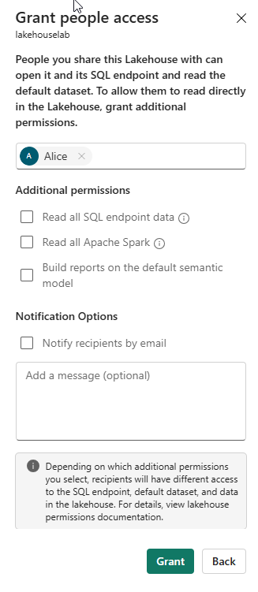
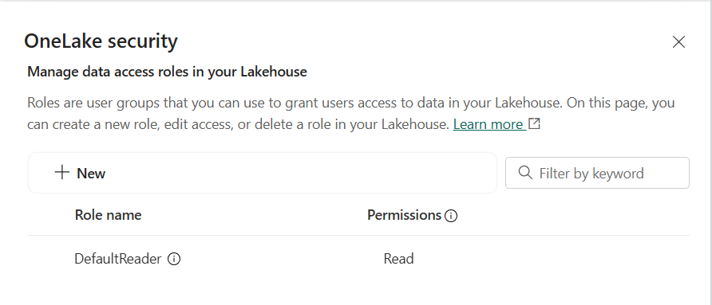

---
lab:
  title: "Sécuriser l’accès aux données dans Microsoft\_Fabric"
  module: Secure data access in Microsoft Fabric
---

# Sécuriser l’accès aux données dans Microsoft Fabric

Microsoft Fabric offre un modèle de sécurité multicouche pour gérer l’accès aux données. La sécurité peut être définie pour un espace de travail entier, pour des éléments individuels ou via des autorisations granulaires dans chaque moteur Fabric. Dans cet exercice, vous sécurisez les données à l’aide de l’espace de travail, ainsi que des contrôles d’accès aux éléments et des rôles d’accès aux données OneLake.

Ce labo est d’une durée de **45** minutes environ.

## Créer un espace de travail

Avant d’utiliser des données dans Fabric, créez un espace de travail avec l’essai gratuit de Fabric activé.

1. Accédez à la [page d’accueil de Microsoft Fabric](https://app.fabric.microsoft.com/home?experience=fabric) sur `https://app.fabric.microsoft.com/home?experience=fabric` dans un navigateur et connectez-vous avec vos informations d’identification Fabric.
1. Dans la barre de menus à gauche, sélectionnez **Espaces de travail** (l’icône ressemble à &#128455;).
1. Créez un espace de travail avec le nom de votre choix et sélectionnez un mode de licence qui inclut la capacité Fabric (*Essai*, *Premium* ou *Fabric*).
1. Lorsque votre nouvel espace de travail s’ouvre, il doit être vide.

    

> **Remarque** : Quand vous créez un espace de travail, vous devenez automatiquement membre du rôle Administrateur d’espace de travail.

## Créer un entrepôt de données

Ensuite, créez un entrepôt de données dans l’espace de travail que vous avez créé.

1. Cliquez sur **+ Nouvel élément**. Dans la page *Nouvel élément*, sous la section *Stocker des données*, sélectionnez **Exemple d’entrepôt** et créez un entrepôt de données avec le nom de votre choix.

     Au bout d’une minute environ, un nouvel entrepôt est créé :

    

## Créer un lakehouse
Ensuite, créez un lakehouse dans l’espace de travail que vous avez créé.

1. Dans la barre de menu à gauche, sélectionnez **Espaces de travail** (l’icône ressemble à 🗇).
2. Sélectionnez l’espace de travail que vous avez créé.
3. Dans l’espace de travail, sélectionnez le bouton **+ Nouvel élément**, puis **Lakehouse**. Créez un lakehouse avec le nom de votre choix.

   Au bout d’une minute environ, un nouveau lakehouse est créé :

    

4. Sélectionnez la vignette **Démarrer avec l’exemple de données**, puis sélectionnez l’exemple **Jours fériés**. En une minute environ, le lakehouse est rempli de données.

## Appliquer les contrôles d’accès à l’espace de travail

Les rôles d’espace de travail sont utilisés pour contrôler l’accès aux espaces de travail et le contenu qu’ils contiennent. Les rôles de l’espace de travail peuvent être attribués lorsque les utilisateurs doivent afficher tous les éléments d’un espace de travail, quand ils doivent gérer l’accès à l’espace de travail ou créer de nouveaux éléments Fabric, ou lorsqu’ils ont besoin d’autorisations spécifiques pour afficher, modifier ou partager du contenu dans l’espace de travail.  

Dans cet exercice, vous ajoutez un utilisateur à un rôle d’espace de travail, appliquez des autorisations et voyez ce qui est visible lorsque chaque ensemble d’autorisations est appliqué. Vous ouvrez deux navigateurs et vous vous connectez en tant qu’utilisateurs différents. Dans un navigateur, vous serez **administrateur d’espace de travail**. Dans l’autre, vous vous connecterez en tant qu’utilisateur moins privilégié. Dans un navigateur, l’administrateur de l’espace de travail modifie les autorisations du deuxième utilisateur. Dans le deuxième navigateur s’affichent les effets de la modification des autorisations.  

1. Dans la barre de menus à gauche, sélectionnez **Espaces de travail** (l’icône ressemble à &#128455;).
2. Sélectionnez l’espace de travail que vous avez créé.
3. Dans le menu en haut de l’écran, sélectionnez **Gérer les accès**.

> **Remarque** : vous verrez que l’utilisateur connecté a le rôle **Administrateur de l’espace de travail**, car vous avez créé l’espace de travail. Aucun autre utilisateur n’a encore accès à l’espace de travail.

4. Ensuite, vous verrez ce qu’un utilisateur sans autorisations sur l’espace de travail peut afficher. Dans votre navigateur, ouvrez une fenêtre InPrivate. Dans le navigateur Microsoft Edge, sélectionnez l’ellipse en haut à droite, puis **Nouvelle fenêtre InPrivate**.
5. Entrez https://app.fabric.microsoft.com et connectez-vous en tant que deuxième utilisateur que vous utilisez pour les tests.  
6. Dans le coin inférieur gauche de votre écran, sélectionnez **Microsoft Fabric**, puis **Entrepôt de données**. Sélectionnez ensuite **Espaces de travail** (l’icône ressemble à &#128455;).  

> **Remarque :** le deuxième utilisateur n’a pas accès à l’espace de travail. Il n’est donc pas visible.

7. Ensuite, vous attribuez le rôle **Lecteur de l’espace de travail** au deuxième utilisateur et voyez que le rôle accorde l’accès en lecture à l’entrepôt dans l’espace de travail.  
8. Revenez à la fenêtre du navigateur dans laquelle vous êtes connecté en tant qu’administrateur de l’espace de travail. Vérifiez que vous êtes toujours sur la page qui affiche l’espace de travail que vous avez créé. Vous devez voir vos nouveaux éléments d’espace de travail et l’échantillon d’entrepôt et de lakehouse, répertoriés en bas de la page.
9. Sélectionnez **Gérer l’accès** en haut à droite de l’écran.
10. Sélectionnez **Ajouter des personnes ou des groupes**. Entrez l’e-mail du deuxième utilisateur avec lequel vous effectuez des tests. Sélectionnez **Ajouter** pour affecter l’utilisateur au rôle **Lecteur** de l’espace de travail. 
11. Revenez à la fenêtre du navigateur InPrivate dans laquelle vous êtes connecté en tant que deuxième utilisateur et sélectionnez le bouton Actualiser sur le navigateur pour actualiser les autorisations de session affectées au deuxième utilisateur.
12. Sélectionnez l’icône **Espaces de travail** dans la barre de menu de gauche (l’icône ressemble à &#128455 ;) et sélectionnez le nom de l’espace de travail que vous avez créé en tant qu’utilisateur Administrateur de l’espace de travail. Le deuxième utilisateur peut désormais voir tous les éléments de l’espace de travail, car ils ont été affectés au rôle **Lecteur de l’espace de travail**.

    

13. Sélectionnez l’entrepôt et ouvrez-le.
14. Sélectionnez la table **Date** et attendez que les lignes soient chargées. Vous pouvez voir les lignes, car en tant que membre du rôle Lecteur de l’espace de travail, vous disposez de l’autorisation CONNECTER et ReadData sur les tables de l’entrepôt. Pour plus d’informations sur les autorisations accordées au rôle Lecteur de l’espace de travail, consultez [Rôles de l’espace de travail](https://learn.microsoft.com/en-us/fabric/data-warehouse/workspace-roles).
15. Ensuite, sélectionnez l’icône **Espaces de travail** dans la barre de menu de gauche, puis sélectionnez le lakehouse.
16. Lorsque le lakehouse s’ouvre, cliquez sur la zone de liste déroulante située en haut à droite de l’écran qui indique **Lakehouse** et sélectionnez **Point de terminaison d’analytique SQL**.
17. Sélectionnez la table **publicholidays** et attendez que les données soient affichées. Les données de la table lakehouse sont lisibles à partir du point de terminaison d’analytique SQL, car l’utilisateur a le rôle Lecteur de l’espace de travail qui accorde des autorisations de lecture sur le point de terminaison d’analytique SQL.

## Appliquer le contrôle d’accès des éléments

Les autorisations d’élément contrôlent l’accès à des éléments Fabric individuels au sein d’un espace de travail, tels que les entrepôts, les lakehouses et les modèles sémantiques. Dans cet exercice, vous supprimez les autorisations de **Lecteur de l’espace de travail** appliquées dans l’exercice précédent, puis appliquez des autorisations au niveau de l’élément sur l’entrepôt afin qu’un utilisateur moins privilégié puisse uniquement afficher les données de l’entrepôt, et non les données du lakehouse.

1. Revenez à la fenêtre du navigateur dans laquelle vous êtes connecté en tant qu’administrateur de l’espace de travail. Sélectionnez **Espaces de travail** dans le volet de navigation de gauche. 
2. Sélectionnez l’espace de travail que vous avez créé et ouvrez-le.
3. Dans le menu situé en haut de l’écran, sélectionnez **Gérer l’accès**.
4. Sélectionnez le mot **Lecteur** sous le nom du deuxième utilisateur. Dans le menu qui s’affiche, sélectionnez **Renommer**.

   

5. Fermez la section **Gérer l’accès**.
6. Dans l’espace de travail, pointez sur le nom de votre entrepôt jusqu’à ce qu’un ellipse (**...**) s’affiche. Sélectionnez l’ellipse, puis sélectionnez **Gérer les autorisations**.

7. Sélectionnez **Ajouter un utilisateur** et entrez le nom du deuxième utilisateur. 
8. Dans la zone qui s’affiche, sous **Autorisations supplémentaires**, cochez **Lire toutes les données à l’aide de SQL (ReadData)** et décochez toutes les autres cases.

    

9. Sélectionner **Accorder**.

10. Revenez à la fenêtre du navigateur dans laquelle vous êtes connecté en tant que deuxième utilisateur. Actualisez la vue du navigateur.  

11. Le deuxième utilisateur n’a plus accès à l’espace de travail, mais à l’entrepôt uniquement. Vous ne pouvez plus parcourir les espaces de travail dans le volet de navigation de gauche pour trouver l’entrepôt. Sélectionnez **OneLake** dans le menu de navigation de gauche pour rechercher l’entrepôt. 

12. Sélectionnez l’entrepôt. Dans l’écran qui s’affiche, sélectionnez **Ouvrir** dans la barre de menu supérieure.

13. Lorsque la vue de l’entrepôt s’affiche, sélectionnez la table **Date** pour afficher les données de la table. Les lignes sont visibles, car l’utilisateur a toujours accès en lecture à l’entrepôt. En effet, les autorisations ReadData ont été appliquées à l’aide d’autorisations d’élément sur l’entrepôt.

## Appliquer des rôles d’accès aux données OneLake dans un lakehouse

Les rôles d’accès aux données OneLake vous permettent de créer des rôles personnalisés dans un lakehouse et d’accorder des autorisations de lecture aux dossiers que vous spécifiez. Les rôles d’accès aux données OneLake sont actuellement une fonctionnalité d’évaluation.

Dans cet exercice, vous affectez une autorisation d’élément, créez un rôle d’accès aux données OneLake et expérimentez la façon dont ils fonctionnent ensemble pour restreindre l’accès aux données dans un lakehouse.  

1. Restez dans le navigateur dans lequel vous êtes connecté en tant que deuxième utilisateur.  
2. Sélectionnez **OneLake** dans la barre de navigation de gauche. Le deuxième utilisateur ne voit pas le lakehouse.  
3. Revenez au navigateur dans lequel vous êtes connecté en tant qu’administrateur de l’espace de travail.
4. Dans le menu de gauche, sélectionnez **Espaces de travail**, puis sélectionnez votre espace de travail. Pointez sur le nom du lac.  
5. Sélectionnez l’ellipse (**...**) à droite de l’ellipse, puis sélectionnez **Gérer les autorisations**

      

6. Dans l’écran qui s’affiche, sélectionnez **Ajouter un utilisateur**. 
7. Affectez le deuxième utilisateur au lakehouse et vérifiez qu’aucune des cases à cocher de la fenêtre **Accorder l’accès aux personnes** n’est cochée.  

      

8. Sélectionner **Octroyer**. Le deuxième utilisateur dispose désormais d’autorisations de lecture sur le lakehouse. L’autorisation en lecture permet uniquement à l’utilisateur de voir les métadonnées pour le lakehouse, mais pas les données sous-jacentes. Ensuite, nous validons le résultat.
9. Revenez au navigateur dans lequel vous êtes connecté en tant que deuxième utilisateur. Actualisez le navigateur.
10. Dans le volet de navigation à gauche, sélectionnez **OneLake**.  
11. Sélectionnez le lakehouse et ouvrez-le. 
12. Sélectionnez **Ouvrir** sur la barre de menu supérieure. Vous ne pouvez pas développer les tables ou fichiers, même si l’autorisation de lecture a été accordée. Ensuite, vous accordez au deuxième utilisateur l’accès à un dossier spécifique à l’aide des autorisations d’accès aux données OneLake.
13. Revenez au navigateur dans lequel vous êtes connecté en tant qu’administrateur de l’espace de travail.
14. Sélectionnez **Espaces de travail** dans la barre de navigation de gauche.
15. Sélectionnez le nom de votre espace de travail.
16. Sélectionnez le lakehouse.
1. Lorsque le lakehouse s’ouvre, sélectionnez **Gérer l’accès aux données OneLake** dans la barre de menu supérieure et activez la fonctionnalité en cliquant sur le bouton **Continuer**.

      

14. Sélectionnez un nouveau rôle sur l’écran **Gérer l’accès aux données OneLake (préversion)** qui s’affiche.
  
      

15. Créez un rôle appelé **publicholidays** qui ne peut accéder qu’au dossier publicholidays, comme illustré dans la capture d’écran ci-dessous.

      

16. Une fois le rôle créé, sélectionnez **Attribuer un rôle** et attribuez le rôle à votre deuxième utilisateur. Sélectionnez **Ajouter** et **Enregistrer**.
 
       

17. Revenez au navigateur dans lequel vous êtes connecté en tant que deuxième utilisateur. Assurez-vous que vous êtes toujours sur la page où le lakehouse est ouvert. Actualisez le navigateur.  
18. Sélectionnez la table **publicholidays** et attendez que les données se chargent. Seules les données de la table publicholidays sont accessibles à l’utilisateur, car l’utilisateur a été affecté au rôle d’accès aux données OneLake personnalisé. Ce rôle permet de voir uniquement les données de la table publicholidays, et non des autres tables, fichiers ou dossiers.

## Nettoyer les ressources

Dans cet exercice, vous avez sécurisé les données à l’aide des contrôles d’accès à l’espace de travail, des contrôles d’accès aux éléments et des rôles d’accès aux données OneLake.

1. Dans la barre de navigation de gauche, sélectionnez l’icône de votre espace de travail pour voir tous les éléments qu’il contient.
2. Dans le menu de la barre d’outils du haut, sélectionnez **Paramètres de l’espace de travail**.
3. Dans la section **Général**, sélectionnez **Supprimer cet espace de travail**.
