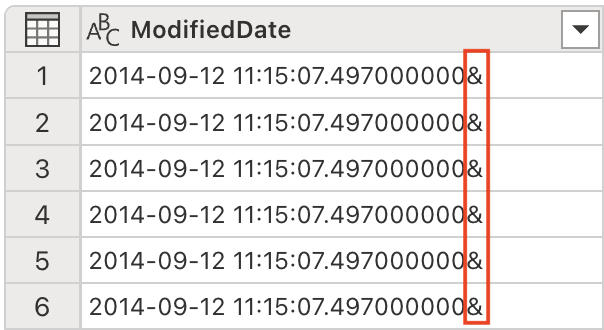

---
lab:
  title: Travaillez plus intelligemment avec Copilot dans Microsoft Fabric Dataflow Gen2
  module: Get started with Copilot in Fabric for data engineering
---

# Travaillez plus intelligemment avec Copilot dans Microsoft Fabric Dataflow Gen2

Dans Microsoft Fabric, les flux de données (Gen2) se connectent à différentes sources de données et effectuent des transformations dans Power Query Online. Ils peuvent ensuite être utilisés dans des pipelines de données pour ingérer des données dans un lakehouse ou un autre magasin analytique, ou pour définir un jeu de données pour un rapport Power BI. Ce labo propose une introduction à Copilot dans Dataflows (Gen2) plutôt que de se concentrer sur la création d’une solution d’entreprise complexe.

Cet exercice devrait prendre environ **30** minutes.

## Ce que vous allez apprendre

En suivant ce labo, vous allez :

- Découvrez comment utiliser Copilot dans Microsoft Fabric Dataflow Gen2 pour accélérer les tâches de transformation des données.
- Découvrez comment ingérer, nettoyer et transformer des données à l’aide de Power Query Online avec l’assistance de Copilot.
- Appliquez les meilleures pratiques en matière de qualité des données, notamment en renommant les colonnes, en supprimant les caractères indésirables et en définissant les types de données appropriés.
- Acquérez de l’expérience dans l’analyse et l’expansion de données XML au sein d’un flux de données.
- Classez les données continues en groupes significatifs pour les analyser.
- Publiez les données transformées dans un lakehouse et validez les résultats.
- Reconnaissez la valeur de l’ingénierie des données assistée par l’IA pour améliorer la productivité et la qualité des données.

## Avant de commencer

Vous devez disposer d’une [capacité Microsoft Fabric (F2 ou supérieure)](https://learn.microsoft.com/fabric/fundamentals/copilot-enable-fabric) avec Copilot activé pour effectuer cet exercice.

## Scénario de l’exercice

Contoso, une entreprise mondiale de vente au détail, modernise son infrastructure de données à l’aide de Microsoft Fabric. En tant qu’ingénieur données, vous êtes chargé de préparer les informations des magasins pour l’analyse. Les données brutes sont stockées dans un fichier CSV et comprennent des champs XML intégrés, des noms de colonnes incohérents et des caractères indésirables. Votre objectif est d’utiliser Copilot dans Dataflow Gen2 pour ingérer, nettoyer, transformer et enrichir ces données, afin qu’elles soient prêtes à être utilisées pour le reporting et l’analyse dans le lakehouse. Cet exercice pratique vous guidera à travers chaque étape, en vous montrant comment Copilot accélère et simplifie les tâches courantes d’ingénierie des données.

## Créer un espace de travail

Avant de travailler avec des données dans Fabric, créez un espace de travail avec Fabric activé. Un espace de travail sert de conteneur pour tous vos éléments Fabric et offre des fonctionnalités de collaboration pour les équipes.

1. Accédez à la [page d’accueil de Microsoft Fabric](https://app.fabric.microsoft.com/home?experience=fabric) sur `https://app.fabric.microsoft.com/home?experience=fabric` dans un navigateur et connectez-vous avec vos informations d’identification Fabric.

1. Dans la barre de menus à gauche, sélectionnez **Espaces de travail** (l’icône ressemble à &#128455;).

1. Créez un nouvel espace de travail avec le nom de votre choix, en sélectionnant un mode de licence qui inclut la capacité Fabric (*Premium* ou *Fabric*). Remarque : *Trial* n’est pas pris en charge.

    > **Important** : Les fonctionnalités Copilot dans Fabric nécessitent une capacité payante (F2 ou supérieure). Les espaces de travail d’essai ne prennent pas en charge la fonctionnalité Copilot.

1. Lorsque votre nouvel espace de travail s’ouvre, il doit être vide.

    

## Créer un lakehouse

Maintenant que vous disposez d’un espace de travail, il est temps de créer un data lakehouse dans lequel vous ingérerez les données.

1. Sélectionnez **Créer** dans la barre de menus de gauche. Dans la page *Nouveau*, sous la section *Engineering données*, sélectionnez **Lakehouse**. Donnez-lui un nom unique de votre choix.

    >**Note** : si l’option **Créer** n’est pas épinglée à la barre latérale, vous devez d’abord sélectionner l’option avec des points de suspension (**...**).

    Au bout d’une minute environ, un nouveau lakehouse vide est créé.

    

## Créer un flux de données (Gen2) pour ingérer des données

Maintenant que vous disposez d’un lakehouse, vous devez y ingérer des données. Pour ce faire, vous pouvez définir un flux de données qui encapsule un processus d’*extraction, transformation et chargement* (ETL).

1. Dans la page d’accueil de votre espace de travail, sélectionnez **Obtenir des données** > **Nouveau flux de données Gen2**. Après quelques secondes, l’éditeur Power Query de votre nouveau flux de données s’ouvre comme illustré ici.

    

1. Sélectionnez **Importer à partir d’un fichier texte/CSV** et créez une nouvelle source de données avec les paramètres suivants :

   - **Lien vers le fichier** : *Sélectionné*
   - **Chemin ou URL du fichier** : `https://raw.githubusercontent.com/MicrosoftLearning/mslearn-fabric/refs/heads/main/Allfiles/Labs/22a/Store.csv`
   - **Connexion** : Créez une nouvelle connexion
   - **Passerelle de données** : (aucune)
   - **Type d’authentification** : Anonyme
   - **Niveau de confidentialité** : Aucun(e)

1. Sélectionnez **Suivant** pour afficher un aperçu des données du fichier, puis **Créer** pour créer la source de données. L’éditeur Power Query affiche la source de données et un ensemble initial d’étapes de requête pour mettre en forme les données, comme illustré ici :

    

1. Dans l’onglet **Accueil** du ruban, à partir du groupe **Insights**, sélectionnez **Copilot**, comme illustré ici :
    
    

1. Les noms des colonnes sont actuellement trop génériques et manquent de clarté (probablement affichés sous la forme Column1, Column2, etc.). Des noms de colonnes pertinents sont essentiels pour la compréhension des données et leur traitement en aval. Utilisez le prompt suivant pour les améliorer et vous assurer qu’ils transmettent correctement les informations souhaitées :

    ```copilot-prompt
    Rename columns to BusinessEntityID, Name, SalesPersonID, Demographics, rowguid, ModifiedDate
    ```

    Notez que les noms des colonnes sont désormais précis et descriptifs. De plus, une étape supplémentaire a été ajoutée à la liste des étapes appliquées, montrant comment Copilot génère automatiquement le code M Power Query en arrière-plan :
    
    

1. Certaines colonnes contiennent un caractère « + » à la fin de leurs valeurs textuelles. Il s’agit d’un problème courant de qualité des données qui peut interférer avec l’analyse et le traitement des données en aval. 

    
    
    Nous allons éliminer ces caractères indésirables à l’aide du prompt suivant :
    
    ```copilot-prompt
    Delete the last character from the columns Name, Demographics, rowguid
    ```
    
    **Pourquoi c’est important** : La suppression des caractères superflus garantit la cohérence des données et permet d’éviter les problèmes lors des opérations sur les chaînes ou des jointures de données ultérieures dans le processus.

1. La table contient certaines colonnes redondantes qui doivent être supprimées afin de simplifier notre jeu de données et d’améliorer l’efficacité du traitement. Utilisez le prompt suivant pour améliorer les données en conséquence :

    
    
    ```copilot-prompt
    Remove the rowguid and Column7 columns
    ```
    
    **Remarque** : La colonne `rowguid` est généralement utilisée pour les opérations internes de la base de données et n’est pas nécessaire pour l’analyse. `Column7` semble être une colonne vide ou non pertinente qui n’ajoute aucune valeur à notre jeu de données.
    
1. La colonne Données démographiques contient un caractère Unicode invisible, la marque d’ordre des octets (Byte Order Mark - BOM) \ufeff, qui interfère avec l’analyse des données XML. Nous devons le supprimer pour garantir un traitement correct. Dans le volet Copilot, entrez l’invite suivante :

    ```copilot-prompt
    Remove the Byte Order Mark (BOM) \ufeff from the Demographics column
    ```
    
    **Comprendre le BOM** : La marque d’ordre des octets est un caractère Unicode qui peut apparaître au début des fichiers texte pour indiquer l’ordre des octets de l’encodage du texte. Bien qu’elle soit utile pour la détection de l’encodage des fichiers, elle peut poser des problèmes lors de l’analyse de données structurées telles que XML.
    
    Remarquez la formule qui a été générée pour supprimer le caractère :
    
    
    
1. Nous pouvons maintenant analyser les données XML et les développer en colonnes distinctes. La colonne Données démographiques contient des données au format XML qui fournissent des informations précieuses sur les magasins, telles que le chiffre d’affaires annuel, la superficie en mètres carrés et d’autres indicateurs commerciaux.

    
    
    Dans le volet Copilot, entrez l’invite suivante :
    
    ```copilot-prompt
    Parse this XML and expand it's columns
    ```
    
    **Comprendre l’analyse XML** : XML (eXtensible Markup Language) est un format de données structuré couramment utilisé pour stocker des informations hiérarchiques. En analysant et en développant le fichier XML, nous convertissons les données imbriquées en une structure tabulaire plate, plus facile à analyser.
    
    Vous remarquerez que de nouvelles colonnes ont été ajoutées à la table (vous devrez peut-être faire défiler vers la droite).
    
    

1. Supprimez la colonne Données démographiques, car nous n’en avons plus besoin puisque nous avons extrait toutes les informations utiles dans des colonnes distinctes. Dans le volet Copilot, entrez l’invite suivante :

    ```copilot-prompt
    Remove the Demographics column.
    ```

    **Pourquoi supprimer cette colonne** : Maintenant que nous avons analysé le XML et créé des colonnes individuelles pour chaque élément d’information, la colonne Données démographiques d’origine contenant le XML brut est redondante et peut être supprimée en toute sécurité afin de garder notre jeu de données propre.

1. La colonne ModifiedDate contient une esperluette (&) à la fin de ses valeurs. Elle doit être supprimée avant l’analyse afin d’assurer un traitement correct des données.

    
    
    Dans le volet Copilot, entrez l’invite suivante :
    
    ```copilot-prompt
    Remove the last character from the ModifiedDate
    ```

1. Nous pouvons maintenant convertir son type de données en DateHeure afin de permettre des opérations et analyses correctes sur les dates et heures. Dans le volet Copilot, entrez l’invite suivante :

    ```copilot-prompt
    Set the data type to DateTime
    ```

    **Importance du type de données** : La conversion vers le type de données correct est essentielle pour permettre un tri, un filtrage et des calculs basés sur la date appropriés dans l’analyse en aval.

    Vous remarquerez que le type de données ModifiedDate a été remplacé par DateHeure :
    
    
    
1. Ajustez les types de données de plusieurs colonnes à des valeurs numériques afin de permettre les opérations mathématiques et les agrégations appropriées. Dans le volet Copilot, entrez l’invite suivante :

    ```copilot-prompt
    Set the data type to whole number for the following columns: AnnualSales, AnnualRevenue, SquareFeet, NumberEmployee
    ```
    
    **Pourquoi convertir en nombres** : Les types de données numériques permettent d’effectuer des calculs mathématiques, des agrégations (somme, moyenne, etc.) et des analyses statistiques qui ne seraient pas possibles avec des données textuelles.
    
1. Le champ MètresCarrés contient des valeurs numériques comprises entre 6 000 et 80 000. Créer des regroupements catégoriels à partir de données numériques continues est une technique d’analyse courante qui facilite l’interprétation et l’analyse des données.

    
    
    Nous allons générer une nouvelle colonne afin de classer la taille des magasins en conséquence. Dans le volet Copilot, entrez l’invite suivante :
    
    ```copilot-prompt
    Add a column StoreSize, based on the SquareFeet:
        0 - 10000: Small
        10001 - 40000: Medium
        40001 - 80000: Large
    ```
    
    Vous remarquerez qu’une nouvelle colonne TailleMagasin a été ajoutée, avec une formule basée sur la colonne MètresCarrés. Vous remarquerez également que le profil de la colonne comporte trois valeurs distinctes : Petit, Moyen et Grand.
    
    
    
1. Modifiez les types de données des colonnes qui ne disposent actuellement pas d’un type spécifié. Dans le volet Copilot, entrez l’invite suivante :

    ```copilot-prompt
    Set the datatype of the following columns to text: Name, BankName, BusinessType, YearOpened, Specialty, Brands, Internet, StoreSize
    ```
    
    **Cohérence du type de données** : La définition explicite des types de données garantit un comportement prévisible dans les processus en aval et empêche l’inférence automatique des types qui pourrait conduire à des résultats inattendus.
    
## Explication du code

1. Nous avons effectué plusieurs transformations. Demandons à Copilot de résumer les étapes que nous avons suivies :

    ```copilot-prompt
    Describe this query
    ```
    
    Vous constaterez que le résultat apparaît dans le volet Copilot. Vous trouverez ci-dessous un exemple de l’explication fournie. Vos résultats peuvent varier légèrement, car le contenu généré par l’IA peut comporter des erreurs.
    
    
    
    *Voici une explication pour **Magasin** : Chargez et transformez un fichier CSV, analysez les données XML et catégorisez les magasins par taille.*
    
    - _**Source** : Chargez un fichier CSV à partir d’une URL avec un délimiteur de canal et un encodage spécifique._
    - _**Type de colonne modifié** : Modifiez les types de données des colonnes._
    - _**Renommer des colonnes** : Renommez les colonnes en leur donnant des noms significatifs._
    - _**Personnalisé** : Supprimez le dernier caractère des colonnes « Nom », « Données démographiques » et « rowguid »._
    - _**Supprimer des colonnes** : Supprimez les colonnes « rowguid » et « Column7 »._
    - _**Personnalisé 1** : Supprimez tous les caractères spéciaux en début de ligne dans la colonne « Données démographiques »._
    - _**Personnalisé 2** : Analysez la colonne « Données démographiques » en tant que XML et développez-la en plusieurs colonnes._
    - _**Supprimer des colonnes 1** : Supprimez la colonne « Données démographiques » d’origine._
    - _**Transformer des colonnes** : Supprimez le dernier caractère de la colonne « ModifiedDate »._
    - _**Transformer des colonnes 1** : Convertissez la colonne « ModifiedDate » en type dateheure._
    - _**Modifier le type** : Modifiez les types de données des colonnes « VentesAnnuelles », « RevenuAnnuel », « MètresCarrés » et « NombreEmployés » en entier._
    - _**Colonne conditionnelle** : Ajouter une nouvelle colonne « TailleMagasin » basée sur la valeur « MètresCarrés », en catégorisant les magasins comme « Petit », « Moyen » ou « Grand »._
    - _**Modifier le type 1** : Modifiez les types de données de plusieurs colonnes en texte._
    
## Ajouter une destination de données pour le flux de données

1. Dans le ruban de la barre d’outils, sélectionnez l’onglet **Accueil**. Ensuite, dans le menu déroulant **Ajouter une destination de données**, sélectionnez **Lakehouse**.

    > **Remarque :** Si cette option est grisée, vous disposez peut-être déjà d’un jeu de destination de données. Vérifiez la destination des données en bas du volet Paramètres de la requête à droite de l’éditeur Power Query. Si une destination est déjà définie, vous pouvez la modifier à l’aide de l’engrenage.

1. Dans la boîte de dialogue **Se connecter à la destination des données**, modifiez la connexion et connectez-vous à l’aide de votre compte d’organisation Power BI pour définir l’identité que le flux de données utilise pour accéder au lakehouse.

    

1. Sélectionnez **Suivant** et, dans la liste des espaces de travail disponibles, recherchez votre espace de travail et sélectionnez le lakehouse que vous avez créé au début de cet exercice. Spécifiez ensuite une nouvelle table nommée **Magasin** :

    

1. Sélectionnez **Suivant** et, dans la page **Choisir les paramètres de destination**, désactivez l’option **Utiliser les paramètres automatiques**, sélectionnez **Ajouter**, puis **Enregistrer les paramètres**.

    > **Remarque :** Nous recommandons l’utilisation de l’éditeur *Power Query* pour mettre à jour les types de données, mais vous pouvez également le faire à partir de cette page.

    

1. Sélectionnez **Enregistrer et exécuter** pour publier le flux de données. Attendez ensuite que le flux de données **Dataflow 1** soit créé dans votre espace de travail.

## Validez votre travail

Il est maintenant temps de valider le processus ETL à partir du flux de données et de s’assurer que toutes les transformations ont été correctement appliquées.

1. Revenez à votre espace de travail et ouvrez le lakehouse que vous avez créé précédemment.

1. Dans le lakehouse, recherchez et ouvrez la table **Magasin**. (Vous devrez peut-être patienter quelques minutes avant qu’elle ne s’affiche, le temps que le flux de données traite les informations.)

1. Observez les aspects clés suivants de vos données transformées :

   - **Noms des colonnes** : Vérifiez qu’ils correspondent aux noms significatifs que vous avez spécifiés (BusinessEntityID, Name, SalesPersonID, etc.)
   - **Types de données** : Vérifiez que les colonnes numériques s’affichent sous forme de nombres, les colonnes DateHeure sous forme de date/heure et les colonnes texte sous forme de texte
   - **Qualité des données** : Vérifiez que les caractères indésirables (+, &) ont été supprimés
   - **Extension XML** : Vous remarquerez les colonnes individuelles qui ont été extraites des données démographiques XML d’origine
   - **Catégorisation TailleMagasin** : Vérifier que les catégories Petit/Moyen/Grand ont été correctement créées en fonction des valeurs de MètresCarrés
   - **Exhaustivité des données** : Assurez-vous qu’aucune donnée critique n’a été perdue pendant le processus de transformation

   

    **Pourquoi c’est important** : La table finale doit contenir des données propres et bien structurées, avec des noms de colonnes significatifs, des types de données appropriés et la nouvelle colonne catégorielle TailleMagasin. Cela montre comment Copilot peut aider à transformer des données brutes et désordonnées en un jeu de données propre, prêt pour l’analyse.

## Nettoyer les ressources

Si vous avez terminé d’explorer les flux de données dans Microsoft Fabric, vous pouvez supprimer l’espace de travail que vous avez créé pour cet exercice.

1. Accédez à Microsoft Fabric dans votre navigateur.
1. Dans la barre de gauche, sélectionnez l’icône de votre espace de travail pour afficher tous les éléments qu’il contient.
1. Sélectionnez **Paramètres de l’espace de travail** et, dans la section**Général**, faites défiler vers le bas et sélectionnez **Supprimer cet espace de travail**.
1. Sélectionnez **Supprimer** pour supprimer l’espace de travail.

