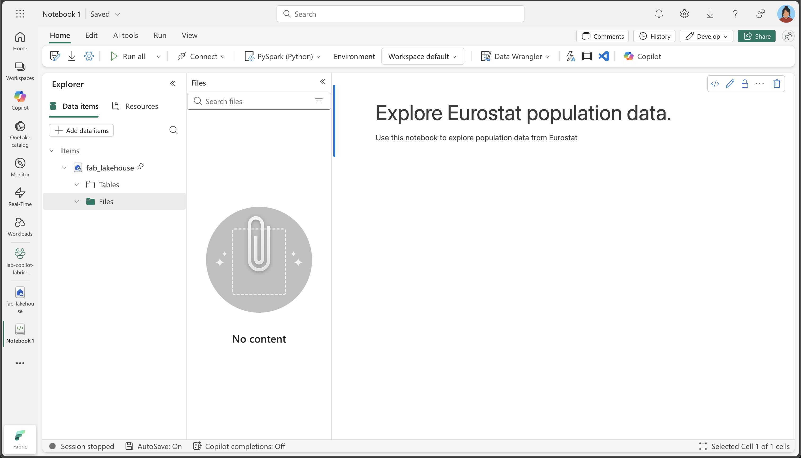

---
lab:
  title: Analysez les données avec Apache Spark et Copilot dans les notebooks Microsoft Fabric
  module: Get started with Copilot in Fabric for data engineering
---

# Analysez les données avec Apache Spark et Copilot dans les notebooks Microsoft Fabric

Dans ce labo, nous utilisons Copilot pour Fabric Data Engineering afin de charger, transformer et enregistrer des données dans un Lakehouse, à l’aide d’un notebook. Les notebooks offrent un environnement interactif qui combine code, visualisations et texte narratif dans un seul document. Ce format facilite la documentation de votre flux de travail, l’explication de votre raisonnement et le partage des résultats avec d’autres personnes. En utilisant des notebooks, vous pouvez développer et tester votre code de manière itérative, visualiser les données à chaque étape et conserver une trace claire de votre processus d’analyse. Cette approche favorise la collaboration, la reproductibilité et la compréhension, faisant des notebooks un outil idéal pour les tâches d’ingénierie et d’analyse de données.

Traditionnellement, travailler avec des notebooks pour l’ingénierie des données nécessite d’écrire du code dans des langages tels que Python ou Scala et d’avoir une bonne compréhension des infrastructures et des bibliothèques comme Apache Spark et pandas. Cela peut s’avérer difficile pour ceux qui débutent en programmation ou qui ne sont pas familiarisés avec ces outils. Avec Copilot dans les notebooks Fabric, vous pouvez décrire vos tâches de données en langage naturel, et Copilot générera le code nécessaire pour vous, en gérant une grande partie de la complexité technique et vous permettant de vous concentrer sur votre analyse.

Cet exercice devrait prendre environ **30** minutes.

## Ce que vous allez apprendre

En suivant ce labo, vous serez capable de :

- Créer et configurer un espace de travail Microsoft Fabric Lakehouse pour les tâches d’ingénierie des données.
- Utiliser Copilot dans les notebooks Fabric pour générer du code à partir de prompts en langage naturel.
- Ingérer, nettoyer et transformer des données à l’aide d’Apache Spark et de flux de travail assistés par Copilot.
- Normaliser et préparer des jeux de données statistiques pour l’analyse en divisant, filtrant et convertissant les types de données.
- Enregistrer les données transformées sous forme de table dans le lakehouse pour des analyses en aval.
- Utiliser Copilot pour générer des requêtes et des visualisations pour l’exploration et la validation des données.
- Comprendre les meilleures pratiques en matière de nettoyage, de transformation et d’analyse collaborative des données dans Microsoft Fabric.

## Avant de commencer

Vous devez disposer d’une [capacité Microsoft Fabric (F2 ou supérieure)](https://learn.microsoft.com/fabric/fundamentals/copilot-enable-fabric) avec Copilot activé pour effectuer cet exercice.

> **Remarque** : Pour vous faciliter la tâche, un cahier contenant tous les prompts relatifs à cet exercice est disponible en téléchargement à l’adresse suivante :

`https://github.com/MicrosoftLearning/mslearn-fabric/raw/refs/heads/main/Allfiles/Labs/22b/Starter/eurostat-notebook.ipynb`

## Scénario de l’exercice

Imaginons que Contoso Health, un réseau hospitalier à spécialités multiples, souhaite développer ses services dans l’Union européenne et analyser les données démographiques prévisionnelles. Cet exemple utilise le jeu de données sur les projections démographiques [Eurostat](https://ec.europa.eu/eurostat/web/main/home) (office statistique de l’Union européenne).

Source : EUROPOP2023 Population au 1er janvier par âge, sexe et type de projection [[proj_23np](https://ec.europa.eu/eurostat/databrowser/product/view/proj_23np?category=proj.proj_23n)], dernière mise à jour le 28 juin 2023.

## Créer un espace de travail

Avant de travailler avec des données dans Fabric, créez un espace de travail avec Fabric activé. Un espace de travail dans Microsoft Fabric sert d’environnement collaboratif où vous pouvez organiser et gérer tous vos artefacts d’ingénierie des données, y compris les lakehouses, les notebooks et les jeux de données. Considérez-le comme un dossier de projet contenant toutes les ressources nécessaires à votre analyse de données.

1. Accédez à la [page d’accueil de Microsoft Fabric](https://app.fabric.microsoft.com/home?experience=fabric) sur `https://app.fabric.microsoft.com/home?experience=fabric` dans un navigateur et connectez-vous avec vos informations d’identification Fabric.

1. Dans la barre de menus à gauche, sélectionnez **Espaces de travail** (l’icône ressemble à 🗇).

1. Créez un nouvel espace de travail avec le nom de votre choix, en sélectionnant un mode de licence qui inclut la capacité Fabric (*Premium* ou *Fabric*). Remarque : *Trial* n’est pas pris en charge.
   
    > **Pourquoi c’est important** : Copilot nécessite une capacité Fabric payante pour fonctionner. Cela vous garantit l’accès aux fonctionnalités basées sur l’intelligence artificielle qui vous aideront à générer du code tout au long de ce labo.

1. Lorsque votre nouvel espace de travail s’ouvre, il doit être vide.

    

## Créer un lakehouse

Maintenant que vous disposez d’un espace de travail, il est temps de créer un lakehouse dans lequel vous allez ingérer des données. Un lakehouse combine les avantages d’un lac de données (stockage de données brutes dans divers formats) et d’un entrepôt de données (données structurées optimisées pour l’analyse). Il servira à la fois de lieu de stockage pour nos données démographiques brutes et de destination pour notre jeu de données nettoyé et transformé.

1. Sélectionnez **Créer** dans la barre de menus de gauche. Dans la page *Nouveau*, sous la section *Engineering données*, sélectionnez **Lakehouse**. Donnez-lui un nom unique de votre choix.

    >**Note** : si l’option **Créer** n’est pas épinglée à la barre latérale, vous devez d’abord sélectionner l’option avec des points de suspension (**...**).


Au bout d’une minute environ, un nouveau lakehouse vide est créé.


## Créer un notebook

Vous pouvez maintenant créer un notebook Fabric pour utiliser vos données. Les notebooks offrent un environnement interactif dans lequel vous pouvez écrire et exécuter du code, visualiser les résultats et documenter votre processus d’analyse des données. Ils sont parfaits pour l’analyse exploratoire des données et le développement itératif, car ils vous permettent de voir immédiatement les résultats de chaque étape.

1. Sélectionnez **Créer** dans la barre de menus de gauche. Sur la page *Nouveau*, sous la section *Engineering données*, sélectionnez **Notebook**.

    Un notebook nommé **Notebook 1** est créé et ouvert.

    

1. Fabric attribue un nom à chaque notebook que vous créez, tel que Notebook 1, Notebook 2, etc. Cliquez sur le panneau de noms au-dessus de l’onglet **Accueil** du menu pour remplacer le nom par quelque chose de plus descriptif.

    

1. Sélectionnez la première cellule (qui est actuellement une cellule de code) puis, dans la barre d’outils en haut à droite, utilisez le bouton **M↓** pour convertir la cellule en cellule Markdown. Le texte contenu dans la cellule s’affiche alors sous forme de texte mis en forme.

    > **Pourquoi utiliser des cellules Markdown** : Les cellules Markdown vous permettent de documenter votre analyse avec du texte formaté, rendant votre bloc-notes plus lisible et plus facile à comprendre pour les autres (ou pour vous-même lorsque vous y reviendrez ultérieurement).

    

1. Utilisez le bouton 🖉 (Modifier) pour placer la cellule en mode édition, puis modifiez le balisage Markdown comme suit.

    ```md
    # Explore Eurostat population data.
    Use this notebook to explore population data from Eurostat
    ```
    
    
    
    Lorsque vous avez terminé, cliquez n’importe où dans le notebook en dehors de la cellule pour arrêter la modification.

## Connectez le lakehouse à votre notebook

Pour travailler avec les données de votre lakehouse à partir du notebook, vous devez connecter le lakehouse à votre notebook. Cette connexion permet à votre notebook de lire et d’écrire dans le stockage lakehouse, créant ainsi une intégration transparente entre votre environnement d’analyse et votre stockage de données.

1. Sélectionnez votre nouvel espace de travail dans la barre de gauche. Vous verrez une liste d’éléments contenus dans l’espace de travail, y compris votre lakehouse et votre notebook.

1. Sélectionnez le lakehouse pour afficher le volet Explorateur.

1. Dans le menu supérieur, sélectionnez **Ouvrir le notebook**, **Notebook existant**, puis ouvrez le notebook que vous avez créé précédemment. Le notebook doit maintenant être ouvert en regard du volet Explorateur. Développez Lakehouses, puis la liste Fichiers. Vous remarquerez qu’aucune table ni aucun fichier n’apparaît encore à côté de l’éditeur de notebook, comme ceci :

    

    > **Ce que vous voyez** : Le volet Explorateur à gauche affiche la structure de votre lakehouse. Pour l’instant, il est vide, mais à mesure que nous chargerons et traiterons les données, vous verrez apparaître des fichiers dans la section **Fichiers** et des tables dans la section **Tables**.


## Charger les données

Nous allons maintenant utiliser Copilot pour nous aider à télécharger les données de l’API Eurostat. Au lieu d’écrire du code Python à partir de zéro, nous allons décrire ce que nous voulons faire en langage naturel, et Copilot générera le code approprié. Cela illustre l’un des principaux avantages du codage assisté par l’IA : vous pouvez vous concentrer sur la logique métier plutôt que sur les détails techniques de l’implémentation.

1. Créez une nouvelle cellule dans votre notebook et copiez-y l’instruction suivante. Pour indiquer que nous voulons que Copilot génère du code, utilisez `%%code` comme première instruction dans la cellule. 

    > **À propos de la `%%code` commande magique** : Cette instruction spéciale indique à Copilot que vous souhaitez qu’il génère du code Python à partir de votre description en langage naturel. Il s’agit de l’une des nombreuses « commandes magiques » qui vous aident à interagir plus efficacement avec Copilot.

    ```copilot-prompt
    %%code
    
    Download the following file from this URL:
    
    https://ec.europa.eu/eurostat/api/dissemination/sdmx/2.1/data/proj_23np$defaultview/?format=TSV
     
    Then write the file to the default lakehouse into a folder named temp. Create the folder if it doesn't exist yet.
    ```
    
1. Sélectionnez ▷ **Exécuter la cellule** à gauche de la cellule pour exécuter le code.

    Copilot génère le code suivant, qui peut varier légèrement en fonction de votre environnement et des dernières mises à jour de Copilot.
    
    
    
    > **Fonctionnement de Copilot** : Remarquez comment Copilot traduit votre requête en langage naturel en code Python fonctionnel. Il comprend que vous devez effectuer une requête HTTP, gérer le système de fichiers et enregistrer les données à un emplacement précis dans votre lakehouse.
    
    Voici le code complet pour votre commodité, au cas où vous rencontreriez des exceptions lors de l’exécution :
    
    ```python
    #### ATTENTION: AI-generated code can include errors or operations you didn't intend. Review the code in this cell carefully before running it.
    
    import requests
    import os
    
    # Define the URL and the local path
    url = "https://ec.europa.eu/eurostat/api/dissemination/sdmx/2.1/data/proj_23np$defaultview/?format=TSV"
    local_path = "/lakehouse/default/Files/temp/"
    file_name = "proj_23np.tsv"
    file_path = os.path.join(local_path, file_name)
    
    # Create the temporary directory if it doesn't exist
    if not os.path.exists(local_path):
        os.makedirs(local_path)
    
    # Download the file
    response = requests.get(url)
    response.raise_for_status()  # Check that the request was successful
    
    # Write the content to the file
    with open(file_path, "wb") as file:
        file.write(response.content)
    
    print(f"File downloaded and saved to {file_path}")
    ```

1. Sélectionnez ▷ **Exécuter la cellule** à gauche de la cellule pour exécuter le code et observer la sortie. Le fichier doit être téléchargé et enregistré dans le dossier temporaire de votre Lakehouse.

    > **Note** : vous devrez peut-être actualiser vos fichiers Lakehouse en sélectionnant les trois points ...
    
    

1. Maintenant que nous avons le fichier de données brutes dans notre lakehouse, nous devons le charger dans un Spark DataFrame afin de pouvoir l’analyser et le transformer. Créez une nouvelle cellule dans votre notebook et copiez-y l’instruction suivante.

    > **Informations** : Un DataFrame est un ensemble distribué de données organisées en colonnes nommées, similaire à une table dans une base de données ou une feuille de calcul.

    ```copilot-prompt
    %%code
    
    Load the file 'Files/temp/proj_23np.tsv' into a spark dataframe.
    
    The fields are separated with a tab.
    
    Show the contents of the DataFrame using display method.
    ```

1. Sélectionnez ▷ **Exécuter la cellule** à gauche de la cellule pour exécuter le code et observer la sortie. Le dataframe doit contenir les données du fichier TSV. Voici un exemple de ce à quoi pourrait ressembler le code généré :

    ```python
    #### ATTENTION: AI-generated code can include errors or operations you didn't intend. Review the code in this cell carefully before running it.
    
    # Load the file 'Files/temp/proj_23np.tsv' into a spark dataframe.
    # The fields have been separated with a tab.
    file_path = "Files/temp/proj_23np.tsv"
    
    spark_df = spark.read.format("csv").option("delimiter", "\t").option("header", "true").load(file_path)
    
    # Show the contents of the DataFrame using display method
    display(spark_df)
    ```

Voici un exemple de ce à quoi la sortie peut ressembler :

| freq,projection,sex,age,unit,geo\TIME_PERIOD |      2022  |      2023  |   ...  |      2100  |
| -------------------------------------------- | ---------- | ---------- | ------ | ---------- |
|                         A,BSL,F,TOTAL,PER,AT |   4553444  |   4619179  |   ...  |   4807661  |
|                         A,BSL,F,TOTAL,PER,BE |   5883978  |   5947528  |   ...  |   6331785  |
|                         A,BSL,F,TOTAL,PER,BG |   3527626  |   3605059  |   ...  |   2543673  |
|                                          ... |       ...  |       ...  |   ...  |   5081250  |
|                         A,BSL,F,TOTAL,PER,CY |    463622  |    476907  |   ...  |    504781  |

> **Compréhension de la structure des données** : Notez que la première colonne contient plusieurs valeurs séparées par des virgules (fréquence, type de projection, sexe, âge, unité et situation géographique), tandis que les autres colonnes représentent les années avec les valeurs démographiques. Cette structure est courante dans les jeux de données statistiques, mais doit être nettoyée pour permettre une analyse efficace.

## Transformer les données : diviser les champs

Passons maintenant à la transformation des données. Nous devons nous assurer que le premier champ est divisé en colonnes distinctes. De plus, nous devons également nous assurer de travailler avec les types de données corrects et d’appliquer des filtres. 

> **Pourquoi nous devons diviser les champs** : La première colonne contient plusieurs informations concaténées (fréquence, type de projection, sexe, tranche d’âge, unité et code géographique). Pour une analyse correcte, chacune de ces informations doit figurer dans sa propre colonne. Ce processus est appelé « normalisation » de la structure des données.

1. Créez une nouvelle cellule dans votre notebook et copiez-y l’instruction suivante.


    ```copilot-prompt
    %%code
    
    From the currently loaded DataFrame, split the first field 'freq,projection,sex,age,unit,geo\TIME_PERIOD' using a comma into 6 separate fields.
    ```

1. Sélectionnez ▷ **Exécuter la cellule** à gauche de la cellule pour exécuter le code et observer la sortie. Voici un exemple de ce à quoi la sortie peut ressembler :

    ```python
    #### ATTENTION: AI-generated code can include errors or operations you didn't intend. Review the code in this cell carefully before running it.
    
    from pyspark.sql.functions import split, col
    
    # Split the first field 'freq,projection,sex,age,unit,geo\TIME_PERIOD' into 6 separate fields
    spark_df = spark_df.withColumn("freq", split(col("freq,projection,sex,age,unit,geo\\TIME_PERIOD"), ",").getItem(0)) \
                       .withColumn("projection", split(col("freq,projection,sex,age,unit,geo\\TIME_PERIOD"), ",").getItem(1)) \
                       .withColumn("sex", split(col("freq,projection,sex,age,unit,geo\\TIME_PERIOD"), ",").getItem(2)) \
                       .withColumn("age", split(col("freq,projection,sex,age,unit,geo\\TIME_PERIOD"), ",").getItem(3)) \
                       .withColumn("unit", split(col("freq,projection,sex,age,unit,geo\\TIME_PERIOD"), ",").getItem(4)) \
                       .withColumn("geo", split(col("freq,projection,sex,age,unit,geo\\TIME_PERIOD"), ",").getItem(5))
    
    # Show the updated DataFrame
    display(spark_df)
    ```

1. Sélectionnez ▷ **Exécuter la cellule** à gauche de la cellule pour exécuter le code. Vous devrez peut-être faire défiler la table vers la droite pour voir les nouveaux champs ajoutés à la table.

    

## Transformer les données : supprimer les champs

Certains champs de la table n’ont aucune valeur significative, car ils ne contiennent qu’une seule entrée distincte. La bonne pratique consiste à les supprimer du jeu de données.

> **Principe de nettoyage des données** : Les colonnes qui ne contiennent qu’une seule valeur unique n’apportent aucune valeur d’analyse et peuvent rendre votre jeu de données inutilement complexe. Les supprimer simplifie la structure des données et améliore les performances. Dans ce cas, « freq » (fréquence), « age » (tous les enregistrements indiquent TOTAL) et « unit » (tous les enregistrements indiquent PER pour les personnes) sont constants dans toutes les lignes.

1. Créez une nouvelle cellule dans votre notebook et copiez-y l’instruction suivante.

    ```copilot-prompt
    %%code
    
    From the currently loaded DataFrame, remove the fields 'freq', 'age', 'unit'.
    ```

1. Sélectionnez ▷ **Exécuter la cellule** à gauche de la cellule pour exécuter le code et observer la sortie. Voici un exemple de ce à quoi la sortie peut ressembler :

    ```python
    #### ATTENTION: AI-generated code can include errors or operations you didn't intend. Review the code in this cell carefully before running it.
    
    # Remove the fields 'freq', 'age', 'unit'
    spark_df = spark_df.drop("freq", "age", "unit")
    
    # Show the updated DataFrame
    display(spark_df)
    ```

1. Sélectionnez ▷ **Exécuter la cellule** à gauche de la cellule pour exécuter le code.

## Transformer les données : repositionner les champs

Organiser vos données en plaçant les colonnes d’identification les plus importantes en premier facilite la lecture et la compréhension. Dans l’analyse des données, il est courant de placer les colonnes catégorielles/dimensionnelles ( comme le type de projection, le sexe et la situation géographique) avant les colonnes numériques/de mesure (les valeurs de population par année).

1. Créez une nouvelle cellule dans votre notebook et copiez-y l’instruction suivante.

    ```copilot-prompt
    %%code
    
    From the currently loaded DataFrame, the fields 'projection', 'sex', 'geo' should be positioned first.
    ```

1. Sélectionnez ▷ **Exécuter la cellule** à gauche de la cellule pour exécuter le code et observer la sortie. Voici un exemple de ce à quoi la sortie peut ressembler :

    ```python
    #### ATTENTION: AI-generated code can include errors or operations you didn't intend. Review the code in this cell carefully before running it.
    
    # Reorder the DataFrame with 'projection', 'sex', 'geo' fields first
    new_column_order = ['projection', 'sex', 'geo'] + [col for col in spark_df.columns if col not in {'projection', 'sex', 'geo'}]
    spark_df = spark_df.select(new_column_order)
    
    # Show the reordered DataFrame
    display(spark_df)
    ```

1. Sélectionnez ▷ **Exécuter la cellule** à gauche de la cellule pour exécuter le code.

## Transformer les données : remplacer les valeurs

Le champ de projection contient actuellement des codes cryptiques qui ne sont pas conviviaux. Pour améliorer la lisibilité et l’analyse, nous remplacerons ces codes par des noms descriptifs qui expliquent clairement ce que représente chaque scénario de projection.

> **Comprendre les scénarios de projection** : Les organismes statistiques utilisent souvent différents scénarios pour modéliser l’évolution future de la population. La ligne de base représente le scénario le plus probable, tandis que les tests de sensibilité montrent comment la population pourrait évoluer selon différentes hypothèses concernant les taux de fécondité, de mortalité et les flux migratoires.

1. Créez une nouvelle cellule dans votre notebook et copiez-y l’instruction suivante.


    ```copilot-prompt
    %%code
    
    The 'projection' field contains codes that should be replaced with the following values:
        _'BSL' -> 'Baseline projections'.
        _'LFRT' -> 'Sensitivity test: lower fertility'.
        _'LMRT' -> 'Sensitivity test: lower mortality'.
        _'HMIGR' -> 'Sensitivity test: higher migration'.
        _'LMIGR' -> 'Sensitivity test: lower migration'.
        _'NMIGR' -> 'Sensitivity test: no migration'.
    ```

1. Sélectionnez ▷ **Exécuter la cellule** à gauche de la cellule pour exécuter le code et observer la sortie. Voici un exemple de ce à quoi la sortie peut ressembler :

    ```python
    #### ATTENTION: AI-generated code can include errors or operations you didn't intend. Review the code in this cell carefully before running it.
    
    from pyspark.sql.functions import when
    
    # Replace projection codes
    spark_df = spark_df.withColumn("projection", 
                                   when(spark_df["projection"] == "BSL", "Baseline projections")
                                   .when(spark_df["projection"] == "LFRT", "Sensitivity test: lower fertility")
                                   .when(spark_df["projection"] == "LMRT", "Sensitivity test: lower mortality")
                                   .when(spark_df["projection"] == "HMIGR", "Sensitivity test: higher migration")
                                   .when(spark_df["projection"] == "LMIGR", "Sensitivity test: lower migration")
                                   .when(spark_df["projection"] == "NMIGR", "Sensitivity test: no migration")
                                   .otherwise(spark_df["projection"]))
    
    # Display the updated DataFrame
    display(spark_df)
    ```

1. Sélectionnez ▷ **Exécuter la cellule** à gauche de la cellule pour exécuter le code.

    
    
## Transformer les données : filtrer les données

La table des projections démographiques contient deux lignes pour des pays qui n’existent pas : EU27_2020 (*totaux pour l’Union européenne - 27 pays*) et EA20 (*zone euro - 20 pays*). Nous devons supprimer ces deux lignes, car nous souhaitons ne conserver que les données au niveau de granularité le plus fin.

> **Principe de granularité des données** : Pour une analyse détaillée, il est important de travailler avec des données au niveau de granularité le plus fin possible. Les valeurs agrégées (comme les totaux de l’UE) peuvent toujours être calculées lorsque cela est nécessaire, mais leur inclusion dans votre jeu de données de base peut entraîner un double comptage ou une confusion dans l’analyse.


1. Créez une nouvelle cellule dans votre notebook et copiez-y l’instruction suivante.

    ```copilot-prompt
    %%code
    
    Filter the 'geo' field and remove values 'EA20' and 'EU27_2020' (these are not countries).
    ```

1. Sélectionnez ▷ **Exécuter la cellule** à gauche de la cellule pour exécuter le code et observer la sortie. Voici un exemple de ce à quoi la sortie peut ressembler :

    ```python
    #### ATTENTION: AI-generated code can include errors or operations you didn't intend. Review the code in this cell carefully before running it.
    
    # Filter out 'geo' values 'EA20' and 'EU27_2020'
    spark_df = spark_df.filter((spark_df['geo'] != 'EA20') & (spark_df['geo'] != 'EU27_2020'))
    
    # Display the filtered DataFrame
    display(spark_df)
    ```

1. Sélectionnez ▷ **Exécuter la cellule** à gauche de la cellule pour exécuter le code.

    La table du projet démographique contient également un champ « sexe » qui contient les valeurs distinctes suivantes :
    
    - M : Male
    - F: Femme
    - T: Total (homme + femme)

    Une fois encore, nous devons supprimer les totaux afin de conserver les données au niveau de détail le plus bas possible.

    > **Pourquoi supprimer les totaux** : Comme pour les agrégations géographiques, nous souhaitons conserver uniquement les catégories de sexe individuelles (Homme et Femme) et exclure les valeurs totales. Cela permet une analyse plus flexible : vous pouvez toujours additionner les valeurs Homme et Femme pour obtenir des totaux, mais vous ne pouvez pas diviser les totaux en composants.

1. Créez une nouvelle cellule dans votre notebook et copiez-y l’instruction suivante.

    ```copilot-prompt
    %%code
    
    Filter the 'sex' field and remove 'T' (these are totals).
    ```

1. Sélectionnez ▷ **Exécuter la cellule** à gauche de la cellule pour exécuter le code et observer la sortie. Voici un exemple de ce à quoi la sortie peut ressembler :

    ```python
    #### ATTENTION: AI-generated code can include errors or operations you didn't intend. Review the code in this cell carefully before running it.
    
    # Filter out 'sex' values 'T'
    spark_df = spark_df.filter(spark_df['sex'] != 'T')
    
    # Display the filtered DataFrame
    display(spark_df)
    ```

1. Sélectionnez ▷ **Exécuter la cellule** à gauche de la cellule pour exécuter le code.

## Transformer les données : découper des espaces

Certains noms de champs dans la table des projections démographiques comportent un espace à la fin. Nous devons appliquer une opération de découpage aux noms de ces champs.

> **Problème lié à la qualité des données** : Les espaces supplémentaires dans les noms de colonnes peuvent poser des problèmes lors de la requête de données ou de la création de visualisations. Il s’agit d’un problème courant de qualité des données, en particulier lorsque les données proviennent de sources externes ou sont exportées à partir d’autres systèmes. Le découpage des espaces garantit la cohérence et évite les problèmes difficiles à déboguer par la suite.

1. Créez une nouvelle cellule dans votre notebook et copiez-y l’instruction suivante.

    ```copilot-prompt
    %%code
    
    Strip spaces from all field names in the dataframe.
    ```

1. Sélectionnez ▷ **Exécuter la cellule** à gauche de la cellule pour exécuter le code et observer la sortie. Voici un exemple de ce à quoi la sortie peut ressembler :

    ```python
    #### ATTENTION: AI-generated code can include errors or operations you didn't intend. Review the code in this cell carefully before running it.
    
    from pyspark.sql.functions import col
    
    # Strip spaces from all field names
    spark_df = spark_df.select([col(column).alias(column.strip()) for column in spark_df.columns])
    
    # Display the updated DataFrame
    display(spark_df)
    ```

1. Sélectionnez ▷ **Exécuter la cellule** à gauche de la cellule pour exécuter le code.

## Transformer les données : conversion des types de données

Si nous voulons analyser correctement les données ultérieurement (à l’aide de Power BI ou SQL par exemple), nous devons nous assurer que les types de données (tels que les nombres et les dates/heures) sont correctement définis. 

> **Importance des types de données corrects** : Lorsque les données sont chargées à partir de fichiers texte, toutes les colonnes sont initialement traitées comme des chaînes. La conversion des colonnes d’année en nombres entiers permet d’effectuer des opérations mathématiques ( comme des calculs et des agrégations) et garantit un tri correct. Cette étape est cruciale pour les outils d’analyse et de visualisation en aval.

1. Créez une nouvelle cellule dans votre notebook et copiez-y l’instruction suivante.

    ```copilot-prompt
    %%code
    
    Convert the data type of all the year fields to integer.
    ```

1. Sélectionnez ▷ **Exécuter la cellule** à gauche de la cellule pour exécuter le code et observer la sortie. Voici un exemple de ce à quoi la sortie peut ressembler :

    ```python
    #### ATTENTION: AI-generated code can include errors or operations you didn't intend. Review the code in this cell carefully before running it.
    
    from pyspark.sql.functions import col
    
    # Convert the data type of all the year fields to integer
    year_columns = [col(column).cast("int") for column in spark_df.columns if column.strip().isdigit()]
    spark_df = spark_df.select(*spark_df.columns[:3], *year_columns)
    
    # Display the updated DataFrame
    display(spark_df)
    ```
    
1. Sélectionnez ▷ **Exécuter la cellule** à gauche de la cellule pour exécuter le code. Voici un exemple de ce à quoi pourrait ressembler la sortie (colonnes et lignes supprimées pour plus de concision) :

|          projection|sexe|geo|    2022|    2023|     ...|    2100|
|--------------------|---|---|--------|--------|--------|--------| 
|Protection de la ligne de base|  F| AT| 4553444| 4619179|     ...| 4807661|
|Protection de la ligne de base|  F| BE| 5883978| 5947528|     ...| 6331785|
|Protection de la ligne de base|  F| BG| 3527626| 3605059|     ...| 2543673|
|...                 |...|...|     ...|     ...|     ...|     ...|
|Protection de la ligne de base|  F| LU|  320333|  329401|     ...|  498954|

>[!TIP]
> Vous devrez peut-être faire défiler la table vers la droite pour voir toutes les colonnes.

## Enregistrer des données

Ensuite, nous voulons enregistrer les données transformées dans notre lakehouse. 

> **Pourquoi enregistrer les données transformées** : Après tout ce travail de nettoyage et de transformation des données, nous souhaitons conserver les résultats. Enregistrer les données sous forme de table dans le lakehouse nous permet, ainsi qu’à d’autres, d’utiliser ce jeu de données propre pour divers scénarios d’analyse sans avoir à répéter le processus de transformation. Cela permet également à d’autres outils de l’écosystème Microsoft Fabric (comme Power BI, SQL Analytics Endpoint et Data Factory) d’utiliser ces données.

1. Créez une nouvelle cellule dans votre notebook et copiez-y l’instruction suivante.

    ```copilot-prompt
    %%code
    
    Save the dataframe as a new table named 'Population' in the default lakehouse.
    ```
    
1. Sélectionnez ▷ **Exécuter la cellule** à gauche de la cellule pour exécuter le code. Copilot génère le code, qui peut varier légèrement en fonction de votre environnement et des dernières mises à jour de Copilot.

    ```python
    #### ATTENTION: AI-generated code can include errors or operations you didn't intend. Review the code in this cell carefully before running it.
    
    spark_df.write.format("delta").saveAsTable("Population")
    ```

1. Sélectionnez ▷ **Exécuter la cellule** à gauche de la cellule pour exécuter le code.

## Validation : poser des questions

Explorons maintenant la puissance de Copilot pour l’analyse des données. Au lieu d’écrire des requêtes SQL complexes ou du code de visualisation à partir de zéro, nous pouvons poser à Copilot des questions en langage naturel sur nos données et il générera le code approprié pour y répondre.

1. Pour vérifier que les données sont correctement enregistrées, développez les tables dans votre Lakehouse et vérifiez leur contenu (vous devrez peut-être actualiser le dossier Tables en sélectionnant les trois points ...). 

    

1. Dans le ruban Accueil, sélectionnez l’option Copilot.

    > **Interface de conversation Copilot** : Le panneau Copilot fournit une interface conversationnelle grâce à laquelle vous pouvez poser des questions sur vos données en langage naturel. Il peut générer du code pour l’analyse, créer des visualisations et vous aider à explorer les modèles dans votre jeu de données.

    

1. Entrez l’invite suivante :

    ```copilot-prompt
    What are the projected population trends for geo BE  from 2020 to 2050 as a line chart visualization. Make sure to sum up male and female numbers. Use only existing columns from the population table. Perform the query using SQL.
    ```

    > **Ce que cela démontre** : Ce prompt met en évidence la capacité de Copilot à comprendre le contexte (notre table Population), à générer des requêtes SQL et à créer des visualisations. Il est particulièrement puissant car il combine la requête de données et la visualisation en une seule requête.

1. Observez la sortie générée, qui peut varier légèrement en fonction de votre environnement et des dernières mises à jour de Copilot. Copiez le fragment de code dans une nouvelle cellule.

    ```python
    #### ATTENTION: AI-generated code can include errors or operations you didn't intend. Review the code in this cell carefully before running it.
    
    import plotly.graph_objs as go
    
    # Perform the SQL query to get projected population trends for geo BE, summing up male and female numbers
    result = spark.sql(
        """
        SELECT projection, sex, geo, SUM(`2022`) as `2022`, SUM(`2023`) as `2023`, SUM(`2025`) as `2025`,
               SUM(`2030`) as `2030`, SUM(`2035`) as `2035`, SUM(`2040`) as `2040`,
               SUM(`2045`) as `2045`, SUM(`2050`) as `2050`
        FROM Population
        WHERE geo = 'BE' AND projection = 'Baseline projections'
        GROUP BY projection, sex, geo
        """
    )
    df = result.groupBy("projection").sum()
    df = df.orderBy("projection").toPandas()
    
    # Extract data for the line chart
    years = df.columns[1:].tolist()
    values = df.iloc[0, 1:].tolist()
    
    # Create the plot
    fig = go.Figure()
    fig.add_trace(go.Scatter(x=years, y=values, mode='lines+markers', name='Projected Population'))
    
    # Update the layout
    fig.update_layout(
        title='Projected Population Trends for Geo BE (Belgium) from 2022 to 2050',
        xaxis_title='Year',
        yaxis_title='Population',
        template='plotly_dark'
    )
    
    # Display the plot
    fig.show()
    ```

1. Sélectionnez ▷ **Exécuter la cellule** à gauche de la cellule pour exécuter le code. 

    Observez le graphique qui a été créé :
    
    
    
    > **Ce que vous avez accompli** : Vous avez utilisé Copilot avec succès pour générer une visualisation qui montre les tendances démographiques en Belgique au fil du temps. Cela illustre le flux de travail complet d’ingénierie des données : ingestion des données, transformation, stockage et analyse, le tout avec l’aide de l’IA.

## Nettoyer les ressources

Dans cet exercice, vous avez appris à utiliser Copilot et Spark pour travailler avec des données dans Microsoft Fabric.

Si vous avez terminé d’explorer vos données, vous pouvez mettre fin à la session Spark et supprimer l’espace de travail que vous avez créé pour cet exercice.

1.  Dans le menu du notebook, sélectionnez **Arrêter la session** pour mettre fin à la session Spark.
1.  Dans la barre de gauche, sélectionnez l’icône de votre espace de travail pour afficher tous les éléments qu’il contient.
1.  Sélectionnez **Paramètres de l’espace de travail** et, dans la section**Général**, faites défiler vers le bas et sélectionnez **Supprimer cet espace de travail**.
1.  Sélectionnez **Supprimer** pour supprimer l’espace de travail.
