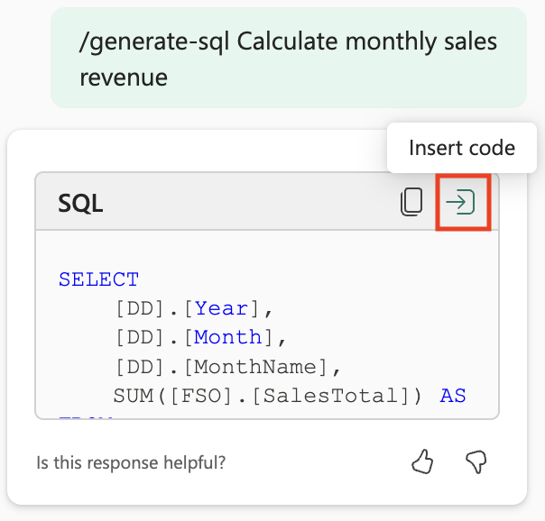

---
lab:
  title: "Utiliser Copilot dans l’entrepôt de données de Microsoft\_Fabric"
  module: Get started with Copilot in Fabric for Data Warehouse
---

# Utiliser Copilot dans l’entrepôt de données de Microsoft Fabric

Dans Microsoft Fabric, un entrepôt de données fournit une base de données relationnelle pour l’analytique à grande échelle. Contrairement au point de terminaison SQL en lecture seule par défaut pour les tables définies dans un lakehouse, un entrepôt de données fournit une sémantique SQL complète, y compris la possibilité d’insérer, de mettre à jour et de supprimer des données dans les tables. Dans ce labo, nous allons explorer comment tirer parti de Copilot pour créer des requêtes SQL

Cet exercice devrait prendre environ **30** minutes.

## Ce que vous allez apprendre

En suivant ce labo, vous serez capable de :

- Comprendre le rôle des entrepôts de données dans Microsoft Fabric.
- Créer et configurer un espace de travail et un entrepôt de données dans Fabric.
- Charger et explorer des exemples de données à l’aide de SQL.
- Utiliser Copilot pour générer, améliorer et résoudre les requêtes SQL à partir de prompts en langage naturel.
- Créer des vues et effectuer des analyses de données avancées grâce à la génération SQL assistée par l’IA.
- Appliquer les capacités de Copilot pour accélérer les tâches d’exploration et d’analyse des données.

## Avant de commencer

Vous devez disposer d’une [capacité Microsoft Fabric (F2 ou supérieure)](https://learn.microsoft.com/fabric/fundamentals/copilot-enable-fabric) avec Copilot activé pour effectuer cet exercice.

## Scénario de l’exercice

Dans cet exercice, vous êtes analyste de données dans une entreprise de vente au détail qui souhaite mieux comprendre ses performances commerciales à l’aide de Microsoft Fabric. Votre équipe a récemment adopté les fonctionnalités d’entrepôt de données de Fabric et souhaite tirer parti de Copilot pour accélérer l’exploration des données et le reporting. Vous allez créer un nouvel entrepôt de données, charger des exemples de données sur les ventes au détail et utiliser Copilot pour générer et améliorer des requêtes SQL. À la fin du labo, vous aurez acquis une expérience pratique de l’utilisation de l’IA pour analyser les tendances des ventes, créer des vues réutilisables et effectuer des analyses de données avancées, le tout dans l’environnement Fabric.

## Créer un espace de travail

Avant de travailler avec des données dans Fabric, créez un espace de travail avec Fabric activé. Un espace de travail dans Microsoft Fabric sert d’environnement collaboratif où vous pouvez organiser et gérer tous vos artefacts d’ingénierie des données, y compris les lakehouses, les notebooks et les jeux de données. Considérez-le comme un dossier de projet contenant toutes les ressources nécessaires à votre analyse de données.

1. Accédez à la [page d’accueil de Microsoft Fabric](https://app.fabric.microsoft.com/home?experience=fabric) sur `https://app.fabric.microsoft.com/home?experience=fabric` dans un navigateur et connectez-vous avec vos informations d’identification Fabric.

1. Dans la barre de menus à gauche, sélectionnez **Espaces de travail** (l’icône ressemble à &#128455;).

1. Créez un nouvel espace de travail avec le nom de votre choix, en sélectionnant un mode de licence qui inclut la capacité Fabric (*Premium* ou *Fabric*). Remarque : *Trial* n’est pas pris en charge.
   
    > **Pourquoi c’est important** : Copilot nécessite une capacité Fabric payante pour fonctionner. Cela vous garantit l’accès aux fonctionnalités basées sur l’intelligence artificielle qui vous aideront à générer du code tout au long de ce labo.

1. Lorsque votre nouvel espace de travail s’ouvre, il doit être vide.


## Créer un entrepôt de données

Maintenant que vous disposez d’un espace de travail, il est temps de créer un entrepôt de données. Un entrepôt de données dans Microsoft Fabric est une base de données relationnelle optimisée pour les charges de travail d’analyse. Contrairement aux bases de données traditionnelles conçues pour les opérations transactionnelles, les entrepôts de données sont structurés de manière à traiter efficacement de grands volumes de données et des requêtes complexes. Repérez le raccourci pour créer un nouvel entrepôt :

1. Sélectionnez **Créer** dans la barre de menus de gauche. Dans la page *Nouveau*, sous la section *Entrepôt de données*, sélectionnez **Entrepôt**. Donnez-lui un nom unique de votre choix. Ce nom identifiera votre entrepôt de données dans l’espace de travail. Choisissez donc un nom descriptif qui reflète son objectif.

    >**Note** : si l’option **Créer** n’est pas épinglée à la barre latérale, vous devez d’abord sélectionner l’option avec des points de suspension (**...**).

    Après environ une minute, un nouvel entrepôt sera créé. Le processus d’approvisionnement configure l’infrastructure sous-jacente et crée les composants nécessaires à votre base de données d’analyse :

    

## Créer des tables et insérer des données

Un entrepôt est une base de données relationnelle dans laquelle vous pouvez définir des tables et d’autres objets. Pour démontrer les capacités de Copilot, nous avons besoin d’échantillons de données sur lesquels travailler. Nous allons créer un schéma de vente au détail type avec des tables de dimensions (client, date, produit) et une table de faits (commandes). Il s’agit d’un modèle courant dans le domaine du stockage de données, appelé schéma en étoile.

1. Sous l’onglet du menu **Accueil**, utilisez le bouton **Nouvelle requête SQL** pour créer une requête. Cela ouvre un éditeur SQL dans lequel vous pouvez écrire et exécuter des commandes Transact-SQL. Ensuite, copiez et collez le code Transact-SQL depuis `https://raw.githubusercontent.com/MicrosoftLearning/mslearn-fabric/refs/heads/main/Allfiles/Labs/22c/create-dw.txt` dans le nouveau volet de requête. Ce script contient toutes les instructions CREATE TABLE et INSERT nécessaires pour créer notre jeu de données d’exemple.

1. Exécutez la requête, qui crée un schéma d’entrepôt de données simple et charge des données. L’exécution du script doit prendre environ 30 secondes. Pendant ce temps, le moteur de base de données crée les structures des tables et les remplit avec des exemples de données sur les ventes au détail.

1. Utilisez le bouton **Actualiser** dans la barre d’outils pour actualiser la vue. Ensuite, dans le volet **Explorateur**, vérifiez que le schéma **dbo** dans l’entrepôt de données contient maintenant les quatre tables suivantes :
   
    - **DimCustomer** : contient les informations relatives aux clients, notamment leurs noms et adresses
    - **DimDate** : table de dimension de date contenant des informations calendaires (année, mois, noms des jours, etc.)
    - **DimProduct** : catalogue de produits avec catégories, noms et informations sur les prix
    - **FactSalesOrder** : table de faits centrale contenant les transactions de ventes avec des clés étrangères vers les tables de dimensions

    > **Conseil** : Si le chargement du schéma prend un certain temps, actualisez simplement la page du navigateur. Le volet Explorateur affiche la structure de la base de données et facilite la navigation parmi vos tables et autres objets de base de données.

## Interroger les tables de l’entrepôt de données

Comme l’entrepôt de données est une base de données relationnelle, vous pouvez utiliser SQL pour interroger ses tables. Cependant, la rédaction de requêtes SQL complexes à partir de zéro peut être fastidieuse et source d’erreurs. Grâce à Copilot, la génération de requêtes SQL est encore plus rapide ! Copilot utilise l’intelligence artificielle pour comprendre vos requêtes en langage naturel et les traduire en syntaxe SQL appropriée, rendant ainsi l’analyse des données plus accessible.

1. Fermez la **requête SQL 1** actuelle. Cette opération efface l’espace de travail afin que nous puissions nous concentrer sur l’utilisation de Copilot pour la génération de requêtes.

1. Dans le ruban Accueil, sélectionnez l’option Copilot. Le volet de l’assistant Copilot s’ouvre alors, vous permettant d’interagir avec l’IA pour générer des requêtes.

    

1. Commençons par explorer ce que Copilot peut faire. Cliquez sur la suggestion étiquetée `What can Copilot do?` et envoyez-la comme prompt.

    Lisez la sortie et observez Copilot est actuellement en préversion et peut vous aider à réfléchir, générer des requêtes SQL, expliquer et corriger des requêtes, etc.
    
    
    
1. Nous souhaitons analyser le chiffre d’affaires par mois. Il s’agit d’une exigence courante dans le monde des affaires : comprendre les tendances des revenus au fil du temps permet d’identifier les tendances saisonnières, les tendances de croissance et les indicateurs de performance. Entrez le prompt suivant et envoyez-le.

    ```copilot-prompt
    /generate-sql Calculate monthly sales revenue
    ```

1. Passez en revue la sortie générée, qui peut varier légèrement en fonction de votre environnement et des dernières mises à jour de Copilot. Remarquez comment Copilot interprète votre requête et crée des instructions JOIN appropriées entre les tables de faits et de dimensions pour agréger les données de ventes par mois.

1. Sélectionnez l’icône **Insérer du code** située dans le coin supérieur droit de la requête. Cela transfère le code SQL généré depuis le volet Copilot vers votre éditeur SQL, où vous pouvez l’exécuter.

    

1. Exécutez la requête en sélectionnant l’option ▷ **Exécuter** au-dessus de la requête et observez la sortie. Vous devriez voir les totaux des revenus mensuels qui montrent comment vos données de vente sont agrégées sur différentes périodes.

    

1. Créez une **nouvelle requête SQL** et posez une question complémentaire pour inclure également le nom du mois et la région de vente dans les résultats. Cela montre comment vous pouvez améliorer vos requêtes de manière itérative avec Copilot, en vous appuyant sur les requêtes précédentes pour créer une analyse plus détaillée :

    ```copilot-prompt
    /generate-sql Retrieves sales revenue data grouped by year, month, month name and sales region
    ```

1. Sélectionnez l’icône **Insérer du code** et ▷ **Exécuter** la requête. Observez la sortie renvoyée. Remarquez comment Copilot adapte la requête pour inclure des dimensions supplémentaires tout en préservant la logique de calcul du chiffre d’affaires.

1. Nous allons créer une vue à partir de cette requête en posant la question suivante à Copilot. Les vues sont des tables virtuelles qui stockent la logique des requêtes, ce qui facilite la réutilisation des requêtes complexes et fournit des modèles d’accès aux données cohérents pour le reporting et l’analyse :

    ```copilot-prompt
    /generate-sql Create a view in the dbo schema that shows sales revenue data grouped by year, month, month name and sales region
    ```

1. Sélectionnez l’icône **Insérer du code** et ▷ **Exécuter** la requête. Passez en revue la sortie qu’elle génère. 

    La requête ne s’exécute pas correctement car l’instruction SQL inclut le nom de la base de données en préfixe, ce qui n’est pas autorisé dans l’entrepôt de données lors de la définition d’une vue. Il s’agit d’un problème syntaxique courant lorsque l’on travaille sur différentes plates-formes de bases de données : ce qui fonctionne dans un environnement peut nécessiter des ajustements dans un autre.

1. Sélectionnez l’option **Corriger les erreurs de requête**. Observez comment Copilot apporte des corrections à la requête. Cela illustre l’une des fonctionnalités puissantes de Copilot : non seulement il peut générer des requêtes, mais il peut également détecter et corriger automatiquement les erreurs de syntaxe.

    
    
    Voici un exemple de la requête corrigée. Vous remarquerez les commentaires `Auto-Fix` qui expliquent les modifications apportées :
    
    ```sql
    -- Auto-Fix: Removed the database name prefix from the CREATE VIEW statement
    CREATE VIEW [dbo].[SalesRevenueView] AS
    SELECT 
        [DD].[Year],
        [DD].[Month],
        [DD].[MonthName],
        -- NOTE: I couldn't find SalesRegion information in your warehouse schema
        SUM([FS1].[SalesTotal]) AS [TotalRevenue]
    FROM 
        [dbo].[FactSalesOrder] AS [FS1] -- Auto-Fix: Removed the database name prefix
    JOIN 
        [dbo].[DimDate] AS [DD] ON [FS1].[SalesOrderDateKey] = [DD].[DateKey] -- Auto-Fix: Removed the database name prefix
    -- NOTE: I couldn't find SalesRegion information in your warehouse schema
    GROUP BY 
        [DD].[Year],
        [DD].[Month],
        [DD].[MonthName]; 
    ```
    
    Vous remarquerez que Copilot a non seulement corrigé les erreurs de syntaxe, mais a également fourni des commentaires utiles expliquant les modifications et indiquant que les informations relatives à la région de vente n’étaient pas disponibles dans le schéma actuel.

1. Entrez un autre prompt pour obtenir une liste détaillée des produits, classés par catégorie. Cette requête illustrera des fonctionnalités SQL plus avancées, telles que les fonctions de fenêtre permettant de classer les données au sein de groupes. Pour chaque catégorie de produits, elle doit afficher les produits disponibles ainsi que leurs prix catalogue, puis les classer au sein de leurs catégories respectives en fonction de leur prix. 

    ```copilot-prompt
    /generate-sql Retrieve a detailed product listing, organized by category. For each product category, it should display the available products along with their list prices and rank them within their respective categories based on price. 
    ```

1. Sélectionnez l’icône **Insérer du code** et ▷ **Exécuter** la requête. Observez la sortie renvoyée. 

    Cela permet de comparer facilement les produits d’une même catégorie et d’identifier les articles les plus chers et les moins chers. La fonctionnalité de classement est particulièrement utile pour la gestion des produits, l’analyse des prix et les décisions liées aux stocks.

## Résumé

Dans cet exercice, vous avez créé un entrepôt de données qui contient plusieurs tables. Vous avez utilisé Copilot pour générer des requêtes SQL afin d’analyser les données dans l’entrepôt de données. Vous avez découvert comment l’IA peut accélérer le processus de rédaction de requêtes SQL complexes, corriger automatiquement les erreurs et vous aider à explorer les données plus efficacement.

Tout au long de ce labo, vous avez appris à :
- Exploiter des instructions en langage naturel pour générer des requêtes SQL
- Utiliser les capacités de correction d’erreurs de Copilot pour corriger les problèmes de syntaxe
- Créer des vues et des requêtes d’analyse complexes avec l’aide de l’IA
- Appliquer des fonctions de classement et de regroupement pour l’analyse des données

## Nettoyer les ressources

Si vous avez fini d’explorer Copilot dans l’entrepôt de données Microsoft Fabric, vous pouvez supprimer l’espace de travail que vous avez créé pour cet exercice.

1. Accédez à Microsoft Fabric dans votre navigateur.
1. Dans la barre de gauche, sélectionnez l’icône de votre espace de travail pour afficher tous les éléments qu’il contient.
1. Sélectionnez **Paramètres de l’espace de travail** et, dans la section**Général**, faites défiler vers le bas et sélectionnez **Supprimer cet espace de travail**.
1. Sélectionnez **Supprimer** pour supprimer l’espace de travail.


