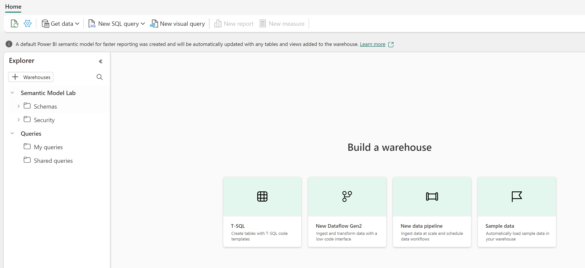

---
lab:
  title: "Conversation instantanée avec vos données à l’aide des agents de données Microsoft\_Fabric"
  module: Implement Fabric Data Agents
---

# Conversation instantanée avec vos données à l’aide des agents de données Microsoft Fabric

Un assistant de données Microsoft Fabric permet une interaction naturelle avec vos données en vous permettant de poser des questions en langage clair et de recevoir des réponses structurées et lisibles par l’homme. En éliminant la nécessité de comprendre les langages de requête tels que SQL (Structured Query Language), DAX (Data Analysis Expressions) ou KQL (Kusto Query Language), l’assistant de données rend les informations accessibles à l’ensemble de l’organisation, quel que soit le niveau de compétence technique.

Cet exercice devrait prendre environ **30** minutes.

## Ce que vous allez apprendre

En suivant ce labo, vous allez :

- Comprendre l’objectif et les avantages des assistants de données Microsoft Fabric pour l’analyse des données en langage naturel.
- Découvrez comment créer et configurer un espace de travail Fabric et un entrepôt de données.
- Acquérez une expérience pratique en chargeant et en explorant un jeu de données de ventes sous forme de schéma en étoile.
- Découvrez comment les assistants de données traduisent des questions en langage clair en requêtes SQL.
- Développez vos compétences pour poser des questions analytiques efficaces et interpréter les résultats générés par l’IA.
- Renforcez votre confiance dans l’utilisation des outils d’IA pour démocratiser l’accès aux données et aux informations.

## Avant de commencer

Vous devez disposer d’une [capacité Microsoft Fabric (F2 ou supérieure)](https://learn.microsoft.com/fabric/fundamentals/copilot-enable-fabric) avec Copilot activé pour effectuer cet exercice.

## Scénario de l’exercice

Dans cet exercice, nous allons créer un entrepôt de données de vente, y charger certaines données, puis créer un assistant de données Fabric. Nous lui poserons ensuite diverses questions et explorerons comment l’assistant de données traduit le langage naturel en requêtes SQL afin de fournir des informations pertinentes. Cette approche pratique démontrera la puissance de l’analyse de données assistée par l’IA sans nécessiter de connaissances approfondies en SQL. Commençons !

## Créer un espace de travail

Avant de travailler avec des données dans Fabric, créez un espace de travail avec Fabric activé. Un espace de travail dans Microsoft Fabric sert d’environnement collaboratif où vous pouvez organiser et gérer tous vos artefacts d’ingénierie des données, y compris les lakehouses, les notebooks et les jeux de données. Considérez-le comme un dossier de projet contenant toutes les ressources nécessaires à votre analyse de données.

1. Accédez à la [page d’accueil de Microsoft Fabric](https://app.fabric.microsoft.com/home?experience=fabric) sur `https://app.fabric.microsoft.com/home?experience=fabric` dans un navigateur et connectez-vous avec vos informations d’identification Fabric.

1. Dans la barre de menus à gauche, sélectionnez **Espaces de travail** (l’icône ressemble à &#128455;).

1. Créez un nouvel espace de travail avec le nom de votre choix, en sélectionnant un mode de licence qui inclut la capacité Fabric (*Premium* ou *Fabric*). Remarque : *Trial* n’est pas pris en charge.
   
    > **Pourquoi c’est important** : Copilot nécessite une capacité Fabric payante pour fonctionner. Cela vous garantit l’accès aux fonctionnalités basées sur l’intelligence artificielle qui vous aideront à générer du code tout au long de ce labo.

1. Lorsque votre nouvel espace de travail s’ouvre, il doit être vide.


## Créer un entrepôt de données

Maintenant que vous disposez d’un espace de travail, il est temps de créer un entrepôt de données. Un entrepôt de données est un référentiel centralisé qui stocke des données structurées provenant de diverses sources, optimisées pour les requêtes analytiques et le reporting. Dans notre cas, nous allons créer un entrepôt de données de vente simple qui servira de base à nos interactions avec l’assistant de données. Repérez le raccourci pour créer un nouvel entrepôt :

1. Sélectionnez **Créer** dans la barre de menus de gauche. Dans la page *Nouveau*, sous la section *Entrepôt de données*, sélectionnez **Entrepôt**. Donnez-lui un nom unique de votre choix.

    >**Note** : si l’option **Créer** n’est pas épinglée à la barre latérale, vous devez d’abord sélectionner l’option avec des points de suspension (**...**).

    Au bout d’une minute environ, un nouvel entrepôt est créé :

    

## Créer des tables et insérer des données

Un entrepôt est une base de données relationnelle dans laquelle vous pouvez définir des tables et d’autres objets. Pour que notre assistant de données soit utile, nous devons le remplir avec des exemples de données de vente. Le script que nous allons exécuter crée un schéma d’entrepôt de données classique avec des tables de dimensions (contenant des attributs descriptifs) et une table de faits (contenant des événements commerciaux mesurables). Cette conception en étoile est optimisée pour les requêtes analytiques que l’assistant de données va générer.

1. Sous l’onglet du menu **Accueil**, utilisez le bouton **Nouvelle requête SQL** pour créer une requête. Ensuite, copiez et collez le code Transact-SQL depuis `https://raw.githubusercontent.com/MicrosoftLearning/mslearn-fabric/refs/heads/main/Allfiles/Labs/22d/create-dw.txt` dans le nouveau volet de requête.

    > **Ce que fait ce script** : Le script crée un entrepôt de données de vente complet contenant des informations sur les clients, les détails des produits, les dimensions de date et les transactions de ventes. Cet ensemble de données réaliste nous permettra de poser des questions professionnelles pertinentes à notre assistant de données.

1. Exécutez la requête, qui crée un schéma d’entrepôt de données simple et charge des données. L’exécution du script doit prendre environ 30 secondes.

1. Utilisez le bouton **Actualiser** dans la barre d’outils pour actualiser la vue. Ensuite, dans le volet **Explorateur**, vérifiez que le schéma **dbo** dans l’entrepôt de données contient maintenant les quatre tables suivantes :
   
    - **DimCustomer** : contient les informations relatives aux clients, notamment leurs noms, adresses et coordonnées
    - **DimDate** : contient des attributs liés aux dates, tels que les exercices comptables, les trimestres et les mois, pour l’analyse temporelle
    - **DimProduct** : contient des informations sur les produits, notamment les noms, les catégories et les prix
    - **FactSalesOrder** : contient les transactions de ventes réelles reliant les clients, les produits et les dates

    > **Conseil** : Si le chargement du schéma prend un certain temps, actualisez simplement la page du navigateur.

## Créer un agent de données Fabric

Un assistant de données Fabric est un assistant alimenté par l’IA qui peut comprendre les questions en langage naturel concernant vos données et générer automatiquement les requêtes appropriées pour y répondre. Les utilisateurs n’ont ainsi plus besoin de connaître la syntaxe SQL, KQL ou DAX pour obtenir des informations précises et basées sur les données. Nous allons créer et configurer notre assistant de données :

1. Créez un nouvel assistant de données.
   
    

1. Donnez-lui un nom comme **`sales-data-agent`**.

    > **Pourquoi le nom est-il important** : Un nom descriptif vous aide, vous et votre équipe, à comprendre l’objectif et la portée de cet assistant de données, en particulier lorsque vous gérez plusieurs assistants pour différents domaines de données.
    
    

1. Sélectionnez **Ajouter une source de données**. 

    

1. Choisissez l’entrepôt de données que vous avez créé précédemment.

    > **Connexion à vos données** : L’assistant de données doit avoir accès à vos tables pour comprendre le schéma et les relations. Cela lui permet de générer des requêtes SQL précises en fonction de vos questions.

1. Développez l’entrepôt de données et vérifiez **DimCustomer**, **DimDate**, **DimProduct** et **FactSalesOrder**.

    > **Stratégie de sélection des tables** : En sélectionnant les quatre tables, nous donnons à l’assistant de données accès au modèle de données complet. Cela lui permet de répondre à des questions complexes qui couvrent plusieurs tables, telles que les tendances des ventes par localisation des clients ou les performances des produits au fil du temps.

    

## Poser des questions

Il est temps de commencer à expérimenter et à poser des questions à notre assistant de données. Cette section montre comment le langage naturel peut être transformé en requêtes SQL, rendant l’analyse des données accessible aux utilisateurs sans connaissances techniques en SQL. Chaque question vous montrera à la fois la réponse et la requête sous-jacente qui a été générée.

1. Posez une question en tapant dans le prompt suivant : 

    ```copilot-prompt
    How many products did we sell by fiscal year?
    ```

    Notez la réponse obtenue : Nous avons vendu un total de 12 630 produits au cours de l’exercice 2021 et 13 336 produits au cours de l’exercice 2022.

1. Développez l’étape terminée ainsi que sa sous-étape. Cela permet d’afficher la requête SQL générée par l’assistant de données pour répondre à la question.

    > **Opportunité d’apprentissage** : En examinant le code SQL généré, vous pouvez comprendre comment l’assistant de données a interprété votre question et en savoir plus sur les relations sous-jacentes entre les données. Cette transparence instaure la confiance dans les résultats générés par l’IA.
    
    
    
    Copilot a généré le code SQL suivant, qui peut varier légèrement en fonction de votre environnement et des dernières mises à jour de Copilot.
    
    ```sql
    SELECT d.Year, SUM(f.Quantity) AS TotalProductsSold
    FROM dbo.FactSalesOrder f
    JOIN dbo.DimDate d ON f.SalesOrderDateKey = d.DateKey
    GROUP BY d.Year
    ORDER BY d.Year;
    ```

    > **Explication SQL** : Cette requête joint la table de faits (FactSalesOrder) à la dimension de date (DimDate) afin de regrouper les ventes par année et d’additionner les quantités. Remarquez comment l’assistant de données a automatiquement compris que « produits vendus » fait référence au champ Quantité et que « exercice comptable » correspond au champ Année dans la dimension de date.

1. Passez à la question suivante : 

    ```copilot-prompt
    What are the top 10 most popular products all time?
    ```

    > **À quoi s’attendre** : Cette question montrera comment l’assistant de données peut effectuer des opérations de classement, en associant les informations sur les produits aux données de vente afin d’identifier les meilleures ventes.

1. Posez la question suivante : 

    ```copilot-prompt
    What are the historical trends across all my data?
    ```

    > **Analyses avancées** : Cette question plus large montrera comment l’assistant de données peut fournir une analyse des tendances sur plusieurs dimensions, incluant éventuellement des motifs temporels dans les ventes, le comportement des clients et la performance des produits.

1. Essayez d’autres questions pour explorer différents aspects de vos données :

    ```copilot-prompt
    In which countries are our customers located?
    ```
    
    ```copilot-prompt
    How many products did we sell in the United States?
    ```
    
    ```copilot-prompt
    How much revenue did we make in FY 2022?
    ```
    
    ```copilot-prompt
    How much was our total sales revenue, by fiscal year, fiscal quarter and month name?
    ```

    > **Conseil Pro** : Chacune de ces questions cible différents scénarios analytiques : analyse géographique, agrégations filtrées, calculs de revenus et analyse temporelle hiérarchique. Testez différentes variantes pour voir comment l’assistant de données s’adapte à différents styles de questions.

## Compréhension de la structure des données

Lorsque vous testez différentes questions, gardez ces caractéristiques à l’esprit afin de poser des questions plus ciblées :

- **Calendrier de l’exercice comptable** : L’exercice comptable commence en juillet (le 7e mois). Ainsi, le premier trimestre s’étend de juillet à septembre, le deuxième trimestre d’octobre à décembre, le troisième trimestre de janvier à mars et le quatrième trimestre d’avril à juin.

- **Identification du client** : Le champ CustomerAltKey contient les adresses e-mail des clients, ce qui peut être utile pour les requêtes spécifiques aux clients.

- **Devise** : Tous les prix catalogue et les totaux des ventes sont indiqués en livres sterling (GBP).

- **Relations de données** : La table FactSalesOrder relie les clients, les produits et les dates à l’aide de clés étrangères, ce qui permet d’effectuer des analyses multidimensionnelles complexes.

> **Expérimentez davantage** : Essayez de poser des questions qui combinent ces éléments, telles que « Quel était notre chiffre d’affaires au premier trimestre de l’exercice 2022 ? » ou « Quels clients au Royaume-Uni ont acheté les produits les plus chers ? » L’assistant de données traitera automatiquement les jointures et les calculs complexes nécessaires pour répondre à ces questions.

## Résumé

Félicitations ! Vous avez effectué les actions suivantes :

- **Création d’un espace de travail Fabric** et d’un entrepôt de données avec un jeu de données de vente réaliste
- **Génération et configuration d’un assistant de données** capable de comprendre les questions en langage naturel concernant vos données
- **Analyse de données expérimentée basée sur l’intelligence artificielle** en posant des questions en langage clair et en voyant comment elles se traduisent en requêtes SQL
- **Exploration de différents types de questions analytiques**, allant des agrégations simples à l’analyse complexe des tendances

### Points clés

- **Accès démocratisé aux données** : Les assistants de données rendent l’analyse accessible aux utilisateurs, quelles que soient leurs connaissances en SQL
- **Transparence et confiance** : Vous pouvez toujours inspecter le code SQL généré pour comprendre comment les questions sont traitées
- **Flexibilité du langage naturel** : L’IA peut gérer les variations de formulation et même les petites fautes de frappe dans les questions
- **Génération de requêtes complexes** : L’assistant gère automatiquement les jointures, les agrégations et les filtres en fonction des entrées en langage naturel

### Étapes suivantes

Envisagez d’explorer :

- **Instructions personnalisées** : Ajoutez un contexte spécifique à l’entreprise pour améliorer les réponses de l’assistant de données
- **Sources de données supplémentaires** : Connectez davantage de tables ou de jeux de données pour développer les connaissances de l’assistant
- **Questions avancées** : Essayez des scénarios d’analyse plus complexes impliquant plusieurs périodes, segments de clients ou catégories de produits
- **Intégration** : Intégrez les informations fournies par l’assistant de données dans des rapports, des tableaux de bord ou des applications métier

L’assistant de données Fabric représente une avancée considérable vers la mise à disposition effective des informations issues des données dans l’ensemble de votre organisation, comblant ainsi le fossé entre les données et la prise de décision.
